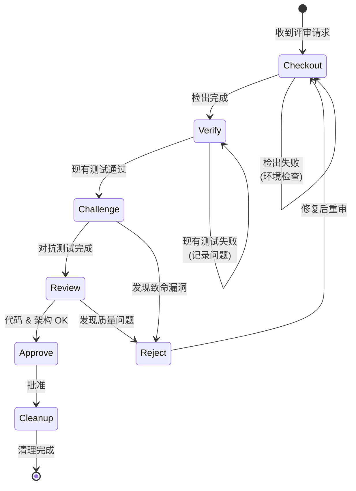

# Reviewer Flow

Reviewer 角色的标准化工作流，确保 "Checkout → Verify → Challenge → Review → Decide → Cleanup" 流程。核心理念是**双层防御体系**：Engineer 负责自证 (Verify)，Reviewer 负责对抗 (Challenge)。

## 工作流状态机



## 执行步骤

### 1. Checkout (检出)

- **目标**: 获取待评审的代码
- **检查点**:
  - [ ] 检出 PR/Branch
  - [ ] 确认与 Base 分支的差异
  - [ ] 检查环境配置

### 2. Verify (验证)

- **目标**: 验证 Engineer 提交的功能正确性和测试覆盖 (White-box)
- **检查点**:
  - [ ] 运行 **Engineer 编写的** 单元测试
  - [ ] 运行集成测试 (如适用)
  - [ ] 检查测试覆盖率报告
  - [ ] **决策**: 如果现有测试失败，直接进入 `Reject` 流程。

### 3. Challenge (对抗测试)

- **目标**: 尝试破坏代码，寻找边界情况和安全漏洞 (Black-box / Edge Cases)
- **思维模式**: "Try to break it"
- **操作**:
  1. 分析代码逻辑，寻找 Engineer 视角的盲区（并发、大/小数值、注入攻击等）。
  2. 编写新的 **Challenge Test Cases**。
  3. 运行这些新测试。
- **检查点**:
  - [ ] **漏洞发现**: 如果新测试导致 Crash 或逻辑错误 -> **Reject** (并将测试用例作为反馈)。
  - [ ] **鲁棒性验证**: 如果新测试通过 -> **保留测试用例** (提交到代码库) 并进入下一步。

### 4. Review (代码审查)

- **目标**: 检查代码质量、架构设计和可维护性
- **检查清单**:
  - [ ] **功能**: 代码是否实现了需求？
  - [ ] **设计**: 架构是否合理？是否遵循 KISS 原则？
  - [ ] **可读性**: 命名和注释是否清晰？
  - [ ] **文档**: 文档是否同步更新？
  - [ ] **合规**: 是否遵循项目 Lint 规范？

### 5. Decide (决策)

- **目标**: 做出批准或拒绝的决定
- **选项**:
  - **Approve**: 代码健壮且符合规范 (包含所有通过的 Challenge Tests)
  - **Reject**: 需要修改，提供具体反馈 (附带失败的 Test Case 或 Log)
  - **Request Changes**: 小问题，可快速修复

### 6. Cleanup (清理)

- **目标**: 完成评审后的环境清理
- **检查点**:
  - [ ] 提交新增的测试用例 (如有)
  - [ ] 删除本地临时分支
  - [ ] 更新 Issue 状态
  - [ ] 记录评审意见到 Review Comments

## 决策分支

| 条件                      | 动作                                    |
| ------------------------- | --------------------------------------- |
| 现有测试 (Verify) 失败    | Reject，要求 Engineer 修复              |
| 对抗测试 (Challenge) 崩溃 | Reject，提交该测试用例证明漏洞          |
| 代码风格问题              | Request Changes 或提供建议              |
| 设计问题                  | Reject，要求重新设计                    |
| 一切正常                  | Approve，并合并价值高的 Challenge Tests |

## 评审意见模板

```markdown
## Review Comments

### 🛡️ Challenge Reports

- [Pass/Fail] Test Case: `test_concurrency_limit`
- [Pass/Fail] Test Case: `test_invalid_inputs`

### ✅ 优点

-

### ⚠️ 建议

-

### ❌ 必须修改

-

### 📝 其他

-
```

## 合规要求

- **必须**: 先通过 Engineer 的测试 (Verify)，再进行对抗测试 (Challenge)
- **必须**: 试图编写至少一个边界测试用例
- **禁止**: 未经测试直接 Approve
