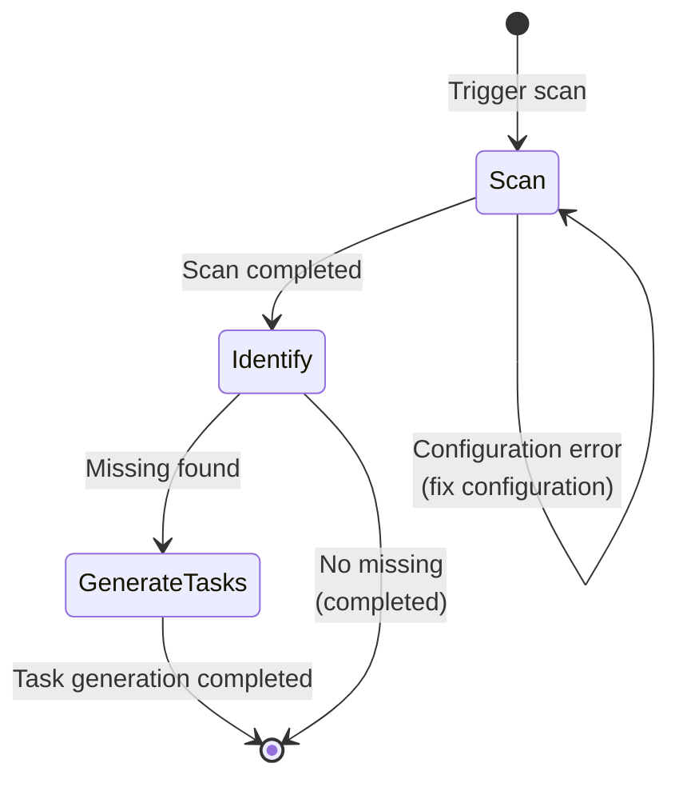

# I18n Scan Workflow

Standardized workflow for I18n scanning, ensuring the "Scan → Identify → Generate Tasks" process.

## Workflow State Machine



## Execution Steps

### 1. Scan (Scanning)

- **Goal**: Scan all documents in the project, identify translation coverage
- **Input**: Project files, i18n configuration
- **Output**: Scan report
- **Checkpoints**:
  - [ ] Check i18n configuration in `.monoco/config.yaml`
  - [ ] Run `monoco i18n scan`
  - [ ] Confirm source and target language settings are correct
  - [ ] Verify exclusion rules (.gitignore, build directories, etc.)

### 2. Identify (Identify Missing)

- **Goal**: Analyze scan results, identify specific missing translations
- **Strategy**: Compare source and target files
- **Checkpoints**:
  - [ ] List all source files with missing translations
  - [ ] Identify missing target languages
  - [ ] Assess impact scope of missing translations
  - [ ] Sort by priority (core documents first)

### 3. Generate Tasks (Generate Tasks)

- **Goal**: Create tracking tasks for missing translations
- **Strategy**: Create Issue or memo based on missing status
- **Checkpoints**:
  - [ ] Create Feature Issue for core document missing translations
  - [ ] Create Memo reminder for secondary document missing translations
  - [ ] Annotate file paths requiring translation in the Issue
  - [ ] Set reasonable priority and deadline

## Decision Branches

| Condition | Action |
|-----------|--------|
| Configuration error | Fix `.monoco/config.yaml`, rescan |
| No missing translations | Process completed, no further action needed |
| Large amount missing | Create Epic, split into multiple Features |
| Critical document missing | High priority, create Issue immediately |

## Compliance Requirements

- **Required**: Verify i18n configuration is correct before scanning
- **Required**: All core documents must have corresponding translations
- **Recommended**: Run scans regularly (e.g., weekly)
- **Recommended**: Bind translation tasks with feature development

## Related Commands

```bash
# Scan for missing translations
monoco i18n scan

# Create translation task
monoco issue create feature -t "Translate {filename} to {lang}"

# Add memo
monoco memo add "Needs translation: {filepath}"
```

## Output Example

After scanning completes, a report like the following should be generated:

```
I18n Scan Report
================
Source Language: en
Target Languages: zh, ja

Missing Translations:
- docs/guide.md → zh/guide.md [MISSING]
- docs/api.md → ja/api.md [MISSING]

Coverage: 85%
```
