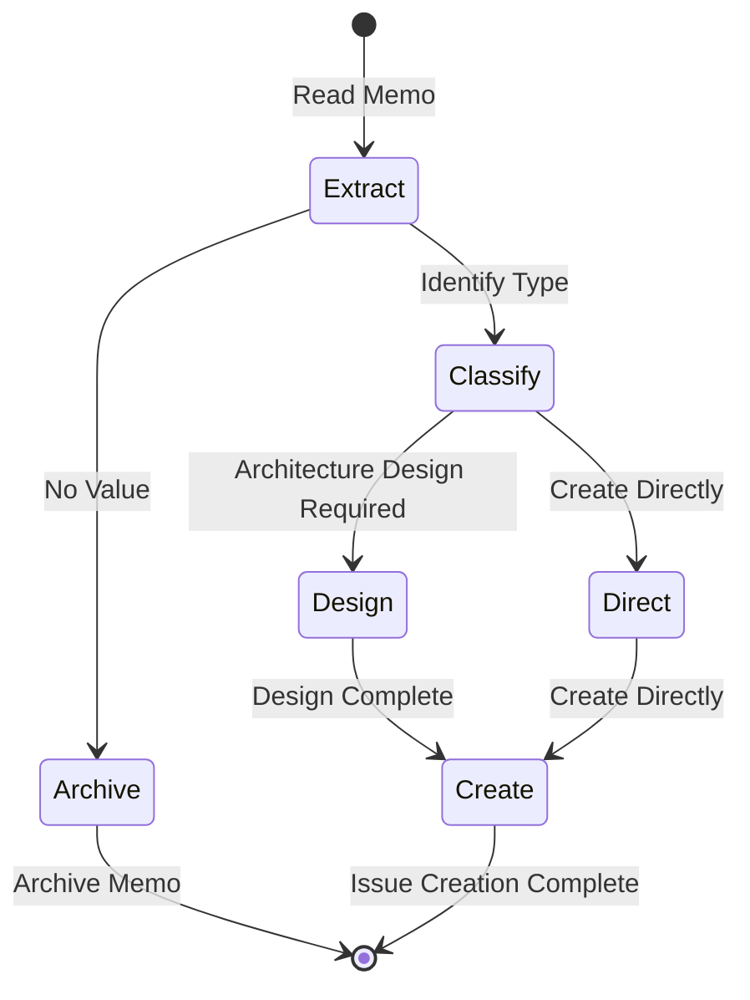

# Issue Create Workflow

Standardized workflow for extracting improvement clues from Memo, analyzing and creating structured Issue Tickets.

**Applicable Scenario**: Copilot Mode (Human-led, AI-assisted)
**Target Users**: Developers who need to quickly transform ideas/notes into actionable tasks

## Workflow State Machine



## Execution Steps

### 1. Extract

- **Goal**: Extract key improvement clues from Memo
- **Input**: Memo file or temporary notes
- **Output**: Structured improvement clue list
- **Checkpoints**:
  - [ ] Run `monoco memo list` to view pending Memos
  - [ ] Analyze improvement type and impact scope for each Memo
  - [ ] Identify actionable improvements (not pure reference materials)
  - [ ] Record improvement motivation and expected effects

**Analysis Dimensions**:
| Dimension | Question |
|-----------|----------|
| Value | What problem does this improvement solve? |
| Scope | Which modules/features are affected? |
| Urgency | Do it now or later? |
| Feasibility | Is there enough information to start? |

### 2. Classify

- **Goal**: Determine Issue type and priority
- **Checkpoints**:
  - [ ] Determine if it's an architecture-level improvement (→ Epic)
  - [ ] Determine if it's user value increment (→ Feature)
  - [ ] Determine if it's engineering debt (→ Chore)
  - [ ] Determine if it's a bug fix (→ Fix)
  - [ ] Assess if pre-architecture design is required

**Decision Branches**:

| Condition | Type | Next Step |
|-----------|------|-----------|
| Architecture vision-level improvement, needs decomposition into multiple Features | Epic | → Design |
| User deliverable value, with clear acceptance criteria | Feature | → Direct |
| Engineering maintenance task, technical debt cleanup | Chore | → Direct |
| Bug fix, with clear reproduction steps | Fix | → Direct |
| Pure reference material, no direct improvement value | - | → Archive |
| Requires architecture design to estimate effort | - | → Design |

### 3. Design (Optional)

- **Goal**: Preliminary architecture design for complex improvements
- **Applicable**: Epic or large Feature
- **Checkpoints**:
  - [ ] Analyze existing architecture inheritance
  - [ ] Determine technical solution direction
  - [ ] Identify dependency relationships and risk points
  - [ ] Estimate effort and milestones

**Outputs**:
- Architecture Decision Record (ADR) draft
- Subtask decomposition suggestions
- Dependency Issue list

### 4. Create

- **Goal**: Create Issue that meets specifications
- **Checkpoints**:
  - [ ] Run `monoco issue create <type> -t "Title"`
  - [ ] Write clear description and background
  - [ ] Define verifiable acceptance criteria (at least 2 Checkboxes)
  - [ ] Set dependency relationships (if needed)
  - [ ] Associate related Memo (if applicable)
  - [ ] Run `monoco issue lint` to verify compliance

**Issue Content Template**:

```markdown
## Objective
Clearly describe the goal and expected outcome of this Issue.

## Acceptance Criteria
- [ ] Acceptance criterion 1
- [ ] Acceptance criterion 2

## Technical Tasks
- [ ] Technical task 1
- [ ] Technical task 2

## Related
- Parent: EPIC-XXXX (if applicable)
- Related Memo: MEMO-XXXX (if applicable)
```

### 5. Archive (Optional)

- **Goal**: Archive Memos with no direct improvement value
- **Checkpoints**:
  - [ ] Confirm Memo content is pure reference material
  - [ ] Record archiving reason
  - [ ] Update Memo status (if system supports)

## Issue Type Guide

| Type | Purpose | Prefix | Mindset | Example |
|------|---------|--------|---------|---------|
| Epic | Grand goals, vision container | EPIC- | Architect | Refactor core architecture |
| Feature | User value increment | FEAT- | Product Owner | Add export functionality |
| Chore | Engineering tasks | CHORE- | Builder | Upgrade dependency versions |
| Fix | Bug fixes | FIX- | Debugger | Fix memory leak |

## Related Commands

```bash
# View pending Memos
monoco memo list

# Create Issue
monoco issue create feature -t "Title"
monoco issue create chore -t "Title"
monoco issue create fix -t "Title"
monoco issue create epic -t "Title"

# Verify Issue compliance
monoco issue lint
```

## Relationship with flow_engineer

This workflow complements `flow_engineer`:
- `issue-create-workflow`: Focuses on Issue creation phase, transforming ideas into actionable tasks
- `flow_engineer`: Focuses on code implementation phase, executing Investigate → Code → Test → Report → Submit

## Copilot Mode Tips

As an AI Copilot, you should:
1. **Ask proactively**: When Memo content is unclear, ask human developers for intent
2. **Provide options**: Give multiple classification suggestions with reasoning
3. **Assist drafting**: Help write Issue descriptions and acceptance criteria
4. **Remind compliance**: Ensure created Issues meet project specifications
