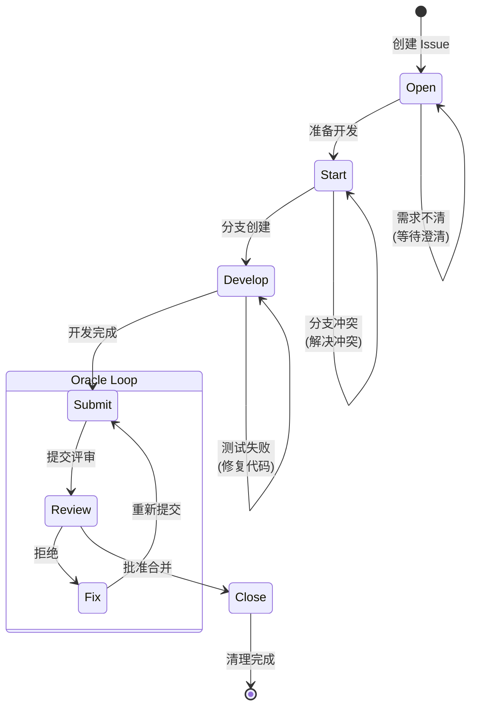

# Issue Lifecycle Workflow

Issue 生命周期的标准化工作流，确保 "Open → Start → Develop → Submit → Review → Close" 流程。

## 工作流状态机



## 执行步骤

### 1. Open (创建)

- **目标**: 创建清晰、可执行的 Issue
- **输入**: 需求描述、类型、优先级
- **输出**: Issue Ticket 文件
- **检查点**:
  - [ ] 使用 `monoco issue create <type> -t "标题"`
  - [ ] 选择合适的类型（epic/feature/chore/fix）
  - [ ] 编写清晰的描述和验收标准
  - [ ] 设置依赖关系（如需要）
  - [ ] 确保至少 2 个 Checkbox

### 2. Start (启动)

- **目标**: 准备开发环境，创建功能分支
- **检查点**:
  - [ ] 运行 `monoco issue start <ID> --branch`
  - [ ] 确认分支已创建并切换
  - [ ] 验证当前不在 main/master 分支
  - [ ] 检查依赖 Issue 是否已完成

### 3. Develop (开发)

- **目标**: 实现功能或修复缺陷
- **策略**: 迭代开发，持续测试
- **检查点**:
  - [ ] 遵循项目代码规范
  - [ ] 编写/更新单元测试
  - [ ] 运行测试套件，确保通过
  - [ ] 定期提交代码（小步提交）
  - [ ] 更新文件追踪（`monoco issue sync-files`）

### 4. Submit (提交)

- **目标**: 准备代码评审
- **检查点**:
  - [ ] 运行 `monoco issue lint` 检查合规性
  - [ ] 修复所有 Lint 错误
  - [ ] 更新任务清单状态
  - [ ] 运行 `monoco issue submit <ID>`
  - [ ] 编写变更摘要

### 5. Review (评审)

- **目标**: 代码质量和流程合规检查
- **检查点**:
  - [ ] 功能是否正确实现
  - [ ] 代码是否符合设计规范
  - [ ] 测试是否充分
  - [ ] 文档是否同步更新
  - [ ] 是否遵循项目规范

### 6. Close (关闭)

- **目标**: 完成 Issue，清理环境
- **检查点**:
  - [ ] 代码已合并到主分支
  - [ ] 运行 `monoco issue close <ID> --solution completed --prune`
  - [ ] 验证分支已清理
  - [ ] 更新 Review Comments（如需要）

## 决策分支

| 条件 | 动作 |
|------|------|
| 需求不清晰 | 返回 Open，请求澄清 |
| 分支创建失败 | 检查 Git 状态，解决冲突 |
| 测试失败 | 返回 Develop，修复代码 |
| Lint 失败 | 修复合规性问题，重新 Submit |
| 评审拒绝 | 返回 Develop，按反馈修改 |
| 评审通过 | 进入 Close，合并并清理 |

## 合规要求

- **禁止**: 在 main/master 分支直接修改代码
- **必须**: 使用 `monoco issue start --branch` 创建功能分支
- **必须**: 所有单元测试通过后才能 Submit
- **必须**: 每个 Issue 至少 2 个 Checkbox
- **必须**: Review/Done 阶段必须包含 Review Comments
- **建议**: 小步提交，频繁同步文件追踪

## 相关命令

```bash
# 创建 Issue
monoco issue create feature -t "标题"

# 启动开发
monoco issue start FEAT-0001 --branch

# 同步文件追踪
monoco issue sync-files

# 检查合规性
monoco issue lint

# 提交评审
monoco issue submit FEAT-0001

# 关闭 Issue
monoco issue close FEAT-0001 --solution completed --prune
```

## Issue 类型指南

| 类型 | 用途 | 前缀 | Mindset |
|------|------|------|---------|
| Epic | 宏大目标、愿景容器 | EPIC- | Architect |
| Feature | 用户价值增量 | FEAT- | Product Owner |
| Chore | 工程性事务 | CHORE- | Builder |
| Fix | 缺陷修复 | FIX- | Debugger |

## 与 flow_engineer 的关系

此工作流与 `flow_engineer` 互补：
- `issue-lifecycle-workflow`: 关注 Issue 管理流程
- `flow_engineer`: 关注代码实现流程

Engineer 在执行 Develop 阶段时，应遵循 `flow_engineer` 的 Investigate → Code → Test → Report → Submit 流程。
