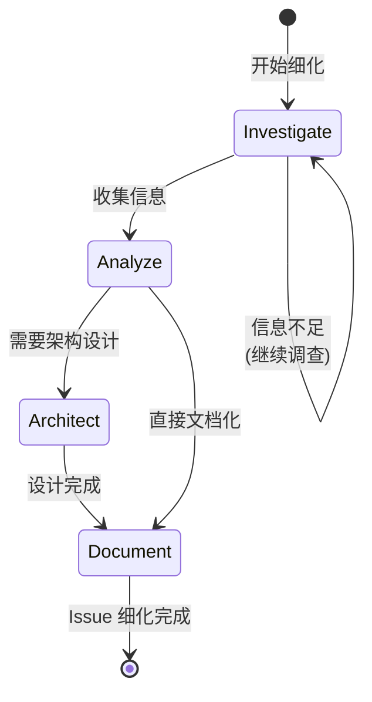

# Issue Refine Workflow

对新创建或待细化的 Issue 进行技术调查、架构分析和方案设计的标准化工作流。

**适用场景**: Copilot 模式（人类主导，AI 辅助）
**目标用户**: 需要深入理解问题并制定实现方案的开发者

## 工作流状态机



## 执行步骤

### 1. Investigate (调查)

- **目标**: 全面收集与 Issue 相关的信息
- **输入**: Issue Ticket、相关代码、文档
- **输出**: 信息收集报告
- **检查点**:
  - [ ] 阅读 Issue 描述，理解核心问题
  - [ ] 识别相关代码模块和文件
  - [ ] 查看相关 Issue/PR 历史
  - [ ] 检查外部依赖和约束条件
  - [ ] 收集类似实现参考（Spike）

**调查维度**:
| 维度 | 调查内容 |
|------|----------|
| 代码 | 相关模块的当前实现 |
| 历史 | 相关 Issue、PR、设计文档 |
| 依赖 | 外部库、API、服务依赖 |
| 约束 | 性能要求、安全要求、兼容性 |
| 参考 | 类似功能的最佳实践 |

### 2. Analyze (分析)

- **目标**: 分析收集的信息，识别关键问题和方案选项
- **检查点**:
  - [ ] 分析架构继承性（如何融入现有架构）
  - [ ] 评估安全性影响
  - [ ] 评估性能影响
  - [ ] 评估可维护性
  - [ ] 识别潜在风险和缓解措施

**分析框架**:

#### 架构继承性
- 现有架构模式是否适用？
- 是否需要引入新的抽象层？
- 对现有模块的耦合影响？

#### 安全性评估
- 输入验证需求
- 权限控制需求
- 数据保护需求
- 潜在攻击面分析

#### 性能评估
- 时间复杂度影响
- 空间复杂度影响
- 并发/并行需求
- 资源使用预估

#### 可维护性评估
- 代码复杂度变化
- 测试覆盖需求
- 文档更新需求
- 后续扩展性

### 3. Architect (架构) - 可选

- **目标**: 对复杂 Issue 进行架构设计
- **适用**: 涉及架构变更或大型功能
- **检查点**:
  - [ ] 确定技术方案选型
  - [ ] 设计接口和交互协议
  - [ ] 规划数据模型变更
  - [ ] 制定实现里程碑

**输出物**:
- 架构决策记录 (ADR)
- 接口设计文档
- 数据模型变更
- 里程碑计划

### 4. Document (文档)

- **目标**: 将分析结果更新到 Issue
- **检查点**:
  - [ ] 更新技术任务清单
  - [ ] 添加架构决策说明
  - [ ] 补充风险和缓解措施
  - [ ] 更新验收标准（如需要）
  - [ ] 添加参考链接和依赖说明
  - [ ] 运行 `monoco issue lint` 验证合规性

**细化后 Issue 结构**:

```markdown
## Objective
[原有内容]

## Acceptance Criteria
- [ ] 验收标准 1
- [ ] 验收标准 2

## Technical Analysis

### 现状分析
描述当前代码状态和相关实现。

### 方案选型
| 方案 | 优点 | 缺点 | 决策 |
|------|------|------|------|
| A | ... | ... | 采纳/备选 |
| B | ... | ... | 备选/放弃 |

### 风险评估
| 风险 | 影响 | 缓解措施 |
|------|------|----------|
| 风险1 | 高/中/低 | 措施... |

## Technical Tasks
- [ ] 任务 1
- [ ] 任务 2

## References
- 相关 Issue: #XXX
- 参考实现: [链接]
- ADR: [链接]
```

## 决策分支

| 条件 | 动作 |
|------|------|
| 信息不足 | 返回 Investigate，继续收集 |
| 需要架构设计 | 进入 Architect 阶段 |
| 方案明确 | 直接进入 Document 阶段 |
| 发现阻塞依赖 | 创建依赖 Issue，标记当前 Issue |
| 问题过于复杂 | 建议拆分为多个 Issue |

## 细化程度指南

| Issue 类型 | 细化要求 |
|------------|----------|
| Epic | 必须包含架构设计、里程碑、子任务分解 |
| Feature | 必须包含技术方案、风险评估、任务分解 |
| Chore | 必须包含实施步骤、影响范围 |
| Fix | 必须包含根因分析、修复方案、测试用例 |

## 相关命令

```bash
# 查看 Issue 详情
monoco issue show <ID>

# 检查合规性
monoco issue lint

# 同步文件追踪
monoco issue sync-files

# 查看相关 Spike
monoco spike list
```

## 与 flow_engineer 的关系

此工作流与 `flow_engineer` 互补：
- `issue-refine-workflow`: 关注 Issue 细化阶段，在开发前完成技术调查
- `flow_engineer`: 关注代码实现阶段，执行 Investigate → Code → Test → Report → Submit

细化阶段收集的信息将为 Engineer 阶段的 Investigate 提供重要输入。

## Copilot 模式提示

作为 AI Copilot，你应该：
1. **主动探索**: 帮助开发者发现潜在问题和边界情况
2. **提供对比**: 给出多个技术方案，分析优缺点
3. **协助评估**: 帮助进行安全性、性能影响评估
4. **提醒遗漏**: 检查是否有遗漏的关键信息或风险点
