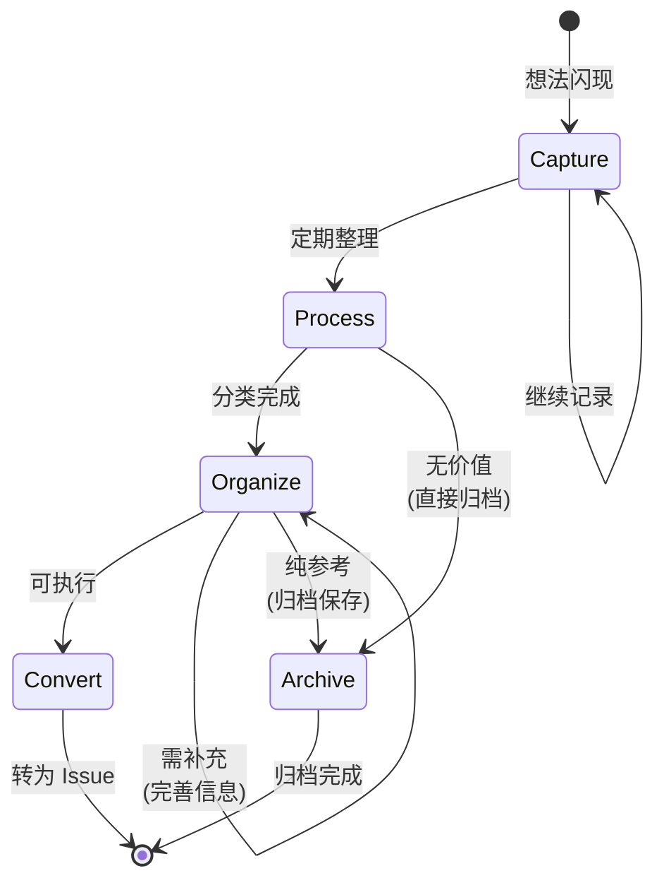

# Note Processing Workflow

Memo 笔记处理的标准化工作流，确保 "Capture → Process → Organize → Archive/Convert" 流程。

## 工作流状态机



## 执行步骤

### 1. Capture (捕获)

- **目标**: 快速记录 fleeting ideas，不中断当前工作
- **输入**: 想法、灵感、代码片段、链接
- **输出**: Memo 记录
- **检查点**:
  - [ ] 使用 `monoco memo add "内容"`
  - [ ] 保持简洁，无需详细描述
  - [ ] 添加上下文（`-c file:line` 如适用）
  - [ ] 不中断当前任务流

### 2. Process (处理)

- **目标**: 定期回顾和分类 Memo
- **策略**: 定期整理（每日/每周）
- **检查点**:
  - [ ] 运行 `monoco memo list` 查看所有 Memo
  - [ ] 评估每个 Memo 的价值
  - [ ] 分类：可执行 / 纯参考 / 无价值
  - [ ] 补充缺失信息

### 3. Organize (组织)

- **目标**: 对有价值的 Memo 进行结构化整理
- **策略**: 根据类型选择处理方式
- **检查点**:
  - [ ] 为相关 Memo 添加标签或分类
  - [ ] 合并相似的 Memo
  - [ ] 完善模糊的记录
  - [ ] 设置优先级（如适用）

### 4. Archive/Convert (归档或转化)

- **目标**: 处理完毕的 Memo 归档或转化为 Issue
- **检查点**:
  - [ ] **Convert**: 可执行的想法转为 Issue
    - 使用 `monoco issue create feature/chore/fix -t "标题"`
    - 在 Issue 中引用原始 Memo
  - [ ] **Archive**: 纯参考内容归档保存
    - 移动到知识库或文档
    - 从 Memo 列表中移除
  - [ ] **Delete**: 无价值的 Memo 直接删除

## 决策分支

| 条件 | 动作 |
|------|------|
| 想法可执行 | Convert，创建 Issue |
| 纯参考资料 | Archive，保存到知识库 |
| 无价值/过时 | Delete，直接删除 |
| 信息不完整 | 返回 Organize，补充信息 |

## 合规要求

- **必须**: Memo 是临时的，不应无限堆积
- **必须**: 可执行的想法必须转为 Issue 追踪
- **建议**: 定期处理（建议每周）
- **建议**: 保持 Memo 简洁，避免长篇大论

## 相关命令

```bash
# 添加 Memo
monoco memo add "考虑使用 Redis 缓存用户会话"

# 带上下文的 Memo
monoco memo add "递归可能导致栈溢出" -c "src/utils.py:42"

# 查看所有 Memo
monoco memo list

# 编辑 Memo
monoco memo open

# 创建 Issue（转化 Memo）
monoco issue create feature -t "实现 Redis 缓存"
```

## 使用场景

| 场景 | 使用 Memo | 后续处理 |
|------|-----------|----------|
| 代码审查时的改进建议 | `memo add "重构建议: ..."` | Process → Convert to Issue |
| 会议中的临时想法 | `memo add "想法: ..."` | Process → Organize → Convert |
| 有用的代码片段 | `memo add "Snippet: ..."` | Process → Archive to 知识库 |
| 技术文章链接 | `memo add "Read: https://..."` | Process → Archive |
| Bug 线索 | `memo add "可能的 Bug: ..."` | Process → Convert to Fix Issue |

## 与 Issue 的区别

| 维度 | Memo | Issue |
|------|------|-------|
| 目的 | 记录想法 | 追踪任务 |
| 生命周期 | 临时，需定期清理 | 正式，完整生命周期 |
| 完成标准 | 归档或转化 | 验收标准通过 |
| 复杂度 | 简单，一句话 | 详细，有 AC 和 Tasks |
| 追踪 | 无 | 完整追踪 |

## 最佳实践

1. **及时记录**: 想法闪现时立即记录，避免遗忘
2. **定期整理**: 每周至少处理一次 Memo 列表
3. **快速转化**: 有价值的想法尽快转为 Issue
4. **果断删除**: 过时或无价值的 Memo 果断删除
5. **保持简洁**: Memo 是速记，不需要详细描述
