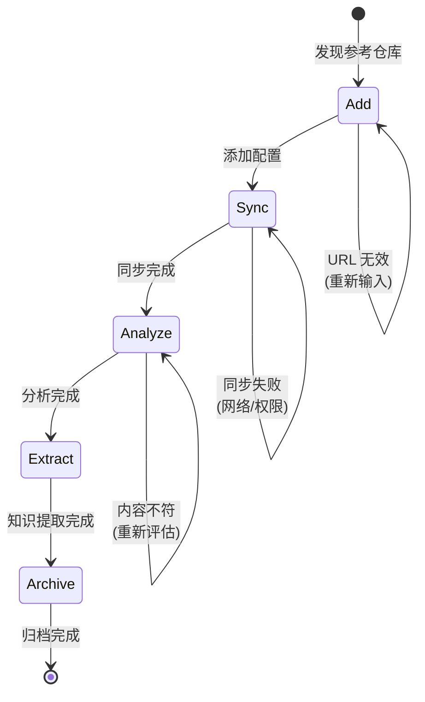

# Research Workflow

Spike 研究的标准化工作流，确保 "Add → Sync → Analyze → Extract → Archive" 流程。

## 工作流状态机



## 执行步骤

### 1. Add (添加仓库)

- **目标**: 将外部仓库添加为参考
- **输入**: 仓库 URL、参考目的
- **输出**: 配置更新
- **检查点**:
  - [ ] 验证仓库 URL 可访问
  - [ ] 确认仓库与当前项目相关
  - [ ] 运行 `monoco spike add <url>`
  - [ ] 检查 `.monoco/config.yaml` 已更新

### 2. Sync (同步)

- **目标**: 下载或更新参考仓库内容
- **检查点**:
  - [ ] 运行 `monoco spike sync`
  - [ ] 验证仓库克隆到 `.references/<name>/`
  - [ ] 检查同步日志，确认无错误
  - [ ] 验证文件权限正确（只读）

### 3. Analyze (分析)

- **目标**: 研究参考仓库的结构和内容
- **策略**: 系统性浏览和标记
- **检查点**:
  - [ ] 浏览仓库整体结构
  - [ ] 识别与当前项目相关的模块
  - [ ] 标记有价值的代码模式
  - [ ] 记录架构设计亮点

### 4. Extract (提取知识)

- **目标**: 从参考仓库提取可用知识
- **策略**: 文档化有价值的发现
- **检查点**:
  - [ ] 提取关键代码片段（不修改原文件）
  - [ ] 记录设计模式和最佳实践
  - [ ] 创建学习笔记（使用 Memo 或 Issue）
  - [ ] 标注知识来源（仓库 URL + Commit）

### 5. Archive (归档)

- **目标**: 整理和归档研究成果
- **检查点**:
  - [ ] 更新项目文档，引用参考仓库
  - [ ] 创建知识索引（如需要）
  - [ ] 运行 `monoco spike list` 验证状态
  - [ ] 定期清理不再需要的参考

## 决策分支

| 条件 | 动作 |
|------|------|
| URL 无效 | 返回 Add，检查 URL 格式 |
| 同步失败 | 检查网络、权限，重试或跳过 |
| 内容不相关 | 从配置中移除，重新选择 |
| 发现重要模式 | 创建 Issue，计划引入项目 |

## 合规要求

- **禁止**: 编辑 `.references/` 中的任何文件
- **必须**: 所有外部知识必须标注来源
- **必须**: 定期同步以获取更新
- **建议**: 只添加高质量、相关的仓库

## 相关命令

```bash
# 添加参考仓库
monoco spike add <url>

# 同步所有仓库
monoco spike sync

# 列出已配置的仓库
monoco spike list

# 记录研究发现
monoco memo add "发现: {insight}" -c "spike:{repo_name}"
```

## 最佳实践

1. **精选选择**: 只添加与项目高度相关的仓库
2. **只读访问**: 将 `.references/` 视为外部知识库，永不修改
3. **定期同步**: 每月运行 `monoco spike sync` 获取更新
4. **知识转化**: 将学到的模式转化为项目的实际改进
