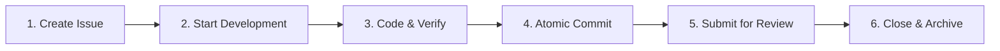

# Monoco Workflow Best Practices

This document defines the standardized development workflow recommended by the Monoco Toolkit. By following these practices, you can maximize the capabilities of Agents while ensuring codebase stability and traceability.

> Core Principle: **Issue-Driven Development**.

## Overview



---

## 1. Inception Phase

### 1.1 Create Issue

Everything starts with an Issue. Do not modify code directly without one.

```bash
# Create a feature
monoco issue create feature -t "Support Dark Mode"
```

If you have a parent task (e.g., Epic), ensure to link it:

```bash
monoco issue create feature -t "Support Dark Mode" --parent EPIC-001
```

### 1.2 Start Work

**This is the most critical step**. Using the `start` command is not just about changing status; it's about establishing a snapshot of the development environment.

```bash
monoco issue start FEAT-001 --branch
```

- **--branch**: Enforces creation of a feature branch (Recommended). The branch name is automatically normalized to `feat/feat-001-support-dark-mode`.
- **Auto Context**: Monoco can automatically load relevant context upon starting (Future Feature).

---

## 2. Implementation Phase

Develop on your feature branch.

### 2.1 Coding & Verification

Code as usual, but adhere to:

- **Test First**: Run tests before writing implementation code.
- **Lint Check**: Run `monoco issue lint` frequently to ensure metadata health.

### 2.2 Atomic Commit ✨

Monoco provides an enhanced commit command that enforces quality gates before committing.

```bash
# Auto-detects linked Issue (based on branch name), runs Lint, then commits
monoco issue commit -m "feat: implement dark mode toggle"
```

Unlike traditional Git commits where you might forget the Issue ID or commit non-compliant code, `monoco issue commit` handles validation for you.

---

## 3. Delivery Phase

### 3.1 Sync Context

Before submitting for review, ensure the Issue's `files` field lists all modified files. This is crucial for Agents to understand the scope of changes.

```bash
# Sync Git changed files to Issue metadata
monoco issue sync-files FEAT-001
```

### 3.2 Submit

When you believe the work is done:

```bash
monoco issue submit FEAT-001
```

This command will:

1. Change Issue status to `Review`.
2. Generate a Delivery Report containing change summary, related files, etc.
3. (Optional) Trigger CI pipelines.

---

## 4. Acceptance Phase

The Reviewer (or an Agent acting as one) inspects the code.

### 4.1 Close Issue

Upon validation, merge code and close the Issue.

```bash
# Mark as implemented
monoco issue close FEAT-001 --solution implemented
```

This automatically:

- Sets status to `Closed`.
- Records `closed_at` timestamp.
- Archives the file to `Issues/Features/closed/` directory.

### 4.2 Cleanup

```bash
# Delete local feature branch and switch back to main
git checkout main
git branch -d feat/feat-001-support-dark-mode
```
