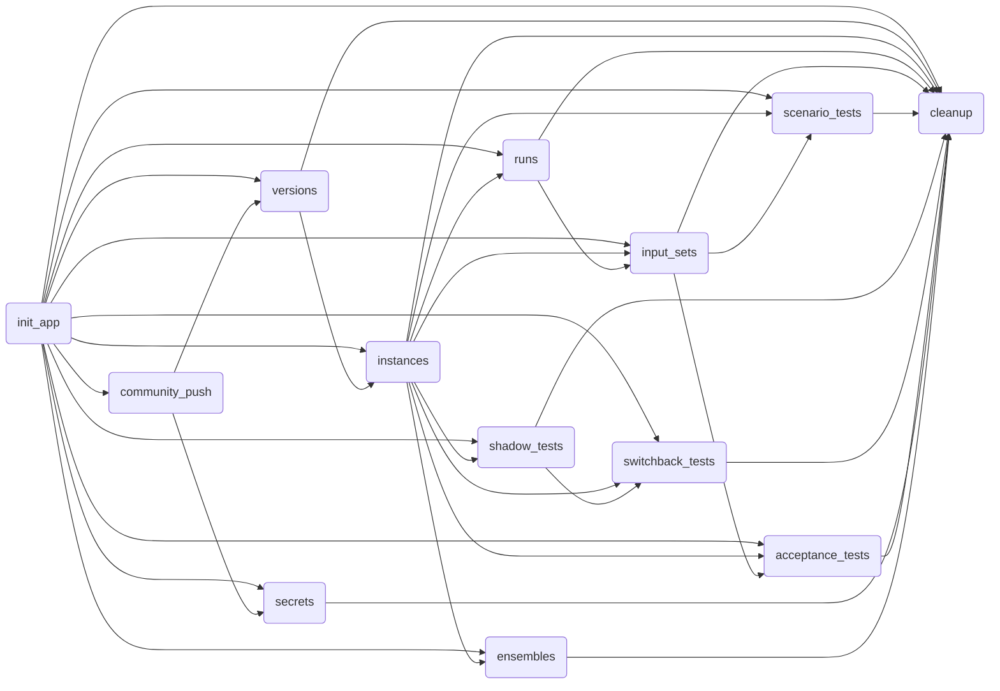

# Nextmv library tests

Make sure you have dev requisites installed:

```bash
pip install -e '.[dev]'
```

## Unit tests

Run unit tests with:

```bash
pytest --ignore=tests/integration
```

This will ignore integration tests located in `tests/integration`.

## Integration tests

Make sure you have a valid Nextmv Cloud API key set in your environment:

```bash
export NEXTMV_API_KEY="<YOUR_API_KEY>"
```

Run integration tests with:

```bash
pytest tests/integration -s
```

The integration tests use [Nextpipe][nextpipe] to orchestrate a workflow of
steps that run both in sequence and in parallel. Here is a mermaid diagram of
the steps that are run in the integration tests. This diagram was generated at
the time of writing, and may change as the tests are updated.



[nextpipe]: https://github.com/nextmv-io/nextpipe
