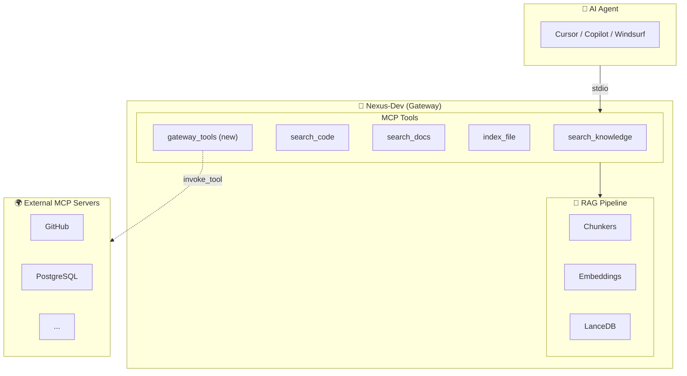
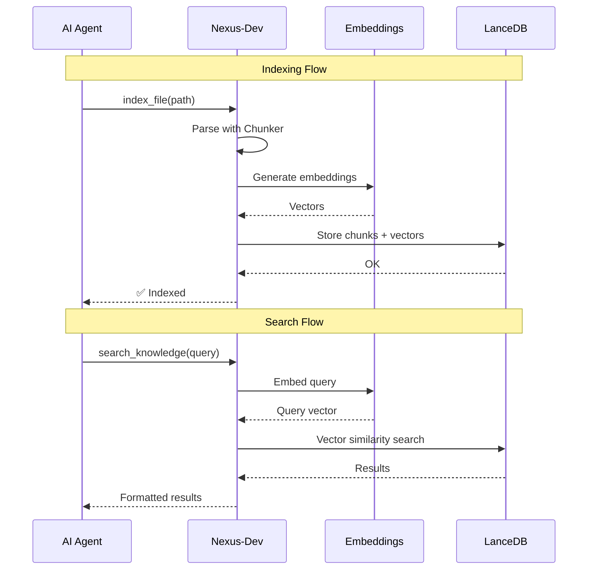

# Nexus-Dev

[](https://github.com/mmornati/nexus-dev/actions/workflows/ci.yml)
[](https://codecov.io/gh/mmornati/nexus-dev)
[](https://www.python.org/downloads/)
[](https://opensource.org/licenses/MIT)
[](https://github.com/astral-sh/ruff)

**Persistent Memory for AI Coding Agents**

Nexus-Dev is an open-source MCP (Model Context Protocol) server that provides a local RAG (Retrieval-Augmented Generation) system for AI coding assistants like GitHub Copilot, Cursor, and Windsurf. It learns from your codebase and mistakes, enabling cross-project knowledge sharing.

## Features

- 🧠 **Persistent Memory**: Index your code and documentation for semantic search
- 📚 **Lesson Learning**: Record problems and solutions that the AI can recall later
- 🐙 **GitHub Integration**: Import Issues and Pull Requests into your knowledge base (see [docs/github-import.md](docs/github-import.md))
- 🌐 **Multi-Language Support**: Python, JavaScript/TypeScript, Java (extensible via tree-sitter)
- 📖 **Documentation Indexing**: Parse and index Markdown/RST documentation
- 🔄 **Cross-Project Learning**: Share knowledge across all your projects
- 🏠 **Local-First**: All data stays on your machine with LanceDB

## 📖 Full Documentation

For comprehensive documentation, visit [mmornati.github.io/nexus-dev](https://mmornati.github.io/nexus-dev/).

## Installation

### Isolated Global Installation (Recommended)

To avoid conflicts with project-specific virtual environments, install Nexus-Dev globally using `pipx` or `uv tool`.

```bash
# Using pipx
pipx install nexus-dev

# Using uv
uv tool install nexus-dev
```

### Development Installation

If you are contributing to Nexus-Dev, you can install it in editable mode:

```bash
# Using pip
pip install -e .

# Using uv
uv pip install -e .
```

## Quick Start

### 1. Initialize a Project

```bash
cd your-project
nexus-init --project-name "my-project" --embedding-provider openai
```

This creates:
- `nexus_config.json` - Project configuration
- `.nexus/lessons/` - Directory for learned lessons

### 2. Set Your API Key (OpenAI only)

The CLI commands require the API key in your environment:

```bash
export OPENAI_API_KEY="sk-..."
```

> **Tip**: Add this to your shell profile (`~/.zshrc`, `~/.bashrc`) so it's always available.
>
> If using **Ollama**, no API key is needed—just ensure Ollama is running locally.

### 3. Index Your Code

```bash
# Index directories recursively (recommended)
nexus-index src/ -r

# Index multiple directories
nexus-index src/ docs/ -r

# Index specific files (no -r needed)
nexus-index main.py utils.py
```

> **Note**: The `-r` flag is required to recursively index subdirectories. Without it, only files directly inside the given folder are indexed.

### 4. Configure Your AI Agent

Add to your MCP client configuration (e.g., Claude Desktop):

```json
{
  "mcpServers": {
    "nexus-dev": {
      "command": "nexus-dev",
      "args": []
    }
  }
}
```

### 5. Verify Your Setup

**Check indexed content** via CLI:
```bash
nexus-status
```

**Test in your AI agent** — copy and paste this prompt:

```
Search the Nexus-Dev knowledge base for functions related to "embeddings" 
and show me the project statistics.
```

If the AI uses the `search_code` or `get_project_context` tools and returns results, your setup is complete! 🎉

## MCP Tools

Nexus-Dev exposes 7 tools to AI agents:

### Search Tools

| Tool | Description |
|------|-------------|
| `search_knowledge` | Search all content (code, docs, lessons) with optional `content_type` filter |
| `search_code` | Search specifically in indexed code (functions, classes, methods) |
| `search_docs` | Search specifically in documentation (Markdown, RST, text) |
| `search_lessons` | Search in recorded lessons (problems & solutions) |

### Indexing Tools

| Tool | Description |
|------|-------------|
| `index_file` | Index a file into the knowledge base |
| `record_lesson` | Store a problem/solution pair for future reference |
| `get_project_context` | Get project statistics and recent lessons |

## MCP Gateway Mode

Nexus-Dev can act as a gateway to other MCP servers, reducing tool count for AI agents.

### Setup

1. Initialize MCP configuration:
   ```bash
   nexus-mcp init --from-global
   ```

2. Index tools from configured servers:
   ```bash
   nexus-index-mcp --all
   ```

### Usage

Instead of configuring 10 MCP servers (50+ tools), configure only Nexus-Dev:

```json
{
  "mcpServers": {
    "nexus-dev": {
      "command": "nexus-dev"
    }
  }
}
```

AI uses these Nexus-Dev tools to access other servers:

| Tool | Description |
|------|-------------|
| `search_tools` | Find the right tool for a task |
| `invoke_tool` | Execute a tool on any configured server |
| `list_servers` | Show available MCP servers |

### Workflow

1. AI searches: `search_tools("create GitHub issue")`
2. Nexus-Dev returns: `github.create_issue` with schema
3. AI invokes: `invoke_tool("github", "create_issue", {...})`
4. Nexus-Dev proxies to GitHub MCP

### Server Configuration

You can configure downstream MCP servers in `.nexus/mcp_config.json` using either **Stdio** (local process) or **SSE** (HTTP remote) transports.

**Local Server (Stdio):**
```json
{
  "servers": {
    "github-local": {
      "transport": "stdio",
      "command": "npx",
      "args": ["-y", "@modelcontextprotocol/server-github"],
      "env": {
        "GITHUB_PERSONAL_ACCESS_TOKEN": "..."
      }
    }
  }
}
```

**Remote Server (SSE):**
```json
{
  "servers": {
    "github-remote": {
      "transport": "sse",
      "url": "https://api.githubcopilot.com/mcp/",
      "headers": {
        "Authorization": "Bearer ..."
      }
    }
  }
}
```

## Configuration

`nexus_config.json` example:

```json
{
  "project_id": "550e8400-e29b-41d4-a716-446655440000",
  "project_name": "my-project",
  "embedding_provider": "openai",
  "embedding_model": "text-embedding-3-small",
  "docs_folders": ["docs/", "README.md"],
  "include_patterns": ["**/*.py", "**/*.js", "**/*.java"],
  "exclude_patterns": ["**/node_modules/**", "**/__pycache__/**"]
}
```

### Project Context & Startup

Nexus-Dev needs to know *which* project to load on startup. It determines this in two ways:

1.  **Automatic Detection (Recommended)**: If the MCP server process is started with your project root as its **current working directory (cwd)**, it automatically loads `nexus_config.json` and `.nexus/mcp_config.json`.
2.  **Environment Variable**: Setting `NEXUS_PROJECT_ROOT=/path/to/project` explicitly tells the server where to look.

**When to use `refresh_agents`:**
If the server starts in a generic location (like a global Docker container or default system path) without a project context, it starts "empty". You must then use the `refresh_agents` tool. This tool asks your IDE for the active workspace path and re-initializes the server with that context.

> **Pro Tip**: Configure your MCP client (Cursor, Claude Desktop) to set `cwd` or `NEXUS_PROJECT_ROOT` to your project path. This matches the server's lifecycle to your open project and avoids the need for manual refreshing.
```

📖 See [docs/adding-mcp-servers.md](docs/adding-mcp-servers.md) for a guide on adding custom MCP servers.

### Supported Embedding Providers

Nexus-Dev supports multiple embedding providers. Choose the one that best fits your needs.

#### 1. OpenAI (Default)
- **Best for:** General purpose, ease of use.
- **Provider:** `openai`
- **Default Model:** `text-embedding-3-small`
- **Configuration:**
  ```json
  {
    "embedding_provider": "openai",
    "embedding_model": "text-embedding-3-small"
  }
  ```
- **Environment:** Set `OPENAI_API_KEY`.

#### 2. Local Ollama (Privacy / Offline)
- **Best for:** Privacy, local execution, cost savings.
- **Provider:** `ollama`
- **Default Model:** `nomic-embed-text`
- **Configuration:**
  ```json
  {
    "embedding_provider": "ollama",
    "embedding_model": "nomic-embed-text",
    "ollama_url": "http://localhost:11434"
  }
  ```

#### 3. Google Vertex AI (Enterprise)
- **Best for:** Enterprise GCP users, high scalability.
- **Provider:** `google`
- **Install:** `pip install nexus-dev[google]`
- **Default Model:** `text-embedding-004`
- **Configuration:**
  ```json
  {
    "embedding_provider": "google",
    "google_project_id": "your-project-id",
    "google_location": "us-central1"
  }
  ```
- **Environment:** Uses standard Google Cloud credentials (ADC).

#### 4. AWS Bedrock (Enterprise)
- **Best for:** Enterprise AWS users.
- **Provider:** `aws`
- **Install:** `pip install nexus-dev[aws]`
- **Default Model:** `amazon.titan-embed-text-v1`
- **Configuration:**
  ```json
  {
    "embedding_provider": "aws",
    "aws_region": "us-east-1"
  }
  ```

#### 5. Voyage AI (High Performance)
- **Best for:** State-of-the-art retrieval quality (RAG specialist).
- **Provider:** `voyage`
- **Install:** `pip install nexus-dev[voyage]`
- **Default Model:** `voyage-large-2`
- **Configuration:**
  ```json
  {
    "embedding_provider": "voyage",
    "voyage_api_key": "your-key"
  }
  ```

#### 6. Cohere (Multilingual)
- **Best for:** Multilingual search and reranking.
- **Provider:** `cohere`
- **Install:** `pip install nexus-dev[cohere]`
- **Default Model:** `embed-multilingual-v3.0`
- **Configuration:**
  ```json
  {
    "embedding_provider": "cohere",
    "cohere_api_key": "your-key"
  }
  ```

> ⚠️ **Warning**: Embeddings are NOT portable between providers. Changing providers requires re-indexing all documents.

## Optional: Pre-commit Hook

Install automatic indexing on commits:

```bash
nexus-init --project-name "my-project" --install-hook
```

Or manually add to `.git/hooks/pre-commit`:

```bash
#!/bin/bash
MODIFIED=$(git diff --cached --name-only --diff-filter=ACM | grep -E '\.(py|js|ts|java)$')
if [ -n "$MODIFIED" ]; then
    nexus-index $MODIFIED
fi
```

## Multi-Repository Projects

Nexus-Dev supports multi-repository setups where a parent folder contains the nexus configuration and multiple sub-folders contain independent git repositories.

### Quick Setup

```bash
# Initialize parent project
cd /path/to/parent-project
nexus-init --project-name "My Multi-Repo Project"

# Install hooks in all sub-repositories
nexus-init --discover-repos
```

Or install hooks manually in each repository:

```bash
cd sub-repo-1
nexus-init --link-hook

cd ../sub-repo-2
nexus-init --link-hook
```

All repositories:
- Share a single project ID and knowledge base
- Index to the parent project's database
- Store lessons centrally in parent `.nexus/lessons/`

📖 See [Multi-Repository Projects](docs/advanced/multi-repo-projects.md) for detailed guide.

## Configuring AI Agents

To maximize Nexus-Dev's value, configure your AI coding assistant to use its tools automatically.

### Add AGENTS.md to Your Project

Copy our template to your project:

```bash
cp path/to/nexus-dev/docs/AGENTS_TEMPLATE.md your-project/AGENTS.md
```

This instructs AI agents to:
- **Search first** before implementing features
- **Record lessons** after solving bugs
- Use `get_project_context()` at session start

### Add Workflow Files (Optional)

```bash
cp -r path/to/nexus-dev/.agent/workflows your-project/.agent/
```

This adds slash commands: `/start-session`, `/search-first`, `/record-lesson`, `/index-code`

📖 See [docs/configuring-agents.md](docs/configuring-agents.md) for detailed setup instructions.

## Architecture



### Data Flow



## Development Setup

Since Nexus-Dev is not yet published to PyPI/Docker Hub, developers must build from source.

### Option 1: Local Python Installation (Recommended for Development)

```bash
# Clone repository
git clone https://github.com/mmornati/nexus-dev.git
cd nexus-dev

# Option A: Use the Makefile (handles pyenv + venv)
make setup
source .venv/bin/activate

# Option B: Manual setup
pyenv install 3.13       # or use your preferred Python 3.13+ manager
python3 -m venv .venv
source .venv/bin/activate
pip install -e ".[dev]"  # Editable install with dev dependencies
```

After installation, CLI commands are available:

```bash
nexus-init --help        # Initialize a project
nexus-index --help       # Index files
nexus-dev                # Run MCP server
```

### Option 2: Docker Build

```bash
# Build the image
make docker-build
# or: docker build -t nexus-dev:latest .

# Run with volume mounts
docker run -it --rm \
    -v /path/to/your-project:/workspace:ro \
    -v nexus-dev-data:/data/nexus-dev \
    -e OPENAI_API_KEY=$OPENAI_API_KEY \
    nexus-dev:latest

# Or use Makefile shortcuts
make docker-run          # Run container
make docker-logs         # View logs
make docker-stop         # Stop container
```

### Makefile Commands

| Command | Description |
|---------|-------------|
| `make setup` | Full dev environment setup (pyenv + venv + deps) |
| `make install-dev` | Install package with dev dependencies |
| `make lint` | Run ruff linter |
| `make format` | Format code + auto-fix lint issues |
| `make check` | Run all CI checks (lint + format + type-check) |
| `make test` | Run tests |
| `make test-cov` | Run tests with coverage report |
| `make docker-build` | Build Docker image |
| `make docker-run` | Run Docker container |
| `make help` | Show all available commands |

### MCP Configuration (Development Mode)

Configure your AI agent to use the locally-built server. **This single configuration works for ALL your indexed projects!**

**For Claude Desktop / Cursor / Windsurf:**

```json
{
  "mcpServers": {
    "nexus-dev": {
      "command": "/path/to/nexus-dev/.venv/bin/python",
      "args": ["-m", "nexus_dev.server"],
      "env": {
        "OPENAI_API_KEY": "sk-..."
      }
    }
  }
}
```

> **How it works**: The server now defaults to searching **all indexed projects** when no specific project context is active. You don't need to configure `cwd` or create separate MCP entries for each project.

> **Tip**: If `OPENAI_API_KEY` is already in your shell profile (`.zshrc`, `.bashrc`), some clients inherit it automatically. Check your client's documentation.

**Using Docker:**

The `/workspace` mount is the server's working directory. It looks for `nexus_config.json` and `.nexus/lessons/` there. Mount your project (or parent directory) to `/workspace`:

```json
{
  "mcpServers": {
    "nexus-dev": {
      "command": "docker",
      "args": [
        "run", "-i", "--rm",
        "-v", "/path/to/project:/workspace:ro",
        "-v", "nexus-dev-data:/data/nexus-dev",
        "-e", "OPENAI_API_KEY",
        "nexus-dev:latest"
      ]
    }
  }
}
```

**Multi-Project Setup:**

For multiple projects, you have two options:

1. **Mount parent directory** containing all projects:
   ```json
   "-v", "/Users/you/Projects:/workspace:ro"
   ```
   Then index paths like `/workspace/project-a/src/`, `/workspace/project-b/src/`. Each project needs its own `nexus_config.json` with a unique `project_id`.

2. **Use local Python install** (recommended): MCP clients automatically set the working directory to the project root, so no path configuration is needed.

### Running Tests

```bash
make test              # Run all tests
make test-cov          # Run with coverage report
pytest tests/unit/ -v  # Run specific test directory
```

## Adding Language Support

See [CONTRIBUTING.md](CONTRIBUTING.md) for instructions on adding new language chunkers.

## License

MIT License - see [LICENSE](LICENSE) for details.
