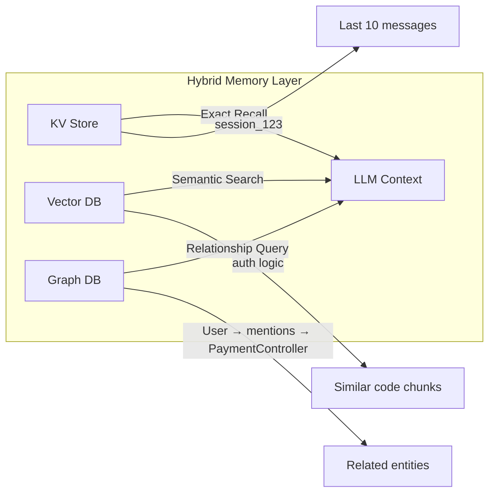

# ADR-003: Hybrid Database Architecture (Vector + Graph + KV)

| Status   | Proposed |
|----------|----------|
| Date     | 2026-01-26 |
| Authors  | @mmornati |
| Supersedes | ADR-001 (extends session cache with hybrid storage) |

## Context

### Problem Statement

The original session cache proposal (ADR-001) used only vector embeddings for session memory. While semantic search is powerful, it has critical limitations for a **coding assistant**:

| Query Type | Vector DB Handles Well? | Example |
|------------|------------------------|---------|
| "Find code about authentication" | ✅ Yes | Semantic similarity |
| "What imports `auth.py`?" | ❌ No | Requires structural/relationship data |
| "What was my last prompt?" | ❌ No | Requires exact recall, not fuzzy search |
| "Which functions call `validate_user`?" | ❌ No | Requires call graph traversal |

### Mem0's Hybrid Approach

Mem0 demonstrates that AI memory benefits from **three complementary stores**:



| Component | Brain Function | What It Stores | Best Query Type |
|-----------|---------------|----------------|-----------------|
| **KV Store** | Short-term memory | Session state, chat history, configs | "What was the last message?" |
| **Vector DB** | Fuzzy association | Semantic embeddings, concepts | "Find code about X concept" |
| **Graph DB** | Structured logic | Relationships, dependencies | "What depends on X?" |

## Decision

**Adopt a hybrid database architecture for nexus-dev** using lightweight, embedded, local-first components:

| Layer | Technology | Rationale |
|-------|-----------|-----------|
| **Key-Value** | SQLite | Built into Python, zero-config, fast exact lookups |
| **Vector** | LanceDB (existing) | Already integrated, excellent performance |
| **Graph** | KùzuDB | Embedded C++ graph DB, Cypher queries, proven LanceDB integration |

### Why These Choices?

#### SQLite for KV
- **Built into Python** - No additional dependency
- **Fast exact lookups** - Perfect for session state, chat history
- **ACID transactions** - Reliable for state management
- **Already proven** - Used by countless applications

#### LanceDB for Vectors (Keep Existing)
- **Already integrated** - No migration needed
- **Excellent performance** - Optimized for embeddings
- **Local-first** - Aligns with nexus-dev philosophy

#### KùzuDB for Graphs (over NetworkX)

| Factor | KùzuDB | NetworkX |
|--------|--------|----------|
| **Language** | C++ with Python bindings | Pure Python |
| **Performance** | 18x faster ingestion, 2-374x faster OLAP | 40-250x slower than C++ alternatives |
| **Persistence** | Disk-backed, survives restarts | In-memory (requires serialization) |
| **Query Language** | Cypher (industry standard) | Python API only |
| **Scale** | Millions of nodes | ~10k nodes before slowdown |
| **LanceDB Integration** | Proven in Graph RAG workshops | Manual coordination |

> [!NOTE]
> NetworkX remains useful for **prototyping** or when the graph is small (<10k nodes). KùzuDB is better for **production** code dependency analysis across large codebases.

## Technical Design

### Storage Locations

```
~/.nexus/
├── lance/              # Vector embeddings (existing)
├── kuzu/               # Graph database (new)
│   ├── nodes/
│   └── edges/
└── state.db            # SQLite KV store (new)
```

### Schema Design

#### KV Layer (SQLite)

```sql
-- Session state table
CREATE TABLE sessions (
    session_id TEXT PRIMARY KEY,
    project_id TEXT NOT NULL,
    created_at TIMESTAMP DEFAULT CURRENT_TIMESTAMP,
    updated_at TIMESTAMP DEFAULT CURRENT_TIMESTAMP,
    metadata JSON
);

-- Chat history (fast exact recall)
CREATE TABLE chat_history (
    id INTEGER PRIMARY KEY AUTOINCREMENT,
    session_id TEXT NOT NULL,
    role TEXT NOT NULL,  -- 'user' or 'assistant'
    content TEXT NOT NULL,
    timestamp TIMESTAMP DEFAULT CURRENT_TIMESTAMP,
    FOREIGN KEY (session_id) REFERENCES sessions(session_id)
);

-- Configuration cache
CREATE TABLE config_cache (
    key TEXT PRIMARY KEY,
    value JSON,
    expires_at TIMESTAMP
);
```

#### Graph Layer (KùzuDB)

```cypher
-- Node types
CREATE NODE TABLE File (path STRING PRIMARY KEY, language STRING);
CREATE NODE TABLE Function (id STRING PRIMARY KEY, name STRING, file_path STRING);
CREATE NODE TABLE Class (id STRING PRIMARY KEY, name STRING, file_path STRING);
CREATE NODE TABLE Entity (id STRING PRIMARY KEY, name STRING, entity_type STRING);

-- Edge types
CREATE REL TABLE IMPORTS (FROM File TO File);
CREATE REL TABLE DEFINES (FROM File TO Function);
CREATE REL TABLE CALLS (FROM Function TO Function);
CREATE REL TABLE INHERITS (FROM Class TO Class);
CREATE REL TABLE DISCUSSED (FROM Entity TO Entity);
CREATE REL TABLE RELATED_TO (FROM Entity TO File);
```

### Example Graph Queries

```cypher
-- What files import auth.py?
MATCH (f:File)-[:IMPORTS]->(target:File {path: 'auth.py'})
RETURN f.path

-- What functions call validate_user?
MATCH (caller:Function)-[:CALLS]->(target:Function {name: 'validate_user'})
RETURN caller.name, caller.file_path

-- Full dependency tree for a file
MATCH path = (f:File {path: 'main.py'})-[:IMPORTS*1..3]->(dep:File)
RETURN path
```

## New MCP Tools

```python
@mcp.tool()
async def search_dependencies(file_or_function: str, direction: str = "both") -> str:
    """Find code dependencies using the graph database."""

@mcp.tool()
async def find_callers(function_name: str) -> str:
    """Find all functions that call the specified function."""

@mcp.tool()
async def smart_search(query: str, search_mode: str = "auto") -> str:
    """Intelligent search combining vector, graph, and KV stores."""
```

## Performance Expectations

| Operation | Expected Latency |
|-----------|-----------------|
| KV exact lookup | <5ms |
| Vector search | 50-100ms |
| Simple graph query | 10-50ms |
| Hybrid search (all three) | 100-300ms |

| Package | Size |
|---------|------|
| kuzu | ~50 MB |
| sqlite3 | 0 MB (built-in) |

## Implementation Phases

### Phase 0: Preparation
- [ ] Add KùzuDB dependency
- [ ] Create `HybridDatabase` wrapper class
- [ ] Add SQLite KV store implementation

### Phase 1: KV Layer
- [ ] Implement session state storage
- [ ] Move chat history to KV
- [ ] Add `get_recent_context` tool

### Phase 2: Graph Layer (Code Dependencies)
- [ ] Implement AST-based code graph extraction
- [ ] Add `search_dependencies` tool
- [ ] Add `find_callers` tool

### Phase 3: Hybrid Query Routing
- [ ] Implement query router
- [ ] Add `smart_search` tool
- [ ] Add reranking for combined results

## References

- [KùzuDB Documentation](https://kuzudb.com/docs/)
- [LanceDB + KùzuDB Graph RAG Workshop](https://github.com/kuzudb/graphrag-workshop)
- [Mem0 Hybrid Architecture](https://mem0.ai/docs)
