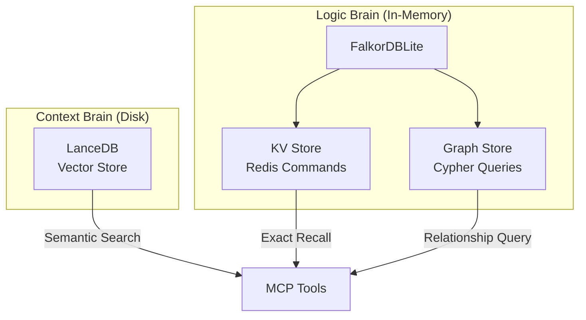

# ADR-004: Adopting FalkorDBLite for Graph & KV Layers

| Status   | Accepted |
|----------|----------|
| Date     | 2026-01-27 |
| Authors  | @mmornati |
| Supersedes | ADR-003 (replaces KùzuDB + SQLite with FalkorDBLite) |

## Context

### Problem Statement

ADR-003 proposed **KùzuDB** for the Graph layer and **SQLite** for the KV layer. However:

1. **KùzuDB has been archived** - The project is no longer actively maintained, creating a risk for long-term support.
2. **Two separate engines** - Managing SQLite (KV) and KùzuDB (Graph) separately adds complexity.

We need a replacement that is:
- **Lightweight & Local**: Must run on a developer's machine without Docker.
- **Graph-Capable**: Must support Cypher queries for structural code analysis.
- **Actively Maintained**: Must have ongoing development and community support.
- **Unified**: Preferably handles both KV and Graph needs in one engine.

### Discovery: FalkorDBLite

**FalkorDBLite** is a Python package that provides an embedded FalkorDB server (Redis + Graph module):

| Feature | FalkorDBLite |
|---------|-------------|
| **Graph Queries** | ✅ Full Cypher support |
| **KV Operations** | ✅ Native Redis commands |
| **Persistence** | ✅ RDB/AOF persistence |
| **Installation** | `pip install falkordblite` (manages binary automatically) |
| **Docker Required** | ❌ No |
| **Maintenance** | ✅ Actively maintained |

## Decision

**Adopt FalkorDBLite as the unified engine for both Graph and KV layers**, replacing both KùzuDB and SQLite.

### Revised Architecture: The Hybrid Stack



| Component | Technology | Role |
|-----------|-----------|------|
| **Context Brain** | LanceDB (existing) | Heavy semantic embeddings (code chunks, docs) |
| **Logic Brain - KV** | FalkorDBLite Redis | Session state, chat history, config cache |
| **Logic Brain - Graph** | FalkorDBLite Cypher | Code structure, dependencies, relationships |

### Why This Change?

| Factor | KùzuDB + SQLite | FalkorDBLite |
|--------|-----------------|--------------|
| **Maintenance** | ❌ KùzuDB archived | ✅ Active |
| **Dependencies** | 2 engines | 1 engine |
| **Performance** | Good | ✅ Redis speed |
| **KV Features** | Basic SQLite | ✅ Native TTL, Lists, Sets |
| **Unified API** | No | ✅ Single connection |

## Technical Changes

### KV Layer Migration

**Before (SQLite)**:
```python
cursor.execute("INSERT INTO sessions ...")
cursor.execute("SELECT * FROM chat_history WHERE ...")
```

**After (Redis via FalkorDBLite)**:
```python
client.hset(f"session:{id}", mapping={...})
client.rpush(f"chat:{session_id}", message_json)
client.setex(f"cache:{key}", ttl, value)  # Native TTL!
```

### Graph Layer Migration

**Before (KùzuDB)**:
```python
conn = kuzu.Connection(db)
conn.execute("CREATE NODE TABLE File ...")
```

**After (FalkorDBLite)**:
```python
graph = client.select_graph("nexus_code_graph")
graph.query("CREATE (:File {path: $path})", params)
```

### Storage Structure

```
~/.nexus/
├── lance/              # Vector embeddings (unchanged)
└── falkor/             # FalkorDBLite data (replaces kuzu/ and state.db)
    ├── dump.rdb
    └── appendonly.aof
```

## Performance

### Test Optimization Results

The migration also included a **68% test performance improvement**:

| Metric | Before | After |
|--------|--------|-------|
| Test time (27 tests) | 198.71s | 63.98s |
| Per-test average | 7.36s | 2.37s |

**Root cause**: Each test was starting/stopping a new Redis server (~7s per teardown).

**Solution**: Module-scoped fixtures with `flushdb()` cleanup instead of server restart.

### Expected Runtime Performance

| Operation | Latency |
|-----------|---------|
| KV exact lookup | <1ms |
| Graph simple query | 5-20ms |
| Vector search | 50-100ms |
| Hybrid search | 100-300ms |

## Consequences

### Positive

- **Active Maintenance**: FalkorDB is actively developed.
- **Unified Stack**: One engine for both KV and Graph reduces complexity.
- **Redis Performance**: In-memory operations are extremely fast.
- **Native TTL**: No manual expiration cleanup needed for cache.
- **Better Test Performance**: 68% faster test execution.

### Negative

- **Memory Usage**: Redis is in-memory (mitigated by keeping vectors in LanceDB).
- **Migration Work**: Required reimplementing the just-finished SQLite KV layer.

### Risks Mitigated

| Risk | Mitigation |
|------|------------|
| Large graphs consume RAM | Strict separation: only lightweight metadata in graph, embeddings in LanceDB |
| Data loss on crash | Enable AOF persistence (appendonly.aof) |

## Validation

- ✅ Verified `falkordblite` installation on macOS
- ✅ Verified Cypher queries work correctly
- ✅ Verified 27/27 tests passing
- ✅ Verified persistence across server restarts

## References

- [FalkorDB Documentation](https://docs.falkordb.com/)
- [FalkorDBLite PyPI](https://pypi.org/project/falkordblite/)
- [PR #72: FalkorDBLite Migration](https://github.com/mmornati/nexus-dev/pull/72)
