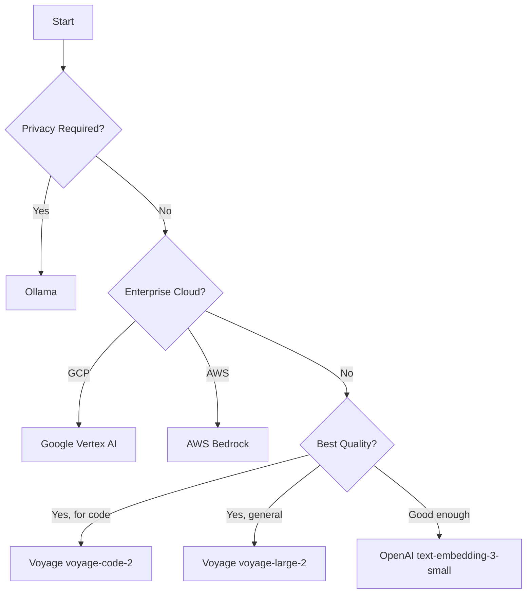

# Embedding Providers

Comprehensive guide to choosing and configuring embedding providers.

---

## Overview

Embeddings are vector representations of text that enable semantic search. Nexus-Dev supports multiple providers to fit different needs:

| Provider | Best For | Cost | Privacy |
|----------|----------|------|---------|
| **OpenAI** | General use, easy setup | $ | Cloud |
| **Ollama** | Privacy, offline use | Free | Local |
| **Google Vertex AI** | GCP enterprises | $$ | Cloud |
| **AWS Bedrock** | AWS enterprises | $$ | Cloud |
| **Voyage AI** | Best RAG quality | $$$ | Cloud |
| **Cohere** | Multilingual, reranking | $$ | Cloud |

!!! warning "Provider Lock-in"
    Embeddings are NOT portable between providers. Changing providers requires re-indexing with `nexus-reindex`.

---

## OpenAI (Default)

**Recommended for:** Getting started, general purpose.

### Setup

```bash
export OPENAI_API_KEY="sk-..."
```

### Configuration

```json
{
  "embedding_provider": "openai",
  "embedding_model": "text-embedding-3-small"
}
```

### Models

| Model | Dimensions | Cost/1M tokens | Quality |
|-------|------------|----------------|---------|
| `text-embedding-3-small` | 1536 | $0.02 | Good |
| `text-embedding-3-large` | 3072 | $0.13 | Better |
| `text-embedding-ada-002` | 1536 | $0.10 | Legacy |

!!! tip "Start with Small"
    `text-embedding-3-small` offers excellent quality/cost ratio for most use cases.

---

## Ollama (Local)

**Recommended for:** Privacy, offline use, cost savings.

### Setup

```bash
# Install Ollama
curl -fsSL https://ollama.com/install.sh | sh

# Start server
ollama serve

# Pull embedding model
ollama pull nomic-embed-text
```

### Configuration

```json
{
  "embedding_provider": "ollama",
  "embedding_model": "nomic-embed-text",
  "ollama_url": "http://localhost:11434"
}
```

### Models

| Model | Dimensions | Size | Quality |
|-------|------------|------|---------|
| `nomic-embed-text` | 768 | 274MB | Good |
| `mxbai-embed-large` | 1024 | 669MB | Better |
| `all-minilm` | 384 | 45MB | Fast |

### Performance

- **CPU**: ~100-500ms per embedding
- **GPU**: ~10-50ms per embedding
- **Batch**: Process multiple files together for efficiency

---

## Google Vertex AI

**Recommended for:** GCP enterprises, high scalability.

### Setup

```bash
# Install extra
pipx install nexus-dev[google]

# Configure ADC
gcloud auth application-default login
```

### Configuration

```json
{
  "embedding_provider": "google",
  "embedding_model": "text-embedding-004",
  "google_project_id": "your-project-id",
  "google_location": "us-central1"
}
```

### Models

| Model | Dimensions | Notes |
|-------|------------|-------|
| `text-embedding-004` | 768 | Latest, recommended |
| `textembedding-gecko@003` | 768 | Previous version |

---

## AWS Bedrock

**Recommended for:** AWS enterprises, existing AWS infrastructure.

### Setup

```bash
# Install extra
pipx install nexus-dev[aws]

# Configure credentials
aws configure
```

### Configuration

```json
{
  "embedding_provider": "aws",
  "embedding_model": "amazon.titan-embed-text-v1",
  "aws_region": "us-east-1"
}
```

### Models

| Model | Dimensions | Notes |
|-------|------------|-------|
| `amazon.titan-embed-text-v1` | 1536 | AWS native |
| `cohere.embed-english-v3` | 1024 | Via Bedrock |

---

## Voyage AI

**Recommended for:** Best-in-class RAG quality.

### Setup

```bash
pipx install nexus-dev[voyage]
```

### Configuration

```json
{
  "embedding_provider": "voyage",
  "embedding_model": "voyage-large-2",
  "voyage_api_key": "your-key"
}
```

### Models

| Model | Dimensions | Best For |
|-------|------------|----------|
| `voyage-large-2` | 1024 | General purpose |
| `voyage-code-2` | 1536 | Code search |
| `voyage-lite-02-instruct` | 1024 | Fast, cost-effective |

!!! tip "For Code Search"
    `voyage-code-2` is specifically trained for code and outperforms general models.

---

## Cohere

**Recommended for:** Multilingual projects, reranking.

### Setup

```bash
pipx install nexus-dev[cohere]
```

### Configuration

```json
{
  "embedding_provider": "cohere",
  "embedding_model": "embed-multilingual-v3.0",
  "cohere_api_key": "your-key"
}
```

### Models

| Model | Dimensions | Languages |
|-------|------------|-----------|
| `embed-english-v3.0` | 1024 | English |
| `embed-multilingual-v3.0` | 1024 | 100+ |

---

## Comparison

### Quality Benchmarks

Based on MTEB (Massive Text Embedding Benchmark):

| Provider | Model | MTEB Score |
|----------|-------|------------|
| Voyage | voyage-large-2 | 68.3 |
| OpenAI | text-embedding-3-large | 64.6 |
| Cohere | embed-multilingual-v3 | 64.0 |
| OpenAI | text-embedding-3-small | 62.3 |
| Ollama | nomic-embed-text | 59.2 |

### Cost Comparison

Approximate cost per 1M tokens indexed:

| Provider | Model | Cost |
|----------|-------|------|
| Ollama | nomic-embed-text | $0 (local) |
| OpenAI | text-embedding-3-small | $0.02 |
| OpenAI | text-embedding-3-large | $0.13 |
| Cohere | embed-english-v3 | $0.10 |
| Voyage | voyage-large-2 | $0.12 |

---

## Choosing a Provider

### Decision Tree



### Quick Recommendations

| Scenario | Provider | Model |
|----------|----------|-------|
| Getting started | OpenAI | text-embedding-3-small |
| Privacy-sensitive | Ollama | nomic-embed-text |
| Maximum quality | Voyage | voyage-large-2 |
| Code-focused | Voyage | voyage-code-2 |
| Multilingual | Cohere | embed-multilingual-v3.0 |
| GCP shop | Google | text-embedding-004 |
| AWS shop | AWS | amazon.titan-embed-text-v1 |

---

## Switching Providers

When changing providers:

1. Update `nexus_config.json`
2. Set required environment variables/credentials
3. Re-index everything:

```bash
nexus-reindex
```

!!! warning "Full Re-index Required"
    You cannot mix embeddings from different providers. The entire database must be rebuilt.

---

## See Also

- [Configuration](../getting-started/configuration.md) - Full config reference
- [nexus-reindex](../cli/reindex.md) - Rebuilding index
