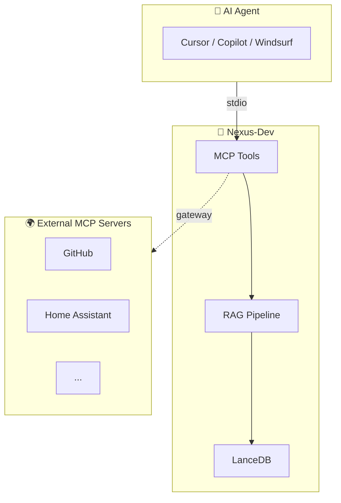

# Nexus-Dev

**Persistent Memory for AI Coding Agents**

Nexus-Dev is an open-source MCP (Model Context Protocol) server that provides a local RAG (Retrieval-Augmented Generation) system for AI coding assistants like GitHub Copilot, Cursor, and Windsurf. It learns from your codebase and mistakes, enabling cross-project knowledge sharing.

---

## ✨ Key Features

<div class="grid cards" markdown>

-   :brain: **Persistent Memory**

    ---

    Index your code and documentation for semantic search. Your AI assistant remembers context across sessions.

-   :books: **Lesson Learning**

    ---

    Record problems and solutions. The AI recalls them when similar issues arise.

-   :octicons-mark-github-16: **GitHub Integration**

    ---

    Import Issues and Pull Requests into your knowledge base for context-aware assistance.

-   :globe_with_meridians: **Multi-Language Support**

    ---

    Python, JavaScript/TypeScript, Java - with extensibility via tree-sitter.

-   :arrows_counterclockwise: **Cross-Project Learning**

    ---

    Share knowledge across all your projects. Solutions from one project help others.

-   :house: **Local-First**

    ---

    All data stays on your machine with LanceDB. Privacy by default.

</div>

---

## 🚀 Quick Start

Install Nexus-Dev globally (no project clone needed):

=== "pipx (Recommended)"

    ```bash
    pipx install nexus-dev
    ```

=== "uv"

    ```bash
    uv tool install nexus-dev
    ```

Then initialize your project:

```bash
cd your-project
nexus-init --project-name "my-project" --embedding-provider openai
nexus-index src/ -r
```

Configure your IDE and you're ready! See the [Quick Start Guide](quickstart.md) for full details.

---

## 📚 Documentation

| Section | Description |
|---------|-------------|
| [Quick Start](quickstart.md) | 5-minute setup guide |
| [Installation](getting-started/installation.md) | Detailed installation options |
| [CLI Reference](cli/index.md) | All command-line tools |
| [MCP Tools](tools/index.md) | Tools exposed to AI agents |
| [Workflows](workflows/new-project.md) | Step-by-step usage guides |

---

## 🔧 MCP Tools Overview

Nexus-Dev exposes powerful tools to your AI coding assistant:

### Search Tools

| Tool | Description |
|------|-------------|

| `smart_search` | **Start here!** Intelligent search that routes to Graph, History, or Vector search |
| `search_knowledge` | Search all content (code, docs, lessons) |
| `search_code` | Find function and class definitions |
| `search_docs` | Search documentation |
| `search_lessons` | Find past solutions to problems |
| `search_insights` | Search recorded insights from past sessions |
| `search_implementations` | Find how similar features were built previously |

### Graph Tools

| Tool | Description |
|------|-------------|
| `find_callers` | Find all functions that call a specific function |
| `search_dependencies` | Find imports and dependencies (what imports X, what X imports) |
| `find_implementations` | Find class hierarchies and implementations |

### Learning Tools

| Tool | Description |
|------|-------------|
| `record_lesson` | Store a problem/solution pair |
| `record_insight` | Capture discoveries and mistakes |
| `record_implementation` | Document completed features |

### Gateway Tools

| Tool | Description |
|------|-------------|

| `search_tools` | Find MCP tools across all servers |
| `invoke_tool` | Execute tools on backend servers |
| `list_servers` | List all configured MCP servers and their status |
| `get_tool_schema` | Get full parameter schema for a specific tool |

### Management Tools

| Tool | Description |
|------|-------------|
| `index_file` | Index a file into the knowledge base |
| `import_github_issues` | Import GitHub issues and PRs for context |

---

## 🏗️ Architecture



---

## 🤝 Contributing

We welcome contributions! See [CONTRIBUTING.md](https://github.com/mmornati/nexus-dev/blob/main/CONTRIBUTING.md) for guidelines.

---

## 📄 License

MIT License - see [LICENSE](https://github.com/mmornati/nexus-dev/blob/main/LICENSE) for details.
