# Architecture

Technical architecture of Nexus-Dev.

---

## High-Level Overview


---

## Component Details

### Hybrid Database Architecture

Nexus-Dev uses a 3-layer hybrid database (ADR-003):


#### 1. Vector Layer (LanceDB)
- **Purpose**: Semantic search over code, docs, and lessons.
- **Engine**: LanceDB (Serverless).
- **Storage**: `~/.nexus-dev/db/lancedb/`.

#### 2. Graph Layer (FalkorDB)
- **Purpose**: Tracks code structure and relationships (imports, calls, inheritance).
- **Engine**: FalkorDB (via `falkordblite`).
- **Storage**: Persistent Redis-compatible file.
- **Querying**: Cypher query language.

#### 3. KV Layer (Redis/FalkorDBLite)
- **Purpose**: High-speed lookups for session context and chat history.
- **Engine**: Redis Hash/List (via `falkordblite`).
- **Performance**: < 10ms latency.

### MCP Server

Built on [FastMCP](https://github.com/jlowin/fastmcp), providing:

- **Tool registration** via decorators
- **Stdio transport** for IDE communication
- **Type-safe parameters** with Pydantic models

### Language Chunkers

Parse source code into semantic chunks:


| Language | Parser | Chunks Extracted |
|----------|--------|------------------|
| Python | `ast` module | Functions, classes, methods |
| JavaScript/TypeScript | tree-sitter | Functions, classes, methods |
| Java | tree-sitter | Classes, methods, interfaces |
| Markdown | Regex | Sections by headers |
| Plain text | Regex | Paragraphs |

### Embedding Pipeline


### LanceDB Storage

Serverless vector database with:

- **Local storage**: `~/.local/share/nexus-dev/lancedb/`
- **Vector index**: Approximate nearest neighbor search
- **Metadata**: File paths, types, line numbers

Schema:

```python
@dataclass
class Document:
    id: str              # Unique document ID
    text: str            # Chunk content
    vector: list[float]  # Embedding vector
    project_id: str      # Project identifier
    file_path: str       # Source file path
    doc_type: str        # code, documentation, lesson, etc.
    chunk_type: str      # function, class, section, etc.
    language: str        # python, javascript, markdown, etc.
    name: str            # Chunk name (function/class name)
    start_line: int      # Starting line number
    end_line: int        # Ending line number
    timestamp: datetime  # When indexed
```

---

## Data Flow

### Indexing Flow

```mermaid
sequenceDiagram
    participant User as User/Hook
    participant CLI as CLI
    participant Chunker as Chunker
    participant Embedder as Embedder
    participant DB as LanceDB

    User->>CLI: nexus-index src/
    CLI->>CLI: Collect files
    loop For each file
        CLI->>Chunker: Parse file
        Chunker-->>CLI: Chunks
        CLI->>Embedder: Generate embeddings
        Embedder-->>CLI: Vectors
        CLI->>DB: Upsert documents
    end
    CLI-->>User: ✅ Indexed N chunks
```



### Search Flow


### Gateway Flow


---

## Directory Structure

```
nexus-dev/
├── src/nexus_dev/
│   ├── server.py           # MCP server entry point
│   ├── cli.py              # CLI commands
│   ├── config.py           # Configuration management
│   ├── database.py         # LanceDB operations
│   ├── embeddings.py       # Embedding providers
│   ├── chunkers/           # Language-specific parsers
│   │   ├── python.py
│   │   ├── javascript.py
│   │   ├── java.py
│   │   └── docs.py
│   ├── agents/             # Agent system
│   │   ├── config.py       # Agent configuration
│   │   ├── executor.py     # Agent execution
│   │   └── manager.py      # Agent discovery
│   ├── gateway/            # MCP gateway
│   │   └── connection_manager.py
│   └── mcp_config.py       # Gateway configuration
├── agents/                 # User-defined agents (YAML)
├── docs/                   # Documentation (you are here)
└── tests/                  # Test suite
```

---

## Configuration Files

| File | Location | Purpose |
|------|----------|---------|
| `nexus_config.json` | Project root | Project configuration |
| `.nexus/mcp_config.json` | Project | Gateway server config |
| `.nexus/lessons/*.md` | Project | Recorded lessons |
| `agents/*.yaml` | Project | Custom agent definitions |
| `~/.local/share/nexus-dev/lancedb/` | User home | Vector database |

---

## Extension Points

### Adding Language Support

1. Create chunker in `src/nexus_dev/chunkers/`
2. Implement `chunk_file(path, content) -> list[CodeChunk]`
3. Register in `ChunkerRegistry`

### Adding Embedding Provider

1. Add to `src/nexus_dev/embeddings.py`
2. Implement `EmbeddingProvider` interface
3. Update `create_embedder()` factory

### Adding MCP Tools

1. Add to `src/nexus_dev/server.py`
2. Use `@mcp.tool()` decorator
3. Follow existing patterns for parameters and responses

---

## See Also

- [Contributing](contributing.md) - Development guide
- [Configuration](../getting-started/configuration.md) - Config reference
