# Agent Tools

Tools for invoking custom AI agents.

---

## Overview

Nexus-Dev supports custom agents—specialized AI personas defined in YAML files. Each agent becomes an MCP tool that can be invoked by your IDE's AI assistant.

```mermaid
flowchart LR
    IDE["🤖 Your IDE"]
    NX["📡 Nexus-Dev"]
    Agent["👤 Custom Agent"]
    RAG["📚 RAG"]
    
    IDE -->|"ask_code_reviewer(...)"| NX
    NX --> Agent
    Agent --> RAG
    Agent -->|response| NX
    NX -->|result| IDE
```



---

## refresh_agents

Reload custom agents from the `agents/` directory.

### When to Use

- After creating a new agent
- After modifying an agent configuration
- When the MCP server started without project context

### Example

```
refresh_agents()
```

**Response:**

```
Refreshed agents from /path/to/project/agents/

Registered tools:
- ask_code_reviewer
- ask_security_auditor
- ask_my_custom_agent
```

---

## list_agents

Show available agents in the current workspace.

### Example

```
list_agents()
```

**Response:**

```markdown
## Available Agents

### code_reviewer
- **Role:** Senior Code Reviewer
- **Description:** Delegate code review tasks to the Code Reviewer agent.

### security_auditor
- **Role:** Security Expert
- **Description:** Identify vulnerabilities and recommend fixes.
```

---

## ask_* (Dynamic Tools)

Each custom agent gets its own `ask_<name>` tool.

### Parameters

| Parameter | Type | Required | Description |
|-----------|------|----------|-------------|
| `task` | string | ✅ | Task description for the agent |

### Example

```
ask_code_reviewer("Review the authentication module for security issues and best practices")
```

**Response:**

The agent processes the task using:

1. Its configured persona (role, goal, backstory)
2. RAG search results from the knowledge base
3. Any configured tools

And returns a structured response based on its expertise.

---

## Creating Agents

### From Template

```bash
nexus-agent init my_reviewer --from-template code_reviewer
```

### Available Templates

| Template | Role |
|----------|------|
| `code_reviewer` | Reviews code for bugs and best practices |
| `doc_writer` | Creates technical documentation |
| `debug_detective` | Analyzes errors and proposes fixes |
| `refactor_architect` | Suggests code restructuring |
| `test_engineer` | Generates test cases |
| `security_auditor` | Identifies vulnerabilities |
| `api_designer` | Reviews REST/GraphQL APIs |
| `performance_optimizer` | Finds bottlenecks |

---

## Agent Configuration

Agents are defined in `agents/<name>.yaml`:

```yaml
name: "code_reviewer"
display_name: "Code Reviewer"
description: "Delegate code review tasks to the Code Reviewer agent."

profile:
  role: "Senior Code Reviewer"
  goal: "Identify bugs, security issues, and suggest improvements"
  backstory: "Expert developer with 10+ years of experience."
  tone: "Professional and constructive"

memory:
  enabled: true
  rag_limit: 5
  search_types: ["code", "documentation", "lesson"]

tools: []  # Empty = all tools available

llm_config:
  model_hint: "claude-sonnet-4.5"
  fallback_hints: ["auto"]
  temperature: 0.5
  max_tokens: 4000
```

### Configuration Options

| Field | Description |
|-------|-------------|
| `profile.role` | Agent's expertise/persona |
| `profile.goal` | What the agent tries to achieve |
| `profile.backstory` | Background for context |
| `profile.tone` | Response style |
| `memory.enabled` | Use RAG for context |
| `memory.rag_limit` | Number of RAG results |
| `memory.search_types` | What to search |
| `llm_config.model_hint` | Preferred model |

---

## Usage Patterns

### Code Review

```
ask_code_reviewer("Review src/auth/login.py for security issues")
```

### Documentation

```
ask_doc_writer("Create API documentation for the UserService class")
```

### Debugging

```
ask_debug_detective("Analyze this error: ConnectionRefusedError on port 5432")
```

---

## See Also

- [nexus-agent CLI](../cli/agent.md) - Create and manage agents
- [Workflows](../workflows/new-project.md#optional-add-custom-agents) - Agent setup guide
