# Gateway Tools

Tools for accessing other MCP servers through Nexus-Dev.

---

## Overview

Nexus-Dev can act as a gateway to other MCP servers, reducing the number of tools your AI agent needs to manage. Instead of configuring 10 servers with 100+ tools, configure only Nexus-Dev and use these tools to access others.

```mermaid
flowchart LR
    AI["🤖 AI Agent"]
    NX["📡 Nexus-Dev"]
    GH["GitHub"]
    HA["Home Assistant"]
    FS["Filesystem"]
    
    AI --> NX
    NX --> GH
    NX --> HA
    NX --> FS
```



---

## search_tools

Find MCP tools matching a description.

### Parameters

| Parameter | Type | Required | Default | Description |
|-----------|------|----------|---------|-------------|
| `query` | string | ✅ | - | Natural language description |
| `server` | string | | (all) | Filter to specific server |
| `limit` | int | | `5` | Maximum results (max: 10) |

### Example

```
search_tools("create a GitHub issue")
```

**Response:**

```markdown
## MCP Tools matching: 'create a GitHub issue'

### 1. github.create_issue
**Description:** Create a new issue in a repository

**Parameters:**
{
  "owner": "string",
  "repo": "string",
  "title": "string",
  "body": "string",
  "labels": ["string"]
}

### 2. github.create_pull_request
**Description:** Create a pull request

**Parameters:**
{
  "owner": "string",
  "repo": "string",
  "title": "string",
  "body": "string",
  "head": "string",
  "base": "string"
}
```

---

## get_tool_schema

Get the full JSON schema for a specific tool.

### Parameters

| Parameter | Type | Required | Default | Description |
|-----------|------|----------|---------|-------------|
| `server` | string | ✅ | - | Server name |
| `tool` | string | ✅ | - | Tool name |

### Example

```
get_tool_schema(server="github", tool="create_issue")
```

**Response:**

```json
{
  "server": "github",
  "tool": "create_issue",
  "description": "Create a new issue in a repository",
  "parameters": {
    "type": "object",
    "properties": {
      "owner": {"type": "string", "description": "Repository owner"},
      "repo": {"type": "string", "description": "Repository name"},
      "title": {"type": "string", "description": "Issue title"},
      "body": {"type": "string", "description": "Issue body"},
      "labels": {"type": "array", "items": {"type": "string"}}
    },
    "required": ["owner", "repo", "title"]
  }
}
```

---

## invoke_tool

Execute a tool on a backend MCP server.

### Parameters

| Parameter | Type | Required | Default | Description |
|-----------|------|----------|---------|-------------|
| `server` | string | ✅ | - | Server name |
| `tool` | string | ✅ | - | Tool name |
| `arguments` | object | | `{}` | Tool arguments |

### Example

```
invoke_tool(
    server="github",
    tool="create_issue",
    arguments={
        "owner": "mmornati",
        "repo": "nexus-dev",
        "title": "Add webhook support",
        "body": "We should add webhook support for real-time updates.",
        "labels": ["enhancement"]
    }
)
```

**Response:**

```
Issue created: https://github.com/mmornati/nexus-dev/issues/42
```

---

## list_servers

List all configured MCP servers and their status.

### Example

```
list_servers()
```

**Response:**

```markdown
## MCP Servers

### Active
- **github**: `Command: npx -y @modelcontextprotocol/server-github`
- **homeassistant**: `SSE: http://homeassistant.local:8123/mcp`

### Disabled
- slack (disabled)
```

---

## Gateway Workflow

The typical workflow for using gateway mode:

1. **Search for the tool**:
   ```
   search_tools("create a GitHub issue")
   ```

2. **Get detailed schema** (if needed):
   ```
   get_tool_schema("github", "create_issue")
   ```

3. **Invoke the tool**:
   ```
   invoke_tool("github", "create_issue", {...})
   ```

---

## Configuration

Configure downstream servers in `.nexus/mcp_config.json`:

```json
{
  "servers": {
    "github": {
      "transport": "stdio",
      "command": "npx",
      "args": ["-y", "@modelcontextprotocol/server-github"],
      "env": {
        "GITHUB_PERSONAL_ACCESS_TOKEN": "ghp_..."
      },
      "enabled": true
    },
    "homeassistant": {
      "transport": "sse",
      "url": "http://homeassistant.local:8123/mcp",
      "enabled": true
    }
  }
}
```

---

## Benefits

| Without Gateway | With Gateway |
|-----------------|--------------|
| Configure 10 MCP servers | Configure 1 server |
| 100+ tools in context | ~20 core tools + search |
| Higher token usage | Lower token usage |
| Complex setup per IDE | One-time setup |

---

## See Also

- [nexus-mcp CLI](../cli/mcp.md) - Configure servers
- [nexus-index-mcp CLI](../cli/index-mcp.md) - Index tool schemas
- [Configuration](../getting-started/configuration.md#mcp-configuration) - Full setup guide
