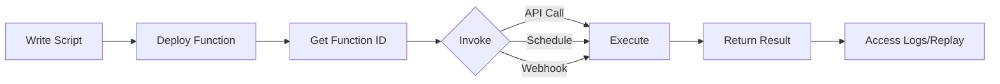

import BasicFunction from "/snippets/functions/basic_function.mdx";
import DeployFunction from "/snippets/functions/deploy_function.mdx";
import InvokeSdk from "/snippets/functions/invoke_sdk.mdx";
import HandlerFunction from "/snippets/functions/handler_function.mdx";
import ParametersExample from "/snippets/functions/parameters_example.mdx";
import PassValues from "/snippets/functions/pass_values.mdx";
import ReturnValues from "/snippets/functions/return_values.mdx";
import UsecaseScheduledScraping from "/snippets/functions/usecase_scheduled_scraping.mdx";
import UsecaseApiEndpoint from "/snippets/functions/usecase_api_endpoint.mdx";
import UsecaseWebhooks from "/snippets/functions/usecase_webhooks.mdx";
import UsecaseBatchProcessing from "/snippets/functions/usecase_batch_processing.mdx";
import BpClearParameters from "/snippets/functions/bp_clear_parameters.mdx";
import BpReturnStructured from "/snippets/functions/bp_return_structured.mdx";
import BpHandleErrors from "/snippets/functions/bp_handle_errors.mdx";
import BpAddLogging from "/snippets/functions/bp_add_logging.mdx";

<iframe
  className="w-full aspect-video rounded-xl"
  src="https://www.youtube.com/embed/jzbsfX-2qzY"
  title="Notte Functions"
  allow="accelerometer; autoplay; clipboard-write; encrypted-media; gyroscope; picture-in-picture"
  allowFullScreen
></iframe>

Functions are serverless deployments of your browser automations that can be invoked via API, scheduled to run automatically, or triggered by events.

## What are Functions?

Functions turn your automation scripts into:
- **API endpoints** you can call with HTTP requests
- **Scheduled jobs** that run on a cron schedule
- **Reusable workflows** accessible from anywhere
- **Shareable automations** for your team

Unlike running scripts locally, Functions:
- ✅ Run on Notte's infrastructure (no servers to manage)
- ✅ Scale automatically based on demand
- ✅ Provide built-in logging and monitoring
- ✅ Can be invoked from any platform (Python, JavaScript, cURL, etc.)
- ✅ Support scheduling and automation

## How Functions Work

### 1. Write Your Script

Create a Python file with a `run()` function:

<BasicFunction />

### 2. Deploy to Notte

Upload your script to create a Function:

<DeployFunction />

### 3. Invoke the Function

Call your Function as an API:

<InvokeSdk />

```bash
# Via cURL
curl -X POST https://api.notte.cc/functions/{function_id}/runs/start \
  -H "Authorization: Bearer YOUR_API_KEY" \
  -H "Content-Type: application/json" \
  -d '{
    "function_id": "workflow_123",
    "variables": {
      "url": "https://example.com",
      "search_query": "laptop"
    }
  }'
```

## Function Structure

### The Handler Function

Functions must have a `run()` function that serves as the entry point:

<HandlerFunction />

**Key points:**
- Named `run()` - this is the entry point
- Can accept parameters (passed as `variables` when invoked)
- Should have type hints for clarity
- Should include docstring documentation
- Returns a value (any JSON-serializable type)

### Parameters

Define parameters as arguments to the `run` function:

<ParametersExample />

Pass values when invoking the function:

<PassValues />

### Return Values

Functions can return any JSON-serializable data:

<ReturnValues />

## Use Cases

### 1. Scheduled Scraping

Extract data on a schedule:

<UsecaseScheduledScraping />

**Schedule:** `0 9 * * *` (Every day at 9 AM)

---

### 2. API Endpoints

Expose automation as an API:

<UsecaseApiEndpoint />

---

### 3. Webhooks

Trigger automations from external events:

<UsecaseWebhooks />

---

### 4. Batch Processing

Process multiple items in parallel:

<UsecaseBatchProcessing />

## How Functions Fit In

Functions are a **deployment layer** - they turn any automation into a reusable API.

```
┌─────────────────────────────────────────────────────┐
│                     Function                        │
│            (Deployment & Scheduling)                │
├─────────────────────────────────────────────────────┤
│                                                     │
│   ┌─────────────────┐    ┌─────────────────┐       │
│   │ Scripted        │ or │ Agent           │       │
│   │ Automation      │    │ (AI-driven)     │       │
│   └────────┬────────┘    └────────┬────────┘       │
│            │                      │                 │
│            └──────────┬───────────┘                 │
│                       │                             │
│              ┌────────▼────────┐                    │
│              │    Session      │                    │
│              │ (Cloud Browser) │                    │
│              └─────────────────┘                    │
│                                                     │
└─────────────────────────────────────────────────────┘
```

- **Session** - The cloud browser that runs everything
- **Scripted Automation vs Agent** - How you control the session
- **Function** - Deploys your automation as an API with scheduling, versioning, and sharing

**Use Functions when:**
- You need to run automation repeatedly
- You want to expose automation as an API
- You need scheduling capabilities
- You want to share automation with team or customers

Functions can contain either scripted automation or agents - they're not mutually exclusive.

## Function Lifecycle



1. **Write** - Create Python script with `run()` function
2. **Deploy** - Upload to Notte (creates function ID)
3. **Version** - Notte tracks versions automatically
4. **Invoke** - Call via API, schedule, or webhook
5. **Execute** - Runs on Notte infrastructure
6. **Monitor** - View logs, replays, and results

## Best Practices

### 1. Use Clear Parameters

Define parameters with type hints and descriptions:

<BpClearParameters />

### 2. Return Structured Data

Always return JSON-serializable data:

<BpReturnStructured />

### 3. Handle Errors Gracefully

Catch exceptions and return meaningful errors:

<BpHandleErrors />

### 4. Add Logging

Log important steps for debugging:

<BpAddLogging />

## Next Steps

<CardGroup cols={2}>
  <Card title="Creating Functions" icon="file-code" href="/features/functions/creating">
    Learn how to write and deploy Functions
  </Card>

  <Card title="Invocations" icon="play" href="/features/functions/invocations">
    Call Functions via API, SDK, or cURL
  </Card>

  <Card title="Schedules" icon="clock" href="/features/functions/schedules">
    Schedule Functions with cron
  </Card>

  <Card title="Management" icon="sliders" href="/features/functions/management">
    Update, version, and monitor Functions
  </Card>
</CardGroup>
