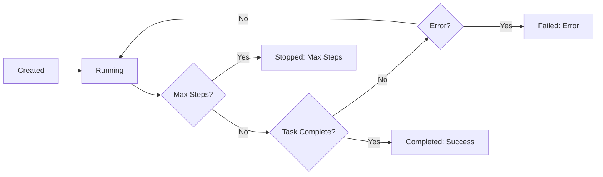

import AsyncExecution from "/snippets/agents/async_execution.mdx";
import ParallelAgents from "/snippets/agents/parallel_agents.mdx";
import RetryPattern from "/snippets/agents/retry_pattern.mdx";
import RunBlocking from "/snippets/agents/lifecycle/run_blocking.mdx";
import StartWait from "/snippets/agents/lifecycle/start_wait.mdx";
import StateRunning from "/snippets/agents/lifecycle/state_running.mdx";
import StateCompleted from "/snippets/agents/lifecycle/state_completed.mdx";
import StateFailed from "/snippets/agents/lifecycle/state_failed.mdx";
import StateMaxSteps from "/snippets/agents/lifecycle/state_max_steps.mdx";
import StatusChecking from "/snippets/agents/lifecycle/status_checking.mdx";
import LiveLogStreaming from "/snippets/agents/lifecycle/live_log_streaming.mdx";
import PollingPattern from "/snippets/agents/lifecycle/polling_pattern.mdx";
import BatchExecution from "/snippets/agents/lifecycle/batch_execution.mdx";
import ManualStop from "/snippets/agents/lifecycle/manual_stop.mdx";
import TimeoutPattern from "/snippets/agents/lifecycle/timeout_pattern.mdx";
import ResponseStructure from "/snippets/agents/lifecycle/response_structure.mdx";
import StepDetails from "/snippets/agents/lifecycle/step_details.mdx";
import GracefulDegradation from "/snippets/agents/lifecycle/graceful_degradation.mdx";
import AgentFallbackExample from "/snippets/agents/lifecycle/agent_fallback_example.mdx";
import BpExecutionMode from "/snippets/agents/lifecycle/bp_execution_mode.mdx";
import BpCheckSuccess from "/snippets/agents/lifecycle/bp_check_success.mdx";
import BpStepLimits from "/snippets/agents/lifecycle/bp_step_limits.mdx";
import BpCleanup from "/snippets/agents/lifecycle/bp_cleanup.mdx";

Agents support multiple execution patterns - from simple blocking calls to advanced asynchronous monitoring. Choose the right pattern for your use case.

## Execution Modes

### Run (Blocking)

The simplest way to execute an agent - start and wait for completion:

<RunBlocking />

**When to use:**
- Simple scripts
- Synchronous workflows
- You don't need to do other work while the agent runs

---

### Start + Wait (Non-blocking)

Start the agent and wait for completion separately:

<StartWait />

**When to use:**
- You need to start multiple agents in parallel
- You want to do other work while the agent runs
- You need more control over execution

---

### Async Execution

Run agents asynchronously with `async`/`await`:

<AsyncExecution />

**When to use:**
- Building async applications
- Running multiple agents concurrently
- Integrating with async frameworks (FastAPI, aiohttp)

## Agent States

Agents transition through these states during execution:

### Running

Agent is actively executing:

<StateRunning />

### Completed

Agent successfully finished the task:

<StateCompleted />

### Failed

Agent encountered an error:

<StateFailed />

### Stopped (Max Steps)

Agent reached maximum step limit:

<StateMaxSteps />

## Monitoring Progress

### Status Checking

Check agent progress at any time:

<StatusChecking />

### Live Log Streaming

Stream agent logs in real-time via WebSocket:

<LiveLogStreaming />

### Polling Pattern

Check status periodically:

<PollingPattern />

## Parallel Execution

### Multiple Independent Agents

Run multiple agents simultaneously:

<ParallelAgents />

### Batch Execution

Use `BatchRemoteAgent` for parallel execution with strategies:

<BatchExecution />

See [Batch Agents](/features/agents/batch) for details.

## Stopping Agents

### Manual Stop

Stop a running agent:

<ManualStop />

**Note:** You cannot stop agents once they complete a step - they must finish the current action.

### Timeout Pattern

Implement custom timeouts:

<TimeoutPattern />

## Response Structure

Agent responses contain execution details:

<ResponseStructure />

### Step Details

Inspect individual steps:

<StepDetails />

## Error Handling

### Graceful Degradation

Handle failures gracefully:

<GracefulDegradation />

### Retry Pattern

Retry failed agents:

<RetryPattern />

### Agent Fallback

Use `AgentFallback` for automatic error recovery:

<AgentFallbackExample />

See [Agent Fallback](/features/agents/fallback) for details.

## Best Practices

### 1. Use Appropriate Execution Mode

<BpExecutionMode />

### 2. Always Check Success

<BpCheckSuccess />

### 3. Set Appropriate Step Limits

<BpStepLimits />

### 4. Clean Up Resources

<BpCleanup />

## Next Steps

<CardGroup cols={2}>
  <Card title="Configuration" icon="sliders" href="/features/agents/configuration">
    Configure agent parameters
  </Card>

  <Card title="Batch Agents" icon="layer-group" href="/features/agents/batch">
    Run agents in parallel
  </Card>

  <Card title="Agent Fallback" icon="shield" href="/features/agents/fallback">
    Automatic error recovery
  </Card>

  <Card title="Replay" icon="circle-play" href="/features/agents/replay">
    Debug with visual replays
  </Card>
</CardGroup>
