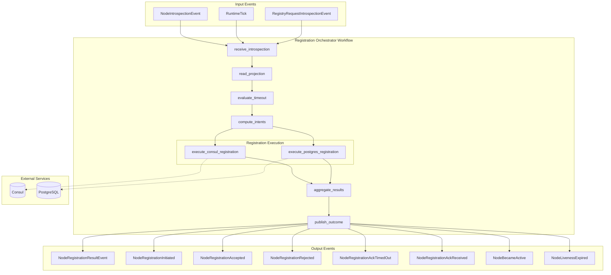
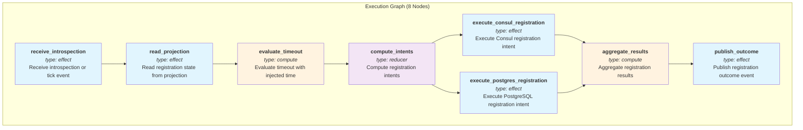
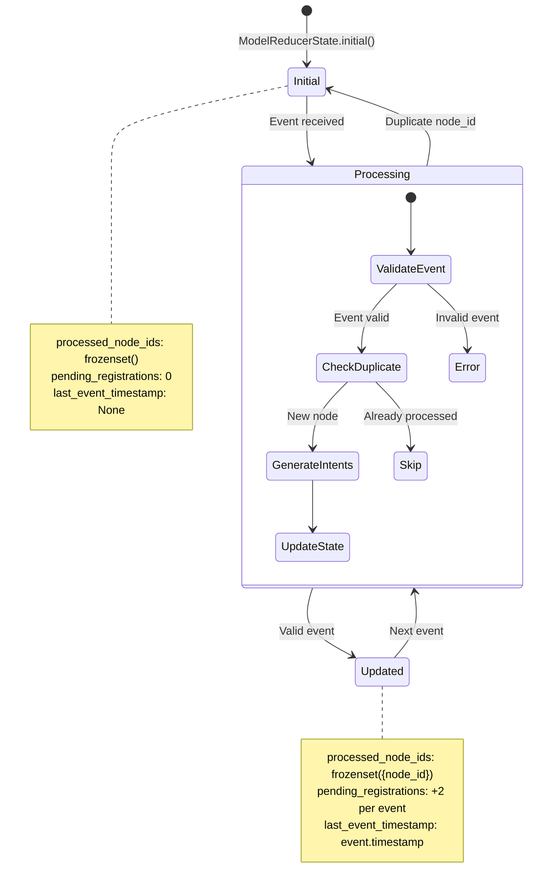
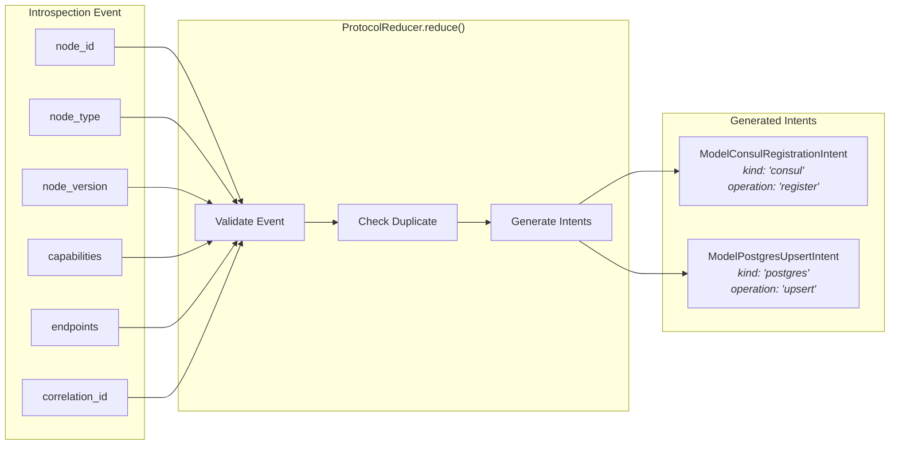
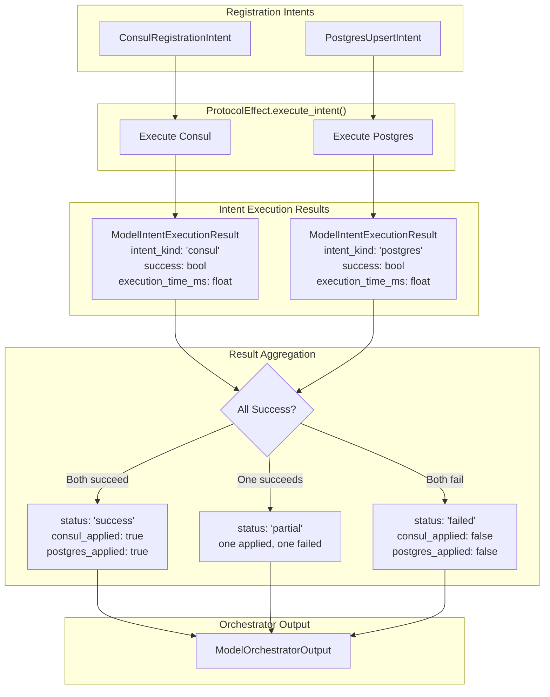
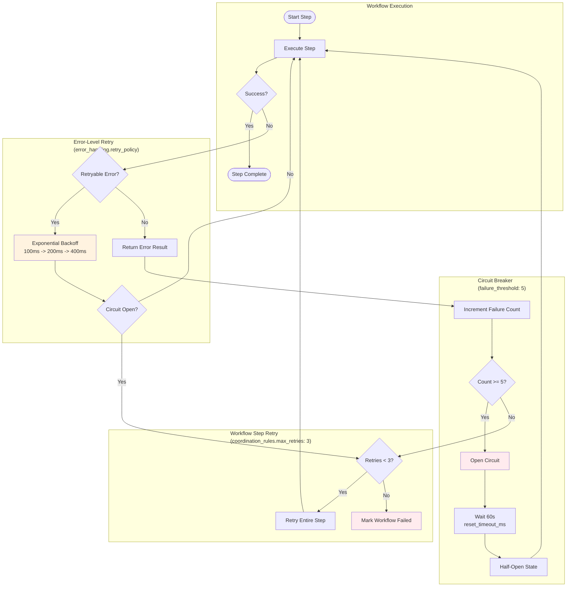

# Node Registration Orchestrator

**Type**: ORCHESTRATOR
**Version**: 1.0.0
**Contract Version**: 1.0.0

The Registration Orchestrator coordinates node lifecycle registration workflows by consuming introspection events, computing registration intents via a reducer, and executing those intents through effect nodes.

## Architecture Overview

This orchestrator uses the **declarative pattern** where workflow behavior is 100% driven by `contract.yaml`, not Python code. All workflow logic, retry policies, and result aggregation are handled by the `NodeOrchestrator` base class.

## Workflow Diagrams

### 1. High-Level Event Flow



### 2. Detailed Execution Graph with Dependencies



**Legend**:
- Blue (effect): External I/O operations
- Orange (compute): Pure transformations
- Purple (reducer): State aggregation

### 3. Reducer State Machine



### 4. Intent Generation Flow



### 5. Effect Execution and Result Aggregation



### 6. Error Handling and Retry Flow



### 7. Complete Workflow State Transitions

```mermaid
stateDiagram-v2
    [*] --> Idle

    Idle --> ReceivingEvent: Event arrives

    state ReceivingEvent {
        [*] --> WaitingForEvent
        WaitingForEvent --> EventReceived: introspection/tick
        EventReceived --> [*]
    }

    ReceivingEvent --> ReadingProjection: Event valid

    state ReadingProjection {
        [*] --> QueryProjection
        QueryProjection --> ProjectionRead: Success
        QueryProjection --> ProjectionError: Failure
        ProjectionError --> QueryProjection: Retry
        ProjectionRead --> [*]
    }

    ReadingProjection --> EvaluatingTimeout: Projection loaded

    state EvaluatingTimeout {
        [*] --> CheckTimeout
        CheckTimeout --> TimeoutExpired: Timeout detected
        CheckTimeout --> NoTimeout: Within threshold
        TimeoutExpired --> [*]
        NoTimeout --> [*]
    }

    EvaluatingTimeout --> ComputingIntents: Timeout evaluated

    state ComputingIntents {
        [*] --> ReducerProcessing
        ReducerProcessing --> IntentsGenerated: New node
        ReducerProcessing --> NoIntents: Duplicate/filtered
        IntentsGenerated --> [*]
        NoIntents --> [*]
    }

    ComputingIntents --> ExecutingRegistrations: Intents ready

    state ExecutingRegistrations {
        [*] --> ConsulRegistration
        [*] --> PostgresRegistration
        ConsulRegistration --> ConsulDone
        PostgresRegistration --> PostgresDone
        ConsulDone --> [*]
        PostgresDone --> [*]
    }

    ExecutingRegistrations --> AggregatingResults: Both complete

    state AggregatingResults {
        [*] --> CollectResults
        CollectResults --> DetermineStatus
        DetermineStatus --> StatusSuccess: All passed
        DetermineStatus --> StatusPartial: Some passed
        DetermineStatus --> StatusFailed: None passed
        StatusSuccess --> [*]
        StatusPartial --> [*]
        StatusFailed --> [*]
    }

    AggregatingResults --> PublishingOutcome: Results aggregated

    state PublishingOutcome {
        [*] --> EmitEvent
        EmitEvent --> EventPublished
        EventPublished --> [*]
    }

    PublishingOutcome --> Idle: Complete
```



## Data Models

### Input Model: `ModelOrchestratorInput`

| Field | Type | Description |
|-------|------|-------------|
| `introspection_event` | `ModelNodeIntrospectionEvent` | The introspection event to process |
| `correlation_id` | `UUID` | Correlation ID for distributed tracing |

### Output Model: `ModelOrchestratorOutput`

| Field | Type | Description |
|-------|------|-------------|
| `correlation_id` | `UUID` | Correlation ID for tracing |
| `status` | `Literal["success", "partial", "failed"]` | Overall workflow status |
| `consul_applied` | `bool` | Whether Consul registration succeeded |
| `postgres_applied` | `bool` | Whether PostgreSQL registration succeeded |
| `consul_error` | `str \| None` | Consul error message if any |
| `postgres_error` | `str \| None` | PostgreSQL error message if any |
| `intent_results` | `list[ModelIntentExecutionResult]` | Results of each intent execution |
| `total_execution_time_ms` | `float` | Total workflow execution time |

### Intent Models

#### `ModelConsulRegistrationIntent`
```python
kind: Literal["consul"]  # Discriminator
operation: str           # "register", "deregister"
node_id: UUID
correlation_id: UUID
payload: ModelConsulIntentPayload
```

#### `ModelPostgresUpsertIntent`
```python
kind: Literal["postgres"]  # Discriminator
operation: str             # "upsert", "delete"
node_id: UUID
correlation_id: UUID
payload: ModelPostgresIntentPayload
```

## Configuration

### Coordination Rules

| Setting | Value | Description |
|---------|-------|-------------|
| `execution_mode` | `sequential` | Steps execute in order |
| `parallel_execution_allowed` | `false` | No parallel branches |
| `max_retries` | `3` | Workflow step retry count |
| `timeout_ms` | `30000` | Overall workflow timeout |
| `checkpoint_enabled` | `true` | Enables recovery checkpoints |
| `rollback_enabled` | `true` | Enables rollback on failure |

### Error Handling

| Setting | Value | Description |
|---------|-------|-------------|
| `retry_policy.max_retries` | `3` | Error-level retry count |
| `retry_policy.initial_delay_ms` | `100` | Initial backoff delay |
| `retry_policy.max_delay_ms` | `5000` | Maximum backoff delay |
| `retry_policy.exponential_base` | `2` | Backoff multiplier |
| `circuit_breaker.enabled` | `true` | Circuit breaker active |
| `circuit_breaker.failure_threshold` | `5` | Failures before open |
| `circuit_breaker.reset_timeout_ms` | `60000` | Time before half-open |

## Dependencies

| Name | Type | Description |
|------|------|-------------|
| `reducer_protocol` | Protocol | For computing registration intents |
| `effect_node` | Node | For executing registration operations |
| `projection_reader` | Protocol | For reading current state (OMN-930) |

## Events

### Consumed Events

| Topic Pattern | Event Type | Description |
|---------------|------------|-------------|
| `{env}.{namespace}.onex.evt.node-introspection.v1` | `NodeIntrospectionEvent` | Node introspection data |
| `{env}.{namespace}.onex.evt.registry-request-introspection.v1` | `RegistryRequestIntrospectionEvent` | Registry request |
| `{env}.{namespace}.onex.internal.runtime-tick.v1` | `RuntimeTick` | Internal tick for timeout evaluation |

### Published Events

| Topic Pattern | Event Type | Description |
|---------------|------------|-------------|
| `{env}.{namespace}.onex.evt.node-registration-result.v1` | `NodeRegistrationResultEvent` | Final registration result |
| `{env}.{namespace}.onex.evt.node-registration-initiated.v1` | `NodeRegistrationInitiated` | Registration started |
| `{env}.{namespace}.onex.evt.node-registration-accepted.v1` | `NodeRegistrationAccepted` | Registration accepted |
| `{env}.{namespace}.onex.evt.node-registration-rejected.v1` | `NodeRegistrationRejected` | Registration rejected |
| `{env}.{namespace}.onex.evt.node-registration-ack-timed-out.v1` | `NodeRegistrationAckTimedOut` | ACK timeout |
| `{env}.{namespace}.onex.evt.node-registration-ack-received.v1` | `NodeRegistrationAckReceived` | ACK received |
| `{env}.{namespace}.onex.evt.node-became-active.v1` | `NodeBecameActive` | Node activated |
| `{env}.{namespace}.onex.evt.node-liveness-expired.v1` | `NodeLivenessExpired` | Liveness expired |

## Coroutine Safety

This orchestrator is **NOT coroutine-safe** for concurrent workflow invocations. Each instance should handle one workflow at a time. For concurrent workflows, create multiple instances.

## Limitations & Implementation Status

This node is part of the MVP implementation for OMN-888. The following limitations apply:

### Current Limitations

| Limitation | Ticket | Description |
|------------|--------|-------------|
| Effect Node Integration | OMN-890 | `NodeRegistryEffect` is implemented in `nodes/effects/registry_effect.py`. The `node_registry_effect` module re-exports from this location. Integration with orchestrator workflow pending reducer implementation. |
| Reducer Not Implemented | OMN-889 | `ProtocolReducer` is defined but no concrete implementation exists. Intent computation is pending. |
| Projection Reader Not Wired | OMN-930 | `ProtocolProjectionReader` protocol does not exist in `omnibase_spi.protocols`. The `read_projection` workflow step cannot execute. |
| Time Injection Not Wired | OMN-973 | Contract declares time injection but orchestrator does not parse or use it. Timeout evaluation uses implicit dispatch context. |
| Intent Models in Infra | OMN-912 | Intent models are currently in `omnibase_infra`. Should be moved to `omnibase_core` for broader reuse. |

### Implementation Status

| Component | Status | Location | Notes |
|-----------|--------|----------|-------|
| Orchestrator Node | **Complete** | `node.py` | Declarative pattern, extends `NodeOrchestrator` |
| Contract | **Complete** | `contract.yaml` | Full workflow definition with coordination rules |
| Protocols | **Complete** | `protocols.py` | `ProtocolReducer`, `ProtocolEffect` defined |
| Models | **Complete** | `models/` | Input, output, intent, state models |
| README | **Complete** | `README.md` | This file |
| Effect Node | **Complete** | `nodes/effects/registry_effect.py` | Alias at `nodes/node_registry_effect/` |
| Reducer Impl | **Pending** | N/A | No implementation yet (OMN-889) |
| Projection Reader | **Pending** | N/A | SPI protocol needed (OMN-930) |

### What Works Today

1. **Contract Parsing**: The contract.yaml is valid and fully defines the workflow
2. **Model Validation**: All input/output models work with Pydantic validation
3. **Protocol Definitions**: Type contracts for reducer and effect are complete
4. **Workflow Structure**: Execution graph with dependencies is defined

### What Does NOT Work Today

1. **End-to-End Registration**: Cannot register nodes (reducer → effect integration pending)
2. **Intent Computation**: Cannot generate intents (reducer not implemented)
3. **Projection Reading**: Cannot read current state (protocol not in SPI)
4. **Timeout Evaluation**: Uses implicit time, not contract-driven injection

Note: The effect node (`NodeRegistryEffect`) is fully implemented and tested. The
blocker for end-to-end registration is the reducer implementation (OMN-889) which
must generate intents that the effect node will execute.

## Related Tickets

- **OMN-888**: Infrastructure MVP Node Registration Orchestrator Workflow
- **OMN-889**: Reducer Implementation (pending)
- **OMN-890**: Effect Node Implementation (pending)
- **OMN-912**: Intent Models in omnibase_core (pending)
- **OMN-930**: Projection Reader Integration
- **OMN-973**: Time Injection Context for Timeout Evaluation

## Related Documentation

- [Node Architecture](../../../../docs/architecture/REGISTRATION_ORCHESTRATOR_ARCHITECTURE.md) - Complete architectural design
- [Protocol Architecture](../../../../docs/architecture/NODE_REGISTRATION_ORCHESTRATOR_PROTOCOLS.md) - Detailed protocol design
- [Validation Exemptions](../../validation/validation_exemptions.yaml) - Exemption for domain-grouped protocols
