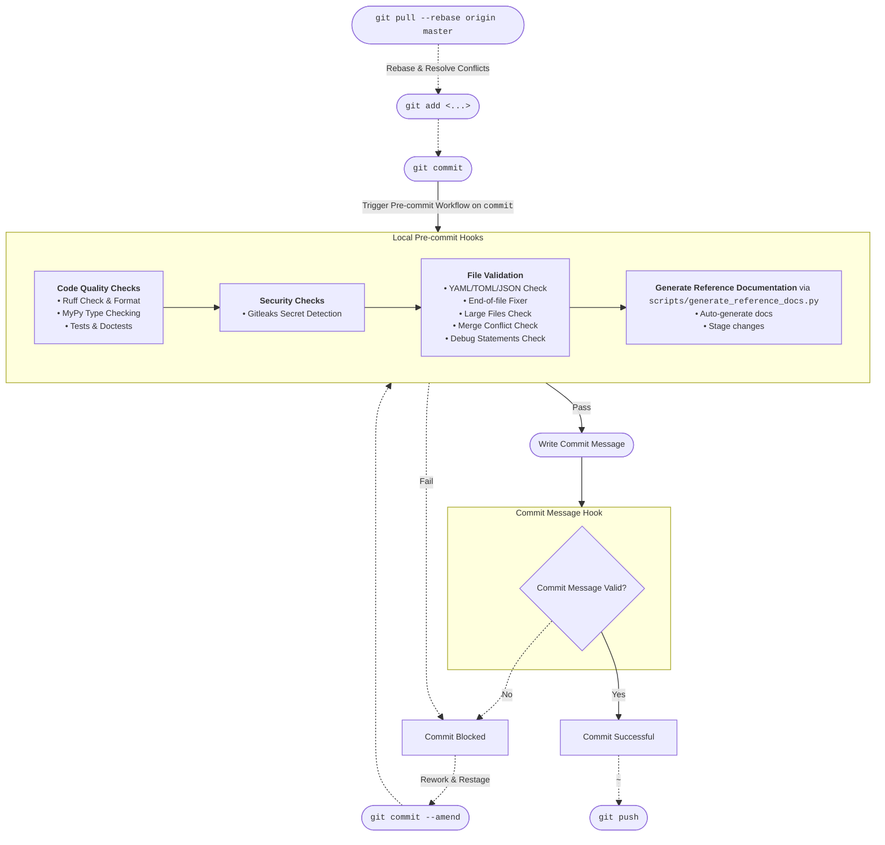
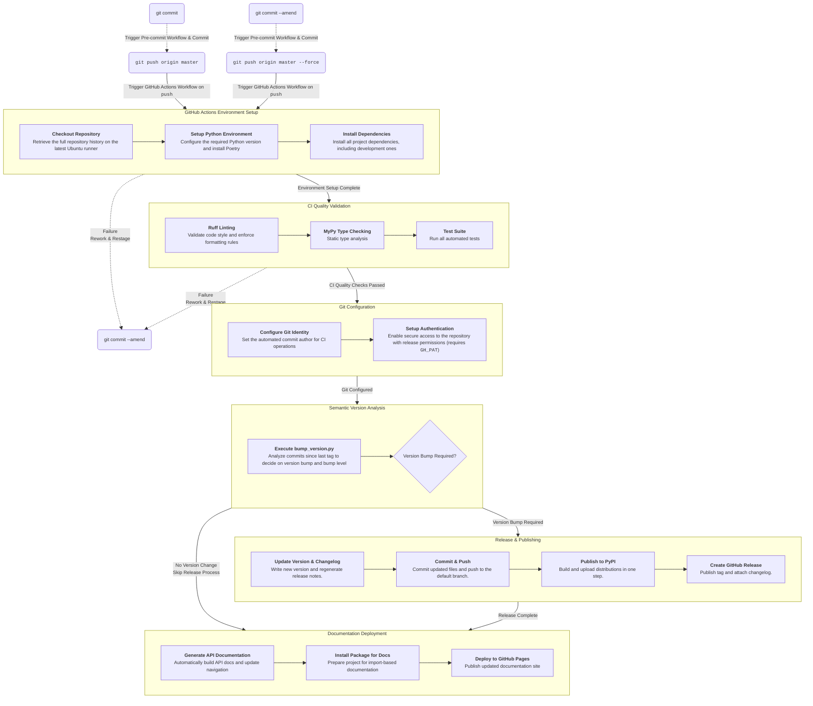

# OneSecondTrader

[](https://github.com/nilskujath/onesecondtrader/actions/workflows/release.yml)
[](https://www.onesecondtrader.com)
[](https://pypi.org/project/onesecondtrader/)
[](https://github.com/nilskujath/onesecondtrader/blob/master/LICENSE)


For documentation, please visit [onesecondtrader.com](https://www.onesecondtrader.com).


## For Developers: Continuous Integration & Delivery (CI/CD) Pipeline

This project's continuous integration & continuous delivery (CI/CD) pipeline consists of two distinct workflows:
 **local pre-commit hooks** that run on `git commit` to ensure code quality,
 and **GitHub Actions** that run on `git push origin master` to automate releases.

In order for the pipeline to work, the following configuration is required:

* version field in `pyproject.toml` must be set to appropriate version
```toml
[tool.poetry]
name = "onesecondtrader"
version = "0.1.0"  # Updated automatically by bump_version.py
```
* `mkdocs.yml` must have `mkdocstrings-python` plugin configured
```yaml
plugins:
  - mkdocstrings:
      handlers:
        python:
          options:
            docstring_style: google
```

### Local Pre-Commit Workflow

To ensure that only good quality code is commited to the repository, a series of pre-commit hooks are executed before each commit.
 These hooks include code quality checks, testing, security scans, and automated API reference generation.
 This workflow is orchestrated by the `pre-commit` package, which is configured in the `.pre-commit-config.yaml` file.
 If any of these checks fail, the commit is blocked and the developer must fix the issues before retrying.

Prior to usage, the pre-commit hooks must be installed by running:
```bash
poetry run pre-commit install
poetry run pre-commit install --hook-type commit-msg
poetry run pre-commit run --all-files # Optional: Test installation
```

This project follows [Conventional Commits](https://www.conventionalcommits.org/) specification for commit messages.
This standardized format enables automated semantic versioning and changelog generation.
The commit messages must have the following format:

```
<type>: <description>

[optional body]

[optional footer(s)]
```

The commit message must start with a type, followed by a colon and a space, and then a description. The type must be one of the following:

- **feat**: New features that add functionality
- **fix**: Bug fixes and patches
- **docs**: Documentation changes only
- **chore**: Maintenance tasks, dependency updates, build changes
- **test**: Adding or modifying tests
- **refactor**: Code changes that neither fix bugs nor add features
- **perf**: Performance improvements
- **ci**: Changes to CI/CD configuration

Examples:

```
feat: added trade-by-trade chart generation 
```

The following diagram illustrates this pre-commit workflow:




### GitHub Actions Workflow

Once a commit is pushed to the remote `master` branch, the GitHub Actions workflow `.github/workflows/release.yml` is triggered.
Note that the GitHub Actions workflow might push commits to the remote repository.
 This means your local branch will be behind the remote branch.

In order for this workflow to run properly, two secrets need to be configured (`Settings > Secrets and variables > Actions`):

- `GH_PAT`: Personal Access Token with enhanced permissions (see PAT Setup below)
- `PYPI_API_TOKEN`: Generate from PyPI account settings

The default `GITHUB_TOKEN` has limited permissions and cannot trigger subsequent workflow runs or push to protected branches.
 The PAT provides the necessary permissions for the automated release process. 
 The PAT is created as follows:

1. Go to GitHub Settings > Developer settings > Personal access tokens > Tokens (classic)
2. Click "Generate new token (classic)"
3. Set expiration and select these scopes:
   - `repo` (Full control of private repositories)
   - `workflow` (Update GitHub Action workflows)
4. Copy the token and add it as `GH_PAT` secret in repository settings

Note that GitHub Actions bot must have write permissions to the repository.

The following diagram illustrates this GitHub Actions workflow:


