# Pain001: Automate ISO 20022-Compliant Payment File Creation

![Pain001 banner][banner]

## Enterprise-Grade ISO 20022 Payment File Generation

[![PyPI Version][pypi-badge]][03]
[![Python Versions][python-versions-badge]][03]
[![PyPI Downloads][pypi-downloads-badge]][07]
[![Licence][licence-badge]][01]
[![Codecov][codecov-badge]][06]
[![Tests][tests-badge]][tests-url]
[![Quality][quality-badge]][quality-url]
[![Documentation][docs-badge]][docs-url]

> **Latest Release: v0.0.47** - Enhanced exception hierarchy, validation service architecture, and IBAN/BIC pre-validation.
> [See what's new →][release-047]

## Overview

**Pain001** is an open-source Python library that you can use to create **ISO
20022-compliant payment files** from your **CSV files**, **SQLite databases**,
or **Python data structures** (lists and dictionaries).

- **Website:** <https://pain001.com>
- **Source code:** <https://github.com/sebastienrousseau/pain001>
- **Bug reports:** <https://github.com/sebastienrousseau/pain001/issues>

The library focuses specifically on **Payment Initiation and Advice Messages**,
commonly known as **Pain**. In a simplified way, a **pain.001** is a message
that initiates a customer payment.

**Key Features:**

- **Mandatory Data Validation:** Ensures all payment files are
  ISO 20022-compliant before creation
- **Multi-source Support:** Works with CSV files, SQLite databases,
  and Python data structures
- **Automatic XSD Validation:** Validates generated XML against
  ISO 20022 schemas
- **Comprehensive Testing:** 98.55% test coverage with 568 tests
  ensuring reliability
- **Secure by Design:** Uses `defusedxml` to prevent XXE attacks
  and implements SQL injection protection
- **Type-Safe:** Full type hints for better IDE support and type
  checking with mypy
- **Robust Error Handling:** Specific exception types for precise
  error handling and debugging
- **9 ISO 20022 Versions Supported:** Supports all 9 Customer Credit
  Transfer Initiation versions: pain.001.001.03 through
  pain.001.001.11
- **Production-Ready:** Used in production environments for SEPA
  and international payments

As of today, the library is designed to be compatible with the:

- **Payments Initiation V03 (pain.001.001.03):** This version is
  used for initiating credit transfers within the SEPA (Single Euro
  Payments Area)
- **Payments Initiation V04 (pain.001.001.04):** Enhanced with
  additional optional fields and improved data structures
- **Payments Initiation V05 (pain.001.001.05):** Brings further
  refinements and clarifications to the ISO 20022 standard
- **Payments Initiation V06 (pain.001.001.06):** Focused on
  supporting instant credit transfers within the SEPA region
- **Payments Initiation V07 (pain.001.001.07):** Extended schema
  with additional optional elements for enhanced payment requests
- **Payments Initiation V08 (pain.001.001.08):** Introduces support
  for new transaction types and enhanced validation rules
- **Payments Initiation V09 (pain.001.001.09):** Simplified message
  structure with consolidated required fields
- **Payments Initiation V10 (pain.001.001.10):** Enhanced with
  improved data structures and additional compliance requirements
- **Payments Initiation V11 (pain.001.001.11):** The latest version
  with extended ISO 20022 compliance and advanced payment features

### Version Comparison

| Version | Status | CSV Fields | Key Features | Use Case |
|---------|--------|------------|--------------|----------|
| pain.001.001.03 | ✅ Stable | 42 | SEPA credit transfers | EU payments |
| pain.001.001.04 | ✅ Stable | 47 | Extended fields | Enhanced payment details |
| pain.001.001.05 | ✅ Stable | 47 | Schema refinements | ISO 20022 alignment |
| pain.001.001.06 | ✅ Stable | 44 | Instant transfers | Real-time SEPA payments |
| pain.001.001.07 | ✅ Stable | 44 | Additional elements | Extended functionality |
| pain.001.001.08 | ✅ Stable | 44 | Enhanced validation | Improved compliance |
| pain.001.001.09 | ✅ Stable | 23 | Simplified structure | Modern implementations |
| pain.001.001.10 | ✅ Stable | 23 | Improved compliance | Enhanced data validation |
| pain.001.001.11 | ✅ Latest | 23 | Advanced features | Future-proof payments |

Payments usually start with a **pain.001 payment initiation message**. The payer
sends it to the payee (or the payee’s bank) via a secure network. This network
could be **SWIFT**, **SEPA (Single Euro Payments Area)**, or other payment
networks such as **CHAPS**, **BACS**, **Faster Payments**, etc. The message
contains the payer's and payee's bank account details, payment amount, and other
information required to process the payment.

The **Pain001** library reduces payment processing complexity and costs by
generating ISO 20022-compliant payment files with **mandatory validation**.
These files are automatically validated before creation, eliminating the need to
create and validate them manually. This makes the payment process more efficient
and cost-effective whilst saving you time and resources and minimising the risk
of errors, ensuring accurate and seamless payment processing.

**Use the Pain001 library to simplify, accelerate, and automate your payment
processing with confidence that every file is ISO 20022-compliant.**

## How It Works

### Payment Processing Flow


## Table of Contents

- [Pain001: Automate ISO 20022-Compliant Payment File Creation](#pain001-automate-iso-20022-compliant-payment-file-creation)
  - [A Powerful Python Library that enables you to create ISO 20022-Compliant Payment Files directly from CSV or SQLite data files](#a-powerful-python-library-that-enables-you-to-create-iso-20022-compliant-payment-files-directly-from-csv-or-sqlite-data-files)
  - [Overview](#overview)
  - [Table of Contents](#table-of-contents)
  - [Features](#features)
  - [Requirements](#requirements)
  - [Installation](#installation)
    - [Install `virtualenv`](#install-virtualenv)
    - [Create a Virtual Environment](#create-a-virtual-environment)
    - [Activate environment](#activate-environment)
    - [Getting Started](#getting-started)
  - [Quick Start](#quick-start)
    - [Arguments](#arguments)
  - [CSV Data Format](#csv-data-format)
    - [Required CSV Columns](#required-csv-columns)
  - [Examples](#examples)
    - [Using a CSV Data File as the source](#using-a-csv-data-file-as-the-source)
    - [Using a SQLite Data File as the source](#using-a-sqlite-data-file-as-the-source)
    - [Using the Source code](#using-the-source-code)
      - [Pain.001.001.03](#pain00100103)
      - [Pain.001.001.04](#pain00100104)
      - [Pain.001.001.05](#pain00100105)
      - [Pain.001.001.06](#pain00100106)
      - [Pain.001.001.07](#pain00100107)
      - [Pain.001.001.08](#pain00100108)
      - [Pain.001.001.09](#pain00100109)
      - [Pain.001.001.10](#pain00100110)
      - [Pain.001.001.11](#pain00100111)
    - [Embedded in an Application](#embedded-in-an-application)
    - [Validation](#validation)
  - [Output Files](#output-files)
    - [Output Location](#output-location)
  - [Troubleshooting](#troubleshooting)
    - [Common Issues and Solutions](#common-issues-and-solutions)
    - [Getting Help](#getting-help)
  - [Documentation](#documentation)
    - [Supported messages](#supported-messages)
      - [Bank-to-Customer Cash Management](#bank-to-customer-cash-management)
      - [Payments Clearing and Settlement](#payments-clearing-and-settlement)
      - [Payments Initiation](#payments-initiation)
  - [Development](#development)
    - [Setting Up Development Environment](#setting-up-development-environment)
    - [Running Tests](#running-tests)
    - [Code Quality Tools](#code-quality-tools)
  - [Licence](#licence)
  - [Contribution](#contribution)
  - [Acknowledgements](#acknowledgements)

## Features

### Core Functionality

- **Easy to Use:** Both developers and non-developers can easily use the library, as it requires minimal coding knowledge
- **Open Source:** The library is open source and free to use, making it accessible to everyone
- **Mandatory Data Validation:** Ensures payment file integrity and ISO 20022 compliance
  - All data sources (CSV, SQLite, Python dict/list) are automatically validated
  - Invalid data raises clear `ValueError` messages indicating what needs to be fixed
  - Validates required fields, data types, boolean values, and field formats
  - Prevents creation of non-compliant payment files
  - No manual validation needed—it's built into every data load operation

### Security & Quality

- **Secure:** The library prioritises security with multiple layers of protection
  - Uses `defusedxml` for secure XML parsing to prevent XXE attacks
  - Implements SQL injection protection in database operations
  - Regular security audits with Bandit and Safety tools
  - All dependencies kept up to date to address known vulnerabilities
  - No sensitive data storage—all information remains confidential
  - OWASP Top 10 security best practices implemented
- **🛡️ Enterprise Logging & Compliance:**
  - **Structured Logging:** All logs emitted as JSON for seamless
    integration with Splunk, Datadog, Elasticsearch, and CloudWatch
  - **PII Protection:** Automatic masking of sensitive fields (IBANs,
    BICs, names, account numbers) in logs to ensure GDPR Article 32 and
    PCI-DSS Requirement 3.4 compliance
  - **Event Standardisation:** 17 standardised event types for
    consistent observability across payment processing lifecycle
  - **Zero PII Leakage:** Logs never expose clear-text payment data—all
    sensitive information automatically redacted before logging
- **Robust Development:** Comprehensive quality assurance with
  - 98.56% test coverage with 561 comprehensive tests
  - Code formatting with Black and Ruff
  - Import sorting with isort
  - Style checking with Flake8 (10.00/10 score)
  - Static type checking with mypy (strict mode)
  - Code quality analysis with Pylint
  - Mutation testing with mutmut for test effectiveness
  - Performance benchmarks: ~69,604 XML ops/sec

### Business Benefits

- **Customisable:** The library allows developers to customise the output, making it adaptable to specific business requirements and preferences
- **Scalable Solution:** The **Pain001** library can handle varying volumes of payment files, making it suitable for businesses of different sizes and transaction volumes
- **Time-Saving:** The automated file creation process reduces the time spent on manual data entry and file generation, increasing overall productivity
- **Seamless Integration:** As a Python package, the Pain001 library is compatible with various Python-based applications and easily integrates into any existing projects or workflows
- **Cross-Border Compatibility:** The library supports both Single Euro Payments Area (SEPA) and non-SEPA credit transfers, making it versatile for use in different countries and regions
- **Improved Accuracy:** By providing precise data validation, the library reduces errors in payment file creation and processing
- **Enhanced Efficiency:** Automates the creation of payment initiation message files
- **Accelerated Processing:** Automates the process and reduces the time required to create payment files
- **Guaranteed Compliance:** Validates all payment files to meet the ISO 20022 standards
- **Simplified Workflow:** Provides a standardised payment file format for ISO 20022-compliant payment initiation messages
- **Reduced Costs:** Removes manual data entry and file generation, reducing payment processing time and errors

## Requirements

**Pain001** works with macOS, Linux, and Windows and requires:

- **Python 3.9.0 or higher**
- **pip** (Python package installer)

### Key Dependencies

- `click` - Command-line interface creation
- `defusedxml` - Secure XML parsing (protection against XXE attacks)
- `xmlschema` - XML Schema validation
- `rich` - Terminal output formatting
- `lxml` - XML processing

All dependencies are automatically installed when you install Pain001.

## Installation

We recommend creating a virtual environment to install **Pain001**. This will
ensure that the package is installed in an isolated environment and will not
affect other projects. To install **Pain001** in a virtual environment, follow
these steps:

### Install `virtualenv`

```sh
python -m pip install virtualenv
```

### Create a Virtual Environment

```sh
python -m venv venv
```

| Code  | Explanation                     |
| ----- | ------------------------------- |
| `-m`  | executes module `venv`          |
| `env` | name of the virtual environment |

### Activate environment

**On macOS/Linux:**
```sh
source venv/bin/activate
```

**On Windows:**
```cmd
venv\Scripts\activate
```

You'll see `(venv)` appear at the start of your command line prompt, indicating the virtual environment is active.

### Getting Started

It takes just a few seconds to get up and running with **Pain001**. You can
install Pain001 from PyPI with pip or your favourite package manager.

**Step 1:** Open your terminal and run the following command to install the latest version:

```sh
python -m pip install pain001
```

**Step 2:** Verify the installation:

```sh
python -c "import pain001; print('Pain001 is installed and ready to use')"
```

You should see a confirmation message indicating Pain001 is ready to use.

**Updating Pain001:**

If `pain001` is already installed and you want to upgrade to the latest version:

```sh
python -m pip install -U pain001
```

## Quick Start

After installation, you can run **Pain001** directly from the command line. Follow these simple steps:

**Step 1:** Prepare your files

You'll need:
- **XML template file** - Contains the structure for your payment message
- **XSD schema file** - Used to validate the generated XML file
- **Data source** - Your payment instructions from:
  - CSV file (.csv)
  - SQLite database (.db)
  - Python list of dictionaries
  - Python dictionary (single transaction)

**Step 2:** Run Pain001

```sh
python3 -m pain001 \
    -t <xml_message_type> \
    -m <xml_template_file_path> \
    -s <xsd_schema_file_path> \
    -d <data_file_path>
```

**Real Example:**

```sh
python3 -m pain001 \
    -t pain.001.001.03 \
    -m pain001/templates/pain.001.001.03/template.xml \
    -s pain001/templates/pain.001.001.03/pain.001.001.03.xsd \
    -d pain001/templates/pain.001.001.03/template.csv
```

**Step 3:** Check the output

If successful, you'll see:
- ✓ Validation messages in your terminal
- ✓ A new ISO 20022-compliant XML file at your specified location

### Safe Validation (Dry-Run Mode)

You can validate your data against the ISO 20022 schema **without
generating an output file** using the `--dry-run` flag (alias:
`--validate-only`). This is ideal for:

- **CI/CD Pipelines:** Pre-flight validation in automated builds
- **Data Quality Checks:** Verify payment data before batch processing
- **Template Development:** Test XML templates and schemas without file clutter
- **Pre-Commit Hooks:** Validate data before committing to version control

**Command:**

```sh
python3 -m pain001 \
    -t pain.001.001.03 \
    -m pain001/templates/pain.001.001.03/template.xml \
    -s pain001/templates/pain.001.001.03/pain.001.001.03.xsd \
    -d pain001/templates/pain.001.001.03/template.csv \
    --dry-run  # <--- Validation-only mode
```

**Output:**

```plaintext
[SUCCESS] Validation passed. No XML file created.
```

**Exit Codes:**

- `0` - Validation succeeded (safe to proceed)
- `1` - Validation failed (data or schema errors detected)

**What Gets Validated:**

- ✓ XML template structure and syntax
- ✓ XSD schema compliance
- ✓ Payment data integrity (required fields, data types, formats)
- ✓ Business rules (amounts > 0, valid IBANs/BICs, etc.)

**Note:** Dry-run mode uses the same validation logic as XML generation,
ensuring your data will be valid when you generate the actual file.

### Arguments

When running **Pain001**, you will need to specify four arguments:

- An `xml_message_type`: This is the type of XML message you want to generate.

  The currently supported types are:

  - pain.001.001.03
  - pain.001.001.04
  - pain.001.001.05
  - pain.001.001.06
  - pain.001.001.07
  - pain.001.001.08
  - pain.001.001.09
  - pain.001.001.10 _(New in v0.0.36)_
  - pain.001.001.11 _(New in v0.0.36)_

- An `xml_template_file_path`: This is the path to the XML template file you are
  using that contains variables that will be replaced by the values in your

  Data file.

- An `xsd_schema_file_path`: This is the path to the XSD schema file you are
  using to validate the generated XML file.

- A `data_file_path`: This is the path to the CSV or SQLite Data file you want
  to convert to XML format.

## CSV Data Format

Before using **Pain001**, prepare your CSV file with the payment data. The CSV
file must include specific columns that map to ISO 20022 fields. Here's the
required structure:

### Required CSV Columns

| Column Name | Description | Example |
|------------|-------------|----------|
| `id` | Unique message identifier | MSG-20260109-001 |
| `date` | Creation date/time | 2026-01-09T10:30:00 |
| `nb_of_txs` | Number of transactions | 1 |
| `initiator_name` | Name of payment initiator | ABC Corporation |
| `payment_information_id` | Payment batch ID | PAYMENT-BATCH-001 |
| `payment_method` | Payment method code | TRF |
| `creditor_name` | Beneficiary name | XYZ Limited |
| `creditor_account` | Beneficiary IBAN | GB29NWBK60161331926819 |
| `creditor_agent` | Beneficiary BIC | NWBKGB2L |
| `amount` | Payment amount | 1000.00 |
| `currency` | Currency code | EUR |
| `end_to_end_id` | End-to-end reference | E2E-REF-001 |

**Sample CSV File:**

```csv
id,date,nb_of_txs,initiator_name,payment_information_id,payment_method,creditor_name,creditor_account,creditor_agent,amount,currency,end_to_end_id
MSG-001,2026-01-09T10:30:00,1,ABC Corp,PMT-001,TRF,XYZ Ltd,GB29NWBK60161331926819,NWBKGB2L,1000.00,EUR,E2E-001
```

**Finding Template Files:**

Template CSV files for each supported pain message type are available in the `pain001/templates/` directory:

```sh
# If you installed via pip, find the templates with:
python -c "import pain001; import os; print(os.path.dirname(pain001.__file__))"

# Navigate to the templates directory:
cd <path_from_above>/templates/
```

Each template directory contains:
- `template.csv` - Sample CSV file with required columns
- `template.xml` - XML template file
- `pain.001.001.XX.xsd` - XSD schema file for validation

## Examples

The following examples demonstrate how to use **Pain001** to generate payment
initiation messages from different data sources (CSV file, SQLite database, and Python data structures).

### Using a CSV Data File as the source

```sh
python3 -m pain001 \
    -t pain.001.001.03 \
    -m /path/to/your/template.xml \
    -s /path/to/your/pain.001.001.03.xsd \
    -d /path/to/your/template.csv
```

### Using a SQLite Data File as the source

```sh
python3 -m pain001 \
    -t pain.001.001.03 \
    -m /path/to/your/template.xml \
    -s /path/to/your/pain.001.001.03.xsd \
    -d /path/to/your/template.db
```

### Using Python Data Structures (Programmatic API)

You can use the library directly in Python with lists or dictionaries:

```python
from pain001 import process_files

# Using a list of payment dictionaries
payments = [
    {
        'id': 'MSG001',
        'amount': '1000.00',
        'currency': 'EUR',
        # ... other required fields
    }
]

result = process_files(
    xml_message_type='pain.001.001.03',
    data_file_path=payments,  # Python list
    xml_template_file_path='pain001/templates/pain.001.001.03/template.xml',
    xsd_schema_file_path='pain001/templates/pain.001.001.03/pain.001.001.03.xsd'
)

# Using a single payment dictionary
payment = {
    'id': 'MSG001',
    'amount': '1000.00',
    'currency': 'EUR',
    # ... other required fields
}

result = process_files(
    xml_message_type='pain.001.001.03',
    data_file_path=payment,  # Single dict
    xml_template_file_path='pain001/templates/pain.001.001.03/template.xml',
    xsd_schema_file_path='pain001/templates/pain.001.001.03/pain.001.001.03.xsd'
)
```

### Using the Source code

You can clone the source code and run the example code in your
terminal/command-line. To check out the source code, clone the repository from
GitHub:

```sh
git clone https://github.com/sebastienrousseau/pain001.git
```

#### Pain.001.001.03

This will generate a payment initiation message in the format of
Pain.001.001.03.

```sh
python -m pain001 \
    -t pain.001.001.03 \
    -m pain001/templates/pain.001.001.03/template.xml \
    -s pain001/templates/pain.001.001.03/pain.001.001.03.xsd \
    -d pain001/templates/pain.001.001.03/template.csv
```

#### Pain.001.001.04

This will generate a payment initiation message in the format of
Pain.001.001.04.

```sh
python -m pain001 \
    -t pain.001.001.04 \
    -m pain001/templates/pain.001.001.04/template.xml \
    -s pain001/templates/pain.001.001.04/pain.001.001.04.xsd \
    -d pain001/templates/pain.001.001.04/template.csv
```

#### Pain.001.001.05

This will generate a payment initiation message in the format of
Pain.001.001.05.

```sh
python -m pain001 \
    -t pain.001.001.05 \
    -m pain001/templates/pain.001.001.05/template.xml \
    -s pain001/templates/pain.001.001.05/pain.001.001.05.xsd \
    -d pain001/templates/pain.001.001.05/template.csv
```

#### Pain.001.001.06

This will generate a payment initiation message in the format of
Pain.001.001.06.

```sh
python -m pain001 \
    -t pain.001.001.06 \
    -m pain001/templates/pain.001.001.06/template.xml \
    -s pain001/templates/pain.001.001.06/pain.001.001.06.xsd \
    -d pain001/templates/pain.001.001.06/template.csv
```

#### Pain.001.001.07

This will generate a payment initiation message in the format of
Pain.001.001.07.

```sh
python -m pain001 \
    -t pain.001.001.07 \
    -m pain001/templates/pain.001.001.07/template.xml \
    -s pain001/templates/pain.001.001.07/pain.001.001.07.xsd \
    -d pain001/templates/pain.001.001.07/template.csv
```

#### Pain.001.001.08

This will generate a payment initiation message in the format of
Pain.001.001.08.

```sh
python -m pain001 \
    -t pain.001.001.08 \
    -m pain001/templates/pain.001.001.08/template.xml \
    -s pain001/templates/pain.001.001.08/pain.001.001.08.xsd \
    -d pain001/templates/pain.001.001.08/template.csv
```

#### Pain.001.001.09

This will generate a payment initiation message in the format of
Pain.001.001.09.

```sh
python -m pain001 \
    -t pain.001.001.09 \
    -m pain001/templates/pain.001.001.09/template.xml \
    -s pain001/templates/pain.001.001.09/pain.001.001.09.xsd \
    -d pain001/templates/pain.001.001.09/template.csv
```

#### Pain.001.001.10

This will generate a payment initiation message in the format of
Pain.001.001.10 with enhanced compliance features.

```sh
python -m pain001 \
    -t pain.001.001.10 \
    -m pain001/templates/pain.001.001.10/template.xml \
    -s pain001/templates/pain.001.001.10/pain.001.001.10.xsd \
    -d pain001/templates/pain.001.001.10/template.csv
```

#### Pain.001.001.11

This will generate a payment initiation message in the format of
Pain.001.001.11, the latest ISO 20022 version with advanced payment features.

```sh
python -m pain001 \
    -t pain.001.001.11 \
    -m pain001/templates/pain.001.001.11/template.xml \
    -s pain001/templates/pain.001.001.11/pain.001.001.11.xsd \
    -d pain001/templates/pain.001.001.11/template.csv
```

You can do the same with the sample SQLite Data file:

```sh
python3 -m pain001 \
    -t pain.001.001.03 \
    -m pain001/templates/pain.001.001.03/template.xml \
    -s pain001/templates/pain.001.001.03/pain.001.001.03.xsd \
    -d pain001/templates/pain.001.001.03/template.db
```

> **Note:** The XML file that **Pain001** generates will automatically be
> validated against the XSD template file before the new XML file is saved. If
> the validation fails, **Pain001** will stop running and display an error
> message in your terminal.

### Embedded in an Application

To embed **Pain001** in a new or existing application, import the main function
and use it in your code.

**Basic Integration:**

```python
from pain001 import main

if __name__ == '__main__':
    xml_message_type = 'pain.001.001.03'
    xml_template_file_path = 'template.xml'
    xsd_schema_file_path = 'schema.xsd'
    data_file_path = 'data.csv'
    main(
        xml_message_type,
        xml_template_file_path,
        xsd_schema_file_path,
        data_file_path
    )
```

**Advanced Integration with Error Handling:**

```python
from pain001.core.core import process_files
from pain001.xml.validate_via_xsd import validate_via_xsd
import os

def create_payment_file(data_file, output_dir='output'):
    """Create and validate an ISO 20022 payment file."""
    try:
        # Define file paths
        xml_message_type = 'pain.001.001.03'
        xml_template = os.path.join(output_dir, 'payment.xml')
        xsd_schema = 'pain001/templates/pain.001.001.03/pain.001.001.03.xsd'

        # Generate the payment file
        process_files(
            xml_message_type,
            xml_template,
            xsd_schema,
            data_file
        )

        # Validate the generated file
        if validate_via_xsd(xml_template, xsd_schema):
            print(f"✓ Successfully created and validated: {xml_template}")
            return xml_template
        else:
            print(f"✗ Validation failed for: {xml_template}")
            return None

    except FileNotFoundError as e:
        print(f"Error: File not found - {e}")
        return None
    except ValueError as e:
        print(f"Error: Invalid data - {e}")
        return None
    except Exception as e:
        print(f"Error: {e}")
        return None

if __name__ == '__main__':
    # Example usage
    result = create_payment_file('payments.csv')
    if result:
        print(f"Payment file ready for submission: {result}")
```

## REST API (FastAPI)

Starting from v0.0.47, Pain001 provides a **production-ready REST API** for
integration with web services and microservices architectures.

### Starting the API Server

```sh
# Install with FastAPI support
pip install pain001

# Start the development server
python -m uvicorn pain001.api:app --reload --host 0.0.0.0 --port 8000

# Or use production server (gunicorn + uvicorn)
pip install gunicorn
gunicorn --workers 4 --worker-class uvicorn.workers.UvicornWorker \
  --bind 0.0.0.0:8000 pain001.api:app
```

### API Endpoints

**Health Check:**

```bash
curl -X GET http://localhost:8000/api/health
```

Response:
```json
{
  "status": "healthy",
  "version": "0.0.47",
  "message": "Pain001 API is running"
}
```

**Validate Payment Data:**

```bash
curl -X POST http://localhost:8000/api/validate \
  -H "Content-Type: application/json" \
  -d '{
    "file_path": "/path/to/payments.csv",
    "data_source": "csv",
    "message_type": "pain.001.001.03"
  }'
```

**Generate XML (Synchronous):**

```bash
curl -X POST http://localhost:8000/api/generate \
  -H "Content-Type: application/json" \
  -d '{
    "file_path": "/path/to/payments.csv",
    "data_source": "csv",
    "message_type": "pain.001.001.03",
    "output_dir": "/tmp/output",
    "validate_only": false
  }'
```

**Generate XML (Asynchronous):**

```bash
# Submit job
curl -X POST http://localhost:8000/api/generate/async \
  -H "Content-Type: application/json" \
  -d '{
    "file_path": "/path/to/payments.csv",
    "data_source": "csv",
    "message_type": "pain.001.001.03"
  }'
```

**Poll Job Status:**

```bash
curl -X GET http://localhost:8000/api/status/550e8400-e29b-41d4-a716-446655440000
```

**Download Generated XML:**

```bash
curl -X GET http://localhost:8000/api/download/550e8400-e29b-41d4-a716-446655440000 \
  --output payment.xml
```

**Interactive API Documentation:**

Once the server is running, visit `http://localhost:8000/api/docs` for
interactive Swagger UI or `http://localhost:8000/api/redoc` for ReDoc.

### Validation

**Pain001** implements **mandatory data validation** to ensure all payment files are ISO 20022-compliant.

#### How Validation Works

**Pain001** performs validation in two stages:

**Stage 1: Data Validation (Automatic)**

Every time you load data (from CSV, SQLite, or Python objects), **Pain001** automatically validates:
- ✓ All required fields are present
- ✓ Data types are correct (strings, numbers, booleans)
- ✓ Boolean values are valid ('true'/'false' or 'yes'/'no')
- ✓ Field formats meet ISO 20022 standards

**Stage 2: XSD Schema Validation (Automatic)**

After generating the XML file, **Pain001** validates it against the XSD schema to ensure:
- ✓ XML structure is correct
- ✓ All elements are properly formatted
- ✓ File is ready for bank submission

#### Handling Validation Errors

If validation fails, you'll get a clear error message:

```python
from pain001 import main

try:
    main(
        'pain.001.001.03',
        'template.xml',
        'schema.xsd',
        'invalid_data.csv'  # CSV with invalid data
    )
except ValueError as e:
    print(f"Data validation failed: {e}")
    # Output: "Data validation failed: CSV data validation failed"
```

**XSD Schema Validation:**

After generating the XML file, **Pain001** validates it against the XSD schema to ensure structural compliance:

```python
from pain001.xml.validate_via_xsd import validate_via_xsd

xml_file = 'generated.xml'
xsd_file = 'schema.xsd'

is_valid = validate_via_xsd(xml_file, xsd_file)
if is_valid:
    print("✓ XML is valid and ready for submission")
else:
    print("✗ XML validation failed - check the error messages")
```

**Why Mandatory Validation?**

Mandatory validation is the core principle of Pain001. It ensures:
- Payment files are always ISO 20022-compliant
- Banks won't reject files due to data errors
- Issues are caught early in the development process
- No silent failures - all problems are reported immediately

#### Complete Validation Workflow

```mermaid
%%{init: {'theme':'default'}}%%
flowchart TD
    Start([1. Load Data Source]) --> DataType{Data Type?}

    DataType -->|CSV| LoadCSV[Load CSV File]
    DataType -->|SQLite| LoadDB[Load SQLite Database]
    DataType -->|Python| LoadPython[Load Python Dict/List]

    LoadCSV --> Stage1[2. Automatic Data Validation]
    LoadDB --> Stage1
    LoadPython --> Stage1

    Stage1 --> CheckReq[Check Required Fields]
    CheckReq --> CheckTypes[Validate Data Types]
    CheckTypes --> CheckBool[Verify Boolean Values]
    CheckBool --> CheckFormats[Check ISO 20022 Formats]

    CheckFormats --> Valid1{All Checks<br/>Passed?}

    Valid1 -->|No| ErrorData[ValueError Raised<br/>Fix Your Data]
    Valid1 -->|Yes| ValidData[Valid Data ✓]

    ErrorData --> Start

    ValidData --> Stage3[3. Generate XML File]
    Stage3 --> Stage4[4. XSD Schema Validation]

    Stage4 --> CheckStruct[Validate XML Structure]
    CheckStruct --> CheckElem[Check Element Formatting]
    CheckElem --> CheckComp[Verify ISO 20022 Compliance]

    CheckComp --> Valid2{XML Schema<br/>Valid?}

    Valid2 -->|No| ErrorXML[Validation Failed<br/>Check Error Message]
    Valid2 -->|Yes| ValidXML[Valid XML ✓]

    ErrorXML --> Start

    ValidXML --> Success([5. Payment File Ready<br/>for Bank Submission ✓])
```



## Output Files

When you run **Pain001**, it generates the following:

1. **XML Payment File**: A fully compliant ISO 20022 pain.001 message file
   - Generated in the same directory as your XML template
   - Validated against the XSD schema before being saved
   - Ready for submission to your bank or payment processor

2. **Log Output**: Detailed logging information displayed in your terminal
   - Shows validation progress and any errors
   - Confirms successful file generation

### Output Location

The generated XML file will be created at the path you specified in the
`xml_template_file_path` argument. For example:

```sh
python3 -m pain001 \
    -t pain.001.001.03 \
    -m /output/payment_2026-01-09.xml \
    -s /path/to/schema.xsd \
    -d /path/to/data.csv
```

Will create `/output/payment_2026-01-09.xml`

## Complete Workflow Example

Here's a complete end-to-end example showing how to create a payment file:

**Step 1: Create your CSV file** (`my_payments.csv`)

```csv
id,date,nb_of_txs,initiator_name,payment_information_id,payment_method,creditor_name,creditor_account,creditor_agent,amount,currency,end_to_end_id,debtor_name,debtor_account,debtor_agent
MSG-2026-001,2026-01-09T14:30:00,1,My Company Ltd,PMT-BATCH-001,TRF,Supplier ABC,GB29NWBK60161331926819,NWBKGB2L,1500.00,EUR,INV-2026-001,My Company Ltd,DE89370400440532013000,COBADEFFXXX
```

**Step 2: Run Pain001**

```sh
python3 -m pain001 \
    -t pain.001.001.03 \
    -m output/payment.xml \
    -s pain001/templates/pain.001.001.03/pain.001.001.03.xsd \
    -d my_payments.csv
```

**Step 3: Verify the output**

```sh
# Check the generated file exists
ls -lh output/payment.xml

# View the first few lines
head -20 output/payment.xml
```

**Step 4: Use in Python application**

```python
from pain001 import main
import os

def generate_payment_file():
    """Generate ISO 20022 payment file from CSV data."""
    try:
        # Define paths
        output_dir = 'output'
        os.makedirs(output_dir, exist_ok=True)

        # Generate payment file
        main(
            xml_message_type='pain.001.001.03',
            xml_template_file_path=f'{output_dir}/payment.xml',
            xsd_schema_file_path='pain001/templates/pain.001.001.03/pain.001.001.03.xsd',
            data_file_path='my_payments.csv'
        )

        print("✓ Payment file generated successfully!")
        print(f"✓ Location: {output_dir}/payment.xml")
        print("✓ File is ready for bank submission")
        return True

    except ValueError as e:
        print(f"✗ Data validation error: {e}")
        print("→ Please check your CSV file for missing or invalid data")
        return False

    except FileNotFoundError as e:
        print(f"✗ File not found: {e}")
        print("→ Please check all file paths are correct")
        return False

    except Exception as e:
        print(f"✗ Unexpected error: {e}")
        return False

if __name__ == '__main__':
    success = generate_payment_file()
    exit(0 if success else 1)
```

**Expected Output:**

```
✓ Payment file generated successfully!
✓ Location: output/payment.xml
✓ File is ready for bank submission
```

## Troubleshooting

### Common Issues and Solutions

**Issue: "ModuleNotFoundError: No module named 'pain001'"**

Solution: Ensure you have installed pain001 and are using the correct Python environment:
```sh
python -m pip install pain001
# Or if you're using a virtual environment:
source venv/bin/activate
python -m pip install pain001
```

**Issue: "Error: Invalid XML message type"**

Solution: Ensure you're using one of the supported message types:
- pain.001.001.03
- pain.001.001.04
- pain.001.001.05
- pain.001.001.06
- pain.001.001.07
- pain.001.001.08
- pain.001.001.09
- pain.001.001.10
- pain.001.001.11

**Issue: "Error: XML template file does not exist"**

Solution: Verify the file path is correct and the file exists:
```sh
ls -la /path/to/your/template.xml
```

**Issue: "Error: Invalid CSV data"**

Solution: Check that your CSV file:
- Contains all required columns
- Has valid data in each column
- Uses proper CSV formatting (commas as delimiters, quotes for text with commas)
- Has a header row with column names

**Issue: "Validation failed"**

Solution: This means the generated XML doesn't match the XSD schema:
- Ensure your data values match ISO 20022 format requirements
- Check that IBANs, BICs, and currency codes are valid
- Verify date/time formats are correct (ISO 8601: YYYY-MM-DDTHH:MM:SS)
- Review the error message for specific field issues

**Issue: Permission denied when writing output file**

Solution: Ensure you have write permissions for the output directory:
```sh
chmod u+w /path/to/output/directory
```

### Getting Help

If you encounter issues not covered here:
1. Check the [GitHub Issues](https://github.com/sebastienrousseau/pain001/issues) for similar problems
2. Review the [Documentation](https://pain001.com) for detailed guides
3. Create a new issue with:
   - Your Python version (`python --version`)
   - Pain001 version (`python -m pip show pain001`)
   - Full error message
   - Minimal example to reproduce the issue

## Documentation

> **Info:** Do check out our [website][00] for comprehensive documentation.

### Supported messages

This section gives access to the documentation related to the ISO 20022 message
definitions supported by **Pain001**.

#### Bank-to-Customer Cash Management

Set of messages used to request and provide account information for
reconciliation and cash positioning between an account servicer and its
customer.

| Status | Message type    | Name                               |
| ------ | --------------- | ---------------------------------- |
| ⏳      | camt.052.001.10 | Bank-to-Customer Account Statement |
| ⏳      | camt.053.001.10 | Customer Account Identification    |
| ⏳      | camt.054.001.10 | Customer Account Statement Request |
| ⏳      | camt.060.001.10 | Customer Account Notification      |

#### Payments Clearing and Settlement

Set of messages used between financial institutions for the clearing and
settlement of payment transactions.

| Status | Message type    | Name                               |
| ------ | --------------- | ---------------------------------- |
| ⏳      | pacs.002.001.12 | Credit Transfer Notification       |
| ⏳      | pacs.003.001.09 | Direct Debit Initiation            |
| ⏳      | pacs.004.001.11 | Direct Debit Reversal              |
| ⏳      | pacs.007.001.11 | Customer Direct Debit Confirmation |
| ⏳      | pacs.008.001.10 | Credit Transfer Initiation         |
| ⏳      | pacs.009.001.10 | Credit Transfer Reversal           |
| ⏳      | pacs.010.001.05 | Account Identification             |
| ⏳      | pacs.028.001.05 | Account Statement Request          |

#### Payments Initiation

Set of messages exchanged between a debtor (or buyer) and its bank or between a
creditor (or seller) and its bank to initiate, collect, manage and monitor
payments.

| Status | Message type                       | Name              |
| ------ | ---------------- | ----------------------------------- |
| ✅      | pain.001.001.03 | Customer Credit Transfer Initiation |
| ✅      | pain.001.001.04 | Customer Direct Debit Initiation    |
| ✅      | pain.001.001.05 | Customer Direct Debit Reversal      |
| ✅      | pain.001.001.06 | Customer Credit Transfer Reversal   |
| ✅      | pain.001.001.07 | Customer Account Notification       |
| ✅      | pain.001.001.08 | Customer Account Statement          |
| ✅      | pain.001.001.09 | Customer Credit Transfer Initiation |
| ✅      | pain.001.001.10 | Customer Credit Transfer Initiation |
| ✅      | pain.001.001.11 | Customer Credit Transfer Initiation |

## Development

### Setting Up Development Environment

Pain001 uses [Poetry](https://python-poetry.org/) for dependency management and [mise](https://mise.jdx.dev/) for Python version management.

```bash
# Install Python version via mise
mise install

# Install dependencies
poetry install

# Activate the virtual environment
poetry shell
```

### Development Workflow (Zero-Trust Quality Model)

We enforce a **Zero-Trust Quality Model** with mandatory quality gates. Before submitting a PR, you **must** run the local tollgates to ensure your changes meet our enterprise standards.

#### Enterprise Quality Gates (Makefile)

We use a `Makefile` to orchestrate all quality checks. This ensures consistency between local development and CI/CD pipelines.

```bash
# Fast PR gate (non-blocking for iterative dev)
poetry run make pr

# Full quality gate (REQUIRED before commit)
poetry run make check

# Release preparation (advanced security, XSD, idempotency)
poetry run make tollgates

# Performance benchmarks (XML generation < 500ms/1000 transactions)
poetry run make perf

# Cleanup build artifacts
poetry run make clean
```

**Quality Gate Requirements:**

| Gate | Command | What It Checks | Exit Code Required |
|------|---------|----------------|--------------------|
| **PR Gate** | `make pr` | Formatting (ruff, black, isort), Type checking (mypy), Tests (pytest), Coverage (≥99%) | 0 (PASS) |
| **Full Gate** | `make check` | PR Gate + Security (bandit, safety), Lint (pylint) | 0 (PASS) |
| **Tollgates** | `make tollgates` | Full Gate + XSD validation (9 versions), Advanced security, Idempotency checks | 0 (PASS) |

**Note:** All PRs must pass the `check` target (exit code 0) and maintain **98%+ coverage**. No exceptions.

### Manual Quality Tools (Advanced)

If you need to run individual tools:

```bash
# Linting
poetry run ruff check .
poetry run pylint pain001

# Formatting
poetry run black .
poetry run ruff format .

# Import sorting
poetry run isort .

# Type checking
poetry run mypy pain001

# Security scanning
poetry run bandit -r pain001
poetry run safety check

# Testing
poetry run pytest --cov=pain001 --cov-report=html
```

**However, we strongly recommend using `make check` instead of individual commands to ensure nothing is missed.**

## Licence

The project is licensed under the terms of both the MIT licence and the Apache
Licence (Version 2.0).

- [Apache Licence, Version 2.0][01]
- [MIT licence][02]

## Contribution

We welcome contributions to **Pain001**. Please see the
[contributing instructions][04] for more information.

Unless you explicitly state otherwise, any contribution intentionally submitted
for inclusion in the work by you, as defined in the Apache-2.0 licence, shall
be dual licensed as above, without any additional terms or conditions.

## Acknowledgements

We would like to extend a big thank you to all the awesome contributors of
[Pain001][05] for their help and support.

[00]: https://pain001.com
[01]: https://opensource.org/license/apache-2-0/
[02]: http://opensource.org/licenses/MIT
[03]: https://github.com/sebastienrousseau/pain001
[04]: https://github.com/sebastienrousseau/pain001/blob/main/CONTRIBUTING.md
[05]: https://github.com/sebastienrousseau/pain001/graphs/contributors
[06]: https://codecov.io/github/sebastienrousseau/pain001?branch=main
[07]: https://pypi.org/project/pain001/
[release-045]: https://github.com/sebastienrousseau/pain001/releases/tag/v0.0.45
[release-046]: https://github.com/sebastienrousseau/pain001/releases/tag/v0.0.46
[release-047]: https://github.com/sebastienrousseau/pain001/releases/tag/v0.0.47

[banner]: https://kura.pro/pain001/images/banners/banner-pain001.svg 'Pain001, A Python Library for Automating ISO 20022-Compliant Payment Files Using CSV Or SQlite Data Files.'
[codecov-badge]: https://img.shields.io/codecov/c/github/sebastienrousseau/pain001?style=for-the-badge 'Codecov badge'
[coverage-floor-badge]: https://img.shields.io/badge/coverage-98.55%25-brightgreen?style=for-the-badge 'Coverage 98.55%'
[docs-badge]: https://img.shields.io/github/actions/workflow/status/sebastienrousseau/pain001/docs.yml?branch=main&label=Docs&style=for-the-badge 'Documentation badge'
[docs-url]: https://docs.pain001.com/
[licence-badge]: https://img.shields.io/pypi/l/pain001?style=for-the-badge 'Licence badge'
[pypi-badge]: https://img.shields.io/pypi/v/pain001?style=for-the-badge 'PyPI version badge'
[pypi-downloads-badge]: https://img.shields.io/pypi/dm/pain001.svg?style=for-the-badge 'PyPI Downloads badge'
[python-matrix-badge]: https://img.shields.io/badge/python-3.9%20%7C%203.10%20%7C%203.11%20%7C%203.12-blue?style=for-the-badge 'Python 3.9-3.12'
[python-versions-badge]: https://img.shields.io/pypi/pyversions/pain001.svg?style=for-the-badge 'Python versions badge'
[quality-badge]: https://img.shields.io/github/actions/workflow/status/sebastienrousseau/pain001/quality.yml?branch=main&label=Quality&style=for-the-badge 'Code quality badge'
[quality-url]: https://github.com/sebastienrousseau/pain001/actions/workflows/quality.yml
[security-hardened-badge]: https://img.shields.io/badge/security-hardened-blueviolet?style=for-the-badge 'Security: Hardened'
[tests-badge]: https://img.shields.io/github/actions/workflow/status/sebastienrousseau/pain001/ci.yml?branch=main&label=Tests&style=for-the-badge 'Tests badge'
[tests-url]: https://github.com/sebastienrousseau/pain001/actions/workflows/ci.yml
