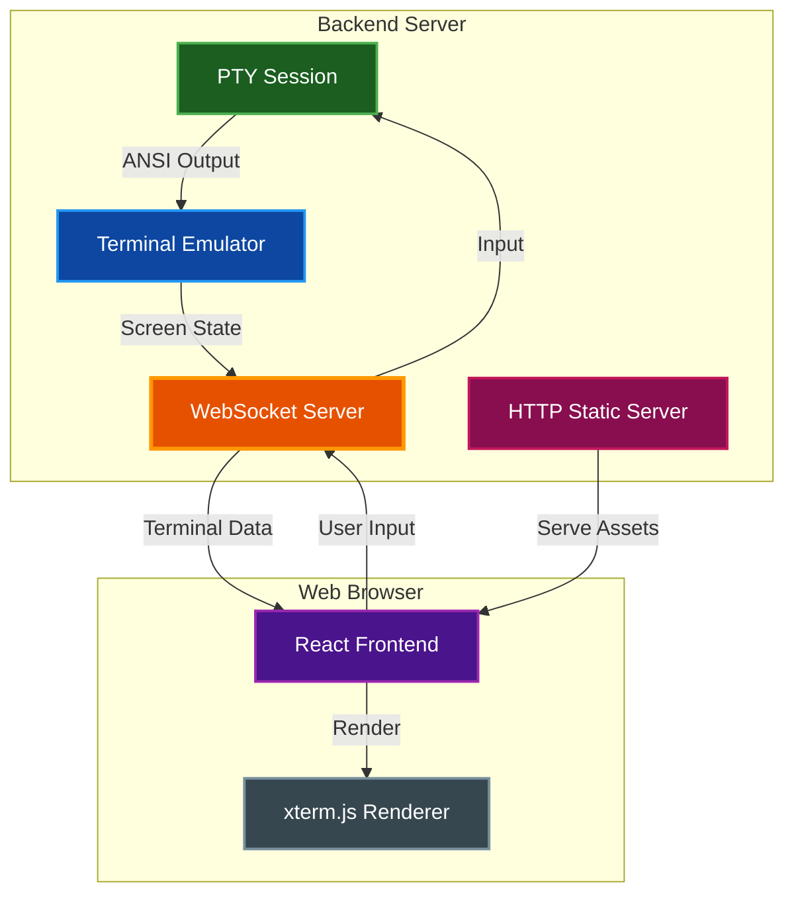

# Quick Start Guide

Get up and running with par-term-emu in minutes!

## Table of Contents
- [Installation](#installation)
- [Your First Terminal](#your-first-terminal)
- [Add Some Color](#add-some-color)
- [Move the Cursor](#move-the-cursor)
- [Inspect Cells](#inspect-cells)
- [Web Terminal Streaming](#web-terminal-streaming)
- [Explore Examples](#explore-examples)
- [Next Steps](#next-steps)
- [Common Patterns](#common-patterns)
  - [Progress Bar](#progress-bar)
  - [Colorful Output](#colorful-output)
  - [Clear and Redraw](#clear-and-redraw)
- [Help & Support](#help--support)

## Installation

**Requirements:** Rust 1.75+ and Python 3.12+

```bash
# Install Rust if you haven't already
curl --proto '=https' --tlsv1.2 -sSf https://sh.rustup.rs | sh

# Install maturin using uv (recommended)
uv tool install maturin

# Clone and build
git clone <repository-url>
cd par-term-emu-core-rust
maturin develop --release
```

## Your First Terminal

```python
from par_term_emu_core_rust import Terminal

# Create a terminal
term = Terminal(80, 24)

# Process some text
term.process_str("Hello, World!\n")

# See the result
print(term.content())
```

## Add Some Color

```python
from par_term_emu_core_rust import Terminal

term = Terminal(80, 24)

# Red text
term.process_str("\x1b[31mThis is red!\x1b[0m\n")

# Green background
term.process_str("\x1b[42mGreen background\x1b[0m\n")

# 24-bit RGB
term.process_str("\x1b[38;2;255;128;0mOrange text\x1b[0m\n")

print(term.content())
```

## Move the Cursor

```python
from par_term_emu_core_rust import Terminal

term = Terminal(80, 24)

# Move to position (row 5, col 10) and write
term.process_str("\x1b[5;10HX marks the spot!")

# Get cursor position
col, row = term.cursor_position()
print(f"Cursor at ({col}, {row})")
```

## Inspect Cells

```python
from par_term_emu_core_rust import Terminal

term = Terminal(80, 24)
term.process_str("\x1b[1;31mBold Red\x1b[0m")

# Get character
char = term.get_char(0, 0)
print(f"Character: {char}")

# Get color
fg = term.get_fg_color(0, 0)
if fg:
    r, g, b = fg
    print(f"Color: RGB({r}, {g}, {b})")

# Get attributes
attrs = term.get_attributes(0, 0)
if attrs:
    print(f"Bold: {attrs.bold}")
```

## Web Terminal Streaming

Stream terminal sessions to web browsers using the standalone streaming server with real-time WebSocket communication.

### Quick Start with Pre-built Binaries

**Download the streaming server and web frontend from [GitHub Releases](https://github.com/paulrobello/par-term-emu-core-rust/releases):**

```bash
# Download streaming server binary (Linux example)
wget https://github.com/paulrobello/par-term-emu-core-rust/releases/latest/download/par-term-streamer-linux-x86_64
chmod +x par-term-streamer-linux-x86_64

# Download and extract web frontend
wget https://github.com/paulrobello/par-term-emu-core-rust/releases/latest/download/par-term-web-frontend-v0.9.0.tar.gz
tar -xzf par-term-web-frontend-v0.9.0.tar.gz -C ./web_term

# Run the server
./par-term-streamer-linux-x86_64 --web-root ./web_term

# Open browser to http://localhost:8080
```

**Available platforms:**
- Linux (x86_64, ARM64)
- macOS (Intel, Apple Silicon)
- Windows (x86_64)

### Install from crates.io

```bash
# Install the streaming server globally
cargo install par-term-emu-core-rust --features streaming

# Run the server
par-term-streamer --port 8080 --theme dracula
```

### Build from Source

```bash
# Build the Rust streaming server
cargo build --bin par-term-streamer --no-default-features --features streaming --release
./target/release/par-term-streamer --help

# Or use the Makefile
make streamer-run
```

### Features

- **Real-time streaming**: Sub-100ms latency terminal streaming over WebSocket
- **Multiple viewers**: Support for concurrent viewers per session
- **Authentication**: Optional API key authentication (header or URL parameter)
- **Themes**: Built-in color themes (iTerm2, Monokai, Dracula, Solarized)
- **Auto-resize**: Client-initiated terminal resizing with SIGWINCH support
- **Modern frontend**: Next.js/React with xterm.js and Tailwind CSS v4

### Architecture



> **📝 Note:** For detailed streaming documentation including protocol specification, advanced features, and troubleshooting, see [docs/STREAMING.md](docs/STREAMING.md)

## Explore Examples

The project includes 33 example scripts demonstrating various features. Explore the `examples/` directory for code samples including PTY sessions, graphics, and advanced terminal features.

```bash
# Run all examples
make examples-all

# Or run individual examples
uv run python examples/colors_demo.py
uv run python examples/pty_shell.py
```

> **Note**: For a full-featured interactive TUI application, check out the sister project [par-term-emu-tui-rust](https://github.com/paulrobello/par-term-emu-tui-rust) ([PyPI](https://pypi.org/project/par-term-emu-tui-rust/)).

## Next Steps

- Check out the [full API documentation](README.md) for complete method reference
- Explore the [examples directory](examples/) for 33 code samples including PTY, graphics, and advanced features
- Review [Streaming Documentation](docs/STREAMING.md) for WebSocket protocol, advanced features, and troubleshooting
- Review [CLAUDE.md](CLAUDE.md) for development and build instructions
- Run example demonstrations: `make examples`

## Common Patterns

### Progress Bar

```python
def show_progress(term, percent):
    bar_width = 50
    filled = int(bar_width * percent / 100)
    bar = "█" * filled + "░" * (bar_width - filled)
    term.process_str(f"\r[{bar}] {percent}%")

term = Terminal(80, 24)
for i in range(0, 101, 10):
    show_progress(term, i)
```

### Colorful Output

```python
def print_colored(term, text, color):
    colors = {
        'red': 31, 'green': 32, 'yellow': 33,
        'blue': 34, 'magenta': 35, 'cyan': 36
    }
    code = colors.get(color, 37)
    term.process_str(f"\x1b[{code}m{text}\x1b[0m\n")

term = Terminal(80, 24)
print_colored(term, "Success!", 'green')
print_colored(term, "Warning!", 'yellow')
print_colored(term, "Error!", 'red')
```

### Clear and Redraw

```python
def clear_screen(term):
    term.process_str("\x1b[2J\x1b[H")

term = Terminal(80, 24)
term.process_str("Old content\n")
clear_screen(term)
term.process_str("New content\n")
```

## Help & Support

- Report issues on GitHub
- Read the full documentation in README.md
- Check examples/ for more code samples
