# Font Support for Screenshots

The screenshot functionality includes **two embedded fonts**, so no font installation is required for basic usage. The library automatically works out-of-the-box on all platforms without any external dependencies.

## Table of Contents
- [Overview](#overview)
- [Embedded Fonts (Default)](#embedded-fonts-default)
- [Emoji & CJK Fallback Fonts](#emoji--cjk-fallback-fonts)
- [Installation Options (Optional)](#installation-options-optional)
  - [Option 1: Install System Fonts](#option-1-install-system-fonts-recommended-for-emojicjk)
  - [Option 2: Download Font with Helper Script](#option-2-download-font-with-helper-script-legacy)
  - [Option 3: Specify a Custom Font](#option-3-specify-a-custom-font)
  - [Option 4: Download Fonts Manually](#option-4-download-fonts-manually)
- [Docker/Container Environments](#dockercontainer-environments)
- [Troubleshooting](#troubleshooting)
- [Related Documentation](#related-documentation)

## Overview

**No installation required!** Screenshots work immediately with two embedded fonts that provide comprehensive character coverage.

However, you may want to install additional system fonts for:
- **Color emoji**: System emoji fonts provide better color emoji support (embedded emoji are monochrome)
- **Extended CJK**: System CJK fonts provide comprehensive East Asian character coverage
- **Custom styling**: Use your preferred monospace font

## Embedded Fonts (Default)

The library includes two embedded fonts that work without any external dependencies:

### 1. JetBrains Mono Regular (Main Font)
**License**: OFL-1.1 (SIL Open Font License)
**Size**: ~268 KB (embedded in binary)
**Location**: `src/screenshot/JetBrainsMono-Regular.ttf`

Features:
- Programming ligatures (=>, !=, >=, etc.)
- Full box drawing character support (┌─┐│└┘)
- Excellent Unicode coverage for Latin, Cyrillic, Greek
- Clean, modern design optimized for code

### 2. Noto Emoji Regular (Emoji Fallback)
**License**: OFL-1.1 (SIL Open Font License)
**Size**: ~409 KB (embedded in binary)
**Location**: `src/screenshot/NotoEmoji-Regular.ttf`

Features:
- Universal emoji coverage (all Unicode emoji)
- Monochrome outline rendering (grayscale)
- Automatic fallback when system color emoji fonts are not available
- Works on all platforms without additional dependencies
- Used as final fallback after all system fonts fail

Both fonts are used automatically when no `font_path` is specified:

```python
# Take screenshot with default embedded fonts (JetBrains Mono + Noto Emoji)
term.screenshot_to_file("output.png")  # No setup needed!

# Or get bytes for in-memory processing
png_bytes = term.screenshot()  # Returns PNG bytes
```

## Emoji & CJK Fallback Fonts

The library uses a smart multi-tier fallback system to render all characters correctly:

```mermaid
graph TD
    Start[Render Character]
    TryMain[Try Main Font<br/>JetBrains Mono or custom]
    CheckSuccess{Glyph Found?}

    CheckType{Character Type?}
    TrySystemEmoji[Try System Emoji Fonts<br/>Apple/Segoe/Noto Color]
    TryEmbeddedEmoji[Try Embedded Noto Emoji<br/>Monochrome]
    TryCJK[Try System CJK Fonts<br/>All available in priority order]
    CheckEmojiAfterCJK{Found in<br/>CJK fonts?}
    FinalFallback[Use Main Font Result<br/>May show as tofu box □]
    Success[Render Glyph]

    Start --> TryMain
    TryMain --> CheckSuccess
    CheckSuccess -->|Yes| Success
    CheckSuccess -->|No or Empty Bitmap| CheckType

    CheckType -->|Emoji 😀| TrySystemEmoji
    CheckType -->|CJK 中文| TryCJK
    CheckType -->|Other with<br/>empty bitmap| TrySystemEmoji

    TrySystemEmoji -->|Found| Success
    TrySystemEmoji -->|Not Found| TryEmbeddedEmoji
    TryEmbeddedEmoji -->|Found| Success
    TryEmbeddedEmoji -->|Not Found| FinalFallback

    TryCJK --> CheckEmojiAfterCJK
    CheckEmojiAfterCJK -->|Yes| Success
    CheckEmojiAfterCJK -->|No| TrySystemEmoji

    FinalFallback --> Success

    style Start fill:#e65100,stroke:#ff9800,stroke-width:3px,color:#ffffff
    style TryMain fill:#1b5e20,stroke:#4caf50,stroke-width:2px,color:#ffffff
    style TrySystemEmoji fill:#0d47a1,stroke:#2196f3,stroke-width:2px,color:#ffffff
    style TryCJK fill:#0d47a1,stroke:#2196f3,stroke-width:2px,color:#ffffff
    style TryEmbeddedEmoji fill:#4a148c,stroke:#9c27b0,stroke-width:2px,color:#ffffff
    style Success fill:#1b5e20,stroke:#4caf50,stroke-width:2px,color:#ffffff
    style FinalFallback fill:#ff6f00,stroke:#ffa726,stroke-width:2px,color:#ffffff
    style CheckSuccess fill:#37474f,stroke:#78909c,stroke-width:2px,color:#ffffff
    style CheckType fill:#37474f,stroke:#78909c,stroke-width:2px,color:#ffffff
    style CheckEmojiAfterCJK fill:#37474f,stroke:#78909c,stroke-width:2px,color:#ffffff
```



### Font Fallback Chain

**For Emoji Characters** (automatic fallback chain):
1. **Main font** (JetBrains Mono or custom `font_path`)
2. **System color emoji fonts** (tries multiple paths in order until one is found):
   - macOS: Apple Color Emoji, Arial Unicode, DejaVu Sans, AppleSDGothicNeo, CJKSymbolsFallback, PingFang, Hiragino Sans GB, Apple Symbols
   - Linux: NotoColorEmoji, NotoEmoji, NotoSans, NotoSansCJK, DejaVuSans, LiberationSans
   - Windows: Segoe UI Emoji, Segoe UI Symbol, Arial, MS Gothic, MS YaHei
3. **Embedded Noto Emoji** (monochrome, always available as final fallback - loaded if all system fonts fail)

**For CJK Characters** (Chinese, Japanese, Korean):
1. **Main font** (JetBrains Mono or custom `font_path`)
2. **System CJK fonts** (loads ALL available fonts in priority order for comprehensive coverage, trying each until a glyph is found):
   - macOS: Arial Unicode, PingFang, Hiragino Sans GB, AppleSDGothicNeo, Hiragino Kaku Gothic ProN, CJKSymbolsFallback, STHeiti Medium, AppleMyungjo, STSong
   - Linux: NotoSansCJK, DejaVuSans, LiberationSans
   - Windows: MS Gothic, MS YaHei, Malgun Gothic, Arial
3. **System emoji fonts** (as additional fallback if CJK fonts don't have the glyph)
4. **Embedded Noto Emoji** (monochrome, as final fallback after all system fonts)
5. **Main font result** (may show as tofu box □) if all fallbacks fail

### Behavior Summary

- **Regular text**: Always uses main font (embedded JetBrains Mono or custom)
- **Emoji**: Tries system color fonts first (lazy-loaded when first emoji is encountered), then falls back to embedded monochrome Noto Emoji as final fallback
- **CJK**: Loads ALL available system CJK fonts in priority order (lazy-loaded when first CJK character is encountered), tries each font until a glyph is found, then tries emoji fonts as additional fallback, with embedded Noto Emoji as final fallback before showing tofu boxes (□)
- **No system fonts needed**: Works out-of-the-box with embedded fonts (JetBrains Mono + Noto Emoji)
- **Font loading**: System fonts are lazy-loaded only when needed (first emoji/CJK character encountered)
- **Comprehensive fallback**: The library tries multiple font sources in sequence to maximize glyph coverage
- **CJK character caching**: The library caches which system CJK font has each character for performance optimization (avoids checking all fonts repeatedly)

## Installation Options (Optional)

Installation is **optional** - the embedded fonts work great! Only install additional system fonts if you need:
- Color emoji rendering (embedded emoji are monochrome)
- Extensive CJK character coverage
- A custom monospace font for your screenshots

### Option 1: Install System Fonts (Recommended for Emoji/CJK)

Install fonts on Linux for better emoji and CJK character support:

#### Linux (Debian/Ubuntu)
```bash
# For emoji support
sudo apt install fonts-noto-color-emoji

# For CJK support
sudo apt install fonts-noto-cjk

# Or install DejaVu fonts (good general coverage)
sudo apt install fonts-dejavu-core
```

#### Linux (Fedora/RHEL)
```bash
# For emoji support
sudo dnf install google-noto-emoji-color-fonts

# For CJK support
sudo dnf install google-noto-sans-cjk-fonts

# Or DejaVu fonts
sudo dnf install dejavu-sans-mono-fonts
```

#### Linux (Arch)
```bash
# For emoji support
sudo pacman -S noto-fonts-emoji

# For CJK support
sudo pacman -S noto-fonts-cjk

# Or DejaVu fonts
sudo pacman -S ttf-dejavu
```

#### macOS
System fonts (Apple Color Emoji, Arial Unicode, etc.) are pre-installed. No action needed for emoji/CJK support.

#### Windows
System fonts (Segoe UI Emoji, MS Gothic, etc.) are pre-installed. No action needed for emoji/CJK support.

### Option 2: Download Font with Helper Script (Legacy)

> **Note**: This script is **no longer necessary** since JetBrains Mono is now embedded. It's kept for users who specifically want the Hack font.

The script downloads Hack font (MIT licensed) to your user fonts directory:

```bash
./scripts/install_font.sh
```

This downloads and installs Hack font to `~/.local/share/fonts/` and updates the font cache. You can then use it with:

```python
term.screenshot_to_file("output.png", font_path="~/.local/share/fonts/Hack-Regular.ttf")
```

### Option 3: Specify a Custom Font

You can use any TTF/OTF monospace font by specifying its path. When you provide a custom font, it replaces JetBrains Mono as the main font, but emoji/CJK fallback still works:

```python
# Use a custom font (replaces JetBrains Mono)
term.screenshot_to_file("output.png", font_path="/path/to/your/font.ttf")

# Use embedded defaults (JetBrains Mono + Noto Emoji)
term.screenshot_to_file("output.png")  # No font_path needed!
```

**Note**: Custom fonts are used for the main text, but emoji and CJK characters will still fall back to system fonts or the embedded Noto Emoji font as needed.

### Option 4: Download Fonts Manually

Download any monospace font you prefer:

- **Hack**: https://github.com/source-foundry/Hack (MIT License)
- **Inconsolata**: https://fonts.google.com/specimen/Inconsolata (OFL)
- **JetBrains Mono**: https://www.jetbrains.com/lp/mono/ (OFL)
- **Fira Code**: https://github.com/tonsky/FiraCode (OFL)

Then place the `.ttf` file somewhere accessible and specify its path:

```python
term.screenshot_to_file("output.png", font_path="/path/to/downloaded/font.ttf")
```

## Docker/Container Environments

**No setup required!** The embedded fonts (JetBrains Mono + Noto Emoji) work in Docker containers out-of-the-box without any external dependencies.

For better color emoji and extended CJK support in containers, optionally install system fonts:

```dockerfile
# Optional: Add color emoji and CJK fonts for enhanced character coverage
RUN apt-get update && \
    apt-get install -y \
        fonts-noto-color-emoji \
        fonts-noto-cjk && \
    rm -rf /var/lib/apt/lists/*

# Or minimal approach - just DejaVu for basic coverage
RUN apt-get update && apt-get install -y fonts-dejavu-core && rm -rf /var/lib/apt/lists/*
```

**Benefits of adding system fonts in containers:**
- Color emoji instead of monochrome (Noto Color Emoji vs embedded Noto Emoji)
- More comprehensive CJK character coverage
- The library works perfectly without them - embedded fonts handle all basic needs

## Troubleshooting

### Screenshots work without any font installation

The library includes two embedded fonts (JetBrains Mono + Noto Emoji). You should **never** see a "No system monospace font found" error. If you do, please file a bug report!

### Emoji appear as monochrome/grayscale instead of color

This is expected behavior when system color emoji fonts are not installed:
- The library first tries to load a system color emoji font (lazy-loaded when first emoji is encountered)
- If no system font is found at any of the searched paths, the embedded Noto Emoji font is used as a final fallback
- The embedded Noto Emoji font provides monochrome (grayscale) emoji rendering
- For color emoji, install system fonts (see [Option 1](#option-1-install-system-fonts-recommended-for-emojicjk))

**On macOS/Windows**: System color emoji fonts are pre-installed, so you should see color emoji automatically.

**On Linux**: Install `fonts-noto-color-emoji` for color emoji support. If not installed, you'll get monochrome emoji from the embedded font.

### CJK characters appear as boxes (□)

This happens when none of the available fonts have the required glyph. The library tries:
1. Main font (JetBrains Mono or custom)
2. ALL available system CJK fonts (lazy-loaded when first CJK character is encountered)
3. System emoji fonts (as additional fallback)
4. Embedded Noto Emoji (as final fallback)
5. Returns to main font result (shows as tofu box □)

To fix this:
1. **Install system fonts** (see [Option 1](#option-1-install-system-fonts-recommended-for-emojicjk) above) - Recommended
2. **Use a comprehensive font** - Specify a font with good CJK coverage via `font_path` (e.g., Arial Unicode MS)
3. **Accept the limitation** - Some obscure CJK characters may not render without proper fonts installed

### Check available fonts

```bash
# Linux - List available monospace fonts
fc-list :mono

# macOS - List system fonts
ls /System/Library/Fonts/

# Check if specific fonts are installed
fc-list | grep -i "noto\|emoji\|cjk"
```

### Font rendering priority

The library uses this priority order for rendering characters:

**Main text (ASCII, Latin, Cyrillic, Greek, box-drawing)**:
1. Custom `font_path` (if specified)
2. Embedded JetBrains Mono (default)

**Emoji characters** (🎉 😀 🚀):
1. Custom `font_path` (if it contains emoji glyphs)
2. System color emoji fonts (loaded in order: see full list above)
3. Embedded Noto Emoji (monochrome, always available as final fallback)

**CJK characters** (中文, 日本語, 한글):
1. Custom `font_path` (if it contains CJK glyphs)
2. System CJK fonts (loads ALL available in priority order: see full list above, tries each until a glyph is found)
3. System emoji fonts (as additional fallback)
4. Embedded Noto Emoji (monochrome, as final fallback)
5. Main font result (may show as tofu box □) if all fallbacks fail

**Note**: The library caches which system CJK font has each character (character → font index mapping) for performance optimization, avoiding repeated searches through all fonts for the same character.

## Related Documentation

- [README.md](../README.md) - Project overview and features
- [ARCHITECTURE.md](ARCHITECTURE.md) - System architecture and design
- [API_REFERENCE.md](API_REFERENCE.md) - Complete API documentation
- [BUILDING.md](BUILDING.md) - Build instructions and requirements
- [CROSS_PLATFORM.md](CROSS_PLATFORM.md) - Platform-specific considerations
