# Regional Indicator Flag Emoji - Frontend Rendering Limitation

Regional indicator flag emojis (🇺🇸, 🇨🇳, 🇯🇵, etc.) are now correctly stored as single cells in the backend (v0.22.0+), but may not render correctly in the web terminal client. This is a known limitation of xterm.js that requires grapheme cluster support, which is not yet available.

## Table of Contents
- [Technical Background](#technical-background)
  - [What Are Regional Indicator Flags?](#what-are-regional-indicator-flags)
  - [The Terminal Grid Problem](#the-terminal-grid-problem)
  - [What Happens Now](#what-happens-now)
- [Why Can't We Fix This Now?](#why-cant-we-fix-this-now)
  - [xterm.js Grapheme Cluster Addon](#xtermjs-grapheme-cluster-addon)
  - [Tracking Issues](#tracking-issues)
- [Other Affected Emoji](#other-affected-emoji)
- [What Works Now](#what-works-now)
- [Workarounds](#workarounds)
- [Future Resolution](#future-resolution)
- [Implementation Details](#implementation-details)
- [Related Documentation](#related-documentation)

## Technical Background

### What Are Regional Indicator Flags?

Regional indicator flag emojis are composed of two Unicode codepoints:
- Each codepoint is a Regional Indicator Symbol (U+1F1E6 to U+1F1FF)
- The pair represents a country code (e.g., 🇺🇸 = US = U+1F1FA + U+1F1F8)
- Visually, they should render as a single flag emoji

### The Terminal Grid Problem

Terminals use a fixed character grid where:
- Each cell can hold one character
- Each character has a fixed width (1 or 2 cells for wide chars)

Regional indicator flags violate this model:
1. **Two codepoints**: The flag is made of 2 separate Unicode characters
2. **Width 1 each**: Each regional indicator has width 1 (per `unicode-width` crate)
3. **Separate cells**: They're stored in separate cells in the terminal grid
4. **Should be width 2**: Visually, they should render as a single wide (2-cell) emoji

```mermaid
graph TD
    Input[Input: 🇺🇸 Flag Emoji]
    Parser[VTE Parser]
    Char1[U+1F1FA Regional Indicator U]
    Char2[U+1F1F8 Regional Indicator S]
    Cell1[Grid Cell: Width=1]
    Cell2[Grid Cell: Width=1]
    Display[Display: Two Separate Chars]
    Expected[Expected: Single Flag Emoji]

    Input --> Parser
    Parser --> Char1
    Parser --> Char2
    Char1 --> Cell1
    Char2 --> Cell2
    Cell1 --> Display
    Cell2 --> Display
    Display -.Should be.-> Expected

    style Input fill:#4a148c,stroke:#9c27b0,stroke-width:2px,color:#ffffff
    style Parser fill:#0d47a1,stroke:#2196f3,stroke-width:2px,color:#ffffff
    style Char1 fill:#1b5e20,stroke:#4caf50,stroke-width:2px,color:#ffffff
    style Char2 fill:#1b5e20,stroke:#4caf50,stroke-width:2px,color:#ffffff
    style Cell1 fill:#37474f,stroke:#78909c,stroke-width:2px,color:#ffffff
    style Cell2 fill:#37474f,stroke:#78909c,stroke-width:2px,color:#ffffff
    style Display fill:#b71c1c,stroke:#f44336,stroke-width:2px,color:#ffffff
    style Expected fill:#2e7d32,stroke:#66bb6a,stroke-width:2px,color:#ffffff
```



### What Happens Now

**Backend (Rust) - v0.22.0+:**

The backend now correctly handles regional indicator flag emoji as grapheme clusters:
- Receives the flag emoji (e.g., "🇺🇸")
- Detects regional indicator pairs (two consecutive regional indicators)
- Stores both regional indicators in a **single cell** (first as base char, second in combining vector)
- Calculates width 2 for the combined flag emoji
- Creates a spacer cell for the second position
- Works correctly with all flag emoji (🇺🇸, 🇬🇧, 🇯🇵, etc.)

**Frontend (xterm.js):**

The frontend receives the data correctly but may not render properly:
- Receives the combined flag emoji via WebSocket
- Lacks grapheme cluster support to treat them as a visual unit
- Browser/font may render them as separate characters or not at all
- This limitation is in xterm.js, not the backend

## Why Can't We Fix This Now?

### xterm.js Grapheme Cluster Addon

The xterm.js team developed a solution: `@xterm/addon-unicode-graphemes`

**Current Status:**
- Code exists in the xterm.js repository (PR #4519)
- Included in xterm.js 5.5.0 release notes
- Never published to npm (Issue #5147)
- Not available on CDN (jsDelivr, unpkg)
- Scheduled for xterm.js 6.0.0 milestone (no due date set)

> **⚠️ Warning:** A malicious typosquatting package exists (`xterm-addon-unicode-graphemes` without the `@` prefix). Do not install this package.

### Tracking Issues

- [Issue #3304](https://github.com/xtermjs/xterm.js/issues/3304) - Grapheme cluster & Unicode v13 support
- [Issue #5147](https://github.com/xtermjs/xterm.js/issues/5147) - Missing npm package @xterm/addon-unicode-graphemes
- [Issue #4797](https://github.com/xtermjs/xterm.js/issues/4797) - Set up publishing for unicode graphemes addon
- [Issue #1468](https://github.com/xtermjs/xterm.js/issues/1468) - Grapheme support (original request)

## Other Affected Emoji

Regional indicators are just one type of grapheme cluster. Other affected emoji include:

1. **Emoji with skin tone modifiers** (e.g., 👍🏻, 👋🏽)
   - Base emoji + skin tone modifier (U+1F3FB to U+1F3FF)

2. **Zero-Width Joiner (ZWJ) sequences** (e.g., 👨‍👩‍👧‍👦, 🏳️‍🌈)
   - Multiple emoji joined with U+200D (ZWJ)

3. **Emoji with variation selectors** (e.g., ❤️, ☀️)
   - Base character + U+FE0F (variation selector)

4. **Keycap sequences** (e.g., 1️⃣, #️⃣)
   - Digit/symbol + U+FE0F + U+20E3 (combining enclosing keycap)

## What Works Now

**Simple Emoji (single codepoint, width 2):**
- Coffee: ☕ (U+2615)
- Rocket: 🚀 (U+1F680)
- Smiley: 😀 (U+1F600)
- Heart: ❤ (U+2764)
- Thumbs up: 👍 (U+1F44D)

**Wide Characters (CJK, etc.):**
- Chinese: 你好世界
- Japanese: 日本語
- Korean: 한국어

## Workarounds

There are no workarounds for this issue:
- Cannot modify backend to "combine" characters (breaks terminal grid model)
- Cannot use unpublished addon (not available via npm or CDN)
- Cannot implement custom grapheme clustering (extremely complex)
- Cannot use alternative rendering (xterm.js is the standard)

### What Users See

When a regional indicator flag is sent to the terminal:
- **Best case**: Two separate regional indicator symbols (🇺🇸 renders as "🇺" and "🇸")
- **Common case**: Empty boxes or missing characters
- **Worst case**: Rendering artifacts or incorrect spacing

## Future Resolution

### When the Addon is Published

Once `@xterm/addon-unicode-graphemes` is published to npm, integration will require:

**Step 1: Load the addon**

Add to HTML client:
```html
<script src="https://cdn.jsdelivr.net/npm/@xterm/addon-unicode-graphemes@latest/lib/addon-unicode-graphemes.js"></script>
```

Add to Next.js client:
```bash
npm install @xterm/addon-unicode-graphemes
```

**Step 2: Activate the addon**

```javascript
const graphemesAddon = new UnicodeGraphemesAddon.UnicodeGraphemesAddon();
term.loadAddon(graphemesAddon);
term.unicode.activeVersion = 'graphemes'; // API may vary
```

### Alternative: Wait for xterm.js Core Support

The xterm.js team may eventually integrate grapheme cluster support directly into the core library, eliminating the need for an addon.

## Implementation Details

### Backend Implementation

**Grapheme Cluster Utilities:**

The Rust backend includes a dedicated `grapheme` module (`src/grapheme.rs`) with utility functions for detecting and handling various Unicode grapheme cluster components:

- `is_regional_indicator(c)` - Detects regional indicator symbols (U+1F1E6-U+1F1FF)
- `is_variation_selector(c)` - Detects variation selectors (U+FE0E, U+FE0F)
- `is_zwj(c)` - Detects Zero Width Joiner (U+200D)
- `is_skin_tone_modifier(c)` - Detects skin tone modifiers (U+1F3FB-U+1F3FF)
- `is_combining_mark(c)` - Detects combining diacritical marks
- `is_wide_grapheme(grapheme)` - Determines if a grapheme cluster should occupy 2 cells

**Unicode Width Calculation:**

The backend uses the `unicode-width` crate (v0.2.2) to calculate individual character widths:

```rust
// From src/cell.rs
let width = unicode_width::UnicodeWidthChar::width(c).unwrap_or(1) as u8;
```

**Combining Character Handling:**

The terminal writer (`src/terminal/write.rs`) detects combining characters and adds them to the previous cell:

```rust
// Variation selectors, ZWJ, skin tone modifiers, and combining marks
// are added to the previous cell instead of creating a new cell
if grapheme::is_variation_selector(c)
    || grapheme::is_zwj(c)
    || grapheme::is_skin_tone_modifier(c)
    || grapheme::is_combining_mark(c)
{
    // Add to previous cell's combining character list
    // and recalculate width if needed
}
```

**Regional Indicator Pair Handling (v0.22.0+):**

The terminal writer now correctly handles regional indicator pairs:

```rust
// Regional indicators are detected and combined into single cells
if grapheme::is_regional_indicator(c) {
    // Check if previous cell is also a regional indicator
    // If so, combine them into a single width-2 cell
    // with the second indicator in the combining vector
}
```

**Regional Indicator Detection:**

The screenshot renderer includes special detection for regional indicators to enable shaped rendering:

```rust
// From src/screenshot/renderer.rs
pub(crate) fn contains_regional_indicators(text: &str) -> bool {
    text.chars().any(|c| matches!(c as u32, 0x1F1E6..=0x1F1FF))
}
```

### Frontend Implementation

**HTML Streaming Client:**

Located in `examples/streaming_client.html`:
- xterm.js version: 5.5.0
- WebGL renderer enabled for better emoji rendering
- Unicode11 addon loaded and activated
- Font stack includes: JetBrains Mono, Fira Code, Noto Sans Mono, Segoe UI Emoji, Noto Color Emoji, Apple Color Emoji
- `rescaleOverlappingGlyphs` option enabled

**Next.js Web Terminal:**

Located in `web-terminal-frontend/components/Terminal.tsx`:
- xterm.js version: 5.5.0
- Same addon configuration as HTML client
- React-based implementation with TypeScript

## Related Documentation

- [ARCHITECTURE.md](ARCHITECTURE.md) - Overall system architecture
- [VT_SEQUENCES.md](VT_SEQUENCES.md) - Supported VT sequences
- [xterm.js Issue #5147](https://github.com/xtermjs/xterm.js/issues/5147) - Missing npm package tracking issue
- [xterm.js Issue #3304](https://github.com/xtermjs/xterm.js/issues/3304) - Grapheme cluster support request

---

**Last Updated**: 2025-11-24
**xterm.js Version**: 5.5.0
**unicode-width Crate**: 0.2.2
**Status**: Blocked on upstream xterm.js addon publishing (scheduled for v6.0.0)
