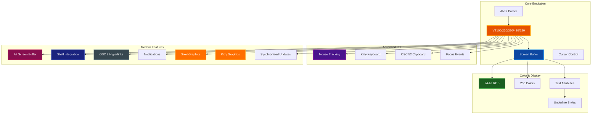

# Advanced Features

Comprehensive guide to advanced terminal emulation features in par-term-emu-core-rust.

## Table of Contents

- [Overview](#overview)
- [True Color Support](#true-color-support)
  - [Bold Brightening](#bold-brightening)
- [Minimum Contrast Adjustment (iTerm2-Compatible)](#minimum-contrast-adjustment-iterm2-compatible)
- [Alternate Screen Buffer](#alternate-screen-buffer)
- [Mouse Reporting](#mouse-reporting)
- [Bracketed Paste Mode](#bracketed-paste-mode)
- [Focus Tracking](#focus-tracking)
- [OSC 52 Clipboard Operations](#osc-52-clipboard-operations)
- [OSC 8 Hyperlinks](#osc-8-hyperlinks)
- [Notifications (OSC 9/777)](#notifications-osc-9777)
- [Progress Bars (OSC 9;4)](#progress-bars-osc-94)
- [Shell Integration](#shell-integration)
- [Sixel Graphics](#sixel-graphics)
- [Kitty Graphics Protocol](#kitty-graphics-protocol)
- [Synchronized Updates](#synchronized-updates)
- [Kitty Keyboard Protocol](#kitty-keyboard-protocol)
- [Underline Styles](#underline-styles)
- [VT420 Rectangle Operations](#vt420-rectangle-operations)
- [Unicode Support](#unicode-support)
- [Buffer Export](#buffer-export)
- [Scrollback Reflow](#scrollback-reflow)
- [Terminal Notifications](#terminal-notifications)
- [Session Recording and Replay](#session-recording-and-replay)
- [Macro Recording and Playback](#macro-recording-and-playback)
- [Terminal Streaming](#terminal-streaming)
- [Complete Example](#complete-example)
- [Related Documentation](#related-documentation)

## Overview

par-term-emu-core-rust provides comprehensive terminal emulation with VT100/VT220/VT320/VT420/VT520 compatibility and modern terminal features including true color, alternate screen buffer, mouse support, clipboard operations, hyperlinks, and graphics rendering.

### Feature Architecture



## True Color Support

par-term-emu-core-rust supports 24-bit RGB (true color) terminal output for 16.7 million colors.

### Usage

```python
from par_term_emu_core_rust import Terminal

term = Terminal(80, 24)

# Set foreground color to orange (RGB: 255, 128, 0)
term.process_str("\x1b[38;2;255;128;0mOrange text\x1b[0m\n")

# Set background color to purple (RGB: 128, 0, 255)
term.process_str("\x1b[48;2;128;0;255mPurple background\x1b[0m\n")

# Both foreground and background
term.process_str("\x1b[38;2;255;255;0;48;2;0;0;128mYellow on blue\x1b[0m\n")
```

### Supported Color Modes

- **16 basic colors**: `\x1b[30-37m` (foreground), `\x1b[40-47m` (background)
- **16 bright colors**: `\x1b[90-97m` (foreground), `\x1b[100-107m` (background)
- **256-color palette**: `\x1b[38;5;<n>m` (foreground), `\x1b[48;5;<n>m` (background)
- **24-bit RGB**: `\x1b[38;2;<r>;<g>;<b>m` (foreground), `\x1b[48;2;<r>;<g>;<b>m` (background)

### Bold Brightening

Bold brightening is a feature where bold text with ANSI colors 0-7 (standard colors) automatically uses the bright color variants 8-15. This matches the behavior of iTerm2's "Use Bright Bold" setting and many traditional terminal emulators.

```python
from par_term_emu_core_rust import Terminal

term = Terminal(80, 24)

# Enable bold brightening (default is typically off)
term.set_bold_brightening(True)

# Bold text with red (color 1) will appear as bright red (color 9)
term.process_str("\x1b[1;31mThis appears bright red\x1b[0m\n")

# Disable bold brightening
term.set_bold_brightening(False)

# Now bold red appears as regular red, just bolded
term.process_str("\x1b[1;31mThis appears regular red (bold)\x1b[0m\n")
```

**Note**: Bold brightening only affects ANSI colors 0-7, not 256-color or RGB colors. When creating snapshots with `create_snapshot()` or taking screenshots with `screenshot()` / `screenshot_to_file()`, the bold brightening setting is automatically applied to the captured colors.

## Minimum Contrast Adjustment (iTerm2-Compatible)

The minimum contrast feature automatically adjusts text colors to ensure readability against backgrounds, using the same algorithm as iTerm2.

### Overview

- **Algorithm**: Uses NTSC perceived brightness formula (30% red, 59% green, 11% blue)
- **Hue Preservation**: Adjusts brightness while maintaining the original color hue
- **Range**: 0.0-1.0 where 0.0 = disabled, 0.5 = moderate (default), 1.0 = maximum
- **Default**: 0.5 (moderate contrast adjustment for improved readability)

### Usage in Screenshots

The minimum contrast adjustment is available as a parameter in screenshot methods. The default value is 0.5 (moderate contrast adjustment):

```python
from par_term_emu_core_rust import Terminal

term = Terminal(80, 24)

# Add some low-contrast content
term.process_str("\x1b[38;2;64;64;64m")  # Dark gray text
term.process_str("\x1b[48;2;0;0;0m")      # Black background
term.process_str("This text has poor contrast\n")

# Screenshot WITHOUT minimum contrast (explicitly disable)
term.screenshot_to_file("low_contrast.png", minimum_contrast=0.0)

# Screenshot WITH minimum contrast adjustment (default is 0.5)
term.screenshot_to_file(
    "readable.png",
    minimum_contrast=0.5  # Recommended value for readability
)

# The adjusted screenshot will automatically lighten the dark gray
# text to ensure at least 0.5 brightness difference from the background
```

### Color Utility Functions

For advanced color manipulation, the library provides standalone functions:

```python
from par_term_emu_core_rust import (
    perceived_brightness_rgb,
    adjust_contrast_rgb,
)

# Calculate perceived brightness (NTSC formula)
brightness = perceived_brightness_rgb(128, 128, 128)  # Returns 0.502

# Adjust colors for minimum contrast
fg = (64, 64, 64)   # Dark gray
bg = (0, 0, 0)       # Black
adjusted = adjust_contrast_rgb(fg, bg, 0.5)  # Returns (128, 128, 128)

# Verify the contrast
fg_brightness = perceived_brightness_rgb(*adjusted)
bg_brightness = perceived_brightness_rgb(*bg)
contrast = abs(fg_brightness - bg_brightness)  # Should be >= 0.5
```

### Additional Color Utilities

The library provides comprehensive color manipulation functions:

```python
from par_term_emu_core_rust import (
    # Brightness adjustments
    lighten_rgb, darken_rgb,

    # WCAG accessibility
    color_luminance, contrast_ratio,
    meets_wcag_aa, meets_wcag_aaa,

    # Color space conversions
    rgb_to_hsl, hsl_to_rgb,
    rgb_to_hex, hex_to_rgb,
    rgb_to_ansi_256,

    # Color manipulation
    mix_colors, complementary_color,
    adjust_saturation, adjust_hue,
)

# Example: Check WCAG compliance
ratio = contrast_ratio((0, 0, 0), (255, 255, 255))  # 21.0:1
meets_aa = meets_wcag_aa((0, 0, 0), (255, 255, 255))  # True
```

See the [Color Utilities](#color-utilities) section in the main README for complete documentation.

### How It Works

The minimum contrast algorithm:

1. **Calculate brightness** using NTSC formula for both foreground and background
2. **Check contrast** - if difference >= minimum_contrast, return original color
3. **Determine direction** - lighten or darken based on which color is brighter
4. **Adjust brightness** using parametric interpolation toward white (1,1,1) or black (0,0,0)
5. **Preserve hue** by interpolating all RGB components proportionally

This ensures text remains readable while preserving the visual intent of the original colors.

## Alternate Screen Buffer

The alternate screen buffer allows applications to use a separate screen without affecting the primary buffer. This is commonly used by full-screen applications like vim, less, and tmux.

### Usage

```python
term = Terminal(80, 24)

# Write to primary screen
term.process_str("Main terminal content\n")

# Switch to alternate screen
term.process_str("\x1b[?1049h")

# The alt screen is now active and empty
term.process_str("This is the alternate screen\n")

# Switch back to primary screen
term.process_str("\x1b[?1049l")

# Primary screen content is restored
```

### API

```python
# Check if alt screen is active
if term.is_alt_screen_active():
    print("Using alternate screen")
```

### Use Cases

- Text editors (vim, nano, emacs)
- Pagers (less, more, man)
- Terminal multiplexers (tmux, screen)
- TUI applications
- Interactive prompts

## Mouse Reporting

par-term-emu-core-rust supports multiple mouse tracking protocols, allowing applications to receive mouse events.

### Mouse Modes

| Mode | Description | Enable | Disable |
|------|-------------|--------|---------|
| Off | No mouse tracking (default) | - | `\x1b[?1000l` |
| X10 | Press events only (legacy) | `\x1b[?9h` | `\x1b[?9l` |
| Normal | Press and release | `\x1b[?1000h` | `\x1b[?1000l` |
| Button Event | Press, release, and motion while pressed | `\x1b[?1002h` | `\x1b[?1002l` |
| Any Event | All mouse motion | `\x1b[?1003h` | `\x1b[?1003l` |

### Mouse Encoding Formats

| Format | Description | Enable |
|--------|-------------|--------|
| Default | X11 encoding (limited to 223x223) | Default |
| UTF-8 | Extended coordinates | `\x1b[?1005h` |
| SGR | Modern format (recommended) | `\x1b[?1006h` |
| URXVT | Alternative format | `\x1b[?1015h` |

### Usage

```python
term = Terminal(80, 24)

# Enable normal mouse tracking with SGR encoding
term.process_str("\x1b[?1000h\x1b[?1006h")

# Check current mode
print(f"Mouse mode: {term.mouse_mode()}")  # "normal"

# Simulate a mouse click
event_bytes = term.simulate_mouse_event(
    button=0,    # 0=left, 1=middle, 2=right
    col=10,      # Column (0-based)
    row=5,       # Row (0-based)
    pressed=True # True=press, False=release
)

print(f"Mouse event: {event_bytes}")  # b'\x1b[<0;11;6M'
```

### Mouse Event Format (SGR)

- **Press**: `\x1b[<{button};{col};{row}M`
- **Release**: `\x1b[<{button};{col};{row}m`

### Use Cases

- Clickable UI elements
- Text selection
- Drag and drop
- Context menus
- Interactive visualizations

## Bracketed Paste Mode

Bracketed paste mode wraps pasted text with special escape sequences, allowing applications to distinguish between typed and pasted text.

### Usage

```python
term = Terminal(80, 24)

# Enable bracketed paste
term.process_str("\x1b[?2004h")

# Check if enabled
if term.bracketed_paste():
    print("Bracketed paste is active")

    # Get the sequences (returned as bytes objects)
    start = term.get_paste_start()  # Returns: b'\x1b[200~'
    end = term.get_paste_end()      # Returns: b'\x1b[201~'
```

### How It Works

Without bracketed paste:
```
user pastes: echo "line 1"\necho "line 2"
shell receives: echo "line 1"<Enter>echo "line 2"<Enter>
result: Both commands execute immediately
```

With bracketed paste:
```
user pastes: echo "line 1"\necho "line 2"
shell receives: \x1b[200~echo "line 1"\necho "line 2"\x1b[201~
result: Shell knows it's a paste, can handle specially
```

### Benefits

1. **Security**: Prevents accidental command execution
2. **Multi-line editing**: Paste code without line-by-line execution
3. **Better UX**: Syntax highlighting, indentation preservation
4. **Special character handling**: Tabs and control characters preserved

### Use Cases

- Safe multi-line command pasting
- Code snippet pasting
- Configuration file content
- SQL queries
- Scripts and functions

## Focus Tracking

Focus tracking allows applications to be notified when the terminal gains or loses focus.

### Usage

```python
term = Terminal(80, 24)

# Enable focus tracking
term.process_str("\x1b[?1004h")

# Get focus events (returned as bytes objects)
focus_in = term.get_focus_in_event()   # Returns: b'\x1b[I'
focus_out = term.get_focus_out_event() # Returns: b'\x1b[O'
```

### Use Cases

- Pause animations when terminal loses focus
- Update status when regaining focus
- Refresh display on focus
- Conserve resources when not focused

## OSC 52 Clipboard Operations

OSC 52 enables clipboard operations that work over SSH without requiring X11 forwarding, making it ideal for remote terminal sessions.

### Usage

```python
term = Terminal(80, 24)

# Enable clipboard read (disabled by default for security)
term.set_allow_clipboard_read(True)

# Copy text to clipboard
term.process_str("\x1b]52;c;SGVsbG8gV29ybGQh\x07")  # base64 encoded "Hello World!"

# Get clipboard content
clipboard_text = term.clipboard()
print(f"Clipboard: {clipboard_text}")

# Query clipboard (sends request to application)
term.process_str("\x1b]52;c;?\x07")
```

### Security Considerations

- Clipboard read is **disabled by default** to prevent security issues
- Use `set_allow_clipboard_read(True)` to enable reading
- Only enable when necessary for your use case

### Use Cases

- Copy/paste over SSH without X11 forwarding
- Remote server clipboard access
- Terminal multiplexer clipboard sync (tmux, screen)
- IDE/editor integration
- Automated testing scenarios

> **🔒 Security:** Always validate clipboard content before processing sensitive data

## OSC 8 Hyperlinks

OSC 8 provides clickable hyperlinks in terminal output with full support including TUI rendering.

### Usage

```python
term = Terminal(80, 24)

# Create a hyperlink
term.process_str("\x1b]8;;https://example.com\x07Click here\x1b]8;;\x07\n")

# Check if a cell contains a hyperlink
url = term.get_hyperlink(0, 0)  # Get URL at column 0, row 0
if url:
    print(f"Link found: {url}")
```

### Format

```
\x1b]8;<params>;<url>\x07<link text>\x1b]8;;\x07
```

- `<params>`: Optional parameters (usually empty)
- `<url>`: Complete URL (http://, https://, file://, etc.)
- `<link text>`: Visible text to display
- Final `\x1b]8;;\x07`: Terminates the hyperlink

### Use Cases

- CLI tool output with documentation links
- Log files with issue tracker references
- TUI applications with clickable navigation
- Error messages with help links
- Git commit output with PR/issue links

> **✅ Tip:** Works in iTerm2, WezTerm, and modern terminal emulators with TUI support

## Notifications (OSC 9/777)

Desktop-style notification support for alerting users about events, completions, or errors.

### OSC 9 (Simple Format)

```python
term = Terminal(80, 24)

# Simple notification (message only)
term.process_str("\x1b]9;Build completed successfully!\x07")

# Retrieve notifications
notifications = term.drain_notifications()
for title, message in notifications:
    print(f"{title}: {message}")
```

### OSC 777 (Structured Format)

```python
# Notification with title and message
term.process_str("\x1b]777;notify;Build Status;Compilation successful\x07")

# Get notifications without removing them
notifications = term.take_notifications()

# Check if notifications pending
if term.has_notifications():
    notifications = term.drain_notifications()
```

### Use Cases

- Long-running command completion alerts
- CI/CD pipeline status updates
- Background process notifications
- Error/warning alerts
- System monitoring alerts
- Test completion notices

> **📝 Note:** Works with iTerm2, ConEmu, and other terminal emulators supporting notification protocols

## Progress Bars (OSC 9;4)

ConEmu/Windows Terminal style progress bar support for displaying build progress, download status, and task completion.

### Overview

The OSC 9;4 sequence enables applications to display progress indicators that can be rendered in the terminal emulator's UI (titlebar, tab, taskbar, etc.).

**Supported Progress States:**
- `Hidden` (0): No progress indicator visible
- `Normal` (1): Regular progress bar (0-100%)
- `Indeterminate` (2): Unknown progress (spinner/animation)
- `Warning` (3): Progress with warning state (yellow/amber)
- `Error` (4): Progress with error state (red)

### Usage

```python
from par_term_emu_core_rust import Terminal, ProgressState

term = Terminal(80, 24)

# Show normal progress at 50%
term.process_str("\x1b]9;4;1;50\x07")

# Check progress state
progress = term.progress_bar()
print(f"State: {progress.state}")  # "Normal"
print(f"Progress: {progress.progress}%")  # 50

# Indeterminate progress (unknown duration)
term.process_str("\x1b]9;4;2\x07")

# Warning state at 75%
term.process_str("\x1b]9;4;3;75\x07")

# Error state
term.process_str("\x1b]9;4;4;100\x07")

# Hide progress bar
term.process_str("\x1b]9;4;0\x07")
# or
term.clear_progress()
```

### Programmatic API

```python
from par_term_emu_core_rust import Terminal, ProgressState

term = Terminal(80, 24)

# Set progress directly using ProgressState enum
term.set_progress(ProgressState.Normal, 33)

# Get progress state and value
if term.has_progress():
    progress = term.progress_bar()
    print(f"State: {progress.state}")  # e.g., "Normal"
    print(f"Progress: {progress.progress}%")  # e.g., 33

# Clear progress
term.clear_progress()
```

### Sequence Format

```
ESC ] 9 ; 4 ; state [ ; progress ] ST
```

**Parameters:**
- `state`: Progress state (0-4)
  - `0` = Hidden
  - `1` = Normal
  - `2` = Indeterminate
  - `3` = Warning
  - `4` = Error
- `progress`: Progress value (0-100), optional for state 0 and 2

**Examples:**
- `\x1b]9;4;0\x07` - Hide progress
- `\x1b]9;4;1;25\x07` - Normal progress at 25%
- `\x1b]9;4;2\x07` - Indeterminate progress
- `\x1b]9;4;3;80\x07` - Warning at 80%
- `\x1b]9;4;4;100\x07` - Error at 100%

### Use Cases

**Build Systems:**
```python
# Compilation progress
for i, file in enumerate(source_files):
    progress = int((i / len(source_files)) * 100)
    term.set_progress(ProgressState.Normal, progress)
    compile(file)
term.set_progress(ProgressState.Normal, 100)
term.clear_progress()
```

**Download Progress:**
```python
def download_with_progress(url, dest):
    response = requests.get(url, stream=True)
    total = int(response.headers.get('content-length', 0))
    downloaded = 0

    term.set_progress(ProgressState.Normal, 0)
    with open(dest, 'wb') as f:
        for chunk in response.iter_content(chunk_size=8192):
            f.write(chunk)
            downloaded += len(chunk)
            percent = int((downloaded / total) * 100)
            term.set_progress(ProgressState.Normal, percent)
    term.clear_progress()
```

**Test Suites:**
```python
passed = 0
failed = 0
for test in tests:
    result = run_test(test)
    if result.passed:
        passed += 1
    else:
        failed += 1

    progress = int(((passed + failed) / len(tests)) * 100)
    state = ProgressState.Error if failed > 0 else ProgressState.Normal
    term.set_progress(state, progress)

term.clear_progress()
```

**Long-Running Tasks:**
```python
# Show indeterminate progress for unknown duration
term.set_progress(ProgressState.Indeterminate, 0)
perform_task()
term.clear_progress()
```

### Terminal Emulator Support

- **ConEmu**: Native support with taskbar progress
- **Windows Terminal**: Taskbar integration
- **Custom terminals**: Can query via `progress_bar()` API and render in UI

> **📝 Note:** Progress values are automatically clamped to 0-100 range

## Shell Integration

Shell integration (OSC 133) allows terminals to understand the structure of shell prompts and command output.

### Markers

| Marker | Description | Sequence |
|--------|-------------|----------|
| A | Prompt start | `\x1b]133;A\x07` |
| B | Command input start | `\x1b]133;B\x07` |
| C | Command execution start | `\x1b]133;C\x07` |
| D | Command finished | `\x1b]133;D;{exit_code}\x07` |

### Usage

```python
term = Terminal(80, 24)

# Prompt start
term.process_str("\x1b]133;A\x07")
term.process_str("$ ")

# Command input
term.process_str("\x1b]133;B\x07")
term.process_str("ls -la")

# Command execution
term.process_str("\x1b]133;C\x07\n")
term.process_str("total 42\nfile1.txt\nfile2.txt\n")

# Command finished with exit code
term.process_str("\x1b]133;D;0\x07")

# Check state
state = term.shell_integration_state()
print(f"In prompt: {state.in_prompt}")
print(f"In command input: {state.in_command_input}")
print(f"In command output: {state.in_command_output}")
print(f"Current command: {state.current_command}")
print(f"Last exit code: {state.last_exit_code}")
print(f"CWD: {state.cwd}")
```

### Working Directory Tracking

```python
# Set current working directory
term.process_str("\x1b]7;/home/user/project\x07")

state = term.shell_integration_state()
print(f"CWD: {state.cwd}")  # "/home/user/project"
```

### Benefits

1. **Jump to prompts**: Navigate command history easily
2. **Command status**: Visual indicators for success/failure
3. **Smart selection**: Click to select commands or output
4. **Command rerun**: Right-click to rerun commands
5. **Directory tracking**: Open new tabs in same directory
6. **Duration tracking**: Measure command execution time

### Supported Terminals

- iTerm2
- VS Code integrated terminal
- WezTerm
- Other modern terminals with OSC 133 support

## Sixel Graphics

Sixel graphics protocol support for displaying images in the terminal with DCS format and half-block rendering.

### Usage

```python
term = Terminal(80, 30)

# Load and display a Sixel image (DCS format)
with open("image.sixel", "rb") as f:
    sixel_data = f.read()
    term.process(sixel_data)

# Check graphics at specific row
graphics = term.graphics_at_row(5)
for graphic in graphics:
    col, row = graphic.position
    print(f"Graphic at row {row}, col {col}")
    print(f"Size: {graphic.width}x{graphic.height} pixels")

# Get total graphics count
count = term.graphics_count()
print(f"Total graphics: {count}")

# Clear all graphics
term.clear_graphics()
```

### Resource Limits and Safety

Graphics (Sixel and Kitty) can be large, so the core enforces per-terminal limits to prevent
pathological memory usage:

- Default limits per terminal:
  - Max bitmap width: 10,000 pixels
  - Max bitmap height: 10,000 pixels
  - Max pixels: 25,000,000 (25MP)
  - Max total memory: 256 MB
  - Max in-memory graphics: 1,000
  - Max scrollback graphics: 500

### Use Cases

- Display charts and graphs in terminal
- Preview images without GUI
- Data visualization
- Logo/banner display
- Terminal-based image viewers

> **📝 Note:** Uses half-block rendering for compatibility with character-based displays

## Kitty Graphics Protocol

Comprehensive support for the Kitty graphics protocol, including image transmission, display, animation, and Unicode placeholders.

### Overview

The Kitty graphics protocol provides advanced features beyond Sixel:

- **Image Reuse**: Transmit once, display multiple times with shared memory
- **Virtual Placements**: Unicode placeholder-based image rendering
- **Animation Support**: Multi-frame animations with control and timing
- **File Transmission**: Load images from local files
- **Relative Positioning**: Position images relative to parent placements

Reference: [Kitty Graphics Protocol Documentation](https://sw.kovidgoyal.net/kitty/graphics-protocol/)

### Basic Image Display

```python
import base64
from par_term_emu_core_rust import Terminal

term = Terminal(80, 24)

# Read PNG file and encode as base64
with open("image.png", "rb") as f:
    png_data = f.read()
    encoded = base64.standard_b64encode(png_data).decode("ascii")

# Transmit and display (action=T)
# Format: f=100 (PNG), transmission: t=d (direct)
sequence = f"\x1b_Ga=T,f=100,t=d;{encoded}\x1b\\"
term.process_str(sequence)
```

### Image Reuse

```python
# Transmit image without displaying (action=t) with ID=42
sequence = f"\x1b_Ga=t,i=42,f=100,t=d;{encoded}\x1b\\"
term.process_str(sequence)

# Display the same image multiple times at different positions
term.process_str("\x1b_Ga=p,i=42\x1b\\")  # Display at cursor
term.process_str("\x1b[10;20H")  # Move cursor
term.process_str("\x1b_Ga=p,i=42\x1b\\")  # Display again
```

### Animation

```python
import base64
import time

term = Terminal(80, 24)

# Create animation frames
# Frame 1 (action=f, frame number r=1)
with open("frame1.png", "rb") as f:
    frame1 = base64.standard_b64encode(f.read()).decode("ascii")
    term.process_str(f"\x1b_Ga=f,i=100,r=1,z=500,f=100;{frame1}\x1b\\")

# Frame 2
with open("frame2.png", "rb") as f:
    frame2 = base64.standard_b64encode(f.read()).decode("ascii")
    term.process_str(f"\x1b_Ga=f,i=100,r=2,z=500,f=100;{frame2}\x1b\\")

# Set infinite loops (v=1) and start animation (s=3)
term.process_str("\x1b_Ga=a,i=100,v=1\x1b\\")  # Infinite loops
term.process_str("\x1b_Ga=a,i=100,s=3\x1b\\")  # Enable looping

# Update animations (call regularly, e.g., 60Hz)
changed_ids = term.update_animations()
if changed_ids:
    print(f"Animation frames changed for IDs: {changed_ids}")

# Stop animation
term.process_str("\x1b_Ga=a,i=100,s=1\x1b\\")  # Stop
```

### Animation Control

| Control | Parameter | Description |
|---------|-----------|-------------|
| Stop | `s=1` | Stop animation and reset loop counter |
| Loading Mode | `s=2` | Pause and wait for more frames |
| Enable Looping | `s=3` | Start/resume normal looping playback |
| Loop Count | `v=N` | `v=0`: ignored, `v=1`: infinite, `v=N`: loop (N-1) times |

### Virtual Placements and Unicode Placeholders

Virtual placements with `U=1` create template images that are displayed via Unicode placeholder characters in the terminal grid. This enables inline image display within text flow.

**How it works:**

1. **Create virtual placement** - Image stored as template, not directly displayed
2. **Placeholder insertion** - Terminal automatically inserts U+10EEEE characters in grid
3. **Metadata encoding** - Colors and diacritics encode image/placement ID and position
4. **Frontend rendering** - Renderer detects placeholders and looks up virtual placement

```python
# Create virtual placement (U=1, columns x rows specifies placeholder grid size)
term.process_str(f"\x1b_Ga=T,U=1,i=50,p=1,c=3,r=2,f=100;{encoded}\x1b\\")

# Terminal automatically inserts 3x2 grid of U+10EEEE placeholder characters
# Each placeholder cell encodes:
# - Foreground color: image_id (lower 24 bits as RGB)
# - Underline color: placement_id (as RGB)
# - Diacritics: row/column position within placement (for future use)
```

**Implementation details:**
- Placeholder character: U+10EEEE (Unicode private use area)
- Image ID encoded in foreground RGB: `(r, g, b)` = `((id>>16)&0xFF, (id>>8)&0xFF, id&0xFF)`
- Placement ID encoded in underline color using same RGB encoding
- MSB support: Image IDs > 24 bits encode upper byte in third diacritic
- Grid insertion: One placeholder per cell in the `cols × rows` area

**Frontend integration:**
```python
# Detect placeholder during rendering
if cell.c == '\u{10EEEE}':
    # Extract IDs from colors
    image_id = (cell.fg.r << 16) | (cell.fg.g << 8) | cell.fg.b
    placement_id = (cell.underline_color.r << 16) | (cell.underline_color.g << 8) | cell.underline_color.b

    # Look up virtual placement
    virtual_placement = graphics_store.get_placeholder_graphic(PlaceholderInfo {
        image_id, placement_id, ...
    })

    # Render appropriate portion of virtual placement at this cell
```

### File Transmission

```python
# Transmit from file (t=f)
# Note: File path data is base64 encoded (like all payload data)
file_path = "/path/to/image.png"
file_path_b64 = base64.standard_b64encode(file_path.encode()).decode()
term.process_str(f"\x1b_Ga=T,f=100,t=f;{file_path_b64}\x1b\\")

# The parser will:
# 1. Decode the base64 to get the file path string
# 2. Read the image data from the file
# 3. Decode the image (PNG format)
# 4. Display the image
```

### Delete Images

```python
# Delete all images
term.process_str("\x1b_Ga=d,d=a\x1b\\")

# Delete specific image by ID
term.process_str("\x1b_Ga=d,d=i,i=42\x1b\\")

# Delete all placements of an image
term.process_str("\x1b_Ga=d,i=42\x1b\\")
```

### Key Parameters

| Parameter | Key | Description | Example |
|-----------|-----|-------------|---------|
| Action | `a` | Action to perform | `a=T` (transmit and display) |
| Image ID | `i` | Image identifier for reuse | `i=42` |
| Placement ID | `p` | Placement identifier | `p=1` |
| Format | `f` | Image format | `f=100` (PNG), `f=32` (RGBA), `f=24` (RGB) |
| Transmission | `t` | Transmission medium | `t=d` (direct), `t=f` (file) |
| Frame Number | `r` | Animation frame number | `r=1` |
| Frame Delay | `z` | Delay in milliseconds | `z=500` |
| Virtual | `U` | Virtual placement flag | `U=1` |
| Columns | `c` | Columns for virtual placement | `c=3` |
| Rows | `r` | Rows for virtual placement | `r=2` |
| Loop Count | `v` | Animation loop count | `v=1` (infinite) |

**Note:** The `r` parameter is context-dependent - it's used for frame number in animations and row count in virtual placements. The `v` parameter is used for both image height and animation loop count depending on context.

### Actions

| Action | Code | Description |
|--------|------|-------------|
| Transmit | `a=t` | Transmit image without displaying |
| Transmit & Display | `a=T` | Transmit and display |
| Query | `a=q` | Query terminal capabilities |
| Put | `a=p` | Display previously transmitted image |
| Delete | `a=d` | Delete images/placements |
| Frame | `a=f` | Add animation frame |
| Animation Control | `a=a` | Control animation playback |

### Use Cases

- Display high-quality images with efficient memory usage
- Create animated graphics in the terminal
- Build interactive UIs with image-based elements
- Preview images in terminal-based file managers
- Display charts and visualizations with animations

> **✅ Tip:** Kitty protocol is more efficient than Sixel for repeated image display due to image reuse capability

## Synchronized Updates

Synchronized updates (DEC 2026) enable flicker-free terminal rendering by batching screen updates.

### Usage

```python
term = Terminal(80, 24)

# Enable synchronized updates
term.process_str("\x1b[?2026h")

# Perform multiple updates
term.process_str("\x1b[2J")  # Clear screen
term.process_str("\x1b[1;1HLine 1\n")
term.process_str("Line 2\n")
term.process_str("Line 3\n")

# Flush all updates at once (flicker-free)
term.flush_synchronized_updates()

# Disable synchronized updates
term.process_str("\x1b[?2026l")
```

### Benefits

1. **Eliminates flicker** during complex screen updates
2. **Improves performance** by reducing redraws
3. **Smoother animations** in TUI applications
4. **Batch processing** of multiple escape sequences

### Use Cases

- TUI frameworks (Textual, Rich, etc.)
- Game rendering in terminal
- Dashboard updates
- Live data visualization
- Progress bar animations

## Kitty Keyboard Protocol

Progressive enhancement for keyboard handling with flags for disambiguation and event reporting. **Automatically resets when exiting alternate screen buffer** (v0.8.0+) to prevent TUI applications from leaving the keyboard in a bad state.

### Usage

```python
term = Terminal(80, 24)

# Set keyboard protocol flags
# Flags: 1=disambiguate, 2=report events, 4=alternate keys, 8=report all, 16=associated text
flags = 1 | 2  # Disambiguate + report events
term.set_keyboard_flags(flags, mode=1)  # mode: 0=disable, 1=set, 2=lock

# Query current flags
term.query_keyboard_flags()
responses = term.drain_responses()
print(f"Keyboard responses: {responses}")

# Get current flags
current_flags = term.keyboard_flags()
print(f"Active flags: {current_flags}")

# Push flags to stack
term.push_keyboard_flags(flags)

# Pop flags from stack
term.pop_keyboard_flags(count=1)
```

> **📝 Note:** Keyboard protocol flags are automatically reset when exiting alternate screen buffer. This ensures TUI applications that fail to properly disable the protocol don't leave the terminal in a bad state.

### Flag Meanings

| Flag | Value | Description |
|------|-------|-------------|
| Disambiguate | 1 | Distinguish special keys (Ctrl+I vs Tab) |
| Report Events | 2 | Report key press and release events |
| Alternate Keys | 4 | Enable alternate key representations |
| Report All | 8 | Report all text/special keys |
| Associated Text | 16 | Include associated text with events |

### Use Cases

- Advanced key binding in editors
- Distinguishing Ctrl+I from Tab
- Capturing key release events
- Full keyboard event handling in TUI apps
- Game controls in terminal

> **📝 Note:** Flags are maintained separately for main and alternate screen buffers with independent stacks. Flags automatically reset when exiting alternate screen to prevent TUI apps from leaving keyboard in bad state.

## Underline Styles

Modern underline styles (SGR 4:x) for text decoration beyond basic underlining.

### Styles

```python
term = Terminal(80, 24)

# No underline
term.process_str("\x1b[4:0mNo underline\x1b[0m\n")

# Straight underline (default)
term.process_str("\x1b[4:1mStraight underline\x1b[0m\n")
term.process_str("\x1b[4mAlso straight\x1b[0m\n")

# Double underline
term.process_str("\x1b[4:2mDouble underline\x1b[0m\n")

# Curly underline (spell check, errors)
term.process_str("\x1b[4:3mCurly underline\x1b[0m\n")

# Dotted underline
term.process_str("\x1b[4:4mDotted underline\x1b[0m\n")

# Dashed underline
term.process_str("\x1b[4:5mDashed underline\x1b[0m\n")

# Colored underline (if supported)
term.process_str("\x1b[4:1;58:2:255:0:0mRed underline\x1b[0m\n")
```

### Use Cases

- Spell checking indicators (curly underline)
- Grammar errors (different style from spelling)
- Hyperlink styling (dotted/dashed)
- Emphasis variations (double underline)
- Syntax highlighting in editors

> **✅ Tip:** Combine with underline color (SGR 58) for rich text decoration

## VT420 Rectangle Operations

VT420 rectangle operations provide advanced text editing capabilities that work on rectangular regions of the screen, enabling efficient manipulation of specific areas without affecting surrounding content.

### Overview

Rectangle operations are powerful tools for:
- Filling regions with specific characters
- Copying rectangular text blocks
- Erasing specific areas
- Modifying attributes in rectangular regions
- Verifying screen content with checksums

All rectangle coordinates are 1-indexed (following VT convention).

### Fill Rectangular Area (DECFRA)

Fill a rectangle with a specific character using current text attributes.

```python
from par_term_emu_core_rust import Terminal

term = Terminal(80, 24)

# Set attributes for the fill
term.process_str("\x1b[1;31m")  # Bold red

# Fill rectangle from (5,10) to (10,40) with 'X' (ASCII 88)
# ESC [ Pc ; Pt ; Pl ; Pb ; Pr $ x
term.process_str("\x1b[88;5;10;10;40$x")

term.process_str("\x1b[0m")  # Reset
```

**Parameters:**
- `Pc`: Character code (e.g., 88='X', 42='*', 32=' ')
- `Pt`: Top row (1-indexed)
- `Pl`: Left column (1-indexed)
- `Pb`: Bottom row (1-indexed)
- `Pr`: Right column (1-indexed)

### Copy Rectangular Area (DECCRA)

Copy a rectangular region to a different location on screen.

```python
# Copy rectangle from (2,5) to (8,25) to position (12,5)
# ESC [ Pts ; Pls ; Pbs ; Prs ; Pps ; Ptd ; Pld ; Ppd $ v
term.process_str("\x1b[2;5;8;25;1;12;5;1$v")
```

**Parameters:**
- `Pts`, `Pls`, `Pbs`, `Prs`: Source rectangle (top, left, bottom, right)
- `Pps`: Source page (use 1 for current screen)
- `Ptd`, `Pld`: Destination (top, left)
- `Ppd`: Destination page (use 1 for current screen)

**Use Cases:**
- Duplicating text blocks
- Moving UI elements
- Copying menu items
- Implementing undo/redo buffers

### Erase Rectangular Areas

Two types of erase operations with different behaviors:

#### DECSERA - Selective Erase (Respects Protection)

```python
# Selectively erase rectangle (skips protected characters)
# ESC [ Pt ; Pl ; Pb ; Pr $ {
term.process_str("\x1b[5;10;15;60${")
```

#### DECERA - Unconditional Erase

```python
# Erase rectangle unconditionally (ignores protection)
# ESC [ Pt ; Pl ; Pb ; Pr $ z
term.process_str("\x1b[5;10;15;60$z")
```

**Difference:**
- **DECSERA** (`${`): Respects character protection (set via DECSCA)
- **DECERA** (`$z`): Erases all characters regardless of protection

### Change Attributes in Rectangle (DECCARA)

Apply SGR attributes to text in a rectangular region without changing the text itself.

```python
# Make text in rectangle bold and underlined
# ESC [ Pt ; Pl ; Pb ; Pr ; Ps $ r
term.process_str("\x1b[5;10;15;60;1;4$r")
```

**Supported Attributes:**
- `0`: Reset attributes
- `1`: Bold
- `4`: Underline
- `5`: Blink
- `7`: Reverse video
- `8`: Hidden

**Example - Highlight Code Block:**

```python
term = Terminal(80, 30)

# Write code
term.process_str("def hello():\n")
term.process_str("    print('Hello')\n")
term.process_str("    return True\n")

# Apply bold to the entire function (rows 1-3, cols 1-20)
term.process_str("\x1b[1;1;3;20;1$r")
```

### Reverse Attributes in Rectangle (DECRARA)

Toggle (reverse) specific attributes in a rectangular region.

```python
# Toggle bold attribute in rectangle
# ESC [ Pt ; Pl ; Pb ; Pr ; Ps $ t
term.process_str("\x1b[5;10;15;60;1$t")
```

**Reversible Attributes:**
- `0`: All attributes
- `1`: Bold
- `4`: Underline
- `5`: Blink
- `7`: Reverse video
- `8`: Hidden

**Behavior:**
- If attribute is **set**, it's **cleared**
- If attribute is **cleared**, it's **set**

### Request Checksum of Rectangle (DECRQCRA)

Calculate and retrieve a 16-bit checksum of a rectangular area for verification.

```python
# Request checksum of rectangle
# ESC [ Pi ; Pg ; Pt ; Pl ; Pb ; Pr * y
term.process_str("\x1b[42;1;5;10;15;60*y")

# Get response: DCS 42 ! ~ xxxx ST
responses = term.drain_responses()
for response in responses:
    print(f"Checksum response: {response}")
```

**Parameters:**
- `Pi`: Request ID (echoed in response)
- `Pg`: Page number (use 1 for current screen)
- `Pt`, `Pl`, `Pb`, `Pr`: Rectangle coordinates

**Response Format:** `DCS Pi ! ~ xxxx ST`
- `Pi`: Request ID (from request)
- `xxxx`: 16-bit checksum (4 hex digits)

**Use Cases:**
- Verifying screen updates
- Testing terminal emulation accuracy
- Detecting screen corruption
- Automated testing

### Select Attribute Change Extent (DECSACE)

Control how DECCARA and DECRARA apply attributes - either in stream mode (wrapping at line boundaries) or rectangle mode (strict boundaries).

```python
# Set rectangle mode (default, strict boundaries)
# ESC [ Ps * x
term.process_str("\x1b[2*x")

# Apply attributes in rectangle mode
term.process_str("\x1b[5;10;15;60;1$r")

# Set stream mode (wraps at line boundaries)
term.process_str("\x1b[1*x")

# Apply attributes in stream mode
term.process_str("\x1b[5;10;15;60;1$r")
```

**Modes:**
- `Ps = 0` or `1`: **Stream mode** - attributes flow with text, wrapping at line boundaries
- `Ps = 2`: **Rectangle mode** (default) - strict rectangular boundaries

### Complete Example - Text Editor Highlighting

```python
from par_term_emu_core_rust import Terminal

term = Terminal(80, 30)

# Draw a simple code editor interface
term.process_str("\x1b[2J\x1b[H")  # Clear and home

# Write some code
code = """
def calculate(x, y):
    result = x + y
    return result

value = calculate(10, 20)
print(f"Result: {value}")
"""

term.process_str(code)

# Highlight function definition (rows 2-4, bold yellow)
term.process_str("\x1b[38;2;255;255;0m")  # Yellow foreground
term.process_str("\x1b[2;1;4;25;1$r")     # Apply bold to function

# Highlight variable name (row 6, reverse video)
term.process_str("\x1b[6;1;6;25;7$r")     # Reverse video

# Fill a margin indicator (column 80, rows 1-30)
term.process_str("\x1b[124;1;80;30;80$x")  # Fill with '|' (ASCII 124)

# Get checksum of highlighted area
term.process_str("\x1b[1;1;2;1;6;30*y")
responses = term.drain_responses()
print(f"Checksum: {responses}")

print(term.content())
```

### Use Cases

**Text Editors:**
- Syntax highlighting rectangles
- Block selection and editing
- Column editing mode
- Visual block mode (vim)

**UI Applications:**
- Drawing borders and boxes
- Clearing menu areas
- Highlighting selections
- Status bar updates

**Games and Visualization:**
- Drawing game boards
- Clearing play areas
- Updating score regions
- Animation frames

**Testing and Verification:**
- Checksums for regression testing
- Screen update validation
- Terminal emulation testing

### Compatibility Notes

- All rectangle operations use 1-indexed coordinates (VT convention)
- Coordinates are clamped to screen boundaries
- DECCARA and DECRARA behavior affected by DECSACE mode
- Character protection (DECSCA) affects DECSERA but not DECERA
- Page parameters default to 1 (current screen/page)

## Unicode Support

par-term-emu-core-rust has full Unicode support, including:

### Wide Characters

Characters that occupy two terminal columns:
- **CJK characters**: 你好, こんにちは, 안녕하세요
- **Emoji**: 😀 🎉 🚀 ❤️
- **Fullwidth characters**: ＡＢＣ１２３

```python
term = Terminal(80, 24)

# Wide characters are properly handled
term.process_str("Hello 世界 🌍\n")

# The cursor advances by 2 for wide characters
term.process_str("😀")  # Cursor advances by 2 columns
```

### Character Support

- **Basic Latin**: A-Z, a-z, 0-9
- **Latin Extended**: àáâã, ñ, ç, etc.
- **Greek**: αβγδ, ΑΒΓ∆
- **Cyrillic**: абвг, АБВГ
- **Arabic**: العربية
- **Hebrew**: עברית
- **CJK**: 中文, 日本語, 한국어
- **Emoji**: 😀🎉🚀❤️💯
- **Symbols**: ←→↑↓, ✓✗, ★☆
- **Math**: ∀∃∅∞∑∏√∫
- **Box drawing**: ┌─┐│└┘

### Normalization

The terminal handles:
- Combining characters (e.g., é = e + ́)
- Emoji modifiers (skin tones, gender variants)
- Zero-width joiners
- Variation selectors

### Example

```python
from par_term_emu_core_rust import Terminal

term = Terminal(100, 30)

# Mix of different scripts
term.process_str("English, 中文, 日本語, 한국어, العربية\n")

# Emoji
term.process_str("😀 😃 😄 😁 😆 😅 🤣 😂\n")

# Box drawing
term.process_str("┌─────────┐\n")
term.process_str("│ Hello! │\n")
term.process_str("└─────────┘\n")

# Colored emoji
term.process_str("\x1b[31m❤️ 🔴 🌹\x1b[0m\n")
```

## Buffer Export

**Feature:** Export entire terminal buffer (scrollback + current screen) as plain text or with ANSI styling.

### Overview

Buffer export allows you to save the complete terminal session including all scrollback history. Two export modes are available:

1. **Plain text export** (`export_text()`) - Clean text without any styling or escape sequences
2. **Styled export** (`export_styled()`) - Full ANSI sequences preserved for color and formatting

### Usage

#### Plain Text Export

Export the entire buffer as plain text, stripping all formatting:

```python
from par_term_emu_core_rust import Terminal

term = Terminal(80, 24, scrollback=1000)

# Generate some content
for i in range(100):
    term.process_str(f"\x1b[1;{31 + i % 7}mLine {i}\x1b[0m\n")

# Export as plain text (no styling)
plain_text = term.export_text()

# Save to file
with open("session.txt", "w") as f:
    f.write(plain_text)
```

**Characteristics:**
- All ANSI escape sequences removed
- Colors and text attributes stripped
- Trailing spaces trimmed from each line
- Wrapped lines properly handled (no newline between wrapped segments)
- Empty lines preserved
- Graphics (Sixel, etc.) excluded

#### Styled Export

Export the entire buffer with all ANSI styling preserved:

```python
from par_term_emu_core_rust import Terminal

term = Terminal(80, 24, scrollback=1000)

# Generate styled content
term.process_str("\x1b[1;31mError:\x1b[0m Connection failed\n")
term.process_str("\x1b[1;33mWarning:\x1b[0m Retrying...\n")
term.process_str("\x1b[1;32mSuccess:\x1b[0m Connected\n")

# Export with ANSI styling
styled_text = term.export_styled()

# Save to file (viewable with cat or less -R)
with open("session.ansi", "w") as f:
    f.write(styled_text)
```

**Characteristics:**
- Full ANSI escape sequences for colors and text attributes
- Efficient generation (only emits changes, not redundant escapes)
- Trailing spaces trimmed from each line
- Wrapped lines properly handled
- Preserves bold, italic, underline, colors, etc.
- Graphics (Sixel) excluded (use styled text only)

### PTY Session Export

Buffer export works seamlessly with PTY sessions to capture interactive shell output:

```python
from par_term_emu_core_rust import PtyTerminal
import time

with PtyTerminal(80, 24, scrollback=5000) as pty:
    pty.spawn_shell()

    # Run some commands
    pty.write_str("ls -la --color=always\n")
    time.sleep(0.5)

    pty.write_str("git status\n")
    time.sleep(0.5)

    pty.write_str("neofetch\n")
    time.sleep(1)

    # Export entire session with colors
    session_log = pty.export_styled()

    # Save session log
    with open("shell_session.log", "w") as f:
        f.write(session_log)

    # Also save plain text version
    plain_log = pty.export_text()
    with open("shell_session.txt", "w") as f:
        f.write(plain_log)
```

#### Graphics Limits for PTY Sessions

When using `PtyTerminal`, you can configure graphics limits for both Sixel and Kitty protocols. This is especially useful if the PTY will display untrusted content that might emit large images:

```python
from par_term_emu_core_rust import PtyTerminal

with PtyTerminal(80, 24, scrollback=5000) as pty:
    # Access the underlying terminal to configure graphics limits
    # Note: Graphics limits are managed through the GraphicsStore
    pty.spawn_shell()
    pty.write_str("cat image.sixel\n")
    # ... interact as normal ...
```

Graphics limits apply to both Sixel and Kitty protocol images and are enforced by the GraphicsStore.

### Use Cases

#### Session Logging

Record terminal sessions for later review:

```python
# Development debugging
with PtyTerminal(120, 40, scrollback=10000) as pty:
    pty.spawn_shell()
    # ... interactive work ...

    # Save full session with colors
    with open(f"session_{datetime.now().isoformat()}.log", "w") as f:
        f.write(pty.export_styled())
```

#### Automated Testing

Capture test output for comparison or archival:

```python
term = Terminal(80, 24)
run_tests(term)  # Function that writes test output

# Compare against expected output
actual = term.export_text()
expected = open("expected_output.txt").read()
assert actual == expected
```

#### Documentation Generation

Extract terminal output for documentation:

```python
term = Terminal(100, 30)
term.process_str("$ mycommand --help\n")
# ... command output ...

# Export for inclusion in docs
help_text = term.export_text()
with open("docs/cli-help.txt", "w") as f:
    f.write(help_text)
```

#### Clipboard Integration

Copy entire terminal session to clipboard:

```python
import pyperclip

term = Terminal(80, 24)
# ... work in terminal ...

# Copy plain text to clipboard
pyperclip.copy(term.export_text())
```

### API Reference

Both `Terminal` and `PtyTerminal` classes provide:

- **`export_text() -> str`**
  - Returns entire buffer (scrollback + current screen) as plain text
  - No styling, colors, or graphics
  - Suitable for processing, searching, or archival

- **`export_styled() -> str`**
  - Returns entire buffer with ANSI escape sequences
  - Full color and text attribute preservation
  - Viewable with standard tools (`cat`, `less -R`, `bat`)
  - Suitable for session replay or visual archival

### Performance Notes

- Pre-allocated buffers minimize allocations
- Efficient string building optimized for large outputs
- Styled export only emits escape sequence changes (not redundant)
- Both methods handle large scrollback buffers efficiently (10K+ lines)

## Scrollback Reflow

**Feature:** Automatic reflow of scrollback content when terminal width changes.

### Overview

When the terminal is resized, the scrollback buffer is intelligently reflowed to match the new width, similar to behavior in xterm and iTerm2. This preserves scrollback history that would otherwise be lost during width changes.

### Behavior

**Width Increase (e.g., 80 → 120 columns):**
- Previously soft-wrapped lines are unwrapped into longer lines
- Lines that were split across multiple rows are merged back together
- Results in fewer scrollback lines (more content fits per line)

**Width Decrease (e.g., 120 → 80 columns):**
- Lines that no longer fit are re-wrapped at the new width
- Results in more scrollback lines (content spans more rows)
- Respects `max_scrollback` limit (oldest lines dropped if exceeded)

**Height-Only Changes:**
- No reflow is performed (optimization)
- Scrollback content remains unchanged

### Preserved During Reflow

- All text content
- Foreground and background colors (named, indexed, RGB)
- Text attributes (bold, italic, underline, etc.)
- Underline styles and colors
- Hyperlink associations
- Wide character handling (CJK, emoji)

### Example

```python
from par_term_emu_core_rust import Terminal

# Create terminal with scrollback
term = Terminal(80, 24, scrollback=1000)

# Write content that wraps
term.process_str("A" * 100 + "\n")  # Wraps at 80 cols

# Scroll into scrollback
for _ in range(30):
    term.process_str("\n")

# Before resize: 2 scrollback lines (100 chars wrapped at 80)
print(f"Before: {term.scrollback_len()} lines")

# Resize wider - lines unwrap
term.resize(120, 24)
print(f"After resize to 120: {term.scrollback_len()} lines")  # Now 1 line

# Resize narrower - lines re-wrap
term.resize(50, 24)
print(f"After resize to 50: {term.scrollback_len()} lines")  # Now 2 lines
```

### Technical Details

- Reflow occurs **before** the grid dimensions are updated
- The circular buffer is linearized during reflow for simpler processing
- Wide characters that would be split at line boundaries cause early wrapping
- Empty trailing cells are trimmed from non-wrapped lines

## Terminal Notifications

Advanced notification system for terminal events with configurable triggers and alerts.

### Overview

The notification system provides a comprehensive framework for handling terminal events through various notification mechanisms:

- **Multiple Trigger Types**: Bell, Activity, Silence, and Custom
- **Alert Mechanisms**: Desktop notifications, sound alerts, visual alerts
- **Event Logging**: Track all notification events with timestamps
- **Configurable Thresholds**: Fine-tune when notifications trigger
- **Custom Notifications**: Register and trigger custom events

### Configuration

```python
from par_term_emu_core_rust import Terminal

term = Terminal(80, 24)

# Get current notification configuration
config = term.get_notification_config()

# Configure bell notifications
config.bell_desktop = True  # Enable desktop notifications
config.bell_sound = 75  # Sound volume (0-100, 0 = disabled)
config.bell_visual = True  # Enable visual alerts

# Configure activity detection
config.activity_enabled = True
config.activity_threshold = 10  # Seconds of inactivity before trigger

# Configure silence detection
config.silence_enabled = True
config.silence_threshold = 300  # Seconds of silence before trigger

# Apply configuration
term.set_notification_config(config)
```

### Triggering Notifications

```python
# Manual notification triggers
term.trigger_notification("Bell", "Desktop", "Terminal bell rang")
term.trigger_notification("Activity", "Sound(50)", None)
term.trigger_notification("Silence", "Visual", None)

# Bell event integration
term.handle_bell_notification()  # Uses configured bell alerts

# Custom notifications
term.register_custom_trigger(1, "Build completed")
term.register_custom_trigger(2, "Test failed")

term.trigger_custom_notification(1, "Desktop")
term.trigger_custom_notification(2, "Sound(100)")
```

### Event Management

```python
# Get notification events
events = term.get_notification_events()
for event in events:
    print(f"Trigger: {event.trigger}")
    print(f"Alert: {event.alert}")
    print(f"Message: {event.message}")
    print(f"Timestamp: {event.timestamp}")
    print(f"Delivered: {event.delivered}")

# Mark events as delivered
for i, event in enumerate(events):
    if not event.delivered:
        # Handle notification (send to system, play sound, etc.)
        send_system_notification(event.message or event.trigger)
        # Mark as delivered
        term.mark_notification_delivered(i)

# Clear processed events
term.clear_notification_events()
```

### Activity and Silence Detection

```python
import time

# Update activity timestamp (call when terminal receives input/output)
term.update_activity()

# Periodic checks (in event loop or separate thread)
while True:
    # Process terminal I/O
    term.process(data)
    term.update_activity()

    # Check for silence/activity conditions
    term.check_silence()  # Triggers notification if threshold exceeded
    term.check_activity()  # Triggers notification if activity after inactivity

    time.sleep(0.1)
```

### Notification Types

**Trigger Types:**
- `Bell`: Terminal bell event (BEL character or visual bell)
- `Activity`: Terminal activity after period of inactivity
- `Silence`: Silence after period of activity
- `Custom(id)`: Custom notification with numeric ID

**Alert Types:**
- `Desktop`: Desktop/system notification
- `Sound(volume)`: Sound alert with volume 0-100
- `Visual`: Visual alert (flash, border, etc.)

### Use Cases

1. **Long-Running Commands**: Notify when silence detected after activity
2. **Build Systems**: Custom notifications for build events
3. **Monitoring**: Activity detection for log monitoring
4. **Terminal Bells**: Configurable bell handling (desktop, sound, visual)
5. **Focus Management**: Alert when terminal needs attention

## Session Recording and Replay

Record terminal sessions with precise timing information compatible with asciinema and custom players.

### Overview

The recording system captures complete terminal sessions including:

- **All I/O Events**: Input, output, resize events, markers
- **Precise Timing**: Millisecond-precision timestamps
- **Session Metadata**: Environment variables, terminal size, title
- **Export Formats**: Asciicast v2, JSON
- **Playback Compatible**: Works with asciinema and custom players

### Recording Sessions

```python
from par_term_emu_core_rust import Terminal
import time

term = Terminal(80, 24)

# Start recording
term.start_recording("Build Session")

# Check recording status
if term.is_recording():
    print("Recording active")

# Record terminal activity
term.process_str("echo 'Building project...'\n")
term.record_output(b"Building project...\n")

term.record_input(b"make all\n")
term.record_output(b"[Building...]\n")

# Add markers for important events
term.record_marker("Build started")
time.sleep(2)
term.record_marker("Build completed")

# Record resize events
term.record_resize(100, 30)

# Get session info while recording
session = term.get_recording_session()
if session:
    print(f"Events recorded: {len(session.events)}")
    print(f"Duration: {session.duration}ms")
    print(f"Size: {session.terminal_size}")

# Stop recording
final_session = term.stop_recording()
```

### Exporting Sessions

```python
# Export to asciicast v2 format (asciinema compatible)
asciicast = term.export_asciicast(final_session)
with open("session.cast", "w") as f:
    f.write(asciicast)

# Playback with asciinema
# $ asciinema play session.cast

# Export to JSON format
json_data = term.export_json(final_session)
with open("session.json", "w") as f:
    f.write(json_data)
```

### PTY Session Recording

```python
from par_term_emu_core_rust import PtyTerminal
import time

with PtyTerminal(80, 24) as pty:
    # Start recording before spawning shell
    pty.start_recording("Shell Session")

    # Spawn shell
    pty.spawn_shell()

    # Execute commands
    pty.write_str("ls -la\n")
    time.sleep(0.5)

    pty.record_marker("After ls")

    pty.write_str("cd /tmp\n")
    time.sleep(0.5)

    pty.write_str("pwd\n")
    time.sleep(0.5)

    # Stop and export
    session = pty.stop_recording()
    if session:
        asciicast = pty.export_asciicast(session)
        with open("shell.cast", "w") as f:
            f.write(asciicast)
```

### Asciicast v2 Format

The exported asciicast format is compatible with asciinema:

```json
{"version": 2, "width": 80, "height": 24, "timestamp": 1234567890, "title": "Session", "env": {...}}
[0.1, "o", "$ "]
[0.5, "i", "echo hello\n"]
[0.6, "o", "echo hello\r\n"]
[0.7, "o", "hello\r\n"]
[1.2, "r", "100x30"]
[1.5, "m", "Marker text"]
```

**Event Types:**
- `o`: Output event
- `i`: Input event
- `r`: Resize event (format: "WIDTHxHEIGHT")
- `m`: Marker event

### Session Metadata

```python
session = term.get_recording_session()

# Access session properties
print(f"Start time: {session.start_time}")  # UNIX timestamp (ms)
print(f"Duration: {session.duration}ms")
print(f"Size: {session.terminal_size}")  # (cols, rows) tuple or None
print(f"Title: {session.title}")
print(f"Events: {len(session.events)}")

# Session info
print(f"Environment: {session.env}")  # Dictionary of env vars
```

### Recording Events

```python
# Record different event types
term.record_input(b"command\n")  # User input
term.record_output(b"output\n")  # Terminal output
term.record_resize(100, 30)  # Terminal resize
term.record_marker("Important moment")  # Named marker

# Events are timestamped automatically
# Timestamps are relative to recording start time
```

### Use Cases

1. **Documentation**: Record terminal sessions for tutorials
2. **Debugging**: Capture and replay terminal issues
3. **Testing**: Record expected behavior for regression tests
4. **Demos**: Create demonstration recordings
5. **Training**: Record sessions for educational purposes
6. **CI/CD**: Record build outputs with timing
7. **Analysis**: Analyze terminal session patterns

### Performance Considerations

- Recording adds minimal overhead (<1% CPU for typical sessions)
- Memory usage scales with event count
- Large sessions (>10K events) export efficiently
- Export operations are fast (millions of events/second)
- Use markers sparingly for best performance

## Macro Recording and Playback

High-level macro system for recording keyboard input, delays, and screenshot triggers with YAML serialization and timed playback.

### Overview

While Session Recording captures raw I/O events, the macro system provides a higher-level abstraction focused on user input sequences with friendly key notation, making it ideal for demos, tutorials, and automated testing.

**Key Differences from Session Recording:**

| Feature | Session Recording | Macro Recording |
|---------|------------------|-----------------|
| **Focus** | Raw I/O events | User input sequences |
| **Format** | Asciicast JSON | YAML with friendly keys |
| **Key Notation** | Raw bytes | Human-readable (`ctrl+c`, `enter`) |
| **Use Case** | Complete session replay | Demos, tutorials, testing |
| **Timing** | Automatic timestamps | Explicit delays |
| **Output** | Asciinema compatible | Streaming server compatible |

### Basic Usage

```python
from par_term_emu_core_rust import Macro

# Manual macro creation
macro = Macro("Demo Session")
macro.add_key("e")
macro.add_key("c")
macro.add_key("h")
macro.add_key("o")
macro.add_key("space")
macro.add_key("'")
macro.add_key("H")
macro.add_key("e")
macro.add_key("l")
macro.add_key("l")
macro.add_key("o")
macro.add_key("'")
macro.add_key("enter")
macro.add_delay(1000)  # 1 second pause
macro.add_screenshot("after_hello")  # Screenshot with label

# Save to YAML
macro.save_yaml("demo.yaml")

# Load and inspect
loaded = Macro.load_yaml("demo.yaml")
print(f"Macro: {loaded.name}")
print(f"Duration: {loaded.duration}ms")
print(f"Event count: {len(loaded.events)}")
```

### Key Features

**Friendly Key Notation:**
- Single keys: `a`, `space`, `enter`, `tab`, `escape`
- Modified keys: `ctrl+c`, `shift+tab`, `alt+f4`
- Function keys: `f1` through `f12`
- Arrow keys: `up`, `down`, `left`, `right`
- Special keys: `home`, `end`, `pageup`, `pagedown`, `delete`

**YAML Format:**
```yaml
name: Demo Macro
description: Example demonstration
created: 1700000000000
terminal_size: [80, 24]
events:
  - type: key
    key: echo
    timestamp: 0
  - type: key
    key: space
    timestamp: 100
  - type: key
    key: enter
    timestamp: 200
  - type: delay
    duration: 1000
    timestamp: 1200
  - type: screenshot
    label: demo_complete
    timestamp: 1200
duration: 1200
```

### Integration with Streaming

Macros integrate seamlessly with the streaming server for automated demos:

```bash
# Play macro to connected web clients
par-term-streamer --macro-file demo.yaml --macro-speed 1.5 --macro-loop
```

### Use Cases

1. **Interactive Demos**: Pre-record complex command sequences
2. **Tutorials**: Create step-by-step learning sessions
3. **Testing**: Automated regression tests with screenshot checkpoints
4. **Presentations**: Professional live coding without typos
5. **Documentation**: Generate terminal session recordings

> **📝 Note:** For complete macro documentation including playback control, speed adjustment, and advanced features, see [MACROS.md](MACROS.md)

## Terminal Streaming

Real-time terminal streaming over WebSocket with browser-based frontend for remote terminal access and multi-viewer support.

### Overview

The streaming system enables terminal sessions to be viewed and controlled through web browsers using WebSocket connections. It consists of a Rust/Python streaming server and a Next.js/React web frontend with xterm.js rendering.

**Architecture:**
- **Backend**: Streaming server captures terminal output and forwards via WebSocket
- **Frontend**: Next.js application with xterm.js for browser rendering
- **Protocol**: Binary Protocol Buffers with optional zlib compression
- **Latency**: Sub-100ms for local connections
- **Security**: Optional TLS/SSL encryption and API key authentication

### Quick Start

**Python Server:**
```python
from par_term_emu_core_rust import PtyTerminal, StreamingServer

# Create PTY terminal
pty_term = PtyTerminal(80, 24)
pty_term.spawn_shell()

# Create and start streaming server
server = StreamingServer(pty_term, "127.0.0.1:8099")
server.start()

# Server now streams terminal to ws://127.0.0.1:8099
# Connect with web browser or custom client
```

**Rust Standalone Server:**
```bash
# Build with streaming support
cargo build --release --bin par-term-streamer --features streaming

# Run server
par-term-streamer --host 127.0.0.1 --port 8099 --theme dracula

# Or run with macro playback
par-term-streamer --macro-file demo.yaml --macro-loop --macro-speed 1.5
```

**Web Frontend:**
```bash
cd web-terminal-frontend
npm install
npm run dev  # Development server on http://localhost:3000
```

### Key Features

**Server Features:**
- Multiple concurrent viewers (configurable limit)
- Read-only and read-write client modes
- Color theme synchronization
- Automatic resize handling
- Macro playback mode
- HTTP static file serving
- Optional API key authentication

**Frontend Features:**
- Modern Next.js/React/TypeScript stack
- xterm.js with WebGL rendering
- Automatic reconnection
- Theme synchronization
- Responsive design
- Full Unicode and emoji support

### Protocol

**Wire Format:**
The protocol uses binary Protocol Buffers with a 1-byte compression header:

```
[1 byte: compression flag][N bytes: protobuf payload]
```

- `0x00` = Uncompressed Protocol Buffers message
- `0x01` = zlib-compressed Protocol Buffers message (used for payloads > 1KB)

**Message Types:**

**Server → Client:**
- `Connected`: Initial connection with terminal size, session ID, and theme
- `Output`: Terminal output data (text/ANSI sequences)
- `Resize`: Terminal dimension change
- `Title`: Terminal title update
- `Ping`: Keepalive message

**Client → Server:**
- `Input`: User keyboard/mouse input
- `Resize`: Request terminal resize
- `Refresh`: Request full screen refresh
- `Pong`: Keepalive response

> **📝 Note:** The protocol definition is in `proto/terminal.proto`. See [STREAMING.md](STREAMING.md) for complete protocol specification and examples.

### Configuration

```python
from par_term_emu_core_rust import StreamingConfig, StreamingServer

config = StreamingConfig(
    max_clients=100,              # Maximum concurrent clients
    send_initial_screen=True,     # Send screen snapshot on connect
    keepalive_interval=30,        # Ping interval in seconds
    default_read_only=False       # New clients read-only by default
)

server = StreamingServer(pty_term, "0.0.0.0:8099", config)
```

### TLS/SSL Configuration

Enable secure connections with TLS/SSL encryption:

```python
from par_term_emu_core_rust import StreamingConfig, StreamingServer, PtyTerminal

# Create PTY terminal
pty_term = PtyTerminal(80, 24)
pty_term.spawn_shell()

# Create config with TLS
config = StreamingConfig()

# Option 1: Separate certificate and key files
config.set_tls_from_files(
    cert_path="/path/to/cert.pem",
    key_path="/path/to/key.pem"
)

# Option 2: Combined PEM file (cert + key)
config.set_tls_from_pem("/path/to/combined.pem")

# Check TLS status
if config.tls_enabled:
    print("TLS is enabled")

# Create server with TLS (uses wss:// instead of ws://)
server = StreamingServer(pty_term, "0.0.0.0:8099", config)
server.start()
# Server now accessible via wss://0.0.0.0:8099

# Disable TLS if needed
config.disable_tls()
```

**Rust Server with TLS:**
```bash
# Using separate cert and key
par-term-streamer --host 0.0.0.0 --port 8099 \
    --tls-cert /path/to/cert.pem \
    --tls-key /path/to/key.pem

# Using combined PEM file
par-term-streamer --host 0.0.0.0 --port 8099 \
    --tls-pem /path/to/combined.pem

# Generate self-signed certificate for testing
openssl req -x509 -newkey rsa:4096 -keyout key.pem -out cert.pem -days 365 -nodes
```

### Use Cases

1. **Remote Access**: Access terminals from web browsers anywhere
2. **Training/Education**: Multiple students viewing instructor's terminal
3. **Demos/Presentations**: Stream terminal to audience
4. **Collaboration**: Multiple developers watching build/deployment
5. **Monitoring**: Central dashboard for multiple terminal sessions
6. **Testing**: Automated testing with visual verification

### Security Considerations

> **🔒 Security:** Streaming exposes shell access over the network

**Best Practices:**
- **Always use TLS/SSL** for production deployments over public networks
- Bind to `127.0.0.1` for local-only access
- Use API key authentication for remote access
- Consider VPN or SSH tunneling as additional security layer
- Implement read-only mode for viewers when appropriate
- Configure maximum client limits to prevent resource exhaustion
- Monitor connection logs for suspicious activity
- Use firewall rules to restrict access

**Example with TLS:**
```bash
# Production deployment with TLS
par-term-streamer \
    --host 0.0.0.0 --port 8099 \
    --tls-cert /path/to/cert.pem \
    --tls-key /path/to/key.pem

# Connect from browser using wss://
```

**Note:** API key authentication is available through the StreamingConfig API but not currently exposed as a CLI flag in the standalone server.

**Certificate Requirements:**
- Use trusted CA certificates for production
- Self-signed certificates work for testing/internal use
- Browsers will warn about self-signed certificates
- Certificate must match the hostname/domain

### Technology Stack

**Backend:**
- Rust: tokio, axum, tokio-tungstenite for async WebSocket server
- Protocol Buffers: prost for binary encoding
- TLS: rustls for secure connections
- Python: PyO3 bindings for easy integration

**Frontend:**
- Next.js 16 with React 19
- TypeScript 5.9
- xterm.js 5.5 with WebGL renderer
- Tailwind CSS 4.1
- Protocol Buffers: @bufbuild/protobuf
- Compression: pako (zlib)

**Protocol:**
- Definition: `proto/terminal.proto` (Protocol Buffers schema)
- Wire format: 1-byte compression header + binary protobuf
- Compression: Optional zlib for large payloads (>1KB)
- Generation: `prost-build` (Rust), `@bufbuild/buf` (TypeScript)

> **📝 Note:** For complete streaming documentation including protocol specification, frontend setup, performance tuning, and troubleshooting, see [STREAMING.md](STREAMING.md)

## Complete Example

Comprehensive example combining multiple advanced features:

```python
from par_term_emu_core_rust import Terminal

# Create terminal with scrollback
term = Terminal(80, 30, scrollback=1000)

# Enable all advanced features
term.process_str("\x1b[?1049h")                    # Alternate screen buffer
term.process_str("\x1b[?1000h")                    # Normal mouse tracking
term.process_str("\x1b[?1006h")                    # SGR mouse encoding
term.process_str("\x1b[?2004h")                    # Bracketed paste mode
term.process_str("\x1b[?1004h")                    # Focus tracking
term.process_str("\x1b[?2026h")                    # Synchronized updates
term.process_str("\x1b]7;file:///home/user\x07")  # Set current directory
term.set_allow_clipboard_read(True)               # Enable clipboard operations

# Set keyboard protocol for advanced key handling
term.set_keyboard_flags(1 | 2, mode=1)  # Disambiguate + report events

# Draw a colorful TUI with various features
term.process_str("\x1b[2J\x1b[H")  # Clear screen and home cursor

# Title bar with hyperlink
term.process_str("\x1b[48;2;50;50;50m")  # Dark gray background
term.process_str("\x1b[1m\x1b[38;2;100;200;255m")  # Bold bright blue
term.process_str(" Terminal Features Demo ")
term.process_str("\x1b]8;;https://github.com/paulrobello/par-term-emu-core-rust\x07")
term.process_str("(Documentation)")
term.process_str("\x1b]8;;\x07")  # End hyperlink
term.process_str("\x1b[0m\n\n")

# Menu with different underline styles
term.process_str("\x1b[38;2;100;200;255m╔══════════════════════╗\x1b[0m\n")
term.process_str("\x1b[38;2;100;200;255m║\x1b[0m   \x1b[1mMenu Options\x1b[0m 📋   \x1b[38;2;100;200;255m║\x1b[0m\n")
term.process_str("\x1b[38;2;100;200;255m╠══════════════════════╣\x1b[0m\n")
term.process_str("\x1b[38;2;100;200;255m║\x1b[0m \x1b[4:1m1. Basic Feature\x1b[0m  \x1b[38;2;100;200;255m║\x1b[0m\n")
term.process_str("\x1b[38;2;100;200;255m║\x1b[0m \x1b[4:2m2. Advanced Mode\x1b[0m \x1b[38;2;100;200;255m║\x1b[0m\n")
term.process_str("\x1b[38;2;100;200;255m║\x1b[0m \x1b[4:3m3. Beta Feature\x1b[0m  \x1b[38;2;100;200;255m║\x1b[0m\n")
term.process_str("\x1b[38;2;100;200;255m║\x1b[0m \x1b[38;2;255;100;100m4. Exit ❌\x1b[0m       \x1b[38;2;100;200;255m║\x1b[0m\n")
term.process_str("\x1b[38;2;100;200;255m╚══════════════════════╝\x1b[0m\n")

# Flush synchronized updates for flicker-free rendering
term.flush_synchronized_updates()

# Simulate mouse click at menu position
mouse_event = term.simulate_mouse_event(
    button=0,    # Left button
    col=5,       # Column position
    row=5,       # Row position
    pressed=True # Button press
)

# Get clipboard content
if term.clipboard():
    print(f"Clipboard: {term.clipboard()}")

# Check focus state
if term.focus_tracking():
    focus_in = term.get_focus_in_event()
    focus_out = term.get_focus_out_event()
    print(f"Focus events configured: IN={focus_in}, OUT={focus_out}")

# Get shell integration state
si_state = term.shell_integration_state()
if si_state.in_prompt:
    print(f"Currently in prompt")
if si_state.cwd:
    print(f"Current directory: {si_state.cwd}")

# Check keyboard protocol
flags = term.keyboard_flags()
print(f"Keyboard protocol flags: {flags}")

# Check mouse mode
mouse_mode = term.mouse_mode()
print(f"Mouse tracking mode: {mouse_mode}")

# Get terminal dimensions
cols, rows = term.size()
print(f"Terminal size: {cols}x{rows}")

# Get cursor position
cursor_col, cursor_row = term.cursor_position()
print(f"Cursor at: ({cursor_col}, {cursor_row})")

# Check if alt screen is active
if term.is_alt_screen_active():
    print("Using alternate screen buffer")

# Clean up and return to primary screen
term.process_str("\x1b[?2026l")  # Disable synchronized updates
term.process_str("\x1b[?1004l")  # Disable focus tracking
term.process_str("\x1b[?2004l")  # Disable bracketed paste
term.process_str("\x1b[?1006l")  # Disable SGR mouse
term.process_str("\x1b[?1000l")  # Disable mouse tracking
term.process_str("\x1b[?1049l")  # Return to primary screen

print("\nFeature demonstration complete!")
```

### Output

The example demonstrates:

1. **Alternate Screen Buffer**: Full-screen TUI without affecting main terminal
2. **True Color**: RGB colors for visual appeal
3. **Mouse Tracking**: SGR encoding for reliable mouse events
4. **Bracketed Paste**: Safe multi-line text handling
5. **Focus Tracking**: Application awareness of focus changes
6. **Synchronized Updates**: Flicker-free rendering
7. **Shell Integration**: Current directory tracking
8. **OSC 8 Hyperlinks**: Clickable documentation link
9. **Kitty Keyboard**: Advanced keyboard protocol
10. **Underline Styles**: Different underline types for menu items
11. **Unicode Support**: Emoji and box-drawing characters

> **📝 Note:** See [examples/](../examples/) directory for more focused demonstrations of individual features including Kitty graphics animations

## Related Documentation

- [README.md](../README.md) - Main documentation and API reference
- [QUICKSTART.md](../QUICKSTART.md) - Getting started guide
- [ARCHITECTURE.md](ARCHITECTURE.md) - Internal architecture
- [SECURITY.md](SECURITY.md) - Security guidelines for PTY usage
- [VT_TECHNICAL_REFERENCE.md](VT_TECHNICAL_REFERENCE.md) - Complete VT compatibility matrix and implementation details
- [MACROS.md](MACROS.md) - Macro recording and playback system
- [STREAMING.md](STREAMING.md) - WebSocket streaming server and web frontend
- [examples/](../examples/) - Example scripts and demonstrations

## References

- [XTerm Control Sequences](https://invisible-island.net/xterm/ctlseqs/ctlseqs.html)
- [ANSI Escape Codes](https://en.wikipedia.org/wiki/ANSI_escape_code)
- [iTerm2 Proprietary Escape Codes](https://iterm2.com/documentation-escape-codes.html)
- [Kitty Graphics Protocol](https://sw.kovidgoyal.net/kitty/graphics-protocol/)
- [VS Code Terminal Shell Integration](https://code.visualstudio.com/docs/terminal/shell-integration)
