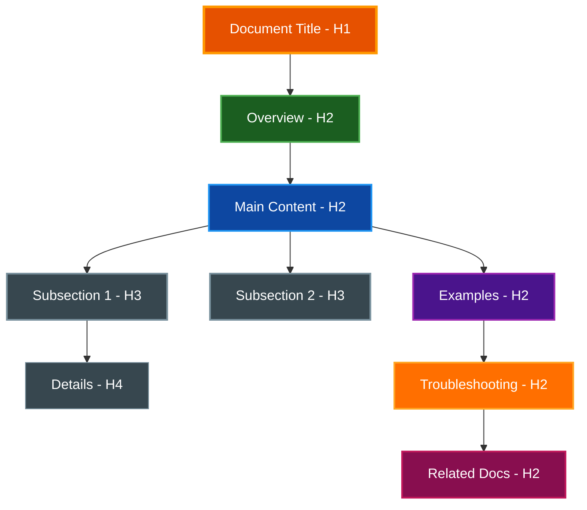
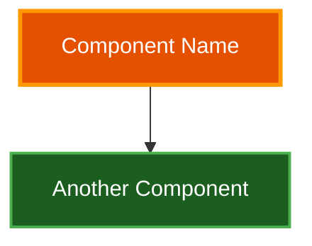
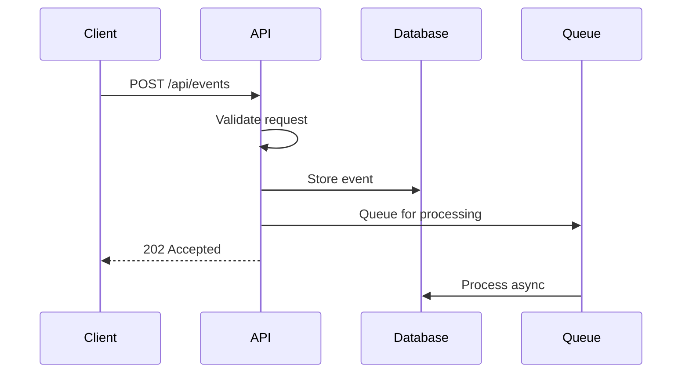
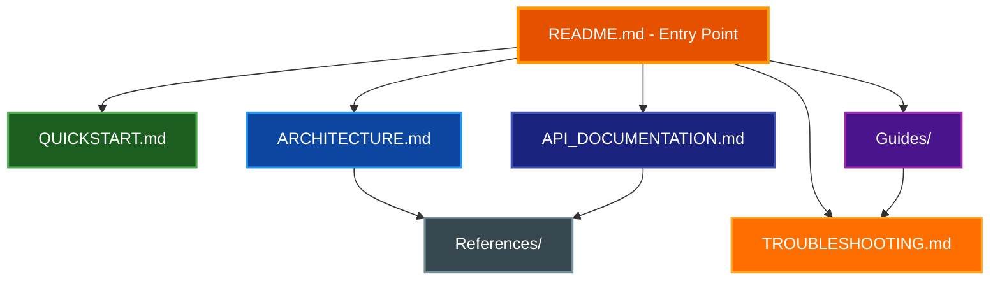
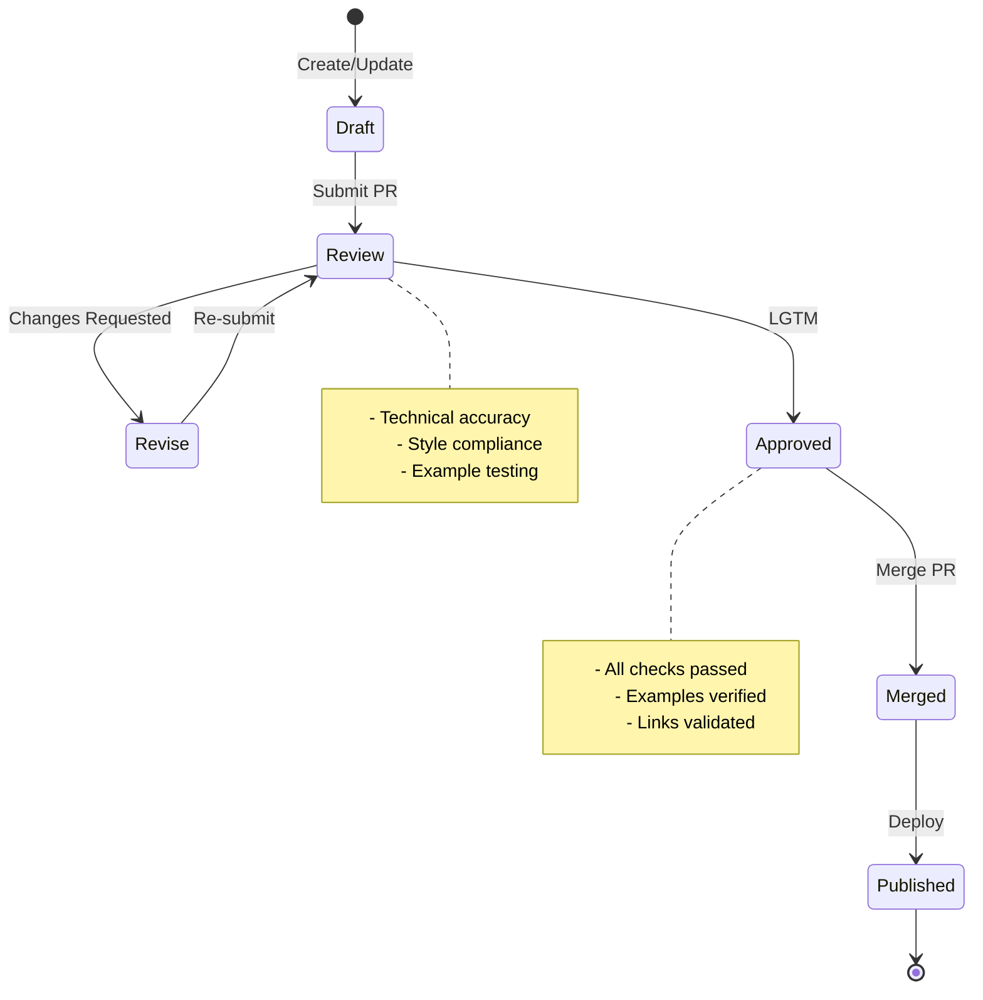
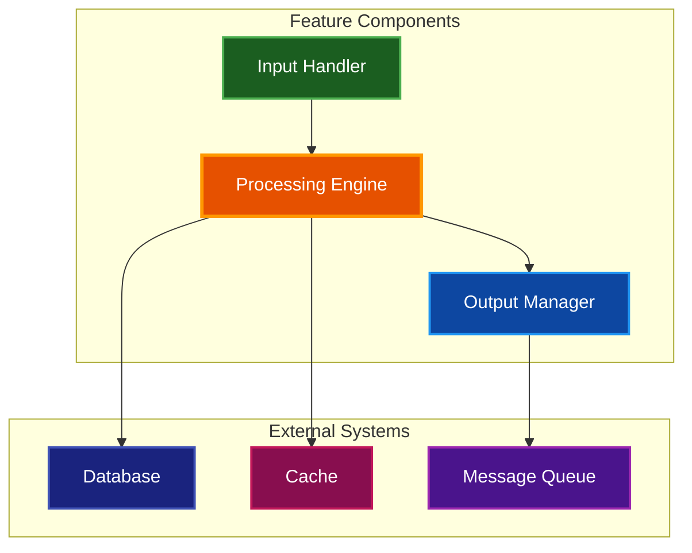

# Documentation Style Guide

This guide establishes standards and best practices for creating and maintaining documentation in the Par Terminal Emulator project. It ensures consistency, clarity, and professionalism across all technical documentation.

## Table of Contents
- [Quick Reference](#quick-reference)
- [Document Structure](#document-structure)
- [Writing Style](#writing-style)
- [Diagram Standards](#diagram-standards)
- [Color Scheme](#color-scheme)
- [Code Examples](#code-examples)
- [API Documentation](#api-documentation)
- [File Organization](#file-organization)
- [Maintenance](#maintenance)
- [Review Checklist](#review-checklist)

## Quick Reference

### Essential Rules
- **Never use ASCII art** - Always use Mermaid diagrams
- **Always include a TOC** for documents > 500 words
- **Use dark backgrounds** with white text in diagrams
- **Specify language** in all code blocks
- **Test all examples** before documenting
- **Update cross-references** when modifying content
- **Never use line numbers** in file references - They're brittle and hard to maintain

## Document Structure

### Required Elements

Every documentation file MUST include:

1. **Title (H1)**: Clear, descriptive title that immediately identifies the document's purpose
2. **Brief Description**: 1-2 sentence summary immediately after the title
3. **Table of Contents**: Required for documents > 500 words or > 3 main sections
4. **Overview Section**: Context and scope of the document
5. **Main Content**: Logical sections with proper hierarchy
6. **Related Documentation**: Links to relevant resources at the end

### Document Template

```markdown
# Document Title

Brief description of what this document covers and its intended audience.

## Table of Contents
- [Overview](#overview)
- [Prerequisites](#prerequisites)
- [Main Topic](#main-topic)
  - [Subtopic 1](#subtopic-1)
  - [Subtopic 2](#subtopic-2)
- [Examples](#examples)
- [Troubleshooting](#troubleshooting)
- [Related Documentation](#related-documentation)

## Overview

Detailed introduction providing context, scope, and objectives...

## Prerequisites

What the reader needs to know or have before proceeding...

[Main content sections...]

## Related Documentation

- [Relevant Doc 1](link1.md) - Brief description
- [Relevant Doc 2](link2.md) - Brief description
```

### Section Hierarchy

| Level | Usage | Markdown | Example |
|-------|-------|----------|---------|
| H1 | Document title only | `#` | `# API Documentation` |
| H2 | Main sections | `##` | `## Authentication` |
| H3 | Subsections | `###` | `### OAuth Flow` |
| H4 | Minor divisions | `####` | `#### Error Codes` |
| H5+ | Avoid if possible | `#####` | Use lists instead |

### Information Architecture Flow



## Diagram Standards

### Always Use Mermaid

**NEVER use ASCII art diagrams.** Always use Mermaid for:
- Architecture diagrams
- Flow charts
- Sequence diagrams
- State diagrams
- Entity relationship diagrams

### Mermaid Diagram Template

```markdown


## Color Scheme

### High-Contrast Colors for Dark Mode Compatibility

All diagrams MUST use dark backgrounds with white text (`color:#ffffff`) for maximum contrast and readability in both light and dark modes.

### Component Color Mapping

| Component Type | Fill Color | Stroke Color | Stroke Width | Text Color | Usage |
|---------------|------------|--------------|--------------|------------|--------|
| **Primary/Main** | `#e65100` | `#ff9800` | 3px | `#ffffff` | Main components, load balancers, orchestrators |
| **Active/Healthy** | `#1b5e20` | `#4caf50` | 2px | `#ffffff` | Active backends, healthy services |
| **Success State** | `#2e7d32` | `#66bb6a` | 2px | `#ffffff` | Successful operations, active components |
| **Failed/Unhealthy** | `#b71c1c` | `#f44336` | 2px | `#ffffff` | Failed components, error states |
| **Error/Alert** | `#d32f2f` | `#ef5350` | 2px | `#ffffff` | Errors, crashed services |
| **Data Storage** | `#0d47a1` | `#2196f3` | 2px | `#ffffff` | Redis, cache layers |
| **Database** | `#1a237e` | `#3f51b5` | 2px | `#ffffff` | PostgreSQL, persistent storage |
| **Client/External** | `#4a148c` | `#9c27b0` | 2px | `#ffffff` | CLI, TUI, API clients |
| **Special/Events** | `#880e4f` | `#c2185b` | 2px | `#ffffff` | WebSocket, special protocols |
| **Neutral/Info** | `#37474f` | `#78909c` | 2px | `#ffffff` | Stopped services, info boxes |
| **Warning** | `#ff6f00` | `#ffa726` | 2px | `#ffffff` | Decision points, warnings |

### Example Color Application


## Writing Style

### Core Principles

| Principle | Do | Don't |
|-----------|-----|-------|
| **Clarity** | "Click the Submit button" | "The submission interface should be utilized" |
| **Conciseness** | "Install dependencies: `npm install`" | "To install the required dependencies, run the npm install command" |
| **Active Voice** | "The API returns JSON data" | "JSON data is returned by the API" |
| **Specificity** | "Set timeout to 30 seconds" | "Set an appropriate timeout value" |
| **Consistency** | Use the same terms throughout | Mix "endpoint", "route", and "path" |

### Voice and Tone

- **Professional but approachable**: Technical accuracy without unnecessary jargon
- **Direct and actionable**: Focus on what the reader needs to do
- **Inclusive language**: Use "you" for instructions, avoid assumptions about expertise
- **Present tense**: Describe current behavior ("The system uses..." not "The system will use...")

### Formatting Standards

| Element | Format | Example | Usage |
|---------|--------|---------|-------|
| **Bold** | `**text**` | **Important:** | Key concepts, warnings, emphasis |
| *Italics* | `*text*` | *Note:* | Subtle emphasis, first use of terms |
| `Code` | `` `text` `` | `npm run dev` | Commands, file names, variables |
| ~~Strike~~ | `~~text~~` | ~~Deprecated~~ | Outdated information |
| > Quote | `> text` | > Best practice | Callouts, tips, notes |

### Text Elements

#### Commands and Code
- File paths: `/Users/bob/Repos/my-project/`
- Commands: `docker-compose up -d`
- Functions: `processEvent()`
- Classes: `WebSocketProvider`
- Variables: `DASHBOARD_SERVER_URL`
- Ports: `port 8080`

#### File References

**IMPORTANT**: When referencing files in documentation, **DO NOT include line numbers**. Line numbers are brittle and difficult to maintain as code changes.

**Good examples:**
- "The `Terminal` class in `src/terminal.rs`"
- "See the implementation in `src/python_bindings/terminal.rs`"
- "The `export_text()` method in `Terminal`"

**Bad examples:**
- ❌ "See `src/terminal.rs:816`" - line numbers change with code edits
- ❌ "Located at `/Users/probello/Repos/par-term-emu-core-rust/Cargo.toml:3`" - overly specific and fragile
- ❌ "The fix is in `terminal.rs` lines 100-150" - ranges become outdated quickly

**Exception**: Line numbers may be included in:
- Temporary debugging notes (marked clearly as temporary)
- Issue reports with specific commit SHA references
- Code review comments (ephemeral by nature)

#### Callout Boxes

Use blockquotes with emoji indicators for different types of information:

> **📝 Note:** Additional context or information

> **⚠️ Warning:** Important caution about potential issues

> **✅ Tip:** Helpful suggestion or best practice

> **🚫 Deprecated:** Feature or method no longer recommended

> **🔒 Security:** Security-related information

### Lists and Sequences

#### Unordered Lists (Features, Options)
- Use for non-sequential items
- Keep items parallel in structure
- Start with capital letters
- End without punctuation (unless full sentences)

#### Ordered Lists (Instructions, Steps)
1. Use for sequential procedures
2. Write as complete sentences
3. Include expected outcomes where helpful
4. Number all steps (don't mix with bullets)

#### Nested Lists
- Main item
  - Sub-item with 2-space indent
    - Further nesting with 4-space indent
  - Another sub-item
- Next main item

### Acronyms and Terminology

| First Use | Subsequent Uses |
|-----------|-----------------|
| Application Programming Interface (API) | API |
| WebSocket (WS) | WS or WebSocket |
| Personally Identifiable Information (PII) | PII |
| Real-Time (RT) | RT or real-time |

### Writing Patterns

#### Describing Features
```markdown
## Feature Name

**Purpose:** One-line description of what it does

**When to use:** Specific scenarios where this feature applies

**How it works:**
1. Step-by-step explanation
2. Of the feature's operation
3. With clear outcomes

**Example:** Practical demonstration
```

#### Documenting Procedures
```markdown
### How to [Task Name]

**Prerequisites:**
- Required software installed
- Necessary permissions
- Configuration completed

**Steps:**
1. **Start the service**
   ```bash
   command to execute
   ```
   Expected output or result

2. **Configure settings**
   Description of what to configure and why

3. **Verify operation**
   How to confirm success
```

## Code Examples

### Code Block Guidelines

#### Language Specification
Always specify the language for proper syntax highlighting:

````markdown
```python
# Python with type hints
async def process_event(event: dict[str, Any]) -> EventResponse:
    """Process incoming event and return response."""
    return EventResponse(status="success", data=event)
```

```typescript
// TypeScript with interfaces
interface EventData {
  id: string;
  timestamp: Date;
  payload: Record<string, unknown>;
}
```

```bash
#!/bin/bash
# Shell script with error handling
set -euo pipefail
docker-compose up -d || exit 1
```

#### Code Annotations

Use comments to explain complex logic:

```python
# Good: Explains why, not what
cache_ttl = 300  # 5 minutes - balances freshness with API rate limits

# Avoid: Obvious comments
x = x + 1  # Increment x
```

### Command-Line Examples

#### Basic Format
```bash
# Description of what the command does
$ command --with-options

# Expected output (if relevant)
Output line 1
Output line 2
```

#### Interactive Sessions
```bash
# Start interactive session
$ python
>>> import sys
>>> sys.version
'3.12.0 (main, Oct  2 2024, 00:00:00) [GCC 11.2.0]'
>>> exit()

# Return to shell
$
```

#### Multi-Step Procedures
```bash
# Step 1: Clone the repository
$ git clone https://github.com/user/repo.git
Cloning into 'repo'...

# Step 2: Install dependencies
$ cd repo
$ npm install
added 150 packages in 3.5s

# Step 3: Run tests
$ npm test
✓ All tests passed (42 passing)
```

### Configuration Examples

#### YAML with Comments
```yaml
# Service configuration
services:
  dashboard:
    image: dashboard:latest
    ports:
      - "8080:8080"  # External:Internal port mapping
    environment:
      DEBUG: "false"  # Set to "true" for verbose logging
      DATABASE_URL: ${DATABASE_URL}  # From .env file
    volumes:
      - ./data:/app/data:rw  # Persistent storage
```

#### JSON with Schema
```json
{
  "$schema": "https://example.com/schema/v1",
  "name": "example-config",
  "version": "1.0.0",
  "settings": {
    "timeout": 30,
    "retries": 3
  }
}
```

### Error Examples

Always show both error cases and solutions:

```python
# Common error
try:
    result = risky_operation()
except SpecificError as e:
    # Bad: Silent failure
    pass

# Better approach
try:
    result = risky_operation()
except SpecificError as e:
    logger.error(f"Operation failed: {e}")
    # Provide fallback or re-raise with context
    raise OperationError(f"Could not complete task: {e}") from e
```

## API Documentation

### Endpoint Documentation Template

```markdown
### Endpoint Name

**Purpose:** Brief description of what the endpoint does

**Method:** `GET` | `POST` | `PUT` | `DELETE` | `PATCH`

**Path:** `/api/v1/resource/{id}`

**Authentication:** Required | Optional | None

#### Request

**Headers:**
| Header | Required | Description |
|--------|----------|-------------|
| Authorization | Yes | Bearer token |
| Content-Type | Yes | application/json |

**Path Parameters:**
| Parameter | Type | Required | Description |
|-----------|------|----------|-------------|
| id | string | Yes | Resource identifier |

**Query Parameters:**
| Parameter | Type | Default | Description |
|-----------|------|---------|-------------|
| limit | integer | 10 | Maximum results |
| offset | integer | 0 | Pagination offset |

**Request Body:**
```json
{
  "field1": "value",
  "field2": 123
}
```

#### Response

**Success Response (200 OK):**
```json
{
  "status": "success",
  "data": {
    "id": "abc123",
    "field1": "value"
  }
}
```

**Error Response (400 Bad Request):**
```json
{
  "status": "error",
  "message": "Invalid input",
  "errors": [
    {
      "field": "field1",
      "message": "Field is required"
    }
  ]
}
```

#### Examples

**cURL:**
```bash
curl -X POST https://api.example.com/v1/resource \
  -H "Authorization: Bearer token123" \
  -H "Content-Type: application/json" \
  -d '{"field1": "value"}'
```

**Python:**
```python
import requests

response = requests.post(
    "https://api.example.com/v1/resource",
    headers={"Authorization": "Bearer token123"},
    json={"field1": "value"}
)
```

### API Flow Diagrams



## File Organization

### Directory Structure

```
docs/
├── README.md                    # Documentation index
├── DOCUMENTATION_STYLE_GUIDE.md # This guide
├── architecture/                # System design documents
│   ├── SYSTEM_OVERVIEW.md
│   ├── DATABASE_SCHEMA.md
│   └── API_ARCHITECTURE.md
├── guides/                      # How-to and tutorials
│   ├── QUICKSTART.md
│   ├── DEPLOYMENT_GUIDE.md
│   └── TROUBLESHOOTING.md
├── api/                        # API documentation
│   ├── REST_API.md
│   ├── WEBSOCKET_API.md
│   └── examples/
└── diagrams/                   # Standalone diagram sources
    └── system-flow.mmd
```

### File Naming Conventions

File name should be uppercase with lowercase extension.

| Type | Pattern | Example | Description |
|------|---------|---------|-------------|
| **Guides** | `*_GUIDE.md` | `DEPLOYMENT_GUIDE.md` | Step-by-step instructions |
| **Architecture** | `*_ARCHITECTURE.md` | `SYSTEM_ARCHITECTURE.md` | Design documents |
| **API Docs** | `*_API.md` | `REST_API.md` | API references |
| **Reference** | `*_REFERENCE.md` | `CONFIG_REFERENCE.md` | Configuration/settings |
| **Troubleshooting** | `TROUBLESHOOTING_*.md` | `TROUBLESHOOTING_DOCKER.md` | Problem-solving |

### Standard Files

#### Root Level Documentation
- `README.md` - Project overview and entry point
- `CHANGELOG.md` - Version history and releases
- `CONTRIBUTING.md` - Contribution guidelines
- `LICENSE.md` - License information
- `SECURITY.md` - Security policies and reporting

#### Project-Specific
- `CLAUDE.md` - AI assistant instructions (if using Claude)
- `QUICKSTART.md` - Getting started quickly
- `ARCHITECTURE.md` - High-level system design
- `API_DOCUMENTATION.md` - Complete API reference
- `TROUBLESHOOTING.md` - Common issues and solutions

### Documentation Hierarchy



## Maintenance

### Documentation Lifecycle


### Version Management

#### Version Annotations
```markdown
<!-- Added in v1.0.0 -->
**New Feature:** WebSocket auto-reconnection

<!-- Changed in v1.2.0 -->
**Updated:** Connection timeout increased to 30s (was 10s)

<!-- Deprecated in v2.0.0 -->
> **⚠️ DEPRECATED:** Use `newMethod()` instead. Will be removed in v3.0.0.

<!-- Removed in v3.0.0 -->
~~Old feature documentation removed~~
```

#### Breaking Changes
```markdown
> **🚨 Breaking Change in v2.0.0**
>
> The API endpoint structure has changed:
> - Old: `/api/resource`
> - New: `/api/v2/resources`
>
> Migration guide: [See MIGRATION_V2.md](MIGRATION_V2.md)
```

### Cross-Reference Management

#### Update Checklist
When modifying documentation:

1. **Identify Dependencies**
   - List all documents that reference the current one
   - Note sections that might be affected

2. **Update Links**
   - Fix broken internal links
   - Update anchor links if headings changed
   - Verify external links still work

3. **Synchronize Examples**
   - Ensure code examples match current implementation
   - Update configuration samples
   - Test command-line examples

4. **Version Consistency**
   - Update version numbers where referenced
   - Add changelog entries
   - Mark deprecated features

### Documentation Testing

#### Automated Checks
- Link validation (internal and external)
- Markdown linting (proper syntax)
- Code block syntax validation
- Mermaid diagram rendering

#### Manual Verification
- Technical accuracy review
- Example functionality testing
- Screenshot currency (if applicable)
- Flow diagram accuracy

## Review Checklist

### Pre-Commit Checklist

#### Structure & Format
- [ ] **Title**: Clear, descriptive H1 heading
- [ ] **Description**: Brief summary after title
- [ ] **TOC**: Present for documents > 500 words
- [ ] **Sections**: Logical hierarchy (H2 → H3 → H4)
- [ ] **Headings**: Descriptive and action-oriented

#### Content Quality
- [ ] **Clarity**: Simple, direct language
- [ ] **Completeness**: All necessary information included
- [ ] **Accuracy**: Technical details verified
- [ ] **Consistency**: Terminology matches project standards
- [ ] **Examples**: Practical and tested

#### Visual Elements
- [ ] **Diagrams**: Mermaid (not ASCII art)
- [ ] **Colors**: High contrast with white text
- [ ] **Tables**: Properly formatted with headers
- [ ] **Images**: Alt text provided (if any)
- [ ] **Code blocks**: Language specified

#### Code & Commands
- [ ] **Syntax**: Proper highlighting language set
- [ ] **Testing**: All examples executed successfully
- [ ] **Output**: Expected results documented
- [ ] **Errors**: Common errors and solutions included
- [ ] **Versions**: Compatible with current project version

#### Links & References
- [ ] **Internal links**: All working and accurate
- [ ] **External links**: Verified and accessible
- [ ] **Cross-references**: Updated in related docs
- [ ] **Related docs**: Section included at end
- [ ] **API refs**: Match current implementation

#### Metadata & Maintenance
- [ ] **File name**: Follows naming conventions
- [ ] **Location**: In appropriate directory
- [ ] **Version info**: Included where relevant
- [ ] **Deprecations**: Clearly marked
- [ ] **Changelog**: Entry added (if applicable)

### Review Process



### Quality Metrics

| Metric | Target | Measurement |
|--------|--------|-------------|
| **Readability** | Grade 8-10 | Flesch-Kincaid score |
| **Completeness** | 100% | All sections populated |
| **Accuracy** | 100% | Technical review passed |
| **Link Health** | 100% | No broken links |
| **Example Success** | 100% | All examples run |
| **Update Frequency** | < 6 months | Last modification date |

## Example Templates

### Complete Feature Documentation

```markdown
# Feature Name

One-line description of the feature's purpose and value.

## Table of Contents
- [Overview](#overview)
- [Architecture](#architecture)
- [Installation](#installation)
- [Configuration](#configuration)
- [Usage](#usage)
- [API Reference](#api-reference)
- [Troubleshooting](#troubleshooting)
- [Performance](#performance)
- [Security](#security)
- [Related Documentation](#related-documentation)

## Overview

**Purpose:** What problem does this solve?

**Key Features:**
- Feature 1: Brief description
- Feature 2: Brief description
- Feature 3: Brief description

**Requirements:**
- System requirement 1
- System requirement 2

## Architecture

### System Design



### Data Flow

Description of how data moves through the system...

## Installation

### Prerequisites

```bash
# Check required versions
$ node --version
v20.17.0
$ npm --version
10.0.0
```

### Setup Steps

1. **Install dependencies**
   ```bash
   npm install feature-package
   ```

2. **Configure environment**
   ```bash
   cp .env.example .env
   # Edit .env with your settings
   ```

3. **Initialize feature**
   ```bash
   npm run feature:init
   ```

## Configuration

### Basic Configuration

```yaml
feature:
  enabled: true
  mode: production
  options:
    timeout: 30
    retries: 3
```

### Advanced Options

| Option | Type | Default | Description |
|--------|------|---------|-------------|
| `cache.enabled` | boolean | true | Enable caching |
| `cache.ttl` | integer | 3600 | Cache TTL in seconds |
| `log.level` | string | "info" | Logging level |

## Usage

### Basic Example

```javascript
import { Feature } from 'feature-package';

const feature = new Feature({
  apiKey: 'your-api-key'
});

const result = await feature.process(data);
```

### Advanced Usage

```javascript
// With error handling and options
try {
  const result = await feature.process(data, {
    timeout: 5000,
    retryOnFailure: true
  });
  console.log('Success:', result);
} catch (error) {
  console.error('Failed:', error.message);
}
```

## API Reference

See [API_DOCUMENTATION.md](API_DOCUMENTATION.md) for complete reference.

## Troubleshooting

### Common Issues

#### Issue: Connection timeout
**Symptom:** Error: ETIMEDOUT
**Solution:** Increase timeout in configuration
```yaml
feature:
  options:
    timeout: 60  # Increase from default 30
```

#### Issue: Authentication failed
**Symptom:** 401 Unauthorized
**Solution:** Verify API key is correct and has required permissions

## Performance

### Benchmarks

| Operation | Average Time | Throughput |
|-----------|--------------|------------|
| Process small | 50ms | 20 req/s |
| Process large | 200ms | 5 req/s |
| Batch process | 1000ms | 100 items/s |

### Optimization Tips

- Enable caching for repeated queries
- Use batch operations for multiple items
- Implement connection pooling

## Security

### Best Practices

- Store sensitive configuration in environment variables
- Rotate API keys regularly
- Enable rate limiting
- Use HTTPS for all connections

### Security Headers

```javascript
app.use(helmet({
  contentSecurityPolicy: {
    directives: {
      defaultSrc: ["'self'"],
      styleSrc: ["'self'", "'unsafe-inline'"]
    }
  }
}));
```

## Related Documentation

- [System Architecture](ARCHITECTURE.md) - Overall system design
- [API Documentation](API_DOCUMENTATION.md) - Complete API reference
- [Deployment Guide](DEPLOYMENT_GUIDE.md) - Production deployment
- [Troubleshooting Guide](TROUBLESHOOTING.md) - Extended troubleshooting

## Summary

This style guide ensures consistency and quality across all project documentation. Following these guidelines will result in documentation that is:

- **Clear and concise** - Easy to understand and navigate
- **Visually enhanced** - Effective use of diagrams and formatting
- **Technically accurate** - Verified examples and information
- **Well-maintained** - Regular updates and cross-reference management
- **Professional** - Consistent style and presentation

Remember: Good documentation is an investment in your project's success and your team's productivity.
