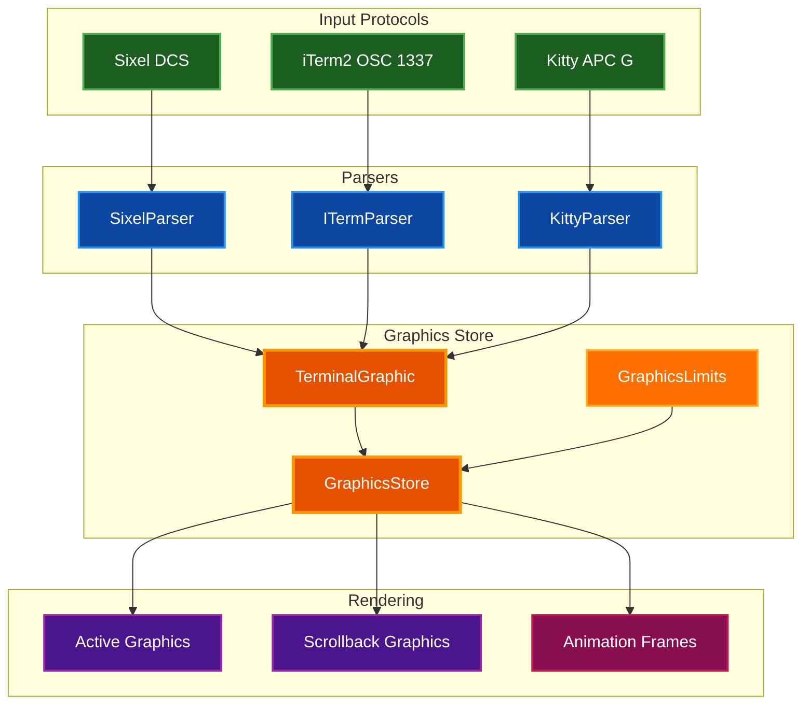

# Graphics Testing Guide

Quick reference for testing graphics support in par-term-emu-core-rust.

## Table of Contents
- [Overview](#overview)
- [Supported Protocols](#supported-protocols)
- [Quick Tests](#quick-tests)
- [Graphics in Scrollback](#graphics-in-scrollback)
- [Debug Logging](#debug-logging)
- [Python TUI Testing](#python-tui-testing)
- [Common Issues](#common-issues)
- [Python API Reference](#python-api-reference)
- [Performance Testing](#performance-testing)
- [Architecture Documentation](#architecture-documentation)
- [Test Images](#test-images)
- [Example Scripts](#example-scripts)
- [Tools](#tools)
- [Next Steps](#next-steps)
- [Contributing](#contributing)

## Overview

This library implements comprehensive multi-protocol graphics support with unified storage and scrollback handling. All graphics are normalized to RGBA pixel data and managed through the `GraphicsStore` with configurable memory limits and resource tracking.

### Graphics Architecture



## Supported Protocols

| Protocol | Status | Format | Test Script |
|----------|--------|--------|-------------|
| Sixel | ✅ Complete | DCS | `examples/test_sixel_simple.py`, `examples/display_image_sixel.py` |
| iTerm2 Inline | ✅ Complete | OSC 1337 | Multipart and single-sequence transfers |
| Kitty Graphics | ✅ Complete | APC G | Virtual placements with Unicode placeholders |
| Kitty Animation | ✅ Complete | APC G | `scripts/test_kitty_animation.py` |

**Protocol Implementation Details:**
- **Sixel**: DEC VT340 compatible bitmap graphics with color palette support
- **iTerm2**: OSC 1337 inline images supporting PNG, JPEG, GIF with base64 encoding
- **Kitty**: APC-based protocol with image ID reuse, virtual placements, and frame composition

## Quick Tests

### Sixel Graphics

```bash
# In par-term terminal
echo -e '\x1bPq"1;1;100;100#0;2;0;0;0#1;2;100;0;0#1!100~-\x1b\\'
```

### iTerm2 Inline Images

iTerm2 inline images are supported through OSC 1337 sequences. The library handles both single-sequence and multi-part transfers automatically.

```bash
# Example single-sequence transfer (base64 encode your image first)
echo -e '\x1b]1337;File=inline=1;size=1234:BASE64_DATA_HERE\x07'

# For actual testing, use a tool like imgcat if available
# Note: imgcat is part of iTerm2's shell integration utilities
```

### Kitty Graphics (Static Image)

```python
# Simple test with Python
import base64
from PIL import Image
import io

# Create a test image
img = Image.new('RGB', (100, 100), (255, 0, 0))
buf = io.BytesIO()
img.save(buf, format='PNG')
data = base64.standard_b64encode(buf.getvalue()).decode()

# Send to terminal
print(f'\x1b_Ga=T,f=100,t=d;{data}\x1b\\')
```

### Kitty Graphics Animation

```bash
# Run the animation test script
python scripts/test_kitty_animation.py

# The script demonstrates:
# - Multi-frame animation loading
# - Frame timing and composition
# - Animation control (play/pause/loop)
```

See detailed guide: [TESTING_KITTY_ANIMATIONS.md](TESTING_KITTY_ANIMATIONS.md)

## Graphics in Scrollback

All graphics protocols support scrollback:

```bash
# Display a graphic
echo -e '\x1bPq"1;1;100;100#0;2;0;0;0#1;2;100;0;0#1!100~-\x1b\\'

# Scroll it off screen
for i in {1..50}; do echo "line $i"; done

# Scroll back up to see it
# Use mouse wheel or Shift+PageUp
```

## Debug Logging

Enable debug output to track graphics processing:

```bash
# Set debug level (0-5, where 4=Debug, 5=Trace)
export DEBUG_LEVEL=4

# Debug log location
tail -f /tmp/par_term_emu_core_rust_debug_rust.log | grep -i "GRAPHICS\|KITTY"
```

**Debug Categories:**
- `GRAPHICS` - General graphics operations and scrolling
- `KITTY` - Kitty graphics protocol parsing and animation control
- `KITTY_PLACEHOLDER` - Unicode placeholder insertion for virtual placements

## Python TUI Testing

For the Python TUI (par-term-emu-tui-rust):

```bash
cd /Users/probello/Repos/par-term-emu-tui-rust
uv run par-term-emu-tui-rust

# Graphics render as half-block characters in TUI mode
```

## Common Issues

### Graphics not appearing

1. **Check protocol support**: Verify the terminal reports correct features
2. **Check image size**: Ensure within limits (default: 10000x10000, 25MP max)
3. **Check debug logs**: Look for parsing errors or resource limit rejections
4. **Verify cell dimensions**: Graphics renderer needs correct cell size

### Scrollback graphics rendering issues

1. **Check scroll offset calculation**: Graphics should track `scroll_offset_rows`
2. **Verify scrollback_row assignment**: Graphics moved to scrollback need proper row index
3. **Check texture clipping**: Partially visible graphics should clip correctly

### Animation not playing

**Frontend integration complete** - Animations are fully supported in both backend and frontend:

1. **Backend (Complete)**:
   - `update_animations()` is called periodically in par-term's render loop
   - Animation frames advance based on timing
   - State control (play/pause/stop/loop) is implemented

2. **Frontend (Complete)**:
   - Static graphics display correctly
   - Animation frame rendering is working
   - Graphics query methods properly integrated in par-term frontend

If animations aren't playing, check:
- Animation control sequences were sent correctly (action 'a', 'f', 's', etc.)
- Frame delays are appropriate (gap parameter)
- Debug logs show frame updates

See: [TESTING_KITTY_ANIMATIONS.md](TESTING_KITTY_ANIMATIONS.md) for detailed testing guide

## Python API Reference

The terminal provides the following graphics-related methods:

### Graphics Query Methods

```python
from par_term_emu_core_rust import Terminal

term = Terminal(80, 24)

# Get total graphics count
count = term.graphics_count()  # Returns: int

# Get graphics at specific row
graphics_list = term.graphics_at_row(row)  # Returns: list[PyGraphic]

# Get all graphics
all_graphics = term.graphics()  # Returns: list[PyGraphic]

# Clear all graphics
term.clear_graphics()
```

### Animation Control

```python
# Update animations and get changed image IDs
changed_ids = term.update_animations()  # Returns: list[u32]
# Call this regularly (e.g., 60Hz) to advance animation frames
```

### PyGraphic Object

Graphics returned from query methods have the following properties:
- `position` - Tuple `(col, row)` of top-left corner in grid coordinates
- `width` - Width in pixels
- `height` - Height in pixels
- `protocol` - Protocol identifier (string: "sixel", "iterm", "kitty")
- `id` - Unique placement ID (u64)
- `scroll_offset_rows` - Number of rows scrolled from original position
- `cell_dimensions` - Optional tuple `(cell_width, cell_height)` in pixels

**Methods:**
- `get_pixel(x, y)` - Get RGBA color at coordinates, returns `(r, g, b, a)` tuple or `None` if out of bounds

## Performance Testing

```bash
# Send many graphics quickly
for i in {1..100}; do
    echo -e '\x1bPq"1;1;50;50#0;2;0;0;0#1;2;100;0;0#1!50~-\x1b\\'
done

# Check memory usage
ps aux | grep par-term

# Check graphics count using Python bindings
python3 << 'EOF'
from par_term_emu_core_rust import Terminal

term = Terminal(80, 24)

# Send some test graphics
for i in range(10):
    term.process_str('\x1bPq"1;1;50;50#0;2;0;0;0#1;2;100;0;0#1!50~-\x1b\\')

print(f'Active graphics: {term.graphics_count()}')
print(f'Graphics at row 0: {len(term.graphics_at_row(0))}')
EOF
```

**Graphics Limits** (configurable via `GraphicsLimits`):
- Max width: 10,000 pixels
- Max height: 10,000 pixels
- Max pixels per image: 25,000,000 (25MP)
- Max total memory: 256MB
- Max graphics count: 1,000
- Max scrollback graphics: 500

## Architecture Documentation

For implementation details, see:

**Graphics Module:**
- `src/graphics/mod.rs` - Unified graphics module with `TerminalGraphic` and `GraphicsStore`
- `src/graphics/iterm.rs` - iTerm2 inline image parser
- `src/graphics/kitty.rs` - Kitty graphics protocol parser
- `src/graphics/animation.rs` - Animation frame management and composition
- `src/graphics/placeholder.rs` - Unicode placeholder generation for Kitty virtual placements

**Sixel Support:**
- `src/sixel.rs` - Sixel parser implementation
- `src/terminal/sequences/dcs.rs` - DCS (Device Control String) sequence handling

**Terminal Integration:**
- `src/terminal/graphics.rs` - Graphics storage, scrolling, and position management

**Documentation:**
- [Testing Kitty Animations](TESTING_KITTY_ANIMATIONS.md) - Animation-specific testing guide
- [Security Considerations](SECURITY.md) - Resource limits and memory management

## Test Images

Test images are available in the repository:

```
images/
├── snake.png         # Snake game screenshot (274KB)
├── snake.sixel       # Snake as Sixel (265KB)
├── snake_tui.png     # Snake TUI version (5KB)
└── snake_tui.sixel   # Snake TUI as Sixel (9KB)
```

**Note**: Currently, test images are primarily snake game screenshots. Additional test images (basic colors, patterns, etc.) can be added for comprehensive protocol testing.

## Example Scripts

The repository includes several example scripts for testing graphics functionality:

**Sixel Graphics:**
- `examples/test_sixel_simple.py` - Basic Sixel parsing test with red square
- `examples/display_image_sixel.py` - Convert and display images as Sixel
- `examples/test_sixel_display.py` - Sixel display demonstration

**Kitty Graphics:**
- `scripts/test_kitty_animation.py` - Multi-frame animation test

**General:**
All example scripts are located in the `examples/` directory and can be run with:
```bash
python examples/<script_name>.py
```

## Tools

### External Image Display Tools

**imgcat (iTerm2)**
```bash
# Part of iTerm2 shell integration
# Sends images using OSC 1337 protocol
imgcat image.png
```

**kitty icat (Kitty terminal)**
```bash
# Requires Kitty terminal
# Uses Kitty graphics protocol
kitty +kitten icat image.png
```

**Note**: These tools send graphics using their respective protocols. The library implements the protocol handlers, so images sent by these tools will be parsed and stored correctly.

## Next Steps

1. ✅ **Sixel, iTerm2, Kitty** - All protocols working
2. ✅ **Scrollback persistence** - Graphics saved in scrollback
3. ✅ **Animation playback** - Fully integrated in backend and frontend
4. ✅ **Unicode placeholders** - Virtual placements insert placeholder characters into grid
5. ⏳ **Performance optimization** - Consider texture caching, frame pooling for large animations

## Contributing

When adding graphics tests:
1. Add test script to `examples/` or `scripts/` directory
2. Document protocol specifics and expected behavior
3. Include expected output and verification steps
4. Test with multiple frontends if available
5. Update this documentation with new test cases
6. Add entries to the table of contents if adding new sections

**Testing Checklist:**
- Verify graphics are stored correctly (`graphics_count()`)
- Check position and dimensions (`graphics_at_row()`)
- Test scrollback persistence (scroll graphics off screen)
- Verify memory limits are enforced
- Test with various image sizes and formats
