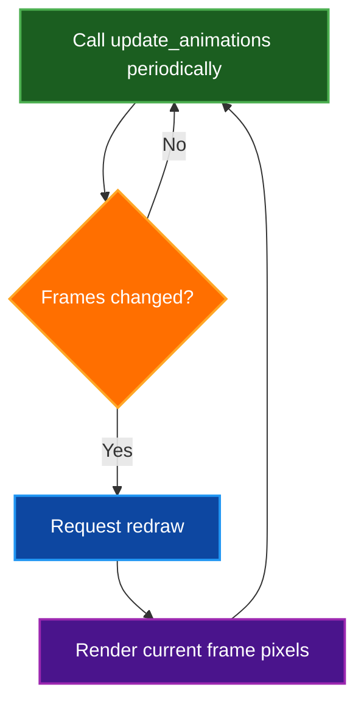
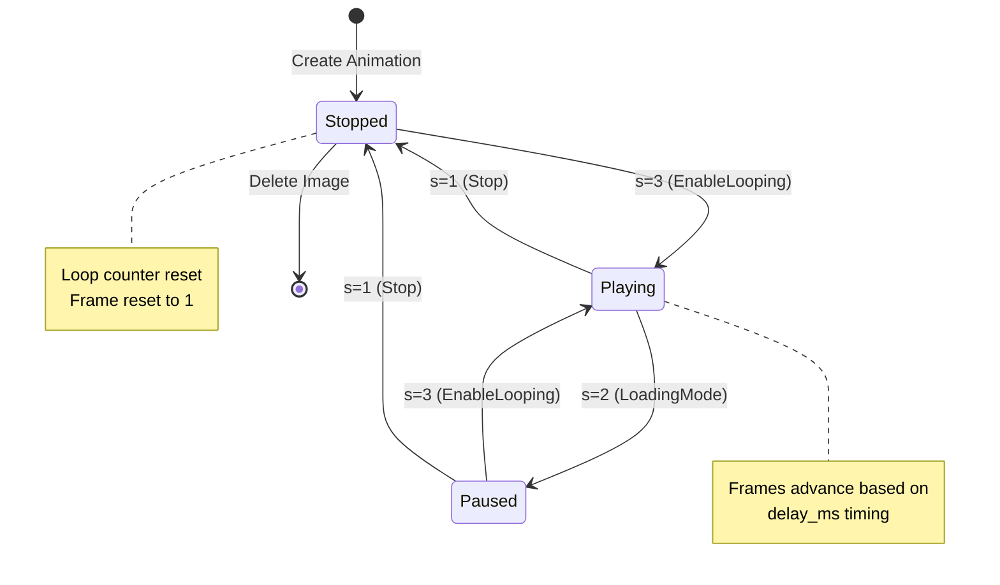

# Testing Kitty Graphics Animations

This guide explains how to test Kitty graphics protocol animation support in `par-term-emu-core-rust`.

## Table of Contents
- [Current Status](#current-status)
- [Prerequisites](#prerequisites)
- [Quick Test](#quick-test)
- [What the Test Does](#what-the-test-does)
- [Kitty Animation Protocol](#kitty-animation-protocol)
  - [Frame Transmission](#frame-transmission)
  - [Animation Control](#animation-control)
- [Backend Verification](#backend-verification)
- [Frontend Integration](#frontend-integration)
- [Manual Testing](#manual-testing)
- [Debugging](#debugging)
- [Related Documentation](#related-documentation)

## Current Status

| Component | Status | Notes |
|-----------|--------|-------|
| Backend Animation Storage | ✅ Complete | `src/graphics/animation.rs` |
| Backend Frame Management | ✅ Complete | Frames stored in `GraphicsStore.animations` |
| Backend Playback Control | ✅ Complete | Stop/LoadingMode/EnableLooping |
| Backend Loop Count | ✅ Complete | Supports v= parameter (0=ignored, 1=infinite, N=N-1 loops) |
| Frontend Rendering | 🔄 Pending | Needs integration in par-term |

## Prerequisites

Install Pillow for PNG generation:

```bash
# Install with uv (recommended):
uv add Pillow

# Or with pip (legacy):
pip install Pillow
```

## Quick Test

Run the test script to verify animation support:

```bash
# Run the test script
python scripts/test_kitty_animation.py

# Alternative: Run with uv
uv run scripts/test_kitty_animation.py
```

> **⚠️ Note:** To see animations actually render, you need a terminal emulator with full Kitty graphics protocol animation support, or test with the par-term frontend once animation rendering is integrated.

## What the Test Does

The test script creates two animations:

1. **Simple 2-frame animation**: Red ↔ Blue squares
   - Frame 1: Red (500ms delay)
   - Frame 2: Blue (500ms delay)
   - Demonstrates: Play, Pause, Resume, Stop

2. **Multi-frame color cycle**: Red → Yellow → Green → Blue
   - 4 frames, 400ms each
   - Demonstrates: Loop count (2 loops)

## Kitty Animation Protocol

### Frame Transmission

```
ESC _ G a=f,i=<id>,r=<frame>,z=<delay>[,c=<comp>],f=100,t=d ; <base64_png> ESC \
```

**Parameters:**
- `a=f` - Action: frame
- `i=<id>` - Image ID
- `r=<frame>` - Frame number (1-indexed)
- `z=<delay>` - Frame delay in milliseconds
- `c=<comp>` - Composition mode (optional):
  - `0` or unspecified: AlphaBlend (default)
  - `1`: Overwrite
- `f=100` - Format: PNG
- `t=d` - Transmission: direct (or `f` for file, `t` for temp file)

**Example:**
```python
# Send frame 1 of animation with image_id=42, 500ms delay
payload = f"a=f,i=42,r=1,z=500,f=100,t=d;{base64_png_data}"
print(f"\x1b_G{payload}\x1b\\", end="", flush=True)
```

### Animation Control

```
ESC _ G a=a,i=<id>,s=<state>[,v=<num_plays>] ESC \
```

**Parameters:**
- `a=a` - Action: animation control
- `i=<id>` - Image ID
- `s=<state>` - State control:
  - `1` = Stop animation and reset loop counter
  - `2` = Loading mode (pause, wait for more frames)
  - `3` = Enable looping (start/resume normal playback)
- `v=<num_plays>` - Number of times to play (optional):
  - `0` = Ignored (no change to loop count)
  - `1` = Infinite looping (loops forever)
  - `N` (N > 1) = Play animation N times total (e.g., `v=3` means play the complete animation 3 times: initial play + 2 additional loops)

**Examples:**
```python
# Set infinite loops
print("\x1b_Ga=a,i=42,v=1\x1b\\", end="", flush=True)

# Enable looping (start animation)
print("\x1b_Ga=a,i=42,s=3\x1b\\", end="", flush=True)

# Play animation 3 times total (v=3)
print("\x1b_Ga=a,i=42,v=3\x1b\\", end="", flush=True)

# Pause animation (loading mode)
print("\x1b_Ga=a,i=42,s=2\x1b\\", end="", flush=True)

# Stop animation completely
print("\x1b_Ga=a,i=42,s=1\x1b\\", end="", flush=True)
```

## Backend Verification

### Python API Access

The animation system is accessible via Python bindings:

```python
from par_term_emu_core_rust import Terminal, PtyTerminal

# Using Terminal directly
terminal = Terminal(80, 24)
changed_image_ids = terminal.update_animations()  # Returns list of image IDs with frame changes

# Using PtyTerminal (terminal with PTY support)
pty = PtyTerminal(80, 24)
pty.spawn("/bin/bash")
changed_image_ids = pty.update_animations()  # Updates animations for the PTY's terminal
```

### Debug Logging

Check debug logs for animation events:

```bash
# Enable debug logging
export DEBUG_LEVEL=4

# Run par-term (if testing with frontend)
cd ../par-term && cargo run

# In another terminal, monitor logs
tail -f /tmp/par_term_emu_core_rust_debug_rust.log
```

**Expected log entries:**
- Animation frame additions
- Animation control commands
- Frame timing updates (when `update_animations()` is called)
- Frame advancement messages with timing details

## Frontend Integration

The frontend ([par-term](https://github.com/probello/par-term)) needs the following integration to enable animation playback:

> **📝 Note:** This section describes the integration requirements for the par-term Rust frontend. The integration is not yet complete.

### Required Implementation Steps



### 1. Update Animations Periodically

Call `GraphicsStore::update_animations()` in the redraw loop:

```rust
// In par-term app.rs redraw loop
if let Some(terminal) = &self.terminal {
    let terminal = terminal.blocking_lock();
    let pty = terminal.pty_session.lock();
    let term_arc = pty.terminal();
    let mut term = term_arc.lock();

    // Update animations and get list of images with frame changes
    let changed_images = term.graphics_store_mut().update_animations();

    if !changed_images.is_empty() {
        // Request redraw when animation frames change
        if let Some(window) = &self.window {
            window.request_redraw();
        }
    }
}
```

### 2. Render Current Animation Frame

The `update_animations()` method automatically updates the pixel data in all placements, so no additional rendering logic is needed. The current implementation already handles this:

The `update_animations()` method in `GraphicsStore` automatically updates pixel data for all placements that reference an animated image. When a frame advances, the method:

1. Updates the animation's current frame based on timing
2. Clones the current frame's pixel data (Arc-wrapped for efficient sharing)
3. Updates all placements with `kitty_image_id` matching the animated image
4. Returns a list of image IDs that had frame changes

This automatic update means the frontend only needs to call `update_animations()` periodically and request a redraw when changes occur.

### 3. Animation State Flow



## Manual Testing

You can also test animations manually by sending escape sequences:

```bash
# Create a simple red PNG (requires Pillow)
python3 -c "
from PIL import Image
import io, base64
img = Image.new('RGB', (100, 100), (255, 0, 0))
buf = io.BytesIO()
img.save(buf, format='PNG')
print(base64.standard_b64encode(buf.getvalue()).decode())
" > /tmp/red.b64

# Send frame 1 (action='f' for frame, not 'T')
printf '\x1b_Ga=f,i=1,r=1,z=500,f=100,t=d;'
cat /tmp/red.b64
printf '\x1b\\'

# Create and send blue frame 2
python3 -c "
from PIL import Image
import io, base64
img = Image.new('RGB', (100, 100), (0, 0, 255))
buf = io.BytesIO()
img.save(buf, format='PNG')
print(base64.standard_b64encode(buf.getvalue()).decode())
" | (printf '\x1b_Ga=f,i=1,r=2,z=500,f=100,t=d;'; cat; printf '\x1b\\')

# Set infinite loops
printf '\x1b_Ga=a,i=1,v=1\x1b\\'

# Start animation (enable looping)
printf '\x1b_Ga=a,i=1,s=3\x1b\\'

# Wait a few seconds, then pause
sleep 3
printf '\x1b_Ga=a,i=1,s=2\x1b\\'

# Resume
sleep 2
printf '\x1b_Ga=a,i=1,s=3\x1b\\'

# Stop completely
sleep 3
printf '\x1b_Ga=a,i=1,s=1\x1b\\'
```

## Debugging

### Check Backend Logs

The implementation includes comprehensive debug logging. Enable debug output to see animation events:

```bash
# Enable debug logging
export DEBUG_LEVEL=4

# Run par-term (if testing with frontend)
cd ../par-term && cargo run

# In another terminal, monitor logs
tail -f /tmp/par_term_emu_core_rust_debug_rust.log
```

**Expected log output:**
```
KITTY: Parsed animation control: s=3 -> Some(EnableLooping)
ANIMATION: Adding frame 1 to image_id=42 (delay=500ms, size=100x100)
ANIMATION: Frame 1 added. Total frames in animation: 1
GRAPHICS: Added animation frame 1 to image_id=42 (total frames: 1)
ANIMATION: Applying control to image_id=42: EnableLooping (current state=Stopped, frame=1/1)
ANIMATION: After control: image_id=42 state=Playing, frame=1/1
ANIMATION: image_id=42 advanced frame 1 -> 2 (delay=500ms, elapsed=501ms)
```

### Common Issues

#### Issue: Animation not advancing frames
**Symptoms:** Frames loaded but animation stuck on first frame

**Check:**
1. Verify `update_animations()` is being called periodically (at least once per frame delay)
2. Check animation state is `Playing` (not `Stopped` or `Paused`)
   - State should show `Playing` after `s=3` (EnableLooping) command
3. Ensure frame delays are reasonable (> 0ms)
   - Default delay of 100ms is used if frame delay is not specified
4. Look for log messages showing frame advances with timing information

#### Issue: Animation frames not displaying
**Symptoms:** Backend logs show frames advancing but no visual change

**Check:**
1. Frontend needs to call `update_animations()` and request redraw
2. Verify the graphics rendering pipeline is using updated pixel data
3. Check that placements exist for the animated image_id

#### Issue: Wrong loop count behavior
**Symptoms:** Animation loops wrong number of times

**Check:**
- Remember: `v=0` is ignored, `v=1` is infinite, `v=N` (N > 1) means play N times total
- Example: `v=3` means play the complete animation 3 times (initial play + 2 additional loops)
- Internally: `loop_count` is set to `N-1`, and the animation stops after `N-1` complete loops (giving N total plays including the initial playthrough)
- Check logs for: `"Setting loop count for image_id=..."` messages

## Related Documentation

- [Kitty Graphics Protocol - Animation](https://sw.kovidgoyal.net/kitty/graphics-protocol/#animation) - Official Kitty animation specification
- [Architecture Documentation](ARCHITECTURE.md) - System architecture and component design
- [Graphics Testing Guide](GRAPHICS_TESTING.md) - General graphics protocol testing
- [VT Sequences Reference](VT_SEQUENCES.md) - All supported VT escape sequences

**Implementation Files:**
- [`src/graphics/animation.rs`](../src/graphics/animation.rs) - Animation frame storage and playback logic
- [`src/graphics/mod.rs`](../src/graphics/mod.rs) - Graphics store with `update_animations()` method
- [`src/graphics/kitty.rs`](../src/graphics/kitty.rs) - Kitty protocol parser with animation support
- [`scripts/test_kitty_animation.py`](../scripts/test_kitty_animation.py) - Automated animation test script
- [`src/python_bindings/terminal.rs`](../src/python_bindings/terminal.rs) - Python bindings for terminal animation updates
- [`src/python_bindings/pty.rs`](../src/python_bindings/pty.rs) - Python bindings for PTY animation updates

## Implementation Status

```mermaid
graph LR
    Storage[Animation Storage]
    Frames[Frame Management]
    Control[Playback Control]
    Loops[Loop Count]
    Timing[Frame Timing]
    Frontend[Frontend Integration]

    Storage --> Frames
    Frames --> Control
    Control --> Loops
    Loops --> Timing
    Timing --> Frontend

    style Storage fill:#1b5e20,stroke:#4caf50,stroke-width:2px,color:#ffffff
    style Frames fill:#1b5e20,stroke:#4caf50,stroke-width:2px,color:#ffffff
    style Control fill:#1b5e20,stroke:#4caf50,stroke-width:2px,color:#ffffff
    style Loops fill:#1b5e20,stroke:#4caf50,stroke-width:2px,color:#ffffff
    style Timing fill:#1b5e20,stroke:#4caf50,stroke-width:2px,color:#ffffff
    style Frontend fill:#ff6f00,stroke:#ffa726,stroke-width:2px,color:#ffffff
```



### Completed Features
- ✅ **Animation Storage** - Frames stored in `GraphicsStore.animations` with Arc-shared pixels
- ✅ **Frame Management** - Add, retrieve, and iterate frames with composition modes
- ✅ **Playback Control** - Stop (s=1), LoadingMode (s=2), EnableLooping (s=3)
- ✅ **Loop Count** - Supports v= parameter (0=ignored, 1=infinite, N=N-1 loops)
- ✅ **Frame Timing** - Automatic frame advancement based on delay_ms
- ✅ **Auto Placement Update** - `update_animations()` updates pixel data in all placements

### Pending Features
- 🔄 **Frontend Integration** - par-term needs to call `update_animations()` in render loop
- ⏳ **Frame Composition Testing** - Alpha blend (default) vs overwrite modes are parsed but need thorough validation
  - Composition modes are set via the `c=` parameter in frame transmission (when action is `a=f`)
  - `c=0` or unspecified: AlphaBlend (default) - blend frame with previous frame using alpha channel
  - `c=1`: Overwrite - completely replace previous frame pixels
- ⏳ **Performance Optimization** - Large animations (100+ frames) may benefit from additional caching
- ⏳ **Garbage Collection** - Strategy for cleaning up old animation data when images are deleted

### Known Limitations

1. **Frontend rendering**: Backend is complete, but par-term frontend needs integration
2. **Composition modes**: AlphaBlend and Overwrite modes are parsed but not fully tested
3. **Memory management**: No automatic cleanup of unused animations
4. **Performance**: Very large animations (100+ frames) may need optimization
