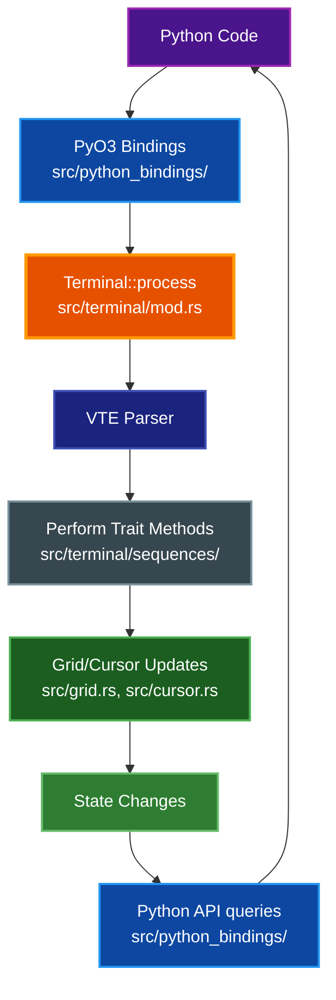
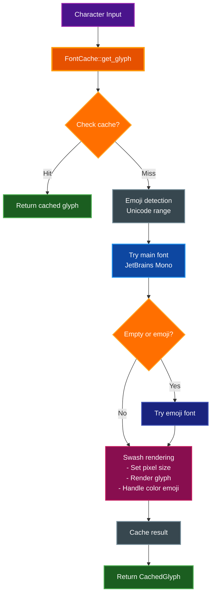
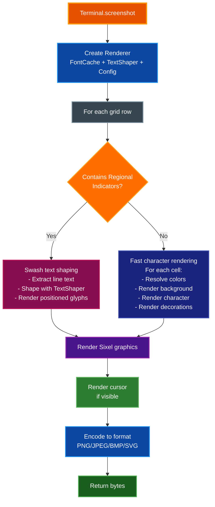
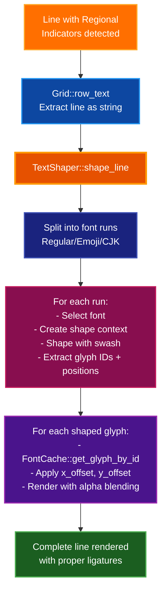
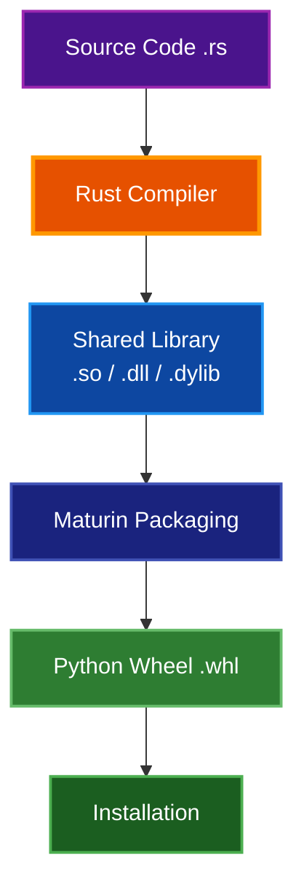

# Architecture Documentation

This document describes the internal architecture of par-term-emu-core-rust.

## Table of Contents

- [Overview](#overview)
- [Core Components](#core-components)
  - [1. Color](#1-color)
  - [2. Cell](#2-cell)
  - [3. Cursor](#3-cursor)
  - [4. Grid](#4-grid)
  - [5. Terminal](#5-terminal)
  - [6. Supporting Modules](#6-supporting-modules)
- [ANSI Sequence Processing](#ansi-sequence-processing)
- [Data Flow](#data-flow)
- [Python Bindings](#python-bindings)
- [Memory Management](#memory-management)
- [Performance Considerations](#performance-considerations)
- [Extension Points](#extension-points)
- [Testing Strategy](#testing-strategy)
- [Implemented Features](#implemented-features)
- [Future Enhancements](#future-enhancements)
- [Screenshot Module](#screenshot-module)
- [Dependencies](#dependencies)
- [Build Process](#build-process)
- [Continuous Integration](#continuous-integration)
- [Debugging](#debugging)
- [Contributing](#contributing)
- [References](#references)
- [See Also](#see-also)

## Overview

par-term-emu-core-rust is a terminal emulator library written in Rust with Python bindings. It uses the VTE (Virtual Terminal Emulator) crate for ANSI sequence parsing and PyO3 for Python interoperability.

**Library Artifacts:**
- **Python Extension**: Built with Maturin, provides `par_term_emu_core_rust._native` module
- **Rust Library**: Can be used as a `cdylib` or `rlib` for other Rust projects
- **Streaming Server Binary**: `par-term-streamer` - WebSocket-based terminal streaming server (optional, requires `streaming` feature)

## Core Components

### 1. Color

**Location:** `src/color.rs`

Represents colors in various formats:

- **Named Colors**: 16 basic ANSI colors (black, red, green, etc.)
- **Indexed Colors**: 256-color palette (0-255)
- **RGB Colors**: 24-bit true color (r, g, b)

All colors can be converted to RGB for rendering.

```rust
pub enum Color {
    Named(NamedColor),
    Indexed(u8),
    Rgb(u8, u8, u8),
}
```

### 2. Cell

**Location:** `src/cell.rs`

Represents a single character cell in the terminal grid. Each cell contains:

- A base character (Unicode)
- Combining characters (variation selectors, ZWJ, skin tone modifiers, etc.) for complete grapheme clusters
- Foreground color
- Background color
- Text attributes (bold, italic, underline, etc.)

```rust
pub struct Cell {
    pub c: char,
    pub combining: Vec<char>,  // Combining chars for grapheme clusters
    pub fg: Color,
    pub bg: Color,
    pub underline_color: Option<Color>,  // SGR 58/59
    pub flags: CellFlags,
    pub(crate) width: u8,  // Cached display width (1 or 2)
}
```

### 3. Cursor

**Location:** `src/cursor.rs`

Tracks the cursor state:

- Position (col, row)
- Visibility (shown/hidden)
- Style (DECSCUSR) - BlinkingBlock, SteadyBlock, BlinkingUnderline, SteadyUnderline, BlinkingBar, SteadyBar

Provides methods for cursor movement and positioning.

```rust
pub struct Cursor {
    pub col: usize,
    pub row: usize,
    pub visible: bool,
    pub style: CursorStyle,
}
```

### 4. Grid

**Location:** `src/grid.rs`

Manages the 2D terminal buffer:

- Main screen buffer (cols × rows)
- Scrollback buffer (configurable size)
- Scrolling operations
- Cell access and manipulation
- Resize handling with scrollback reflow

**Resize Behavior:**
When terminal width changes, the scrollback buffer is automatically reflowed:
- **Width increase**: Previously soft-wrapped lines are unwrapped into longer lines
- **Width decrease**: Lines are re-wrapped to fit the new width
- All cell attributes (colors, bold, italic, etc.) are preserved during reflow
- Wide characters (CJK, emoji) are handled correctly at line boundaries
- The circular buffer is rebuilt after reflow for simpler indexing
- Height-only changes do not trigger scrollback reflow (optimization)

The grid uses a flat Vec for efficient storage and access:

```rust
pub struct Grid {
    cols: usize,
    rows: usize,
    cells: Vec<Cell>,              // Row-major order
    scrollback_cells: Vec<Cell>,   // Flat circular buffer
    scrollback_start: usize,       // Circular buffer head
    scrollback_lines: usize,       // Current scrollback count
    max_scrollback: usize,
    wrapped: Vec<bool>,            // Line wrap tracking
    scrollback_wrapped: Vec<bool>, // Scrollback wrap tracking
}
```

### 5. Terminal

**Location:** `src/terminal/mod.rs` (modular implementation)

The main terminal emulator that ties everything together, organized into submodules:
- `notification.rs` - Notification types from OSC sequences
- `sequences/` - VTE sequence handlers (CSI, OSC, ESC, DCS)
- `graphics.rs` - Sixel graphics management
- `colors.rs` - Color configuration
- `write.rs` - Character writing logic
- `progress.rs` - OSC 9;4 progress bar support (ConEmu/Windows Terminal style)

Features:

- Owns the grid and cursor
- Implements the VTE `Perform` trait for ANSI parsing
- Manages terminal state (colors, attributes)
- Handles all terminal operations

### 6. Supporting Modules

**Graphics Module** (`src/graphics/`)
- **Multi-protocol support**: Sixel, iTerm2 inline images (OSC 1337), Kitty graphics protocol
- **Unified architecture**: All protocols normalized to `TerminalGraphic` with RGBA pixel data
- **Submodules**:
  - `mod.rs` - Core graphics types and `GraphicsStore`
  - `animation.rs` - Animation control and frame management
  - `kitty.rs` - Kitty graphics protocol implementation
  - `iterm.rs` - iTerm2 inline images implementation
  - `placeholder.rs` - Placeholder character management
- **Features**: Image reuse, scrolling, animation, composition modes

**Mouse Handling** (`src/mouse.rs`)
- Mouse event types and button tracking
- Mouse mode management (Normal, Button, Any)
- Mouse encoding formats (SGR, UTF-8, URXVT)

**Shell Integration** (`src/shell_integration.rs`)
- OSC 133 prompt/command/output markers
- Command execution tracking
- Integration with modern shells (fish, zsh, bash)

**Sixel Graphics** (`src/sixel.rs`)
- Sixel image parser and decoder
- DEC VT340 compatible bitmap graphics
- Integrated with unified graphics system

**Macros Module** (`src/macros.rs`)
- Macro recording and playback
- Screenshot triggers
- Event tracking

**Streaming Module** (`src/streaming/`)
- **WebSocket-based terminal streaming with Protocol Buffers**
- **Submodules**:
  - `mod.rs` - Core streaming types
  - `server.rs` - Axum-based WebSocket server with TLS support
  - `client.rs` - Client connection management
  - `protocol.rs` - Streaming protocol definitions (app-level)
  - `proto.rs` - Protocol Buffers wire format with optional zlib compression
  - `broadcaster.rs` - Multi-client broadcast support
  - `error.rs` - Streaming-specific errors
- **Features**: Real-time terminal sharing, multiplexing, binary protocol with compression
- **Protocol Buffers**: Generated from `proto/terminal.proto` via `build.rs`

**Utility Modules**
- `ansi_utils.rs` - ANSI sequence parsing and generation helpers
- `grapheme.rs` - Grapheme cluster utilities for Unicode handling
  - Variation selector detection (U+FE0E text style, U+FE0F emoji style)
  - Zero Width Joiner (ZWJ) detection for emoji sequences
  - Skin tone modifier detection (U+1F3FB-U+1F3FF Fitzpatrick types)
  - Regional indicator detection for flag emoji (U+1F1E6-U+1F1FF)
  - Combining mark detection for diacritics and accents
  - Wide grapheme detection for proper terminal cell width calculation
- `color_utils.rs` - Advanced color manipulation and conversion utilities
  - Minimum contrast adjustment (iTerm2-compatible)
  - Perceived brightness calculation (NTSC formula)
  - Color space conversions (RGB, HSL, HSV)
  - WCAG contrast ratio calculations
  - Bold brightening support for enhanced readability
  - Parametric interpolation for brightness adjustment
  - Preserves color hue while adjusting brightness
- `text_utils.rs` - Text processing and Unicode handling
  - Word boundary detection with configurable word characters
  - Default word characters: `"/-+\\~_."` (iTerm2-compatible)
  - `DEFAULT_WORD_CHARS` constant for word selection
  - `is_word_char()`, `get_word_at()`, `select_word()` functions
- `html_export.rs` - HTML export functionality for terminal content
  - Complete HTML document generation with embedded styles
  - Scrollback buffer export support
  - Inline CSS for terminal styling
  - Color preservation (foreground, background, attributes)
  - Monospace font stack: Monaco, Menlo, Ubuntu Mono, Consolas, monospace
- `debug.rs` - Debug utilities and logging helpers with formatted output macros
- `conformance_level.rs` - VT terminal conformance level support
  - VT100/VT220/VT320/VT420/VT520 level definitions
  - Feature compatibility management
- `tmux_control.rs` - Tmux control protocol support
  - Control mode protocol parsing (`tmux -C`)
  - Asynchronous notification handling
  - Pane output management

**PTY Support**
- `pty_session.rs` - PTY session management with portable-pty
- `pty_error.rs` - PTY-specific error types

`PtySession` owns:

- A `parking_lot::Mutex` (wrapped in `Arc<Mutex<Terminal>>`) for all terminal state. `parking_lot` is used for performance and to eliminate Mutex poisoning risk.
- A `portable_pty::PtyPair` and child process handle.
- A background reader thread that:
  - Reads from the PTY master.
  - Feeds bytes into the `Terminal` via `term.process(..)` while holding the terminal mutex.
  - Writes device-query responses (DA/DSR/DECRQM/etc.) back to the child via the shared writer.
- An `Arc<AtomicBool>` `running` flag that reflects the session’s view of whether the child is still alive.

`running` is deliberately a **best-effort** indicator:

- It is set to `true` when a child is successfully spawned.
- It is set to `false` when:
  - EOF is observed on the PTY reader (reader thread).
  - `try_wait()` observes an exited child.
  - `wait()` completes.
  - `kill()` is called.
- There may be a short window where the OS still considers the process live even though `running == false`, or vice versa (between a process exit and the reader thread seeing EOF). Callers that need precise exit status should use `try_wait()`/`wait()` instead of relying solely on `is_running()`.

```rust
pub struct Terminal {
    // Screen management
    grid: Grid,
    alt_grid: Grid,
    alt_screen_active: bool,

    // Cursor state
    cursor: Cursor,
    alt_cursor: Cursor,
    saved_cursor: Option<Cursor>,

    // Text attributes and saved state
    fg: Color,
    bg: Color,
    underline_color: Option<Color>,
    flags: CellFlags,
    saved_fg: Color,
    saved_bg: Color,
    saved_underline_color: Option<Color>,
    saved_flags: CellFlags,

    // Terminal title and modes
    title: String,
    mouse_mode: MouseMode,
    mouse_encoding: MouseEncoding,
    focus_tracking: bool,
    bracketed_paste: bool,
    synchronized_updates: bool,
    update_buffer: Vec<u8>,
    auto_wrap: bool,
    origin_mode: bool,
    application_cursor: bool,
    insert_mode: bool,
    line_feed_new_line_mode: bool,
    char_protected: bool,
    reverse_video: bool,

    // Margins and regions
    scroll_region_top: usize,
    scroll_region_bottom: usize,
    left_margin: usize,
    right_margin: usize,
    use_lr_margins: bool,

    // Tab stops
    tab_stops: Vec<bool>,

    // Advanced features
    shell_integration: ShellIntegration,
    hyperlinks: HashMap<u32, String>,
    current_hyperlink_id: Option<u32>,
    next_hyperlink_id: u32,

    // Unified graphics system
    graphics_store: GraphicsStore,
    sixel_limits: sixel::SixelLimits,
    cell_dimensions: (u32, u32),
    sixel_parser: Option<sixel::SixelParser>,
    dcs_buffer: Vec<u8>,
    dcs_active: bool,
    dcs_action: Option<char>,
    iterm_multipart_buffer: Option<ITermMultipartState>,

    // Kitty keyboard protocol
    keyboard_flags: u16,
    keyboard_stack: Vec<u16>,
    keyboard_stack_alt: Vec<u16>,

    // Device query responses
    response_buffer: Vec<u8>,

    // Clipboard management
    clipboard_content: Option<String>,
    allow_clipboard_read: bool,
    clipboard_history: HashMap<ClipboardSlot, Vec<ClipboardEntry>>,
    max_clipboard_history: usize,
    clipboard_sync_events: Vec<ClipboardSyncEvent>,
    clipboard_sync_history: HashMap<ClipboardTarget, Vec<ClipboardHistoryEntry>>,
    max_clipboard_sync_history: usize,
    max_clipboard_sync_events: usize,
    max_clipboard_event_bytes: usize,
    remote_session_id: Option<String>,

    // Color management
    default_fg: Color,
    default_bg: Color,
    cursor_color: Color,
    ansi_palette: [Color; 16],
    color_stack: Vec<(Color, Color, Option<Color>)>,
    link_color: Color,
    bold_color: Color,
    cursor_guide_color: Color,
    badge_color: Color,
    match_color: Color,
    selection_bg_color: Color,
    selection_fg_color: Color,
    use_bold_color: bool,
    use_underline_color: bool,
    use_cursor_guide: bool,
    use_selected_text_color: bool,
    smart_cursor_color: bool,
    bold_brightening: bool,

    // Notifications and events
    notifications: Vec<Notification>,
    progress_bar: ProgressBar,
    bell_count: u64,
    bell_events: Vec<BellEvent>,
    terminal_events: Vec<TerminalEvent>,
    dirty_rows: HashSet<usize>,
    max_notifications: usize,
    notification_config: NotificationConfig,
    notification_events: Vec<NotificationEvent>,
    last_activity_time: u64,
    last_silence_check: u64,
    custom_triggers: HashMap<u32, String>,

    // VTE parser and state
    parser: vte::Parser,
    pending_wrap: bool,

    // Window/pixel dimensions
    pixel_width: usize,
    pixel_height: usize,

    // Window title stack
    title_stack: Vec<String>,

    // Security and features
    accept_osc7: bool,
    disable_insecure_sequences: bool,

    // VT conformance
    attribute_change_extent: u8,
    conformance_level: ConformanceLevel,
    warning_bell_volume: u8,
    margin_bell_volume: u8,

    // Tmux control protocol
    tmux_parser: TmuxControlParser,
    tmux_notifications: Vec<TmuxNotification>,

    // Selection and bookmarks
    selection: Option<Selection>,
    bookmarks: Vec<Bookmark>,
    next_bookmark_id: usize,

    // Performance tracking
    perf_metrics: PerformanceMetrics,
    frame_timings: Vec<FrameTiming>,
    max_frame_timings: usize,

    // Mouse tracking
    mouse_events: Vec<MouseEventRecord>,
    mouse_positions: Vec<MousePosition>,
    max_mouse_history: usize,

    // Rendering hints and damage tracking
    rendering_hints: Vec<RenderingHint>,
    damage_regions: Vec<DamageRegion>,

    // Profiling data
    profiling_data: Option<ProfilingData>,
    profiling_enabled: bool,

    // Search and regex
    regex_matches: Vec<RegexMatch>,
    current_regex_pattern: Option<String>,

    // Multiplexing and images
    pane_state: Option<PaneState>,
    inline_images: Vec<InlineImage>,
    max_inline_images: usize,

    // Shell integration extended features
    command_history: Vec<CommandExecution>,
    current_command: Option<CommandExecution>,
    cwd_changes: Vec<CwdChange>,
    max_command_history: usize,
    max_cwd_history: usize,

    // Recording and macros
    recording_session: Option<RecordingSession>,
    is_recording: bool,
    recording_start_time: u64,
    macro_library: HashMap<String, Macro>,
    macro_playback: Option<MacroPlayback>,
    macro_screenshot_triggers: Vec<String>,
}
```

## ANSI Sequence Processing

The terminal uses the VTE crate for parsing ANSI escape sequences:


The `Terminal` struct implements the `Perform` trait with these methods:

- `print(char)`: Handle printable characters
- `execute(byte)`: Handle C0 control codes (newline, tab, etc.)
- `csi_dispatch()`: Handle CSI sequences (cursor movement, colors, etc.)
- `osc_dispatch()`: Handle OSC sequences (terminal title, etc.)
- `esc_dispatch()`: Handle ESC sequences (charset selection, etc.)
- `dcs_hook()`, `dcs_put()`, `dcs_unhook()`: Handle DCS sequences (Sixel graphics, etc.)

## Data Flow



## Python Bindings

The Python bindings are organized in `src/python_bindings/` with multiple submodules:
- `terminal.rs` - PyTerminal struct and its implementation
- `pty.rs` - PyPtyTerminal struct and its implementation (PTY support)
- `types.rs` - Data types (PyAttributes, PyScreenSnapshot, PyShellIntegration, PyGraphic, PyTmuxNotification, PySearchMatch, PyDetectedItem, PySelection, PyScrollbackStats, PyBookmark, PyPerformanceMetrics, and many more)
- `enums.rs` - Enum types (PyCursorStyle, PyUnderlineStyle, PySelectionMode)
- `conversions.rs` - Type conversions and parsing utilities
- `color_utils.rs` - Python bindings for color manipulation utilities:
  - Perceived brightness and luminance calculations
  - Contrast adjustment (iTerm2-compatible)
  - Color space conversions (RGB ↔ HSL)
  - WCAG compliance testing (AA/AAA)
  - Color mixing, lightening, darkening
  - Saturation and hue adjustment
  - Complementary color generation
  - Hex color conversion
  - ANSI 256-color conversion

The main Python module is defined in `src/lib.rs`, which exports the `_native` module containing 57 classes and 22 functions (18 color utility functions + 4 binary protocol functions for streaming).

```rust
#[pyclass(name = "Terminal")]
pub struct PyTerminal {
    inner: crate::terminal::Terminal,
}
```

All public methods are wrapped with `#[pymethods]` and provide:

- Type conversion (Rust ↔ Python)
- Error handling (Result → PyResult)
- Pythonic API design

## Memory Management

- **Rust Side**: Owned data structures with automatic memory management
- **Python Side**: Python objects wrapping Rust data
- **Zero-copy**: Where possible, data is referenced rather than copied
- **Scrollback**: Limited by `max_scrollback` to prevent unbounded growth

## Performance Considerations

### Efficient Grid Storage

- Flat Vec for cache-friendly access
- Row-major order for sequential line access
- Minimal allocations during normal operation

### ANSI Parsing

- VTE crate provides fast, zero-allocation parsing
- State machine approach for streaming input

### Python Boundary

- Minimize Python/Rust crossings
- Batch operations where possible
- Return references instead of copying when safe

## Extension Points

### Adding New ANSI Sequences

1. Add handler in the appropriate sequence module:
   - CSI sequences: `src/terminal/sequences/csi.rs`
   - OSC sequences: `src/terminal/sequences/osc.rs`
   - ESC sequences: `src/terminal/sequences/esc.rs`
   - DCS sequences: `src/terminal/sequences/dcs.rs`
2. Update grid/cursor state as needed
3. Add tests

### New Color Formats

1. Add variant to `Color` enum in `src/color.rs`
2. Implement `to_rgb()` conversion
3. Update color handling in `src/terminal/sequences/csi.rs`

### Additional Cell Attributes

1. Add flag to `CellFlags` in `src/cell.rs`
2. Update SGR handling in `src/terminal/sequences/csi.rs`
3. Expose in Python API if needed (in `src/python_bindings/`)

## Testing Strategy

### Test Coverage

**Current test counts (as of latest commit):**
- **Rust tests:** 898 unit and integration tests
- **Python tests:** 363 test functions across 13 test modules
  - PTY tests excluded in CI (hang in automated environments)
  - All tests run locally for comprehensive validation
- **Total:** 1,261 tests ensuring comprehensive coverage and reliability

### Rust Tests

- **Unit tests** in each module (included via `#[cfg(test)]` modules)
- **Integration tests** for full ANSI sequences and terminal operations
  - `tests/test_skin_tone_modifiers.rs` - Tests for emoji skin tone modifier handling
  - `tests/test_zwj_sequences.rs` - Tests for Zero Width Joiner emoji sequences
- **Property-based tests** for invariants (using `proptest` crate)
- **PyO3 configuration:** Tests run with `--no-default-features --features pyo3/auto-initialize`
  - The `extension-module` feature prevents linking during tests
  - Must use `auto-initialize` feature for test environment
  - Run via: `cargo test --lib --no-default-features --features pyo3/auto-initialize`

### Python Tests

- **API contract tests** validating Python bindings behavior
- **Example-based tests** covering common use cases
- **Edge case handling** for error conditions and boundary cases
- **Timeout protection:** 5-second default per test (configured in pyproject.toml)
- **PTY tests** excluded in CI (hang in automated environments):
  - `test_pty.py`, `test_ioctl_size.py`
  - `test_pty_resize_sigwinch.py`, `test_nested_shell_resize.py`

## Implemented Features

The terminal emulator includes comprehensive VT100/VT220/VT320/VT420 compatibility with modern protocol support:

### Core Features ✅

1. **Alt Screen Buffer** - Fully implemented with modes 47, 1047, 1049
2. **Tab Stops** - Complete tab stop management (HTS, TBC, CHT, CBT)
3. **Line Wrapping** - Auto-wrap mode (DECAWM) with delayed wrap
4. **Hyperlinks** - Full OSC 8 hyperlink support with deduplication
5. **Sixel Graphics** - Complete Sixel implementation with half-block rendering
6. **Wide Character Support** - Unicode, emoji, and CJK characters

### Modern Protocols ✅

1. **Mouse Tracking** - All modes (Normal, Button, Any) and encodings (SGR, UTF-8, URXVT)
2. **Bracketed Paste** - Mode 2004 for safe paste handling
3. **Synchronized Updates** - Mode 2026 for flicker-free rendering
4. **Kitty Keyboard Protocol** - Enhanced keyboard reporting with flag management
5. **Shell Integration** - OSC 133 for prompt/command/output markers
6. **Clipboard** - OSC 52 read/write with security controls

### VT Compatibility ✅

- VT100/VT220/VT320 - Complete compatibility
- VT420 - Rectangle operations (DECFRA, DECCRA, DECSERA)
- Left/Right Margins - DECLRMM/DECSLRM support
- Cursor Styles - DECSCUSR with all styles
- Device Queries - DA, DSR, CPR, DECRQM

## Future Enhancements

### Potential Improvements

1. **Unicode Normalization**: Proper grapheme cluster handling for combining marks
2. **Performance**: SIMD optimizations for bulk cell operations
3. **Character Sets**: G0/G1/G2/G3 selection (low priority - UTF-8 handles most cases)

### API Enhancements

1. **Cell Iterators**: Efficient row/region iteration without copying
2. **Diff API**: Change detection for efficient incremental rendering
3. **Event Callbacks**: Async callbacks for title change, resize, bell, etc.
4. **Async Support**: Fully async Python API for non-blocking operation

## Screenshot Module

### Architecture (`src/screenshot/`)

The screenshot module provides high-quality rendering of terminal content to various image formats:

#### Components

1. **Configuration** (`config.rs`)
   - **Purpose**: Screenshot configuration and format options
   - **Features**:
     - Image format selection (PNG, JPEG, BMP, SVG)
     - Font size and padding configuration
     - Sixel rendering mode options (Disabled, Pixels, HalfBlocks)
     - Quality settings for lossy formats (1-100 for JPEG)
     - Font multipliers (line height, character width)
     - Scrollback buffer inclusion
     - Cursor rendering options
     - Theme colors (link, bold, cursor guide, badge, match, selection)
     - Bold brightening and custom bold color support
     - Minimum contrast adjustment (0.0-1.0, iTerm2-compatible)
     - Faint text alpha control (dim strength, 0.0-1.0)

2. **Font Cache** (`font_cache.rs`)
   - **Library**: Swash (pure Rust font library)
   - **Purpose**: Loads and caches font glyphs for efficient rendering
   - **Features**:
     - Embedded JetBrains Mono font (no external dependencies)
     - Embedded Noto Emoji font for emoji support
     - Automatic emoji font fallback (Apple Color Emoji, Segoe UI Emoji)
     - Color emoji rendering with RGBA output
     - Glyph caching for performance (by character, size, bold, italic)
     - Glyph-by-ID rendering for shaped text
   - **Embedded Fonts**: `JetBrainsMono-Regular.ttf`, `NotoEmoji-Regular.ttf`

3. **Text Shaper** (`shaper.rs`)
   - **Library**: Swash (pure Rust text shaping and font rendering)
   - **Purpose**: Handles complex text rendering with ligatures and multi-codepoint sequences
   - **Features**:
     - Flag emoji support via Regional Indicator ligatures (🇺🇸 🇨🇳 🇯🇵)
     - Multi-font support (Regular, Emoji, CJK) with automatic selection
     - Positioned glyph output with advance/offset information
     - Font run segmentation for mixed-script text
     - Pure Rust implementation (no C dependencies, no HarfBuzz)

4. **Renderer** (`renderer.rs`)
   - **Purpose**: Converts terminal grid to image pixels
   - **Features**:
     - Hybrid rendering: character-based (fast) + line-based shaping (complex emoji)
     - Regional Indicator detection for automatic text shaping
     - Full text attribute support (bold, italic, underline styles, colors)
     - Cursor rendering (block, underline, bar styles)
     - Sixel graphics rendering (pixels and half-block modes)
     - Alpha blending for smooth text and graphics
     - Pure Rust rendering pipeline (no C dependencies)

5. **Utilities** (`utils.rs`)
   - **Purpose**: Helper functions for screenshot rendering
   - **Features**:
     - Color conversion and blending utilities
     - Text measurement and positioning helpers
     - Regional Indicator detection for emoji flags

6. **Error Handling** (`error.rs`)
   - **Purpose**: Screenshot-specific error types
   - **Features**:
     - Comprehensive error variants for font, rendering, and encoding failures
     - Integration with standard error handling

7. **Format Support** (`formats/`)
   - **Modules**: `mod.rs`, `png.rs`, `jpeg.rs`, `bmp.rs`, `svg.rs`
   - **Raster formats**: PNG, JPEG, BMP (via `image` crate)
   - **Vector format**: SVG (custom implementation for scalable text)

### Font Rendering Pipeline



### Bitmap Font Handling

Color emoji fonts (like NotoColorEmoji) are bitmap-only fonts that:
- Cannot be scaled to arbitrary sizes
- Have fixed sizes (typically 32, 64, 72, 96, 109, 128, 136 pixels)
- Require special handling during size selection

The implementation automatically:
1. Attempts requested size
2. Falls back to closest available fixed size
3. Renders with swash's color emoji support
4. Outputs RGBA for consistent image processing

### Rendering Pipeline



### Text Shaping Pipeline (Flag Emoji)



## Dependencies

### Rust

**Core dependencies:**
- `pyo3` (0.27.2) - Python bindings (optional, feature-gated)
- `vte` (0.15.0) - ANSI parser
- `unicode-width` (0.2.2) - Character width calculation
- `portable-pty` (0.9.0) - PTY support
- `base64` (0.22.1) - Base64 encoding/decoding
- `bitflags` (2.10.0) - Bit flag management
- `regex` (1.12.2) - Regular expression support
- `serde` (1.0.228) + `serde_json` (1.0.145) + `serde_yaml` (0.9.34) - Serialization support

**Screenshot/rendering support:**
- `image` (0.25.9) - Image encoding/decoding (PNG, JPEG, BMP)
- `swash` (0.2.6) - Pure Rust font rendering and text shaping with color emoji support

**Streaming server dependencies (optional, feature-gated):**
- `tokio` (1.48) - Async runtime with full features
- `tokio-tungstenite` (0.28) - WebSocket support
- `axum` (0.8.7) - Web framework with WebSocket support
- `tower-http` (0.6.7) - HTTP middleware (fs, trace)
- `futures-util` (0.3.31) - Future utilities
- `uuid` (1.19) - UUID generation with v4 and serde support
- `clap` (4.5.53) - CLI parsing with derive feature
- `anyhow` (1.0.100) - Error handling
- `tracing` (0.1.43) + `tracing-subscriber` (0.3.22) - Logging
- `reqwest` (0.12.24) - HTTP client with rustls-tls (for frontend downloads)
- `flate2` (1.1.5) + `tar` (0.4.44) - Archive extraction
- `prost` (0.14.1) + `prost-build` (0.14.1) - Protocol Buffers
- `rustls` (0.23.35) + `tokio-rustls` (0.26.4) + `rustls-pemfile` (2.2.0) - TLS support
- `axum-server` (0.7.3) - TLS server support

**Development dependencies:**
- `pyo3` (0.27.2, features: auto-initialize) - Python test support
- `proptest` (1.9.0) - Property-based testing framework
- `tempfile` (3.23) - Temporary file management for tests

**Platform-specific:**
- `libc` (0.2.178) - Unix system calls (Unix only)

> **📝 Note:** See `Cargo.toml` for current version requirements

### Python

**Build and development tools:**
- `maturin` (>=1.9,<2.0) - Build system for PyO3 bindings
- `uv` - Fast Python package installer and resolver (recommended)

**Runtime dependencies:**
- `pillow` (>=12.0.0) - Image processing for sixel examples and screenshot features

**Testing:**
- `pytest` (>=9.0.1) - Testing framework
- `pytest-timeout` (>=2.4.0) - Test timeout protection (5-second default)

**Code quality:**
- `ruff` (>=0.14.5) - Linting and formatting
- `pyright` (>=1.1.407) - Static type checking
- `pre-commit` (>=4.4.0) - Git hook management

**Python version requirements:** 3.12, 3.13, 3.14

> **📝 Note:** See `pyproject.toml` for current version requirements

> **Note**: This is a core library. For a full-featured TUI application built on this library, see the sister project [par-term-emu-tui-rust](https://github.com/paulrobello/par-term-emu-tui-rust) ([PyPI](https://pypi.org/project/par-term-emu-tui-rust/)), which uses the Textual framework.

## Build Process

### PyO3 Feature Configuration

The project uses conditional PyO3 feature compilation to support both production builds and testing:

**Cargo.toml features:**
```toml
[dependencies]
pyo3 = { version = "0.27.2", optional = true }

[dev-dependencies]
pyo3 = { version = "0.27.2", features = ["auto-initialize"] }

[features]
default = ["python"]
python = ["pyo3", "pyo3/extension-module"]
streaming = ["tokio", "tokio-tungstenite", "axum", "tower-http", "futures-util",
             "uuid", "clap", "anyhow", "tracing", "tracing-subscriber", "reqwest",
             "flate2", "tar", "prost", "prost-build", "rustls", "tokio-rustls",
             "rustls-pemfile", "axum-server"]
rust-only = []
full = ["python", "streaming"]
```

**Build commands:**
- **Development build:** `maturin develop --release` (uses `extension-module` feature)
- **Running Rust tests:** `cargo test --lib --no-default-features --features pyo3/auto-initialize`
- **Production wheels:** `maturin build --release` (uses default features with `extension-module`)
- **Streaming server binary:** `cargo build --release --bin par-term-streamer --features streaming`

> **⚠️ Important:** Never run `cargo build` directly for PyO3 modules. Always use `maturin develop` or the `make dev` target to ensure proper Python integration.

**Why these features:**
- **`extension-module`:** Tells linker NOT to link against libpython (correct for Python extensions)
- **`auto-initialize`:** Initializes Python interpreter for Rust tests (required for `cargo test`)
- **Default feature:** Enables `extension-module` automatically for production builds
- **Test override:** Uses `--no-default-features` to disable `extension-module` during testing

### Build Flow



## Continuous Integration

### CI/CD Pipeline

The project uses GitHub Actions (`.github/workflows/ci.yml`) with three parallel jobs:

#### Test Job
- **Platforms:** Ubuntu, macOS, Windows
- **Python versions:** 3.12, 3.13, 3.14 (matrix: 9 combinations)
- **Timeout:** 15 minutes per job
- **Steps:**
  1. **Rust tests:** `cargo test --lib --no-default-features --features pyo3/auto-initialize`
  2. **Python tests:** `pytest tests/ -v --timeout=5 --timeout-method=thread`
  3. **PTY tests excluded in CI:**
     - `test_pty.py` - Hangs in automated environments
     - `test_ioctl_size.py` - Requires real PTY
     - `test_pty_resize_sigwinch.py` - Signal handling issues in CI
     - `test_nested_shell_resize.py` - Complex PTY interactions

#### Lint Job
- **Platform:** Ubuntu only
- **Python version:** 3.14
- **Timeout:** 15 minutes
- **Checks:**
  - Rust formatting: `cargo fmt -- --check`
  - Rust clippy: `cargo clippy --all-targets --all-features -- -D warnings`
  - Python formatting: `ruff format --check`
  - Python linting: `ruff check`
  - Python type checking: `pyright`

#### Build Job
- **Platforms:** Ubuntu, macOS, Windows
- **Python version:** 3.14
- **Timeout:** 15 minutes
- **Output:** Platform-specific wheels uploaded as artifacts
- **Command:** `maturin build --release`

### Running Checks Locally

```bash
# Run all checks with auto-fix
make checkall

# Individual checks
make test-rust    # Rust unit tests
make test-python  # Python integration tests
cargo fmt         # Format Rust code
cargo clippy      # Lint Rust code
uv run ruff format .  # Format Python code
uv run ruff check .   # Lint Python code
uv run pyright .      # Type check Python code
```

### Pre-commit Hooks

The project uses `pre-commit` hooks to enforce quality standards. Install with:

```bash
make pre-commit-install  # or: uv run pre-commit install
```

**Hooks enabled:**
- Trailing whitespace removal
- End-of-file fixing
- YAML/TOML syntax checking
- Large file detection
- Rust formatting (`cargo fmt`)
- Rust linting (`cargo clippy`)
- Rust tests (`cargo test --lib --no-default-features --features pyo3/auto-initialize`)
- Python formatting (`ruff format`)
- Python linting (`ruff check --fix`)
- Python type checking (`pyright`)
- Python tests (`pytest`)

## Debugging

### Rust Side

```bash
# Enable debug logging
RUST_LOG=debug cargo test

# Use rust-lldb/gdb
rust-lldb target/debug/test_binary
```

### Python Side

```python
# Inspect terminal state
print(repr(term))
print(term.content())
print(term.cursor_position())

# Check individual cells
for row in range(term.size()[1]):
    for col in range(term.size()[0]):
        char = term.get_char(col, row)
        print(f"({col},{row}): {char}")
```

## Contributing

When contributing, please:

1. Add tests for new features
2. Update documentation
3. Follow Rust style guidelines (`cargo fmt`)
4. Pass clippy lints (`cargo clippy`)
5. Ensure Python API remains intuitive

## References

- [VTE Crate Documentation](https://docs.rs/vte/) - ANSI parser library
- [PyO3 Guide](https://pyo3.rs/) - Rust-Python bindings
- [xterm Control Sequences](https://invisible-island.net/xterm/ctlseqs/ctlseqs.html) - Comprehensive reference
- [ANSI Escape Sequences](https://en.wikipedia.org/wiki/ANSI_escape_code) - Wikipedia overview
- [VT100 Reference](https://vt100.net/) - Historical VT100 documentation

## See Also

- [VT_TECHNICAL_REFERENCE.md](VT_TECHNICAL_REFERENCE.md) - Complete VT feature support matrix and implementation details
- [ADVANCED_FEATURES.md](ADVANCED_FEATURES.md) - Advanced features guide
- [CONFIG_REFERENCE.md](CONFIG_REFERENCE.md) - Terminal configuration reference
- [BUILDING.md](BUILDING.md) - Build and installation instructions
- [SECURITY.md](SECURITY.md) - Security considerations for PTY usage
- [README.md](../README.md) - Project overview and API reference
