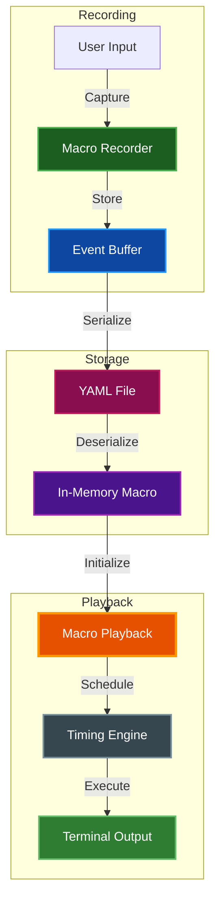
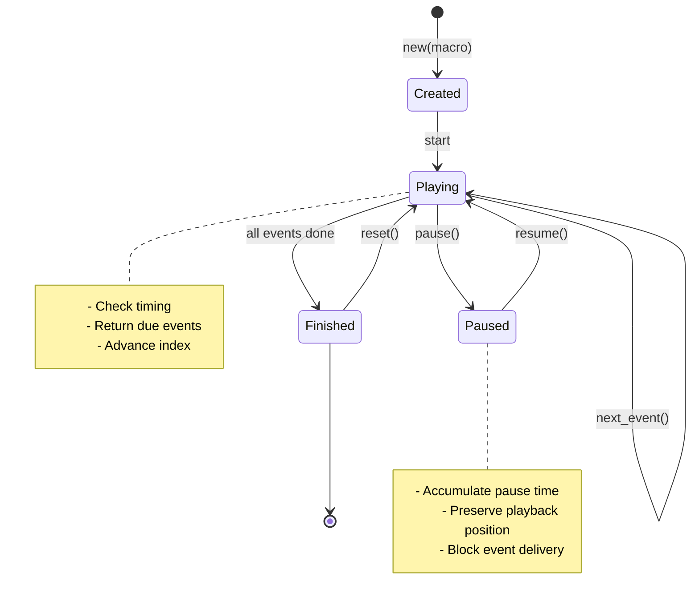
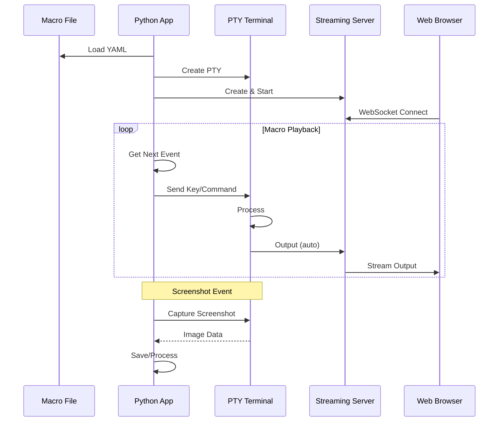

# Macro Recording and Playback

Keyboard macro recording, YAML serialization, and timed playback for terminal sessions and demonstrations.

## Table of Contents
- [Overview](#overview)
- [Architecture](#architecture)
  - [Core Components](#core-components)
  - [Event Types](#event-types)
  - [Playback State Machine](#playback-state-machine)
- [Recording Macros](#recording-macros)
  - [Python Recording API](#python-recording-api)
  - [Rust Recording API](#rust-recording-api)
  - [Manual Macro Creation](#manual-macro-creation)
- [Macro Format](#macro-format)
  - [YAML Structure](#yaml-structure)
  - [Key Notation](#key-notation)
  - [Timestamps and Timing](#timestamps-and-timing)
- [Playback](#playback)
  - [Basic Playback](#basic-playback)
  - [Speed Control](#speed-control)
  - [Pause and Resume](#pause-and-resume)
  - [Looping](#looping)
- [Use Cases](#use-cases)
  - [Interactive Demos](#interactive-demos)
  - [Tutorial Recording](#tutorial-recording)
  - [Automated Testing](#automated-testing)
  - [Presentation Mode](#presentation-mode)
- [Integration](#integration)
  - [Streaming Server](#streaming-server)
  - [PTY Sessions](#pty-sessions)
  - [Screenshot Triggers](#screenshot-triggers)
- [Key Parser](#key-parser)
  - [Supported Keys](#supported-keys)
  - [Modifier Combinations](#modifier-combinations)
  - [Escape Sequences](#escape-sequences)
- [Best Practices](#best-practices)
- [Troubleshooting](#troubleshooting)
- [Related Documentation](#related-documentation)

## Overview

The macro system provides comprehensive recording and playback capabilities for terminal sessions. It captures keyboard input with precise timing, supports delay markers, and includes screenshot triggers for documentation.

**Key Features:**
- Accurate timing preservation with millisecond precision
- YAML serialization for human-readable storage
- Variable playback speed (0.1x to 10x)
- Pause/resume control during playback
- Screenshot markers for documentation
- Environment variable capture
- Terminal size preservation
- Loop mode for continuous playback

**Common Applications:**
- Creating interactive terminal demos
- Recording tutorial sessions
- Automated regression testing
- Presentation and training materials
- CI/CD test scenarios

## Architecture

### Core Components



### Event Types

**MacroEvent Variants:**

| Type | Fields | Description |
|------|--------|-------------|
| `KeyPress` | `key: String`<br>`timestamp: u64` | Single keyboard input with friendly key name |
| `Delay` | `duration: u64`<br>`timestamp: u64` | Pause in playback (milliseconds) |
| `Screenshot` | `label: Option<String>`<br>`timestamp: u64` | Trigger for automated screenshots |

**Example Events:**
```rust
// Key press
MacroEvent::KeyPress {
    key: "ctrl+c".to_string(),
    timestamp: 1500,
}

// Delay
MacroEvent::Delay {
    duration: 1000,
    timestamp: 2500,
}

// Screenshot with label
MacroEvent::Screenshot {
    label: Some("demo_complete".to_string()),
    timestamp: 3500,
}
```

### Playback State Machine



## Recording Macros

### Python Recording API

**Basic Recording:**
```python
import par_term_emu_core_rust as terminal_core

# Create terminal
term = terminal_core.Terminal(80, 24)

# Start recording
term.start_recording("My Demo")

# User interacts with terminal...
term.process_str("echo 'Hello World'\n")
# ... more interactions ...

# Stop recording
session = term.stop_recording()

if session:
    # Recording session properties
    print(f"Recorded {session.event_count} events in {session.duration}ms")
    print(f"Terminal size: {session.initial_size}")

    # Note: RecordingSession captures raw terminal events.
    # To create a playable macro, use the Macro class directly
    # or convert recording events to macro format manually.
```

**Recording with PTY:**
```python
# Create PTY terminal
pty_term = terminal_core.PtyTerminal(80, 24)
pty_term.spawn_shell()

# Start recording
pty_term.start_recording("Shell Session")

# Terminal is live, user can type commands
# Recording captures all input automatically
time.sleep(30)  # Record for 30 seconds

# Stop recording
session = pty_term.stop_recording()
if session:
    print(f"Recorded {session.event_count} events in {session.duration}ms")
    # Note: RecordingSession is for terminal output capture
    # For playable macros, use Macro class to construct programmatically
```

**RecordingSession Object:**
```python
# session properties
session.event_count      # Number of events recorded
session.duration         # Total duration in milliseconds
session.start_time       # Unix timestamp (ms)
session.initial_size     # Terminal size (cols, rows) when recording started
session.title            # Optional recording title/name
```

### Rust Recording API

**Direct Macro Construction:**
```rust
use par_term_emu_core_rust::macros::Macro;

let mut macro_seq = Macro::new("Test Macro");

// Add events
macro_seq
    .add_key("ls")
    .add_delay(100)
    .add_key("enter")
    .add_delay(1000)
    .add_screenshot_labeled(Some("after_ls".to_string()))
    .add_key("pwd")
    .add_delay(100)
    .add_key("enter");

// Set metadata (note: method chaining order matters due to ownership)
let macro_seq = macro_seq
    .with_description("Directory listing demo")
    .with_terminal_size(80, 24)
    .add_env("SHELL", "/bin/bash")
    .add_env("TERM", "xterm-256color");

// Save to YAML
macro_seq.save_yaml("demo.yaml")?;
```

**Terminal Integration:**
```rust
use par_term_emu_core_rust::terminal::Terminal;

let mut terminal = Terminal::new(80, 24);

// Start recording
terminal.start_recording(Some("My Recording".to_string()));

// Process input
terminal.process(b"echo hello\r");

// Stop recording
if let Some(session) = terminal.stop_recording() {
    // RecordingSession contains raw terminal events
    println!("Recorded {} events in {}ms", session.events.len(), session.duration);

    // To create a playable macro, build it manually:
    let mut macro_data = Macro::new(session.title.unwrap_or("Recording".to_string()));
    // Add macro events based on recording session data
    macro_data.save_yaml("recording.yaml")?;
}
```

### Manual Macro Creation

**Create Programmatically:**
```python
import par_term_emu_core_rust as terminal_core

# Create new macro
macro = terminal_core.Macro("Welcome Demo")

# Add events
macro.add_key("e")
macro.add_key("c")
macro.add_key("h")
macro.add_key("o")
macro.add_key("space")
macro.add_key("'")
macro.add_key("W")
macro.add_key("e")
macro.add_key("l")
macro.add_key("c")
macro.add_key("o")
macro.add_key("m")
macro.add_key("e")
macro.add_key("!")
macro.add_key("'")
macro.add_key("enter")
macro.add_delay(1000)
macro.add_screenshot(Some("welcome_msg"))

# Set description
macro.set_description("Welcome message demo")

# Save
macro.save_yaml("welcome.yaml")
```

## Macro Format

### YAML Structure

**Complete Example:**
```yaml
name: Terminal Demo
description: A demonstration of terminal capabilities with colors and formatting
created: 1700000000000  # Unix timestamp (milliseconds)
terminal_size:
  - 80  # columns
  - 24  # rows
env:
  SHELL: /bin/bash
  TERM: xterm-256color
events:
  - type: key
    key: echo
    timestamp: 0
  - type: key
    key: space
    timestamp: 100
  - type: key
    key: "'"
    timestamp: 200
  - type: key
    key: H
    timestamp: 300
  - type: key
    key: e
    timestamp: 400
  - type: key
    key: l
    timestamp: 500
  - type: key
    key: l
    timestamp: 600
  - type: key
    key: o
    timestamp: 700
  - type: key
    key: "'"
    timestamp: 800
  - type: key
    key: enter
    timestamp: 900
  - type: delay
    duration: 1000
    timestamp: 1900
  - type: screenshot
    label: hello_output
    timestamp: 1900
duration: 1900  # Total macro duration in milliseconds
```

### Key Notation

**Friendly Key Names:**

The macro system uses human-readable key names instead of raw bytes or escape sequences:

**Single Keys:**
```yaml
- type: key
  key: a           # Letter 'a'
  timestamp: 0
- type: key
  key: space       # Space bar
  timestamp: 100
- type: key
  key: enter       # Enter/Return key
  timestamp: 200
- type: key
  key: tab         # Tab key
  timestamp: 300
```

**Modified Keys:**
```yaml
- type: key
  key: ctrl+c      # Ctrl+C (interrupt)
  timestamp: 0
- type: key
  key: shift+tab   # Shift+Tab (reverse tab)
  timestamp: 100
- type: key
  key: alt+f4      # Alt+F4
  timestamp: 200
- type: key
  key: ctrl+shift+s  # Multiple modifiers
  timestamp: 300
```

**Special Keys:**
```yaml
- type: key
  key: up          # Arrow up
  timestamp: 0
- type: key
  key: down        # Arrow down
  timestamp: 100
- type: key
  key: f1          # Function key F1
  timestamp: 200
- type: key
  key: backspace   # Backspace
  timestamp: 300
- type: key
  key: delete      # Delete
  timestamp: 400
- type: key
  key: home        # Home
  timestamp: 500
- type: key
  key: end         # End
  timestamp: 600
- type: key
  key: pageup      # Page Up
  timestamp: 700
```

### Timestamps and Timing

**Timestamp Format:**
- All timestamps are in milliseconds
- Relative to macro start (first event at t=0)
- `duration` field indicates total macro length

**Delay Events:**
```yaml
- type: delay
  duration: 1000    # Wait 1000ms (1 second)
  timestamp: 5000   # At 5 seconds into macro
```

**Timing Calculation:**
```python
# Event at timestamp 5000 (5 seconds)
# With playback speed 2.0 (double speed)
# Actual playback time: 5000 / 2.0 = 2500ms (2.5 seconds)

# With playback speed 0.5 (half speed)
# Actual playback time: 5000 / 0.5 = 10000ms (10 seconds)
```

## Playback

### Basic Playback

**Python Playback:**

> **Note:** The `MacroPlayback` class is only available in Rust. Python users must manually iterate over events.

```python
import par_term_emu_core_rust as terminal_core
import time

# Load macro
macro = terminal_core.Macro.load_yaml("demo.yaml")

print(f"Playing: {macro.name}")
print(f"Duration: {macro.duration}ms")
print(f"Events: {macro.event_count}")

# Manual playback loop - iterate over events
for event in macro.events:
    print(f"  {event.event_type} at {event.timestamp}ms")
    if event.key:
        print(f"    Key: {event.key}")
    if event.duration:
        print(f"    Duration: {event.duration}ms")
        time.sleep(event.duration / 1000.0)  # Convert ms to seconds
    if event.label:
        print(f"    Label: {event.label}")
```

**Rust Playback:**
```rust
use par_term_emu_core_rust::macros::{Macro, MacroPlayback, KeyParser};

// Load macro
let macro_data = Macro::load_yaml("demo.yaml")?;

// Create playback session
let mut playback = MacroPlayback::new(macro_data);

// Playback loop
while !playback.is_finished() {
    if let Some(event) = playback.next_event() {
        match event {
            MacroEvent::KeyPress { key, .. } => {
                let bytes = KeyParser::parse_key(&key);
                // Send bytes to terminal/PTY
                writer.write_all(&bytes)?;
            }
            MacroEvent::Delay { duration, .. } => {
                std::thread::sleep(Duration::from_millis(duration));
            }
            MacroEvent::Screenshot { label, .. } => {
                println!("Screenshot: {:?}", label);
                // Trigger screenshot
            }
        }
    }
    std::thread::sleep(Duration::from_millis(10));
}
```

### Speed Control

> **Rust Only:** Speed control via `MacroPlayback` is only available in Rust. Python users must implement custom timing logic.

**Setting Playback Speed:**
```rust
// Create with speed multiplier
let playback = MacroPlayback::with_speed(macro_data, 2.0);  // 2x speed

// Or change speed during playback
let mut playback = MacroPlayback::new(macro_data);
playback.set_speed(0.5);  // Slow to 0.5x (half speed)
playback.set_speed(5.0);  // Fast to 5x
```

**Speed Limits:**
- Minimum: 0.1x (10% speed)
- Maximum: 10.0x (1000% speed)
- Default: 1.0x (normal speed)

**Speed Examples:**

| Speed | Description | Use Case |
|-------|-------------|----------|
| 0.5x | Half speed | Detailed tutorials |
| 1.0x | Normal | Realistic demos |
| 1.5x | Faster | Shorter presentations |
| 2.0x | Double | Quick overviews |
| 5.0x | Very fast | Testing only |

### Pause and Resume

> **Rust Only:** Pause/resume control via `MacroPlayback` is only available in Rust. Python users must implement custom pause logic.

**Pause Control:**
```rust
let mut playback = MacroPlayback::new(macro_data);

// Start playback
loop {
    if playback.is_paused() {
        // Wait while paused
        std::thread::sleep(Duration::from_millis(100));
        continue;
    }

    if let Some(event) = playback.next_event() {
        // Process event
    }

    // User presses 'p' to pause
    if should_pause {
        playback.pause();
    }

    // User presses 'r' to resume
    if should_resume {
        playback.resume();
    }
}
```

**Pause Behavior:**
- Paused time does not count toward playback
- Event timing preserved when resumed
- Can pause indefinitely without affecting playback accuracy

### Looping

> **Rust Only:** The `MacroPlayback` reset mechanism shown here is Rust-only. Python users can loop by re-iterating over `macro.events`.

**Continuous Playback:**
```rust
let macro_data = Macro::load_yaml("demo.yaml")?;

loop {
    let mut playback = MacroPlayback::new(macro_data.clone());

    while !playback.is_finished() {
        if let Some(event) = playback.next_event() {
            // Process event
        }
        std::thread::sleep(Duration::from_millis(10));
    }

    // Optional delay between loops
    std::thread::sleep(Duration::from_secs(2));

    // Check exit condition
    if should_stop {
        break;
    }
}
```

**Note on Streaming:**
Macro playback can be integrated with the StreamingServer for web-based demonstrations. See [STREAMING.md](STREAMING.md) for details on the streaming server architecture.

**Note on Python Playback:**
The `MacroPlayback` class is currently only available in Rust. Python users should manually iterate over macro events for playback (see Python examples above).

## Use Cases

### Interactive Demos

**Product Demonstrations:**
```python
# Record a product demo
pty_term = terminal_core.PtyTerminal(120, 30)
pty_term.spawn_shell()

pty_term.start_recording("Product Demo v1.0")

# Demo scenario:
# 1. Show version
# 2. List features
# 3. Run example command
# 4. Show results

time.sleep(60)  # Record 1 minute demo

session = pty_term.stop_recording()
pty_term.save_macro_yaml(
    session,
    "product_demo.yaml",
    "Product Demo",
    "Full feature demonstration for sales presentations"
)
```

**Conference Talks:**
- Record complex command sequences
- Add delays for dramatic effect
- Include screenshot markers for slides
- Loop continuously at booth displays

### Tutorial Recording

**Step-by-Step Tutorials:**
```yaml
name: Git Tutorial - Basic Workflow
description: Learn basic Git commands and workflow
terminal_size: [100, 30]
events:
  # Step 1: Initialize repository
  - {type: key, key: g, timestamp: 0}
  - {type: key, key: i, timestamp: 50}
  - {type: key, key: t, timestamp: 100}
  - {type: key, key: space, timestamp: 150}
  - {type: key, key: i, timestamp: 200}
  - {type: key, key: n, timestamp: 250}
  - {type: key, key: i, timestamp: 300}
  - {type: key, key: t, timestamp: 350}
  - {type: key, key: enter, timestamp: 400}
  - {type: delay, duration: 2000, timestamp: 2400}
  - {type: screenshot, label: step1_init, timestamp: 2400}

  # Step 2: Create file
  # ... more steps ...
```

**Educational Content:**
- Record coding sessions
- Demonstrate debugging workflows
- Show build processes
- Capture error handling

### Automated Testing

**Regression Tests:**
```rust
// Load test macro
let test_macro = Macro::load_yaml("test_login.yaml")?;
let mut playback = MacroPlayback::with_speed(test_macro, 5.0);

// Play back test scenario
while !playback.is_finished() {
    if let Some(event) = playback.next_event() {
        match event {
            MacroEvent::Screenshot { label, .. } => {
                // Verify UI state at checkpoint
                let actual = terminal.screenshot()?;
                let expected = load_expected(&label)?;
                assert_images_match(actual, expected);
            }
            _ => {
                // Process other events
            }
        }
    }
}
```

**CI/CD Integration:**
```python
# Example CI/CD test runner using macros
import par_term_emu_core_rust as terminal_core

# Load test macro
macro = terminal_core.Macro.load_yaml("test_suite.yaml")

# Create terminal for test
term = terminal_core.Terminal(80, 24)

# Run macro at high speed for testing
for event in macro.events:
    if event.event_type == "key" and event.key:
        term.process_str(event.key)
    elif event.event_type == "screenshot" and event.label:
        # Capture and compare screenshots
        actual = term.screenshot("png")
        # Compare with expected baseline
        # Assert/report differences
        pass
```

### Presentation Mode

**Live Coding Presentations:**
```python
# Pre-record complex commands to avoid typos
macro = terminal_core.Macro("Live Demo")

# Simulate typing out code
for char in "def factorial(n):":
    macro.add_key(char)
    macro.add_delay(80)  # Realistic typing speed

macro.add_key("enter")
macro.add_delay(500)

# Add rest of function...
macro.save_yaml("live_coding.yaml")
```

**Booth Displays:**
- Loop continuously
- Showcase features
- No human interaction needed
- Professional appearance

## Integration

### Streaming Server

**Integration with StreamingServer:**

The StreamingServer (when built with `--features streaming`) can stream terminal output to web browsers.
Macros can be played back manually and the output streamed via the server.

**Example Integration:**
```python
import par_term_emu_core_rust as terminal_core

# Create PTY terminal
pty_term = terminal_core.PtyTerminal(80, 24)
pty_term.spawn_shell()

# Create streaming server
server = terminal_core.StreamingServer(pty_term, "127.0.0.1:8080")
server.start()

# Load and play macro
macro = terminal_core.Macro.load_yaml("demo.yaml")

# Manually play macro events to PTY (output is automatically streamed)
for event in macro.events:
    if event.event_type == "key" and event.key:
        # Simple key handling (full implementation would use KeyParser)
        if len(event.key) == 1:
            pty_term.write(event.key.encode())
    elif event.event_type == "delay":
        import time
        time.sleep(event.duration / 1000.0)
```

**Architecture with Streaming:**


### PTY Sessions

**PTY with Macro Input:**
```python
import time

# Create PTY
pty_term = terminal_core.PtyTerminal(80, 24)
pty_term.spawn_shell()

# Load macro
macro = terminal_core.Macro.load_yaml("commands.yaml")

# Send macro events to PTY
# Note: Key parsing to bytes is done in Rust KeyParser
# Python would need to replicate this logic or use a helper
for event in macro.events:
    if event.event_type == "key":
        # For simple keys, you can send directly
        # For special keys, you'd need to convert using KeyParser logic
        if event.key and len(event.key) == 1:
            pty_term.write(event.key.encode())
    elif event.event_type == "delay":
        time.sleep(event.duration / 1000.0)
```

### Screenshot Triggers

**Automatic Screenshot Capture:**
```python
# Create a macro with screenshot triggers
macro = terminal_core.Macro("Screenshot Demo")
macro.add_key("l")
macro.add_key("s")
macro.add_delay(100)
macro.add_key("enter")
macro.add_delay(1000)
macro.add_screenshot("after_ls")

# During playback, handle screenshot events
term = terminal_core.Terminal(80, 24)

for event in macro.events:
    if event.event_type == "screenshot":
        # Take screenshot
        image_data = term.screenshot("png")
        label = event.label or "screenshot"
        with open(f"{label}.png", "wb") as f:
            f.write(image_data)
    elif event.event_type == "key":
        # Process key event
        if event.key:
            term.process_str(event.key)
    elif event.event_type == "delay":
        import time
        time.sleep(event.duration / 1000.0)
```

## Key Parser

### Supported Keys

**Alphabetic Keys:**
```
a-z  # Lowercase letters
A-Z  # Uppercase letters (or shift+a-z)
```

**Numeric Keys:**
```
0-9  # Number row
```

**Special Characters:**
```
space      # Space bar
enter      # Enter/Return
return     # Alias for enter
tab        # Tab key
backspace  # Backspace
escape     # Escape key
esc        # Alias for escape
```

**Navigation Keys:**
```
up         # Arrow up
down       # Arrow down
left       # Arrow left
right      # Arrow right
home       # Home key
end        # End key
pageup     # Page Up
pgup       # Alias for pageup
pagedown   # Page Down
pgdn       # Alias for pagedown
insert     # Insert key
ins        # Alias for insert
delete     # Delete key
del        # Alias for delete
```

**Function Keys:**
```
f1, f2, f3, f4, f5, f6
f7, f8, f9, f10, f11, f12
```

### Modifier Combinations

**Ctrl Combinations:**
```yaml
ctrl+a   # Ctrl+A (SOH, 0x01)
ctrl+c   # Ctrl+C (ETX, 0x03) - Interrupt
ctrl+d   # Ctrl+D (EOT, 0x04) - EOF
ctrl+z   # Ctrl+Z (SUB, 0x1A) - Suspend
```

**Shift Combinations:**
```yaml
shift+tab      # Reverse tab (Shift+Tab)
shift+a        # Uppercase A (same as 'A')
```

**Alt Combinations:**
```yaml
alt+f4         # Alt+F4
alt+a          # ESC + 'a' (0x1B 0x61)
```

**Multiple Modifiers:**
```yaml
ctrl+shift+s   # Ctrl+Shift+S
ctrl+alt+del   # Ctrl+Alt+Delete (no standard escape)
```

### Escape Sequences

**Key to Bytes Mapping:**

| Key | Escape Sequence | Hex |
|-----|----------------|-----|
| `ctrl+c` | `^C` | `0x03` |
| `enter` | `\r` | `0x0D` |
| `tab` | `\t` | `0x09` |
| `backspace` | `DEL` | `0x7F` |
| `escape` | `ESC` | `0x1B` |
| `up` | `ESC[A` | `0x1B 0x5B 0x41` |
| `down` | `ESC[B` | `0x1B 0x5B 0x42` |
| `f1` | `ESCOP` | `0x1B 0x4F 0x50` |
| `delete` | `ESC[3~` | `0x1B 0x5B 0x33 0x7E` |

**Parser Example:**
```rust
use par_term_emu_core_rust::macros::KeyParser;

// Parse friendly names to bytes
let bytes = KeyParser::parse_key("ctrl+c");
assert_eq!(bytes, vec![0x03]);

let bytes = KeyParser::parse_key("up");
assert_eq!(bytes, vec![0x1B, 0x5B, 0x41]);

let bytes = KeyParser::parse_key("a");
assert_eq!(bytes, vec![0x61]);
```

## Best Practices

**Recording Best Practices:**

1. **Clear Objectives:** Plan what you want to demonstrate before recording
2. **Realistic Timing:** Keep delays natural for viewer comprehension
3. **Error Handling:** Include recovery steps if demonstrating error scenarios
4. **Documentation:** Add meaningful screenshot labels and descriptions
5. **Terminal Size:** Use standard sizes (80×24, 100×30, 120×40) for compatibility

**Playback Best Practices:**

1. **Speed Selection:**
   - Use 1.0x for tutorials
   - Use 1.5-2.0x for demos
   - Use 5.0x+ only for testing

2. **Loop Consideration:**
   - Add delay between loops (2-3 seconds)
   - Consider reset sequences
   - Monitor resource usage

3. **Error Recovery:**
   - Handle failed key parsing gracefully
   - Validate macro structure before playback
   - Implement timeout mechanisms

**Storage Best Practices:**

1. **File Organization:**
   ```
   macros/
   ├── demos/
   │   ├── product_overview.yaml
   │   └── feature_walkthrough.yaml
   ├── tests/
   │   ├── login_test.yaml
   │   └── checkout_test.yaml
   └── tutorials/
       ├── beginner_01.yaml
       └── advanced_05.yaml
   ```

2. **Naming Conventions:**
   - Use descriptive names: `git_basic_workflow.yaml`
   - Include version: `demo_v2.yaml`
   - Date stamp tests: `regression_2025_01_15.yaml`

3. **Version Control:**
   - Store macros in git
   - Review YAML diffs
   - Tag releases

## Troubleshooting

### Recording Issues

**Problem:** Events not captured

**Solutions:**
- Ensure `start_recording()` was called
- Verify terminal is receiving input
- Check recording hasn't been stopped prematurely
- For PTY: ensure shell is running

**Problem:** Incorrect timing

**Solutions:**
- Delays are calculated from previous event timestamps
- Use `add_delay()` for explicit pauses
- Check system clock during recording
- Verify recording session duration

### Playback Issues

**Problem:** Keys not working as expected

**Solutions:**
- Verify key notation matches supported format
- Check KeyParser output for special keys
- Test individual key sequences
- Ensure terminal supports the escape sequences

**Problem:** Playback too fast/slow

**Solutions:**
- Adjust speed with `set_speed()`
- Check delay events are present
- Verify timestamps are sequential
- Consider network latency for streaming

**Problem:** Screenshot triggers not firing

**Solutions:**
- Check event type is exactly `"screenshot"`
- Verify label is optional (can be None)
- Ensure screenshot handler is implemented
- Check file permissions for output directory

### YAML Issues

**Problem:** Failed to load YAML file

**Solutions:**
- Validate YAML syntax with online validator
- Check file encoding (must be UTF-8)
- Verify all required fields present:
  - `name` (string)
  - `created` (integer timestamp)
  - `events` (array)
  - `duration` (integer)
- Ensure timestamp values are integers, not floats

**Problem:** Invalid event structure

**Solutions:**
- Each event must have `type` field
- Key events need `key` and `timestamp`
- Delay events need `duration` and `timestamp`
- Screenshot events need `timestamp` (label optional)

### Integration Issues

**Problem:** PTY not responding to macro input

**Solutions:**
- Ensure PTY writer is available
- Verify shell is running: `pty_terminal.is_running()`
- Check key bytes are correct for current terminal mode
- Test with simple keys first (letters/numbers)

## Related Documentation

- [STREAMING.md](STREAMING.md) - Terminal streaming with macro integration
- [API_REFERENCE.md](API_REFERENCE.md) - Complete Python API reference
- [ADVANCED_FEATURES.md](ADVANCED_FEATURES.md) - Recording and macro features
- [ARCHITECTURE.md](ARCHITECTURE.md) - Internal macro system architecture
- [RUST_USAGE.md](RUST_USAGE.md) - Using macros from Rust code
- [BUILDING.md](BUILDING.md) - Build configuration for macro support
