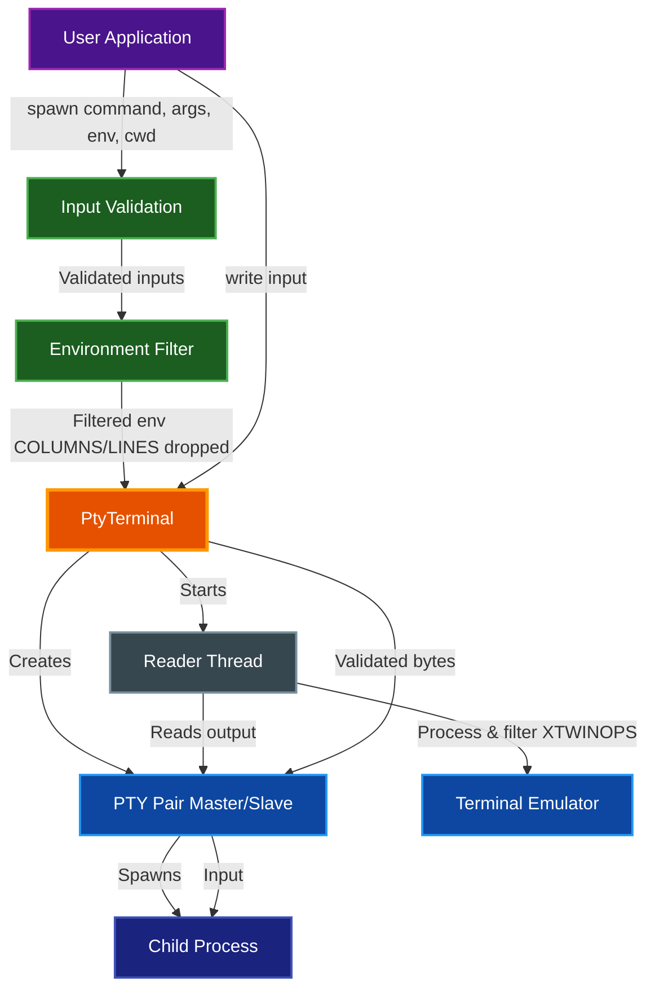

# Security Considerations for PTY Usage

This document outlines security considerations when using the PTY functionality in par-term-emu-core-rust.

## API Overview

The `PtyTerminal.spawn()` method signature:

```python
term.spawn(
    command: str,                      # Required: command to execute
    args: list[str] | None = None,     # Optional: list of command arguments
    env: dict[str, str] | None = None, # Optional: environment variables (merges with inherited)
    cwd: str | None = None             # Optional: working directory
)
```

**Key Points:**
- `env` parameter **merges with and overrides specific keys** in the inherited environment (all parent env vars are inherited by default, then overridden by keys in `env`)
- `args` must be a list of strings or None (e.g., `args=["arg1", "arg2"]` or `args=None`)
- All path arguments (`cwd`, values in `args`) should be validated to prevent directory traversal
- Command must be absolute path (e.g., `/bin/bash`) or findable in `PATH`
- The system automatically drops `COLUMNS` and `LINES` from inherited environment to prevent resize issues
- Set `PAR_TERM_REPLY_XTWINOPS=0` **before creating `PtyTerminal`** to suppress XTWINOPS (CSI t) query responses (this setting is cached at terminal creation time)

**Convenience Methods:**
- `term.spawn_shell()` - Auto-detects and spawns default shell (uses `$SHELL` on Unix or `%COMSPEC%` on Windows, with fallback to `/bin/bash` or `cmd.exe` respectively)
- `PtyTerminal.get_default_shell()` - Static method that returns the default shell path for current platform

**Implementation Notes:**
- The Python wrapper calls `set_env()` and `set_cwd()` on the Rust `PtySession` before calling `spawn()`
- Environment variables are stored internally as `Vec<(String, String)>` and applied during process spawn
- Working directory is stored as `Option<String>` and applied via `CommandBuilder::cwd()` if set
- The Python API accepts `dict[str, str]` for environment variables and `str` for working directory, which are converted to Rust types

## Table of Contents

- [Security Architecture](#security-architecture)
- [Command Injection Prevention](#command-injection-prevention)
  - [DO: Use Command + Args Array Format](#do-use-command--args-array-format)
  - [DON'T: Concatenate User Input into Commands](#dont-concatenate-user-input-into-commands)
  - [Validating User Input](#validating-user-input)
- [Environment Variable Security](#environment-variable-security)
  - [Inherited Environment](#inherited-environment)
  - [Secure Environment Practices](#secure-environment-practices)
  - [Remove Sensitive Variables](#remove-sensitive-variables)
- [Working Directory Security](#working-directory-security)
  - [Prevent Directory Traversal](#prevent-directory-traversal)
- [Shell Selection Security](#shell-selection-security)
  - [Default Shell Risks](#default-shell-risks)
  - [Secure Shell Usage](#secure-shell-usage)
- [Process Management Security](#process-management-security)
  - [Resource Limits](#resource-limits)
  - [Multiple Session Limits](#multiple-session-limits)
- [Terminal Query Response Security](#terminal-query-response-security)
  - [XTWINOPS Query Response Control](#xtwinops-query-response-control)
- [Input Validation](#input-validation)
  - [Keyboard Input Sanitization](#keyboard-input-sanitization)
- [Graphics Protocol File Loading Security](#graphics-protocol-file-loading-security)
  - [Kitty Graphics Protocol File Transmission](#kitty-graphics-protocol-file-transmission)
  - [File Loading Implementation](#file-loading-implementation)
  - [Security Considerations](#security-considerations)
  - [Best Practices for Graphics Protocol](#best-practices-for-graphics-protocol)
  - [Example: Secure Graphics Usage](#example-secure-graphics-usage)
- [Terminal Size Validation](#terminal-size-validation)
- [Privilege Considerations](#privilege-considerations)
  - [Running as Non-Root](#running-as-non-root)
- [Logging and Audit](#logging-and-audit)
  - [Log Security Events](#log-security-events)
- [Summary of Best Practices](#summary-of-best-practices)
  - [Context Manager Pattern](#context-manager-pattern)
- [Security Checklist](#security-checklist)
- [Reporting Security Issues](#reporting-security-issues)

## Security Architecture

The PTY system implements multiple security layers to protect against common attack vectors:



### Security Boundaries

**Input Validation Layer**:
- Command injection prevention via args array
- Path traversal detection for `cwd` and file arguments
- Environment variable filtering and validation
- Terminal size bounds checking

**Environment Isolation**:
- Automatic filtering of `COLUMNS` and `LINES` to prevent resize bugs
- Selective environment variable inheritance
- Sensitive variable removal (credentials, API keys)

**Process Isolation**:
- PTY provides process isolation from parent
- Resource limits via timeouts and session limits
- Non-root execution recommended
- Automatic cleanup via Drop trait and context managers

**Query Response Filtering**:
- Configurable XTWINOPS response filtering
- Prevention of information leakage via terminal queries
- Support for nested TUI applications

## Command Injection Prevention

### ✅ DO: Use Command + Args Array Format

**SECURE** - Always pass commands and arguments separately:

```python
from par_term_emu_core_rust import PtyTerminal

term = PtyTerminal(80, 24)

# GOOD: Command and arguments are separate
term.spawn("/bin/ls", args=["-la", user_input_dir])

# GOOD: Shell with specific command
term.spawn("/bin/sh", args=["-c", safe_command])

# GOOD: With environment and working directory
term.spawn(
    command="/bin/ls",
    args=["-la"],
    env={"SAFE_VAR": "value"},
    cwd="/safe/directory"
)
```

This prevents shell injection because arguments are not interpreted as shell commands.

### ❌ DON'T: Concatenate User Input into Commands

**INSECURE** - Don't build command strings with user input:

```python
# BAD: User input concatenated into shell command
user_file = input("Enter filename: ")  # User enters: file.txt; rm -rf /
dangerous_command = f"cat {user_file}"  # Becomes: cat file.txt; rm -rf /
term.spawn("/bin/sh", args=["-c", dangerous_command])  # EXECUTES rm -rf /!
```

### Validating User Input

If you must use user input in commands, validate and sanitize it:

```python
from pathlib import Path
from par_term_emu_core_rust import PtyTerminal

def safe_spawn_with_file(term, filename):
    """Safely spawn a command with user-provided filename"""
    # Validate filename
    if not filename or '..' in filename or filename.startswith('/'):
        raise ValueError("Invalid filename")

    # Use pathlib for safer path operations
    safe_dir = Path("/safe/directory")
    requested_path = (safe_dir / filename).resolve()

    # Verify it's still in the safe directory (prevents .. traversal)
    try:
        requested_path.relative_to(safe_dir)
    except ValueError:
        raise ValueError("Path traversal attempt detected")

    # Verify file exists and is a regular file
    if not requested_path.is_file():
        raise ValueError("Not a valid file")

    # Use args array format - prevents shell injection
    term.spawn(command="/bin/cat", args=[str(requested_path)])

# Example usage
from par_term_emu_core_rust import PtyTerminal

term = PtyTerminal(80, 24)
safe_spawn_with_file(term, "document.txt")  # OK: /safe/directory/document.txt
# safe_spawn_with_file(term, "../etc/passwd")  # Raises ValueError
```

## Environment Variable Security

### Inherited Environment

**Important**: `PtyTerminal` inherits ALL parent process environment variables by default, including:
- `PATH` - Can be manipulated to execute malicious binaries
- `LD_PRELOAD` / `LD_LIBRARY_PATH` - Can load malicious libraries
- Authentication tokens and API keys
- Database connection strings

**Automatic Environment Filtering**:
- The system automatically drops `COLUMNS` and `LINES` environment variables (if present in parent) to prevent terminal size conflicts
- These variables are static and don't update on resize, causing issues with terminal-aware applications
- Many libraries (e.g., Python's `shutil.get_terminal_size()`) and some TUIs prioritize these env vars over `ioctl(TIOCGWINSZ)`, leaving them stuck at the parent terminal's size
- Applications should query terminal size via `ioctl(TIOCGWINSZ)` instead
- Set `PAR_TERM_REPLY_XTWINOPS=0` before creating `PtyTerminal` to suppress XTWINOPS query responses (this setting is cached at terminal creation time; changing it after will have no effect)

### Secure Environment Practices

```python
from par_term_emu_core_rust import PtyTerminal

# GOOD: Explicitly override sensitive environment variables
# Pass env parameter to merge with inherited environment, overriding specific keys
safe_overrides = {
    "PATH": "/usr/local/bin:/usr/bin:/bin",  # Controlled PATH
    "HOME": "/home/user",
    "USER": "safeuser",
    # Note: The following are set automatically by the PTY system:
    #   TERM=xterm-256color
    #   COLORTERM=truecolor
    #   TERM_PROGRAM=kitty
    #   KITTY_WINDOW_ID=1
    #   KITTY_PID=<process_id>
    # These enable Kitty graphics protocol detection and can be overridden if needed
    # Clear sensitive variables by setting to empty string
    "AWS_SECRET_KEY": "",
    "DATABASE_PASSWORD": "",
    "API_TOKEN": "",
}

term = PtyTerminal(80, 24)
term.spawn("/bin/sh", env=safe_overrides)

# Environment merge order (see spawn() in src/pty_session.rs):
# 1. Inherit all parent env vars (except COLUMNS/LINES - automatically filtered)
# 2. Set terminal-specific environment variables:
#    - TERM=xterm-256color
#    - COLORTERM=truecolor
#    - TERM_PROGRAM=kitty
#    - KITTY_WINDOW_ID=1
#    - KITTY_PID=<current process ID>
# 3. Override with keys from env parameter (user-specified values)
# To completely isolate the environment, you must override ALL inherited vars
```

```python
# CAUTION: This inherits everything from parent
term.spawn_shell()  # Includes all parent env vars (except COLUMNS/LINES)!

# BETTER: Explicitly control environment even with spawn_shell
term.spawn(
    PtyTerminal.get_default_shell(),
    args=None,
    env={
        "PATH": "/usr/local/bin:/usr/bin:/bin",  # Override specific vars
        "AWS_SECRET_KEY": "",                     # Clear sensitive vars
        "DATABASE_PASSWORD": "",
    }
)
```

### Remove Sensitive Variables

```python
import os

# OPTION 1: Remove from parent process environment before spawning
# This affects all future spawn calls
dangerous_vars = ["AWS_SECRET_KEY", "DATABASE_PASSWORD", "API_TOKEN"]

for var in dangerous_vars:
    if var in os.environ:
        del os.environ[var]

term.spawn_shell()
```

```python
# OPTION 2: Override sensitive variables with empty values
# This only affects this specific spawn call
term = PtyTerminal(80, 24)
term.spawn(
    "/usr/bin/app",
    env={
        "AWS_SECRET_KEY": "",     # Override with empty value
        "DATABASE_PASSWORD": "",
        "API_TOKEN": "",
    }
)
```

**Important**: The `env` parameter in `spawn()` **merges with and overrides specific keys** in the inherited environment. The process is:
1. All parent environment variables are inherited (except `COLUMNS` and `LINES` which are automatically filtered out)
2. `TERM=xterm-256color`, `COLORTERM=truecolor`, `TERM_PROGRAM=kitty`, `KITTY_WINDOW_ID=1`, and `KITTY_PID=<process_id>` are set automatically for Kitty graphics protocol support
3. Variables specified in `env` override all previous values (including TERM/COLORTERM/TERM_PROGRAM if specified)
4. The merged environment is passed to the spawned process

The `env` parameter does NOT replace the entire environment. To create a completely isolated environment, you must explicitly override ALL inherited variables with safe values, or clean the parent's `os.environ` first.

**Security Best Practice**: When using `env` parameter, always explicitly set or clear ALL potentially sensitive environment variables to prevent unintended leakage.

## Working Directory Security

### Prevent Directory Traversal

```python
from pathlib import Path
from par_term_emu_core_rust import PtyTerminal

def safe_spawn_with_cwd(term, user_dir, command, args=None):
    """Safely spawn a process with validated working directory"""
    # Validate and resolve path
    safe_root = Path("/home/user/workspaces")
    requested_path = (safe_root / user_dir).resolve()

    # Verify it's within safe_root (prevents .. traversal)
    try:
        requested_path.relative_to(safe_root)
    except ValueError:
        raise ValueError("Directory traversal attempt detected")

    # Verify directory exists and is a directory
    if not requested_path.is_dir():
        raise ValueError("Not a valid directory")

    # Spawn with validated working directory
    term.spawn(command=command, args=args, cwd=str(requested_path))

# Example usage
from par_term_emu_core_rust import PtyTerminal

term = PtyTerminal(80, 24)
safe_spawn_with_cwd(term, "project1", "/bin/bash")  # OK
# safe_spawn_with_cwd(term, "../etc", "/bin/bash")  # Raises ValueError
```

## Shell Selection Security

### Default Shell Risks

The `spawn_shell()` method uses the `$SHELL` environment variable on Unix (or `%COMSPEC%` on Windows):

```python
# Uses $SHELL from environment on Unix (could be manipulated!)
# Uses %COMSPEC% on Windows (typically cmd.exe)
term.spawn_shell()
```

**Risk**: If an attacker controls `$SHELL` (Unix) or `%COMSPEC%` (Windows), they can execute arbitrary programs.

### Secure Shell Usage

```python
import os
from pathlib import Path
from par_term_emu_core_rust import PtyTerminal

# GOOD: Explicitly validate and specify the shell
ALLOWED_SHELLS = ["/bin/bash", "/bin/sh", "/bin/zsh", "/usr/bin/fish"]

def safe_spawn_shell(term):
    """Spawn a shell with validation"""
    # Get shell from environment (could be user-controlled!)
    shell = os.environ.get("SHELL", "/bin/sh")

    # Validate shell is in allowed list
    if shell not in ALLOWED_SHELLS:
        print(f"Warning: Shell {shell} not allowed, using /bin/sh")
        shell = "/bin/sh"

    # Verify shell exists and is executable
    shell_path = Path(shell)
    if not shell_path.is_file() or not os.access(shell, os.X_OK):
        print(f"Warning: Shell {shell} not found or not executable, using /bin/sh")
        shell = "/bin/sh"

    # Spawn the validated shell
    term.spawn(command=shell)

# Example usage
from par_term_emu_core_rust import PtyTerminal

term = PtyTerminal(80, 24)
safe_spawn_shell(term)
```

**Alternative**: Use the static method with default shell detection:
```python
from par_term_emu_core_rust import PtyTerminal

# Get default shell using static method
# On Unix: $SHELL or /bin/bash (fallback)
# On Windows: %COMSPEC% or cmd.exe (fallback)
default_shell = PtyTerminal.get_default_shell()
print(f"Using shell: {default_shell}")

term = PtyTerminal(80, 24)
term.spawn_shell()  # Convenience method that uses get_default_shell() internally
```

## Process Management Security

### Resource Limits

Prevent resource exhaustion:

```python
import time
from par_term_emu_core_rust import PtyTerminal

def spawn_with_timeout(term, command, args=None, env=None, cwd=None, timeout=30):
    """Spawn a process with timeout"""
    term.spawn(command=command, args=args, env=env, cwd=cwd)

    start_time = time.time()
    while term.is_running():
        if time.time() - start_time > timeout:
            print(f"Process timeout after {timeout}s")
            term.kill()
            break
        time.sleep(0.1)

    return term.try_wait()

# Example usage
from par_term_emu_core_rust import PtyTerminal

term = PtyTerminal(80, 24)
exit_code = spawn_with_timeout(term, "/bin/sleep", args=["100"], timeout=5)
print(f"Process exited with code: {exit_code}")  # Will be killed after 5s
```

### Multiple Session Limits

```python
from par_term_emu_core_rust import PtyTerminal

MAX_SESSIONS = 10

class SessionManager:
    def __init__(self):
        self.sessions = []

    def create_session(self, cols, rows):
        # Enforce limit
        if len(self.sessions) >= MAX_SESSIONS:
            raise RuntimeError(f"Maximum {MAX_SESSIONS} sessions allowed")

        term = PtyTerminal(cols, rows)
        self.sessions.append(term)
        return term

    def cleanup(self):
        for term in self.sessions:
            if term.is_running():
                term.kill()
        self.sessions.clear()
```

## Terminal Query Response Security

### XTWINOPS Query Response Control

The terminal emulator automatically responds to certain terminal queries (XTWINOPS CSI t sequences) to support nested TUI applications like vim, tmux, and htop. However, when shells have `ECHOCTL` enabled, these responses can become visible in the terminal output, creating visual noise.

**Security Control**: Set the `PAR_TERM_REPLY_XTWINOPS` environment variable to control this behavior:

```python
import os
from par_term_emu_core_rust import PtyTerminal

# Disable XTWINOPS responses (prevents visible query echoes)
os.environ["PAR_TERM_REPLY_XTWINOPS"] = "0"

# IMPORTANT: Must be set BEFORE creating PtyTerminal
# The setting is read and cached at terminal creation time
term = PtyTerminal(80, 24)
term.spawn_shell()

# Note: Changing os.environ["PAR_TERM_REPLY_XTWINOPS"] after terminal creation has no effect
```

**Default Behavior**: XTWINOPS responses are **enabled by default** (`PAR_TERM_REPLY_XTWINOPS=1` or unset) to ensure nested TUI applications work correctly. Only disable if you experience visual artifacts or want to prevent potential information leakage via terminal queries.

**When to Disable**:
- Shell environment has `ECHOCTL` enabled (common in some configurations)
- Security-sensitive environments where terminal query responses could leak information (e.g., terminal dimensions)
- Testing scenarios where query responses interfere with output validation

**Technical Details**:
- This setting is cached when `PtyTerminal` is created by reading `PAR_TERM_REPLY_XTWINOPS` from the environment (checked once at initialization in `PtySession::new()`, stored in an `Arc<AtomicBool>`)
- Default behavior: enabled (returns true) if env var is unset, not "0", or not "false" (case-insensitive)
- The check is: `std::env::var("PAR_TERM_REPLY_XTWINOPS").ok().map(|v| v != "0" && v.to_lowercase() != "false").unwrap_or(true)`
- Changing the environment variable after terminal creation has no effect on that terminal instance
- The filtering is implemented in the PTY reader thread (`start_reader_thread` in `src/pty_session.rs`)
- When disabled, CSI sequences ending with 't' are filtered from responses before being written back to the PTY master
- Device query responses are processed by scanning for escape sequences (`\x1B[`) and checking the final byte
- Only CSI sequences with alphabetic final byte 't' are dropped when filtering is enabled (other sequences pass through)
- This prevents XTWINOPS responses from being echoed visibly when shells have `ECHOCTL` enabled

## Input Validation

### Keyboard Input Sanitization

```python
from par_term_emu_core_rust import PtyTerminal

def safe_send_input(term, user_input):
    """Safely send user input to terminal"""

    # Limit input length
    if len(user_input) > 4096:
        raise ValueError("Input too long")

    # Check for dangerous control sequences
    dangerous_sequences = [
        b"\x1b[6n",  # Device Status Report (can leak info)
        b"\x1b]",    # OSC sequences (can be misused)
    ]

    input_bytes = user_input.encode('utf-8')
    for seq in dangerous_sequences:
        if seq in input_bytes:
            raise ValueError("Dangerous escape sequence detected")

    term.write(input_bytes)
```

## Graphics Protocol File Loading Security

### Kitty Graphics Protocol File Transmission

The terminal emulator supports the Kitty graphics protocol, which includes file transmission modes (`t=f` and `t=t`). When enabled, applications can send image file paths instead of inline image data. This feature implements multiple security layers to protect against malicious file access.

**Security Measures Implemented**:

1. **Directory Traversal Prevention**: File paths containing `..` are rejected to prevent access to parent directories
2. **File Type Validation**: Only existing regular files are loaded (directories and special files are rejected)
3. **File Size Limits**: Maximum file size of 100MB to prevent memory exhaustion
4. **Path Validation**: File paths must exist and be readable

**Transmission Modes**:
- `t=d` - Direct base64 image data (no file access, most secure)
- `t=f` - File path (raw UTF-8 string, NOT base64-encoded) - **Requires file system access**
- `t=t` - Temporary file path (raw UTF-8 string, auto-deleted after loading) - **Requires file system access**
- `t=s` - Shared memory (not supported)

### File Loading Implementation

The file loading security implementation is located in the `load_file_data()` method in `src/graphics/kitty.rs`.

**Security validations applied:**

1. **UTF-8 Path Validation**
   - File paths are decoded from the raw bytes (not base64-encoded for file transmission)
   - Must be valid UTF-8 strings
   - Invalid encoding returns error: "Invalid UTF-8 in file path"

2. **Directory Traversal Prevention**
   - Any path containing `..` is rejected
   - Prevents access to parent directories
   - Applied before any file system operations
   - Returns error: "Directory traversal not allowed"

3. **File Existence and Type Validation**
   - Path must exist on the filesystem
   - Path must be a regular file (not directory, symlink, or special file)
   - Clear error messages for each validation failure
   - Errors include the path for debugging

4. **File Size Limits**
   - Maximum file size: 100MB (`100 * 1024 * 1024` bytes)
   - Checked via `fs::metadata()` before reading file content
   - Prevents memory exhaustion attacks
   - Error message includes actual file size and the maximum limit

5. **Automatic Cleanup for Temporary Files**
   - Files loaded with `t=t` (TempFile medium) are automatically deleted after reading via `fs::remove_file()`
   - Cleanup errors are silently ignored (using `let _ = ...`) to prevent blocking on file system issues
   - This is intentional to handle cases where the file may already be deleted or locked

**Implementation Details:**
```rust
// From src/graphics/kitty.rs (lines 653-707)
fn load_file_data(&self, path_data: &[u8]) -> Result<Vec<u8>, GraphicsError> {
    // 1. Decode path (NOT base64 for file transmission)
    let path_str = String::from_utf8(path_data.to_vec())
        .map_err(|e| GraphicsError::KittyError(format!("Invalid UTF-8 in file path: {}", e)))?;

    let path = Path::new(&path_str);

    // 2. Directory traversal check
    if path_str.contains("..") {
        return Err(GraphicsError::KittyError(
            "Directory traversal not allowed".to_string(),
        ));
    }

    // 3. File existence and type validation
    if !path.exists() {
        return Err(GraphicsError::KittyError(format!(
            "File not found: {}",
            path_str
        )));
    }

    if !path.is_file() {
        return Err(GraphicsError::KittyError(format!(
            "Path is not a file: {}",
            path_str
        )));
    }

    // 4. File size limit check
    const MAX_FILE_SIZE: u64 = 100 * 1024 * 1024; // 100MB
    let metadata = fs::metadata(path)
        .map_err(|e| GraphicsError::KittyError(format!("Cannot read file metadata: {}", e)))?;

    if metadata.len() > MAX_FILE_SIZE {
        return Err(GraphicsError::KittyError(format!(
            "File too large: {} bytes (max {})",
            metadata.len(),
            MAX_FILE_SIZE
        )));
    }

    // 5. Read file
    let file_data = fs::read(path)
        .map_err(|e| GraphicsError::KittyError(format!("Cannot read file: {}", e)))?;

    // 6. Delete temp file if t=t
    if self.medium == KittyMedium::TempFile {
        let _ = fs::remove_file(path); // Ignore cleanup errors
    }

    Ok(file_data)
}
```

### Security Considerations

**File System Access Risks**:
- Applications can request loading of **any readable file** on the system (within the user's permissions)
- No sandboxing or chroot isolation is applied
- Applications could potentially:
  - Probe for file existence by observing error messages
  - Read sensitive files the user has access to (e.g., `~/.ssh/id_rsa`)
  - Cause resource exhaustion by requesting large files repeatedly

**Mitigations**:
1. **User Permission Model**: File loading operates with the same permissions as the terminal emulator process. If running as a non-root user, sensitive system files are inaccessible.
2. **Size Limits**: 100MB maximum file size prevents single-file memory exhaustion
3. **No Execution**: Files are only read and decoded as images, never executed
4. **Path Sanitization**: Directory traversal attempts are blocked

**Recommendations**:

```python
# GOOD: Run terminal emulator as restricted user
# Limits file access to user's own files
import os
import pwd

def drop_privileges():
    """Run as restricted user"""
    if os.getuid() == 0:
        pwnam = pwd.getpwnam("appuser")
        os.setgid(pwnam.pw_gid)
        os.setuid(pwnam.pw_uid)

drop_privileges()
term = PtyTerminal(80, 24)
```

```python
# GOOD: Monitor for suspicious file access patterns
import logging

logger = logging.getLogger(__name__)

# Log graphics loading errors (may indicate probing)
# Implementation would need to be added to the Rust side
# for full logging of file access attempts
```

**Advanced Security** (Future Enhancements):
- Consider adding a configurable allowlist of directories for file loading
- Implement rate limiting to prevent rapid file access probing
- Add audit logging for all file loading attempts
- Consider sandboxing or chroot for file operations

### Best Practices for Graphics Protocol

1. ✅ **Run as non-root** - Limits file access to user's own files
2. ✅ **Prefer direct transmission (`t=d`)** - No file system access required
3. ✅ **Monitor resource usage** - Watch for memory exhaustion from large images
4. ⚠️ **Be aware of file access** - Applications can read any file the user can read
5. ⚠️ **Consider trusted applications only** - Don't run untrusted applications with graphics support in sensitive environments

### Example: Secure Graphics Usage

```python
from par_term_emu_core_rust import PtyTerminal

# Create terminal with standard user permissions
term = PtyTerminal(80, 24)

# Spawn shell - inherits user permissions
# Any file loading requests will be subject to:
# - User's file permissions (can't read files user can't read)
# - 100MB size limit
# - Directory traversal prevention
# - File type validation
term.spawn_shell()

# Direct transmission is always safer than file transmission
# Encourage applications to use t=d mode when possible
```

## Terminal Size Validation

```python
from par_term_emu_core_rust import PtyTerminal

def safe_resize(term, cols, rows):
    """Safely resize terminal with validation"""

    # Enforce reasonable limits
    MAX_COLS = 500
    MAX_ROWS = 200
    MIN_COLS = 10
    MIN_ROWS = 5

    if not (MIN_COLS <= cols <= MAX_COLS):
        raise ValueError(f"Columns must be between {MIN_COLS} and {MAX_COLS}")

    if not (MIN_ROWS <= rows <= MAX_ROWS):
        raise ValueError(f"Rows must be between {MIN_ROWS} and {MAX_ROWS}")

    term.resize(cols, rows)
```

## Privilege Considerations

### Running as Non-Root

**Always run PTY applications as non-root users** to limit damage from exploits:

```python
import os
import pwd
from par_term_emu_core_rust import PtyTerminal

def drop_privileges(username="nobody"):
    """Drop privileges to specified user"""
    if os.getuid() != 0:
        # Not root, nothing to drop
        return

    # Get user info
    pwnam = pwd.getpwnam(username)

    # Drop privileges
    os.setgid(pwnam.pw_gid)
    os.setuid(pwnam.pw_uid)

    # Verify we dropped privileges
    if os.getuid() == 0 or os.getgid() == 0:
        raise RuntimeError("Failed to drop privileges")

# Drop privileges before creating PTY sessions
drop_privileges("appuser")

# Now safe to create sessions
term = PtyTerminal(80, 24)
```

## Logging and Audit

### Log Security Events

```python
import logging
from par_term_emu_core_rust import PtyTerminal

logging.basicConfig(level=logging.INFO)
logger = logging.getLogger(__name__)

def secure_spawn(term, command, args=None, env=None, cwd=None, user_id=None):
    """Spawn with audit logging"""

    logger.info(
        f"PTY spawn requested: user={user_id}, "
        f"command={command}, args={args}, "
        f"env_keys={list(env.keys()) if env else None}, "
        f"cwd={cwd}"
    )

    try:
        term.spawn(command=command, args=args, env=env, cwd=cwd)
        logger.info(f"PTY spawn successful: user={user_id}, pid={term.is_running()}")
    except Exception as e:
        logger.error(
            f"PTY spawn failed: user={user_id}, "
            f"error={e}"
        )
        raise

# Example usage
from par_term_emu_core_rust import PtyTerminal

term = PtyTerminal(80, 24)
secure_spawn(
    term,
    "/bin/bash",
    env={"SAFE_MODE": "true"},
    cwd="/home/user/workspace",
    user_id="alice"
)
```

## Summary of Best Practices

1. ✅ **Always use command + args array format** - Never concatenate user input into shell commands
2. ✅ **Validate and sanitize all user input** - Check paths, filenames, and command arguments
3. ✅ **Control environment variables** - Don't blindly inherit parent environment
4. ✅ **Explicitly specify shells** - Don't trust `$SHELL` environment variable
5. ✅ **Implement timeouts** - Kill runaway processes
6. ✅ **Limit resources** - Constrain terminal size, number of sessions, process runtime
7. ✅ **Run as non-root** - Use least-privilege principle
8. ✅ **Log security events** - Audit all PTY operations
9. ✅ **Handle cleanup properly** - Always kill processes when done (use context managers or explicit kill())
10. ✅ **Validate terminal sizes** - Prevent resource exhaustion via extreme dimensions

### Context Manager Pattern

`PtyTerminal` supports the context manager protocol for automatic cleanup:

```python
from par_term_emu_core_rust import PtyTerminal

# Automatically kills process when exiting the context
with PtyTerminal(80, 24) as term:
    term.spawn_shell()
    term.write_str("echo 'Hello World'\n")
    # Process is automatically killed when exiting the 'with' block
```

**Benefits**:
- Guaranteed process cleanup even if exceptions occur
- No resource leaks from zombie processes
- Cleaner, more Pythonic code

## Security Checklist

Before deploying PTY functionality:

- [ ] Commands use args array format, not string concatenation
- [ ] All user input is validated and sanitized
- [ ] Sensitive environment variables are removed or overridden
- [ ] Shell is explicitly specified and validated
- [ ] Process timeouts are implemented
- [ ] Resource limits are enforced
- [ ] Application runs as non-root user
- [ ] Security events are logged
- [ ] Cleanup (context managers or explicit kill()) is guaranteed
- [ ] Terminal dimensions are validated
- [ ] Code has been reviewed for injection vulnerabilities
- [ ] Input validation includes escape sequence filtering

## Reporting Security Issues

If you discover a security vulnerability in par-term-emu-core-rust, please report it to the maintainers privately before public disclosure. Create a security advisory on GitHub or contact the maintainers directly.

## Related Documentation

- [README.md](../README.md) - Project overview and API documentation
- [ARCHITECTURE.md](ARCHITECTURE.md) - Internal architecture and component design
- [ADVANCED_FEATURES.md](ADVANCED_FEATURES.md) - Advanced terminal features and capabilities
- [Shell Integration README](../shell_integration/README.md) - Shell integration setup and usage
