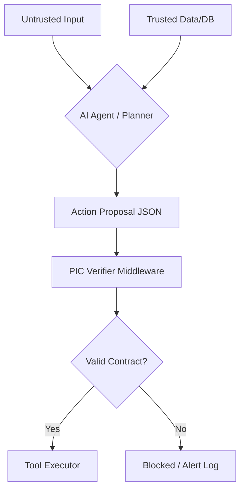

# <p> PIC Standard: Provenance & Intent Contracts</p>
**The Open Protocol for Causal Governance in Agentic AI.**

PIC closes the **causal gap**: when untrusted inputs (prompt injection, user text, web pages) influence **high‑impact side effects** (payments, exports, infra changes), PIC forces a **machine‑verifiable contract** between *what the agent claims* and *what evidence actually backs it*.

[](LICENSE)
[]()

---

## Quickstart (60 seconds)

### Option A — Install from PyPI (recommended)

Pick the extras you need:

```bash
# core (schema + verifier + CLI)
pip install pic-standard

# LangGraph integration
pip install "pic-standard[langgraph]"

# MCP integration
pip install "pic-standard[mcp]"

# Signature evidence (Ed25519)
pip install "pic-standard[crypto]"
```

Verify an example proposal (schema + verifier):

```bash
pic-cli verify examples/financial_irreversible.json
```

Expected output:

```text
✅ Schema valid
✅ Verifier passed
```

Validate schema only:

```bash
pic-cli schema examples/financial_irreversible.json
```

Expected output:

```text
✅ Schema valid
```

### Option B — Install from source (dev / contributors)

```bash
git clone https://github.com/madeinplutofabio/pic-standard.git
cd pic-standard
pip install -e .
pip install -r sdk-python/requirements-dev.txt
```

Run tests:

```bash
pytest -q
```

Run the CLI:

```bash
pic-cli verify examples/financial_irreversible.json
```

If your shell still uses an old `pic-cli` after editable installs:

```bash
python -m pic_standard.cli verify examples/financial_hash_ok.json --verify-evidence
```

---

## The PIC contract (what an agent proposes *before* a tool call)

PIC uses an **Action Proposal JSON** (protocol: `PIC/1.0`). The agent emits it right before executing a tool:

- **intent**: what it’s trying to do
- **impact**: risk class (`money`, `privacy`, `compute`, `irreversible`, …)
- **provenance**: which inputs influenced the decision (and their trust)
- **claims + evidence**: what the agent asserts and which evidence IDs support it
- **action**: the actual tool call being attempted (**tool binding**)

---

## Evidence

### Evidence v0.3 — Resolvable SHA‑256 artifacts (`type="hash"`)

PIC v0.3 adds **deterministic evidence verification**: evidence IDs can point to a real artifact and be validated via **SHA‑256**.

What this gives you:

- `evidence[].id` is no longer just a label — it can be **resolved** to a file (`file://...`) and **verified**.
- Verification is **fail‑closed**: if evidence can’t be resolved or verified, high‑impact actions are blocked.
- “Trusted” becomes an **output** of verification (in‑memory): verified evidence IDs upgrade `provenance[].trust` → `trusted` before the verifier runs.

Verify evidence only:

```bash
pic-cli evidence-verify examples/financial_hash_ok.json
```

Expected output:

```text
✅ Schema valid
✅ Evidence invoice_123: sha256 verified
✅ Evidence verification passed
```

Fail (expected):

```bash
pic-cli evidence-verify examples/failing/financial_hash_bad.json
```

Expected output:

```text
✅ Schema valid
❌ Evidence invoice_123: sha256 mismatch (expected ..., got ...)
❌ Evidence verification failed
```

Gate the verifier on evidence (schema → evidence verify → provenance upgrade → verifier):

```bash
pic-cli verify examples/financial_hash_ok.json --verify-evidence
```

Fail‑closed:

```bash
pic-cli verify examples/failing/financial_hash_bad.json --verify-evidence
```

**Hash evidence references (`file://`)**

`file://artifacts/invoice_123.txt` is resolved relative to the JSON proposal directory:

- `examples/financial_hash_ok.json` → `examples/artifacts/invoice_123.txt`

Evidence is sandboxed: the resolved path must stay under the configured `evidence_root_dir` (default: the proposal directory / server-configured root).

On Windows, recompute SHA‑256 with:

```powershell
Get-FileHash .\examples\artifacts\invoice_123.txt -Algorithm SHA256
```

---

### Evidence v0.4 — Signature evidence (Ed25519) (`type="sig"`)

PIC v0.4 adds **signature verification** so approvals can be endorsed by trusted signers (CFO, internal service, billing system) **without shipping the raw artifact**.

**How it works**
- The proposal includes an evidence entry with:
  - `payload` (the exact bytes-to-verify, as UTF‑8 string)
  - `signature` (base64 Ed25519 signature)
  - `key_id` (public key identifier)
- The verifier resolves `key_id` against a **trusted keyring** (not inside the proposal).

> Canonicalization is the caller’s responsibility. If you change whitespace, ordering, or separators in `payload`, signatures will fail.

**Install**
```bash
pip install "pic-standard[crypto]"
```

**Configure trusted keys**

PIC loads keys from:
- `PIC_KEYS_PATH` (if set), otherwise
- `./pic_keys.json` (if present), otherwise
- an empty keyring (no trusted signers configured)

Example keyring file format:

```json
{
  "trusted_keys": {
    "demo_signer_v1": "<base64-or-hex-or-PEM Ed25519 public key>"
  }
}
```

PowerShell example:

```powershell
$env:PIC_KEYS_PATH=".\pic_keys.json"
pic-cli keys
```

**Run signature evidence verification**

Signed example:

```bash
pic-cli evidence-verify examples/financial_sig_ok.json
```

Expected output:

```text
✅ Schema valid
✅ Evidence approval_123: signature verified (key_id='demo_signer_v1')
✅ Evidence verification passed
```

Tampered example (expected fail):

```bash
pic-cli evidence-verify examples/failing/financial_sig_bad.json
```

Expected output:

```text
✅ Schema valid
❌ Evidence approval_123: signature invalid (key_id='demo_signer_v1')
❌ Evidence verification failed
```

**Key rotation guidance (practical)**
- Add a new key ID (e.g. `cfo_key_v2`) to the keyring.
- Start emitting proposals with `key_id="cfo_key_v2"`.
- Remove old key IDs when you want to revoke/retire them.

---

## Integrations

### LangGraph (anchor integration)

PIC can be enforced at the **tool boundary** using a LangGraph‑compatible tool execution node.

This repo provides:

- `pic_standard.integrations.PICToolNode`: a drop‑in ToolNode wrapper that:
  - requires a PIC proposal in each tool call (`args["__pic"]`)
  - validates **schema + verifier + tool binding**
  - blocks high‑impact calls when provenance is insufficient
  - returns `ToolMessage` outputs (LangGraph state)

Run the demo:

```bash
pip install -r sdk-python/requirements-langgraph.txt
python examples/langgraph_pic_toolnode_demo.py
```

Expected output:

```text
✅ blocked as expected (untrusted money)
✅ allowed as expected (trusted money)
```

Tool‑call contract (PIC proposal is attached under `__pic`):

```json
{
  "name": "payments_send",
  "args": {
    "amount": 500,
    "__pic": {
      "protocol": "PIC/1.0",
      "intent": "Send payment",
      "impact": "money",
      "provenance": [{"id": "invoice_123", "trust": "trusted", "source": "evidence"}],
      "claims": [{"text": "Pay $500", "evidence": ["invoice_123"]}],
      "action": {"tool": "payments_send", "args": {"amount": 500}}
    }
  },
  "id": "tool_call_1"
}
```

> Tool binding is enforced: `proposal.action.tool` must match the actual tool name.

---

### MCP (Model Context Protocol) — production defaults for tool guarding

PIC can also be enforced at the **MCP tool boundary** with a small wrapper:

- `pic_standard.integrations.mcp_pic_guard.guard_mcp_tool(...)`

This integration is designed for production defaults:

- **Fail‑closed** (blocks on verifier/evidence failure)
- **No exception leakage by default** (`PIC_DEBUG` gating)
- **Request correlation** (`request_id` / `__pic_request_id` appears in audit logs)
- **Hard limits** (proposal size/items; evidence file sandbox + max bytes; evaluation time budget)

#### Run the MCP demo (stdio client ↔ stdio server)

Install demo deps:

```bash
pip install -r sdk-python/requirements-mcp.txt
```

Run the client (it spawns the server via stdio):

```bash
python -u examples/mcp_pic_client_demo.py
```

Expected output (high level):

```text
1) untrusted money -> should be BLOCKED
✅ blocked as expected

2) trusted money -> should be ALLOWED
TEXT: sent $500
```

#### Enterprise notes (hardening)

**1) Debug gating (no leakage by default)**
- Default (`PIC_DEBUG` unset/0): error payloads include only `code` + minimal `message`.
- Debug (`PIC_DEBUG=1`): error payloads may include diagnostic `details`.

Windows PowerShell:

```powershell
$env:PIC_DEBUG="0"
python -u examples/mcp_pic_client_demo.py

$env:PIC_DEBUG="1"
python -u examples/mcp_pic_client_demo.py
```

**2) Request tracing**
If your tool call includes:
- `__pic_request_id="abc123"` (recommended reserved key), or
- `request_id="abc123"`

…the guard logs a single structured line with that correlation ID.

**3) Limits / DoS hardening**
- Proposal limits: max bytes + max counts (provenance/claims/evidence)
- Evidence hardening:
  - sandboxed to `evidence_root_dir` (prevents path escape)
  - `max_file_bytes` (default 5MB)
- PIC evaluation time budget:
  - `PICEvaluateLimits(max_eval_ms=...)` blocks if enforcement work exceeds the budget

> Tool execution timeouts are an **executor concern** (sync Python can’t reliably kill a running function). PIC protects the *policy enforcement path*.

---

## Stability & Versioning

- `PIC/1.0` refers to the **proposal protocol** (schema).
- The Python package follows **Semantic Versioning**. Breaking changes will bump the major version.

---

## Why PIC (vs “guardrails”) in one line

Guardrails constrain **what the model says**. PIC constrains **what the agent is allowed to do** (side effects) based on **verifiable provenance + evidence**.

---

## How it works (flow)



---

## Roadmap (protocol)

- [✅] Phase 1: Standardize money and privacy Impact Classes.
- [✅] Phase 2: Reference Python verifier + CLI.
- [✅] Phase 3: Anchor integrations (LangGraph + MCP).
- [✅] Phase 4: Evidence verification (hash v0.3 + signature v0.4).

---

## 🤝 Community & Governance

We’re actively seeking:

- Security researchers to stress‑test causal logic
- Framework authors to build native integrations
- Enterprise architects to define domain Impact Classes

Maintained by [ @fmsalvadori](https://www.linkedin.com/in/fmsalvadori/)
&nbsp;
[ MadeInPluto](https://github.com/madeinplutofabio)
