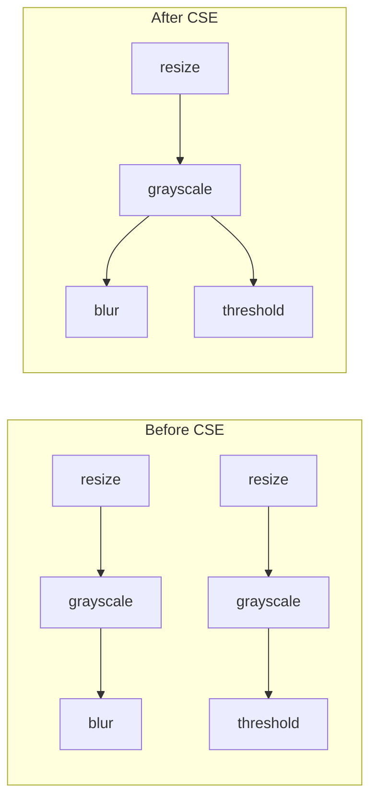

# Multi-Output Pipelines

Extract multiple intermediate results from a single optimized execution.

## Overview

polars-cv's multi-output feature enables:

- Extracting multiple pipeline stages
- Automatic CSE (Common Subexpression Elimination)
- Single execution pass for all outputs
- Struct column with named fields

## Basic Multi-Output

Use `.alias()` to name checkpoints and dict `.sink()` for multi-output:

```python
import polars as pl
from polars_cv import Pipeline

# Build pipeline with named checkpoints
base = (
    pl.col("image")
    .cv.pipe(Pipeline().source("image_bytes").resize(128, 128))
    .alias("resized")
)

gray = base.pipe(Pipeline().grayscale()).alias("gray")
thresh = gray.pipe(Pipeline().threshold(128)).alias("thresh")

# Merge branches for multi-output
merged = thresh.merge_pipe(gray)

# Sink multiple outputs
result = df.with_columns(
    outputs=merged.sink({
        "resized": "png",
        "gray": "png",
        "thresh": "png",
    })
)

# outputs is a Struct column with fields: resized, gray, thresh
```

## Extracting Outputs

Access individual outputs from the Struct column:

```python
# Extract individual fields
resized = result.select(pl.col("outputs").struct.field("resized"))
gray = result.select(pl.col("outputs").struct.field("gray"))

# Or extract all at once
extracted = result.select(
    pl.col("outputs").struct.field("resized").alias("resized_img"),
    pl.col("outputs").struct.field("gray").alias("gray_img"),
    pl.col("outputs").struct.field("thresh").alias("thresh_img"),
)
```

## Common Subexpression Elimination (CSE)

polars-cv automatically detects and shares common operations:



```python
# Both branches share: resize → grayscale
base = pl.col("image").cv.pipe(
    Pipeline().source("image_bytes").resize(100, 100)
)
gray = base.pipe(Pipeline().grayscale()).alias("gray")

# Branch 1: blur
blur = gray.pipe(Pipeline().blur(2.0)).alias("blur")

# Branch 2: threshold  
thresh = gray.pipe(Pipeline().threshold(128)).alias("thresh")

# CSE automatically shares the gray computation
merged = blur.merge_pipe(thresh)
result = df.with_columns(
    outputs=merged.sink({"gray": "png", "blur": "png", "thresh": "png"})
)
```

## Merge Patterns

### Merging Multiple Branches

```python
# Create several branches
branch1 = base.pipe(ops1).alias("out1")
branch2 = base.pipe(ops2).alias("out2")
branch3 = base.pipe(ops3).alias("out3")

# Merge all into one graph
merged = branch1.merge_pipe(branch2).merge_pipe(branch3)
```

### Including Earlier Stages

```python
base = expr.cv.pipe(pipe).alias("base")
processed = base.pipe(more_ops).alias("processed")

# Include base in output
merged = processed.merge_pipe(base)
result = df.with_columns(
    outputs=merged.sink({"base": "png", "processed": "png"})
)
```

## Mixed Output Formats

Different outputs can have different formats:

```python
result = df.with_columns(
    outputs=merged.sink({
        "display": "png",           # For display
        "analysis": "numpy",        # For NumPy analysis
        "raw_data": "list",         # As Polars List
    })
)
```

## Multi-Source Multi-Output

Combine multiple input columns with multiple outputs:

```python
# Two different input columns
img = pl.col("image").cv.pipe(Pipeline().source("image_bytes").resize(128, 128))
mask = pl.col("mask_contour").cv.pipe(Pipeline().source("contour", shape=img))

# Apply mask
masked = img.apply_mask(mask).alias("masked")

# Merge for multi-output
merged = masked.merge_pipe(img.alias("original")).merge_pipe(mask.alias("mask"))

result = df.with_columns(
    outputs=merged.sink({
        "original": "png",
        "mask": "png",
        "masked": "png",
    })
)
```

## Performance Benefits

| Approach | Execution Passes | Memory |
|----------|-----------------|--------|
| Separate `.cv.pipe()` calls | N (one per output) | N buffers |
| Multi-output with `.sink({...})` | 1 | Shared buffers |

## Best Practices

1. **Use `.alias()`**: Name every checkpoint you want to output
2. **Merge All Branches**: Call `.merge_pipe()` to include all in graph
3. **CSE is Automatic**: Don't manually deduplicate—it's handled
4. **Match Output Names**: Sink dict keys must match alias names
5. **Extract Early**: Pull out needed fields to avoid carrying the whole Struct

## Next Steps

- [Binary Operations](binary-ops.md) - Combine pipeline outputs

