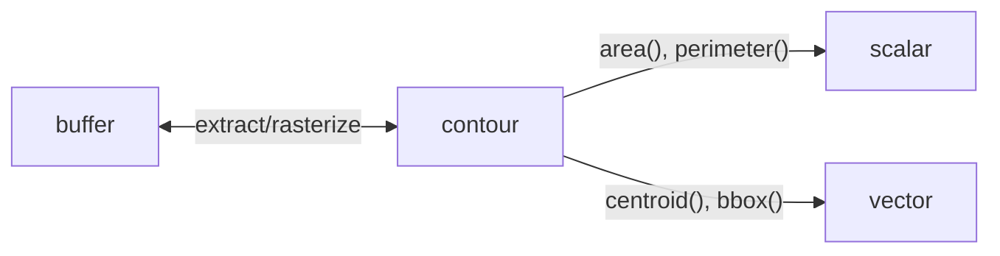

# Domains

polars-cv supports **multi-domain pipelines** that seamlessly transition between different data types.

## Domain Types

| Domain | Description | Example Data |
|--------|-------------|--------------|
| `buffer` | Image/array data | Pixels, tensors |
| `contour` | Polygon geometry | Extracted shapes |
| `scalar` | Single number | Area, perimeter |
| `vector` | Multiple numbers | Centroid (x, y), BBox |

## Domain Transitions



### Buffer → Contour

Extract contours from a binary mask:

```python
# Create binary mask and extract contours
pipe = (
    Pipeline()
    .source("image_bytes")
    .grayscale()
    .threshold(128)
    .extract_contours()
)

df = pl.DataFrame({"image": [png_bytes]})
# Sink as "native" returns the contour structs
result = df.with_columns(
    contours=pl.col("image").cv.pipe(pipe).sink("native")
)
```

### Contour → Buffer

Rasterize contours to a mask:

```python
# Contour source rasterizes to buffer
pipe = Pipeline().source("contour", width=200, height=200)

df = pl.DataFrame({"contour": [contour_data]}).cast({"contour": CONTOUR_SCHEMA})
result = df.with_columns(
    mask=pl.col("contour").cv.pipe(pipe).sink("numpy")
)
```

### Contour → Scalar/Vector

Compute geometric measurements using the `.contour` namespace on Polars expressions:

```python
import polars as pl

result = df.with_columns(
    area=pl.col("contour").contour.area(),
    perimeter=pl.col("contour").contour.perimeter(),
    centroid=pl.col("contour").contour.centroid(),
    bbox=pl.col("contour").contour.bounding_box(),
)
```

## Type Inference

polars-cv performs **static type inference** at Polars planning time. The output type of a pipeline is determined by the operations and the final `.sink()` format.

```python
# Returns Binary (PNG bytes)
pl.col("image").cv.pipe(pipe).sink("png")

# Returns Float64 (Scalar)
pl.col("contour").contour.area()
```

