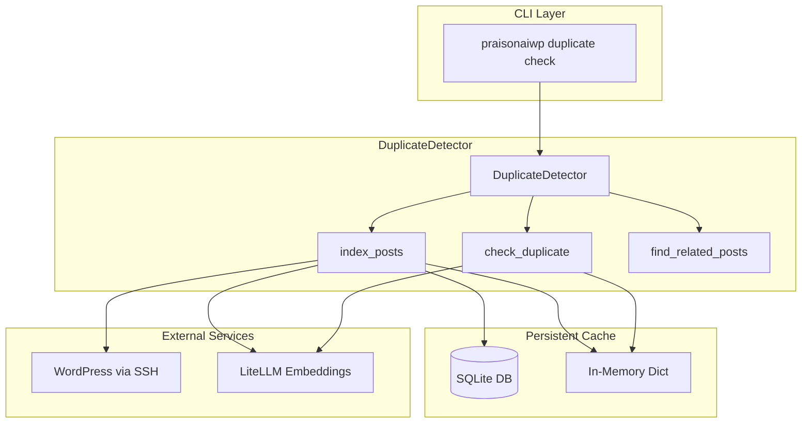
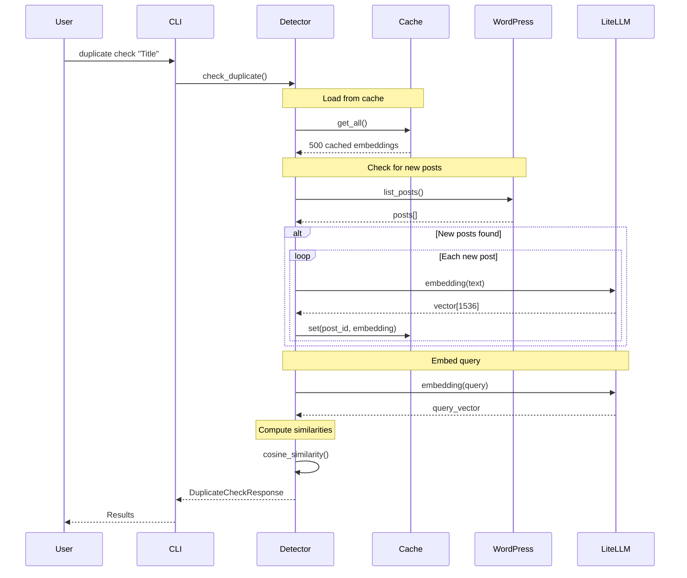
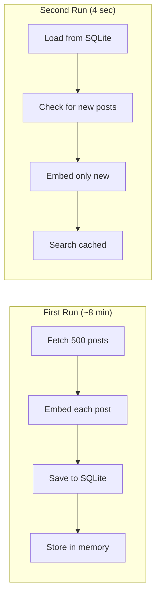

# Duplicate Detection

Semantic duplicate detection using AI embeddings with persistent caching.

## Quick Reference

| Component | Technology |
|-----------|------------|
| **Embeddings** | `litellm` (OpenAI, Gemini, etc.) |
| **Cache** | SQLite (`~/.praisonaiwp/cache/embeddings.db`) |
| **Similarity** | Cosine similarity |
| **Default Threshold** | 0.7 (similar), 0.95 (duplicate) |

---

## Architecture



---

## Data Flow



---

## Caching Strategy



### Cache Location

```
~/.praisonaiwp/
└── cache/
    └── embeddings.db    # SQLite database
```

### Database Schema

```sql
CREATE TABLE embeddings (
    post_id INTEGER PRIMARY KEY,
    title TEXT,
    url TEXT,
    content_hash TEXT,
    embedding TEXT,        -- JSON array of floats
    created_at TIMESTAMP
);
```

---

## Component Details

### What is Used

| Component | Source | Notes |
|-----------|--------|-------|
| **Embeddings** | `litellm.embedding()` | Direct call, NOT through Agent() |
| **Storage** | Custom SQLite | NOT using praisonaiagents cache |
| **Similarity** | Custom `cosine_similarity()` | Pure Python implementation |
| **WordPress** | `WPClient.list_posts()` | Via SSH/WP-CLI |

### What is NOT Used

| Component | Reason |
|-----------|--------|
| `praisonaiagents.Knowledge` | API mismatch with search results |
| `praisonaiagents.Agent()` cache | No embedding cache feature exists |
| REST API | Using SSH instead |

---

## CLI Commands

### duplicate check

Check if content is duplicate before publishing.

```bash
praisonaiwp duplicate check [OPTIONS] CONTENT
```

| Option | Type | Default | Description |
|--------|------|---------|-------------|
| `--threshold` | float | 0.7 | Similarity threshold (0-1) |
| `--duplicate-threshold` | float | 0.95 | Definite duplicate threshold |
| `--type` | string | post | Post type to search |
| `--category` | string | - | Category filter |
| `--count` | int | 5 | Number of results |
| `--file` | path | - | Read from file |
| `--title-only` | flag | - | Check titles only |
| `--json` | flag | - | JSON output |
| `--verbose` | flag | - | Detailed logging |

**Examples:**

```bash
# Basic check
praisonaiwp duplicate check "PraisonAI Tutorial Guide"

# Stricter threshold
praisonaiwp duplicate check "Title" --threshold 0.9

# JSON for scripting
praisonaiwp duplicate check "Title" --json

# From file
praisonaiwp duplicate check "" --file article.md
```

---

### duplicate related

Find posts related to an existing post.

```bash
praisonaiwp duplicate related [OPTIONS] POST_ID
```

| Option | Type | Default | Description |
|--------|------|---------|-------------|
| `--count` | int | 5 | Number of related posts |
| `--threshold` | float | 0.3 | Minimum similarity |
| `--json` | flag | - | JSON output |
| `--verbose` | flag | - | Detailed logging |

**Examples:**

```bash
# Find related posts
praisonaiwp duplicate related 49287

# More results
praisonaiwp duplicate related 49287 --count 10 --threshold 0.2
```

---

## Performance

| Metric | Value |
|--------|-------|
| **First run** | ~8 minutes (500 posts) |
| **Cached run** | ~4 seconds |
| **Memory** | ~50MB for 500 posts |
| **Disk** | ~75MB SQLite file |

---

## Configuration

### Environment Variables

```bash
# Required: Embedding API key
export OPENAI_API_KEY="sk-..."

# Optional: Use different provider
export GEMINI_API_KEY="..."
```

### Thresholds

| Score | Status | Action |
|-------|--------|--------|
| 0.95+ | DUPLICATE | Consider updating existing |
| 0.85-0.94 | SIMILAR | Review for overlap |
| < 0.85 | UNIQUE | Safe to publish |

---

## Troubleshooting

### Clear Cache

```bash
# Via Python
python -c "from praisonaiwp.ai.duplicate_detector import EmbeddingCache; EmbeddingCache().clear()"

# Or delete file
rm ~/.praisonaiwp/cache/embeddings.db
```

### API Errors

| Error | Solution |
|-------|----------|
| `insufficient_quota` | Check OpenAI billing |
| `rate_limit` | Add delay, reduce batch |
| `connection_error` | Check API key |
