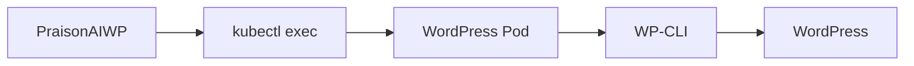

# Kubernetes Setup

PraisonAIWP supports Kubernetes-hosted WordPress installations via `kubectl exec`.

## Prerequisites

- `kubectl` installed and configured
- Access to the Kubernetes cluster running WordPress
- WordPress pod accessible via kubectl exec

## Configuration

Add a Kubernetes server to your config:

```yaml
servers:
  my-k8s-site:
    website: https://my-k8s-site.example.com
    description: "WordPress on Kubernetes"
    
    # Transport type
    transport: kubernetes
    
    # Pod selection (choose one)
    pod_selector: app=wordpress      # Label selector
    # OR
    pod_name: wordpress-pod-abc123   # Specific pod name
    
    # Kubernetes settings
    namespace: default               # Namespace (default: default)
    container: wordpress             # Container name (if multi-container pod)
    context: my-cluster              # kubectl context (optional)
    
    # WordPress paths
    wp_path: /var/www/html
    php_bin: /usr/local/bin/php
    wp_cli: wp
```

## Configuration Options

| Option | Required | Description |
|--------|----------|-------------|
| `transport` | Yes | Set to `kubernetes` or `k8s` |
| `pod_selector` | Yes* | Label selector to find pod |
| `pod_name` | Yes* | Specific pod name |
| `namespace` | No | Kubernetes namespace (default: default) |
| `container` | No | Container name for multi-container pods |
| `context` | No | kubectl context to use |
| `wp_path` | Yes | WordPress path inside container |
| `php_bin` | No | PHP binary path (default: php) |
| `wp_cli` | No | WP-CLI path (default: wp) |

*Either `pod_selector` or `pod_name` is required.

## Example: WordPress on AKS

```yaml
servers:
  praison-ai:
    website: https://praison.ai
    description: "PraisonAI website on AKS"
    transport: kubernetes
    pod_selector: app=php-nginx
    namespace: default
    container: wb-php
    wp_path: /var/www/pa/web
    php_bin: /usr/local/bin/php
    wp_cli: wp
```

## Usage

```bash
# List posts
praisonaiwp --server praison-ai list

# Create a post
praisonaiwp --server praison-ai create "My Post" --content "<p>Hello!</p>"

# Check connection
praisonaiwp --server praison-ai help
```

## How It Works

The Kubernetes transport uses:

1. **Pod Resolution**: If `pod_selector` is used, finds a running pod matching the labels
2. **Command Execution**: Uses `kubectl exec` to run WP-CLI commands
3. **File Transfer**: Uses `kubectl cp` for file uploads/downloads



## Troubleshooting

### Cannot find pod

```
Error: No running pods found with selector: app=wordpress
```

Check your pod selector:
```bash
kubectl get pods -l app=wordpress -n default
```

### Permission denied

Ensure your kubectl context has permissions:
```bash
kubectl auth can-i exec pods -n default
```

### Container not found

If your pod has multiple containers, specify the container name:
```yaml
container: wordpress
```

List containers in a pod:
```bash
kubectl get pod POD_NAME -o jsonpath='{.spec.containers[*].name}'
```

### WP-CLI not found

Install WP-CLI in your container or specify the correct path:
```yaml
wp_cli: /usr/local/bin/wp
# OR if using wp as a script
wp_cli: /var/www/html/wp
```
