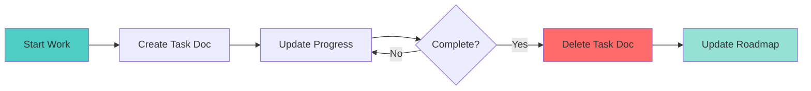

# Active Tasks

Documents tracking active work sessions or multi-step tasks.

## Current Tasks

!!! info "No active tasks"
    There are currently no active task documents. Tasks are created when starting significant work and deleted upon completion.

## Task Template

When creating a new task document, use this template:

```markdown
# Task: <Title>

**Status**: In Progress | Blocked | Complete
**Started**: YYYY-MM-DD
**Updated**: YYYY-MM-DD

## Objective

What this task aims to accomplish.

## Progress

- [x] Completed step
- [ ] Pending step

## Notes

Implementation notes, decisions made, etc.

## Blockers

Any blockers or dependencies.
```

## File Naming

- Use `task-` prefix: `task-jwt-auth.md`
- Use lowercase with hyphens
- Be descriptive but concise

## Task Lifecycle



## Task vs Plan vs Issue

| Document Type | When to Use | Lifespan |
|--------------|-------------|----------|
| **Task** | Active work sessions | Short (days) |
| **Plan** | Feature design & specs | Medium (weeks) |
| **Issue** | Bugs & problems | Until resolved |
