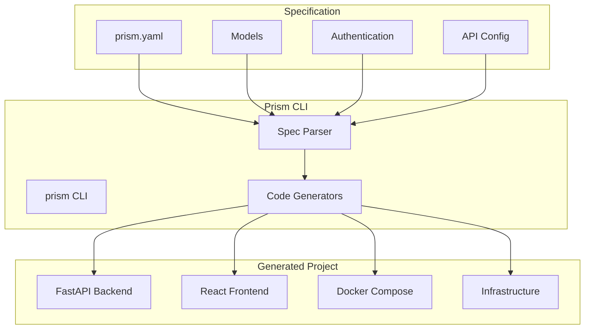
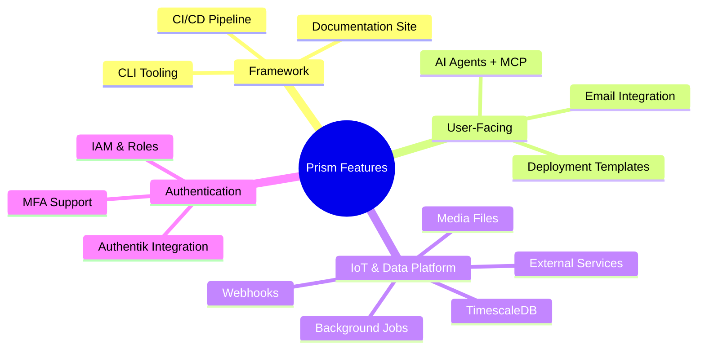

# Prism Development Documentation

Welcome to the internal development documentation for the **Prism** project. This site contains roadmaps, implementation plans, issue tracking, and development guidelines.

## Quick Links

-   :material-map-marker-path:{ .lg .middle } **[Roadmap](roadmap.md)**

    ---

    Development timeline, priorities, and feature status

-   :material-file-document-multiple:{ .lg .middle } **[Plans](plans/index.md)**

    ---

    Detailed implementation plans for features

-   :material-bug:{ .lg .middle } **[Issues](issues/index.md)**

    ---

    Bug tracking and problem documentation

-   :material-checkbox-marked:{ .lg .middle } **[Tasks](tasks/index.md)**

    ---

    Active work session tracking

## Architecture Overview

## Current Priorities

| Priority | Feature | Status |
|----------|---------|--------|
| P0 | [Background Jobs & Scheduling](plans/background-jobs-scheduling-plan.md) | :material-circle-outline: Not Started |
| P0 | [TimescaleDB Support](plans/timescaledb-support-plan.md) | :material-circle-outline: Not Started |
| P1 | [External Service Integration](plans/external-service-integration-plan.md) | :material-circle-outline: Not Started |
| P1 | [Webhook/Event Handling](plans/webhook-event-handling-plan.md) | :material-circle-outline: Not Started |
| P1 | [Authentik Integration](plans/authentik-integration-plan.md) | :material-circle-outline: Not Started |

## Feature Categories

## Getting Started

1. **Read the [Documentation Guide](dev-docs.md)** - Understand folder structure and conventions
2. **Check the [Roadmap](roadmap.md)** - See current priorities and timeline
3. **Review relevant [Plans](plans/index.md)** - Detailed implementation specifications

## Status Legend

| Icon | Meaning |
|------|---------|
| :material-check-circle:{ .green } | Complete |
| :material-progress-clock:{ .yellow } | In Progress |
| :material-circle-outline: | Not Started |
| :material-alert-circle:{ .red } | Blocked |
