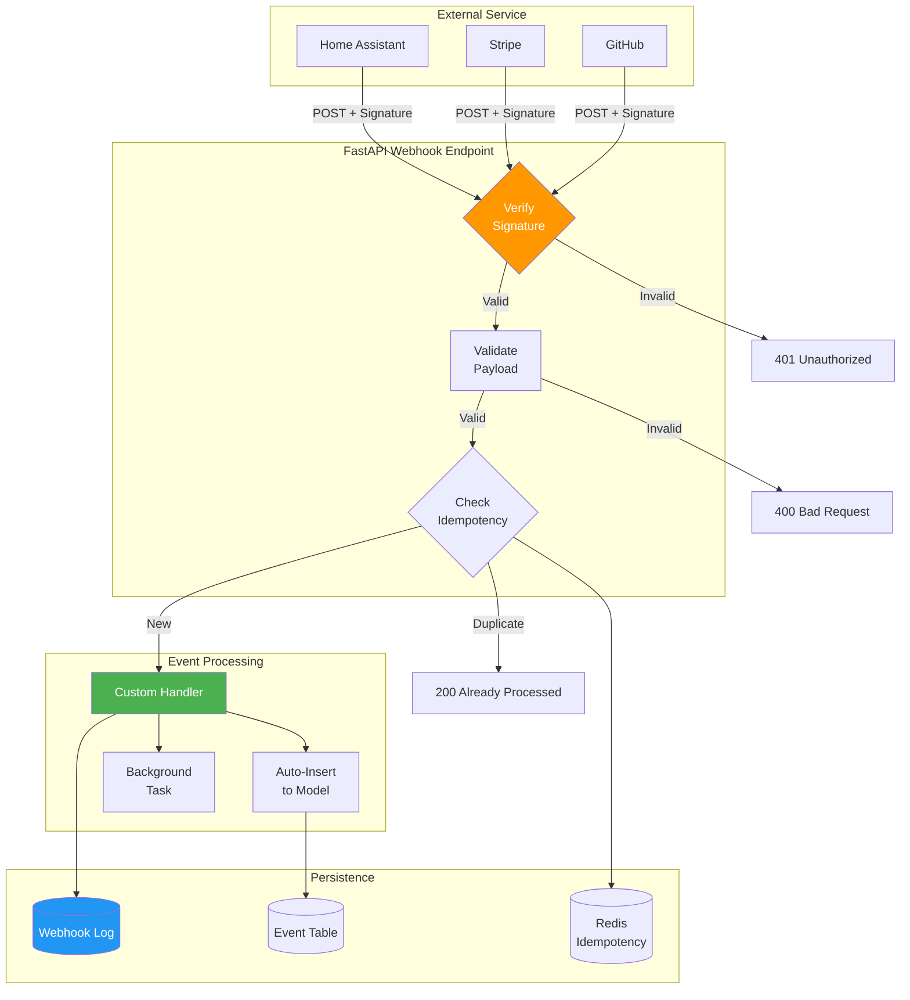
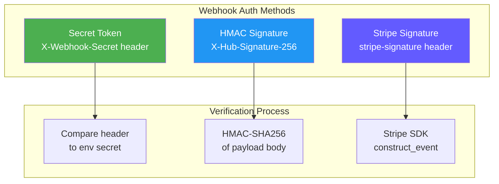
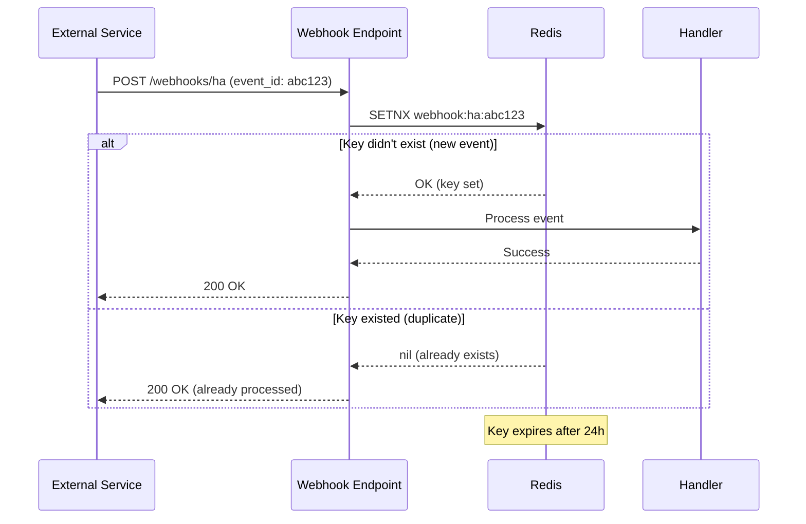
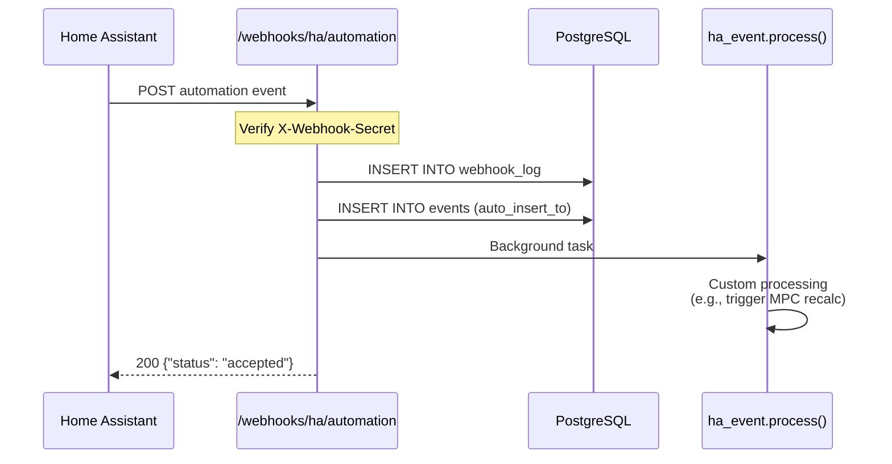
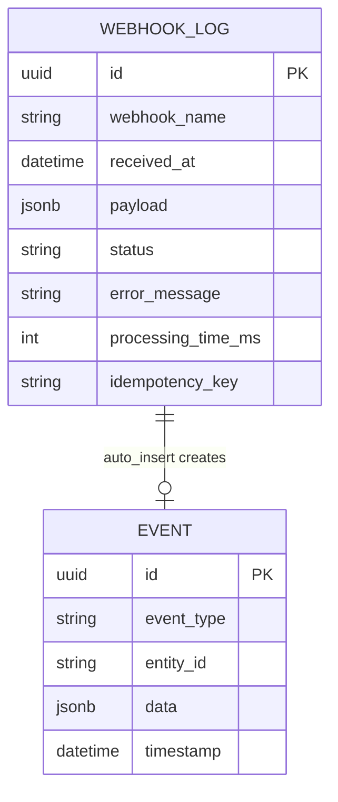

# Plan: Webhook/Event Handling

**Status**: Draft
**Author**: Hjemme IT Platform Team
**Created**: 2026-01-24
**Updated**: 2026-01-24
**Priority**: P1 (Important)
**Roadmap Reference**: Priority 10

## Overview

Add declarative webhook endpoint definitions to Prism, enabling auto-generation of authenticated webhook handlers with payload validation, optional database insertion, and audit logging. This supports integration with Home Assistant automations, payment providers, CI/CD systems, and other event sources.

## Goals

- Define webhooks declaratively in `prism.yaml`
- Auto-generate FastAPI endpoints with authentication
- Validate incoming payloads with Pydantic
- Support automatic database insertion of events
- Maintain webhook audit log for debugging
- Handle idempotency and replay protection

## Non-Goals

- WebSocket connections (separate feature)
- Outbound webhook sending (use external service integration)
- Complex event routing/pub-sub (keep simple)

## Architecture

### Webhook Processing Flow



### Authentication Methods



### Idempotency Handling



### Home Assistant Event Example



### Webhook Log Schema



## Design

### Technical Approach

#### 1. Specification Format

```yaml
# prism.yaml
webhooks:
  - name: ha_automation_event
    path: /webhooks/ha/automation
    description: Receives automation events from Home Assistant
    auth:
      type: secret_token
      header: X-Webhook-Secret
      secret: ${HA_WEBHOOK_SECRET}
    payload_schema:
      event_type:
        type: string
        required: true
      entity_id:
        type: string
        required: true
      new_state:
        type: string
      old_state:
        type: string
      timestamp:
        type: datetime
      attributes:
        type: object
    handler: handlers.ha_event.process
    auto_insert_to: Event  # Optional: auto-insert to model
    log_payloads: true
    idempotency:
      enabled: true
      key_field: event_id  # Field to use for deduplication
      ttl: 24h

  - name: stripe_payment
    path: /webhooks/stripe
    description: Stripe payment webhooks
    auth:
      type: stripe_signature
      secret: ${STRIPE_WEBHOOK_SECRET}
    payload_schema:
      id: string
      type: string
      data:
        type: object
    handler: handlers.stripe.process_payment
    log_payloads: false  # Don't log sensitive payment data

  - name: github_push
    path: /webhooks/github
    description: GitHub push events for deployment triggers
    auth:
      type: github_signature
      secret: ${GITHUB_WEBHOOK_SECRET}
    payload_schema:
      ref: string
      repository:
        full_name: string
      pusher:
        name: string
    handler: handlers.github.on_push
```

#### 2. Generated Components

**Webhook Router** (`packages/backend/src/routes/webhooks.py`):

```python
# AUTO-GENERATED - DO NOT EDIT

from datetime import datetime
from fastapi import APIRouter, Request, HTTPException, Depends, BackgroundTasks
from pydantic import BaseModel
import hmac
import hashlib

from ..core.config import settings
from ..models.webhook_log import WebhookLog
from ..services.database import get_db
from ..handlers import ha_event, stripe, github

router = APIRouter(prefix="/webhooks", tags=["webhooks"])


class HAAutomationEventPayload(BaseModel):
    event_type: str
    entity_id: str
    new_state: str | None = None
    old_state: str | None = None
    timestamp: datetime | None = None
    attributes: dict | None = None


async def verify_secret_token(request: Request) -> None:
    """Verify X-Webhook-Secret header matches expected secret."""
    token = request.headers.get("X-Webhook-Secret")
    if not token or not hmac.compare_digest(token, settings.HA_WEBHOOK_SECRET):
        raise HTTPException(401, "Invalid webhook secret")


async def verify_stripe_signature(request: Request) -> bytes:
    """Verify Stripe webhook signature."""
    import stripe
    payload = await request.body()
    sig_header = request.headers.get("Stripe-Signature")
    try:
        stripe.Webhook.construct_event(
            payload, sig_header, settings.STRIPE_WEBHOOK_SECRET
        )
    except stripe.error.SignatureVerificationError:
        raise HTTPException(401, "Invalid Stripe signature")
    return payload


async def verify_github_signature(request: Request) -> bytes:
    """Verify GitHub webhook signature."""
    payload = await request.body()
    signature = request.headers.get("X-Hub-Signature-256", "")
    expected = "sha256=" + hmac.new(
        settings.GITHUB_WEBHOOK_SECRET.encode(),
        payload,
        hashlib.sha256
    ).hexdigest()
    if not hmac.compare_digest(signature, expected):
        raise HTTPException(401, "Invalid GitHub signature")
    return payload


@router.post("/ha/automation")
async def ha_automation_webhook(
    payload: HAAutomationEventPayload,
    background_tasks: BackgroundTasks,
    db: AsyncSession = Depends(get_db),
    _: None = Depends(verify_secret_token)
):
    """
    Receives automation events from Home Assistant.

    Authentication: X-Webhook-Secret header
    """
    # Log webhook receipt
    log = WebhookLog(
        webhook_name="ha_automation_event",
        received_at=datetime.utcnow(),
        payload=payload.model_dump() if settings.LOG_WEBHOOK_PAYLOADS else None,
        status="processing"
    )
    db.add(log)
    await db.commit()

    try:
        # Auto-insert to Event model if configured
        # (Generated based on auto_insert_to config)
        event = Event(
            event_type=payload.event_type,
            entity_id=payload.entity_id,
            data=payload.model_dump(),
            timestamp=payload.timestamp or datetime.utcnow()
        )
        db.add(event)

        # Call custom handler in background
        background_tasks.add_task(
            ha_event.process,
            payload=payload,
            event_id=event.id
        )

        log.status = "success"
        await db.commit()

        return {"status": "accepted", "event_id": str(event.id)}

    except Exception as e:
        log.status = "failed"
        log.error_message = str(e)
        await db.commit()
        raise HTTPException(500, "Webhook processing failed")
```

**Webhook Log Model** (`packages/backend/src/models/webhook_log.py`):

```python
from datetime import datetime
from uuid import uuid4, UUID
from sqlalchemy import String, DateTime, Text, Integer
from sqlalchemy.dialects.postgresql import JSONB
from sqlalchemy.orm import Mapped, mapped_column

from ..core.database import Base


class WebhookLog(Base):
    __tablename__ = "webhook_log"

    id: Mapped[UUID] = mapped_column(primary_key=True, default=uuid4)
    webhook_name: Mapped[str] = mapped_column(String(100), index=True)
    received_at: Mapped[datetime] = mapped_column(DateTime(timezone=True), index=True)
    payload: Mapped[dict | None] = mapped_column(JSONB, nullable=True)
    status: Mapped[str] = mapped_column(String(20))  # processing, success, failed
    error_message: Mapped[str | None] = mapped_column(Text, nullable=True)
    processing_time_ms: Mapped[int | None] = mapped_column(Integer, nullable=True)
    idempotency_key: Mapped[str | None] = mapped_column(String(255), nullable=True, index=True)
```

#### 3. Authentication Methods

Support multiple webhook authentication patterns:

```python
# packages/backend/src/webhooks/auth.py

class WebhookAuthMethod:
    """Base class for webhook authentication."""

    async def verify(self, request: Request) -> bool:
        raise NotImplementedError


class SecretTokenAuth(WebhookAuthMethod):
    """Verify secret token in header."""

    def __init__(self, header: str, secret: str):
        self.header = header
        self.secret = secret

    async def verify(self, request: Request) -> bool:
        token = request.headers.get(self.header)
        return token and hmac.compare_digest(token, self.secret)


class StripeSignatureAuth(WebhookAuthMethod):
    """Verify Stripe webhook signature."""

    def __init__(self, secret: str):
        self.secret = secret

    async def verify(self, request: Request) -> bool:
        import stripe
        payload = await request.body()
        sig = request.headers.get("Stripe-Signature")
        try:
            stripe.Webhook.construct_event(payload, sig, self.secret)
            return True
        except stripe.error.SignatureVerificationError:
            return False


class GitHubSignatureAuth(WebhookAuthMethod):
    """Verify GitHub webhook signature (HMAC-SHA256)."""

    def __init__(self, secret: str):
        self.secret = secret

    async def verify(self, request: Request) -> bool:
        payload = await request.body()
        signature = request.headers.get("X-Hub-Signature-256", "")
        expected = "sha256=" + hmac.new(
            self.secret.encode(), payload, hashlib.sha256
        ).hexdigest()
        return hmac.compare_digest(signature, expected)
```

#### 4. Idempotency Handling

Prevent duplicate processing of replayed webhooks:

```python
# packages/backend/src/webhooks/idempotency.py

class IdempotencyChecker:
    def __init__(self, cache: Redis, ttl: int = 86400):
        self.cache = cache
        self.ttl = ttl

    async def check_and_mark(self, webhook_name: str, key: str) -> bool:
        """
        Returns True if this is a new event, False if duplicate.
        Marks the key as processed.
        """
        cache_key = f"webhook:{webhook_name}:{key}"
        result = await self.cache.set(cache_key, "1", nx=True, ex=self.ttl)
        return result is not None  # True if key was set (new), False if existed
```

### API Changes

New webhook endpoints generated based on specification:
- `POST /webhooks/ha/automation` - Home Assistant events
- `POST /webhooks/stripe` - Stripe payments
- `POST /webhooks/github` - GitHub push events

Admin endpoints for webhook management:
- `GET /api/admin/webhooks` - List configured webhooks
- `GET /api/admin/webhooks/{name}/logs` - Get webhook logs
- `POST /api/admin/webhooks/{name}/test` - Send test webhook

### Database Changes

New table: `webhook_log`
- Stores all webhook receipts for debugging
- Indexed by webhook_name and received_at
- Optional payload storage (configurable per webhook)
- Idempotency key tracking

## Implementation Steps

1. [ ] Add `webhooks` section to specification schema
2. [ ] Implement authentication method handlers
3. [ ] Create webhook router generator template
4. [ ] Generate Pydantic models for payload schemas
5. [ ] Add WebhookLog model and migration
6. [ ] Implement idempotency checking (Redis or DB)
7. [ ] Add auto-insert to model feature
8. [ ] Create admin endpoints for webhook management
9. [ ] Write tests with mock webhooks
10. [ ] Document webhook specification and security

## Testing Strategy

1. **Unit Tests**: Auth verification, payload validation
2. **Integration Tests**: Full webhook flow with database
3. **Security Tests**: Signature verification, replay protection

```python
# tests/webhooks/test_ha_webhook.py

async def test_ha_webhook_valid_secret(client: AsyncClient, db: AsyncSession):
    response = await client.post(
        "/webhooks/ha/automation",
        json={
            "event_type": "switch.turned_on",
            "entity_id": "switch.garage",
            "new_state": "on",
            "old_state": "off"
        },
        headers={"X-Webhook-Secret": "test-secret"}
    )
    assert response.status_code == 200
    assert response.json()["status"] == "accepted"

    # Verify event was created
    events = await db.execute(select(Event))
    assert len(events.scalars().all()) == 1


async def test_ha_webhook_invalid_secret(client: AsyncClient):
    response = await client.post(
        "/webhooks/ha/automation",
        json={"event_type": "test"},
        headers={"X-Webhook-Secret": "wrong-secret"}
    )
    assert response.status_code == 401
```

## Rollout Plan

1. Release as opt-in via `webhooks:` section
2. Provide example configurations for common providers (Stripe, GitHub, Home Assistant)
3. Document security best practices (HTTPS, secret rotation)
4. Add webhook testing utilities

## Open Questions

- Should webhook handlers run synchronously or always in background tasks?
- How to handle webhook retries from providers (exponential backoff)?
- Should we provide a webhook simulator for testing?
