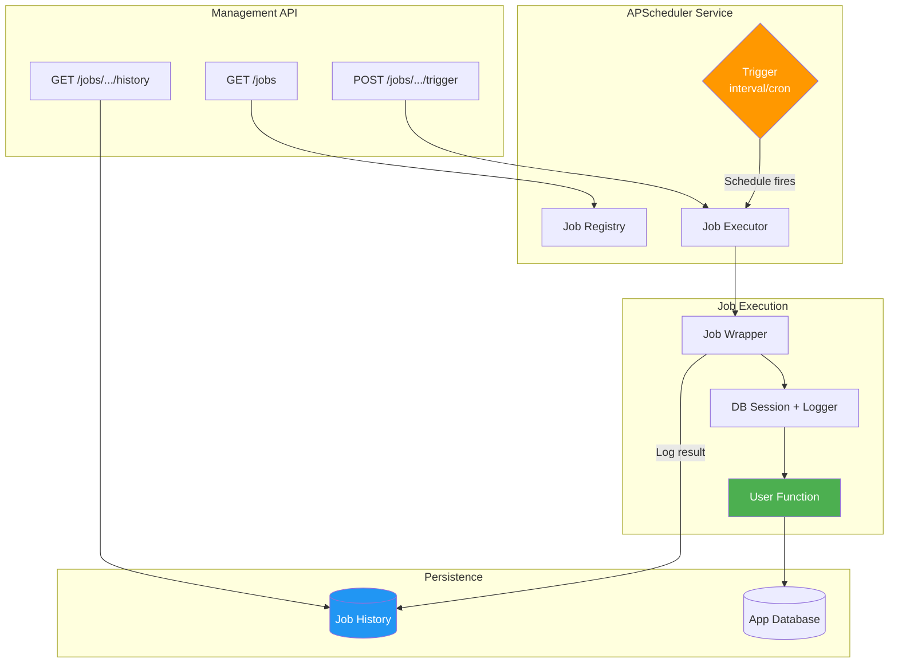
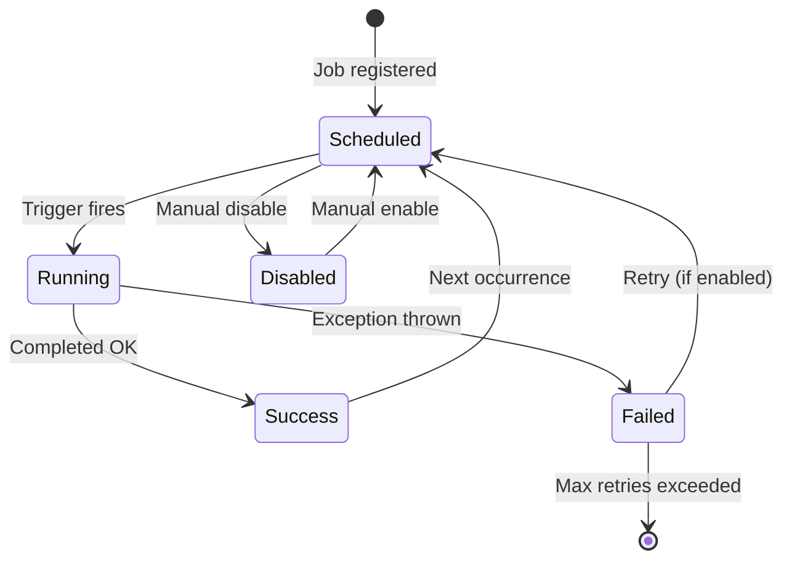
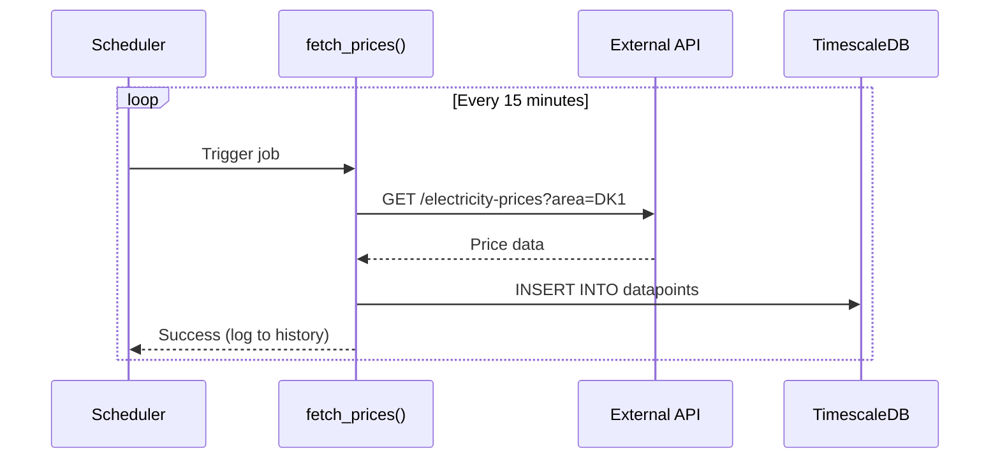

# Plan: Background Jobs & Scheduling

**Status**: Draft
**Author**: Hjemme IT Platform Team
**Created**: 2026-01-24
**Updated**: 2026-01-24
**Priority**: P0 (Critical)
**Roadmap Reference**: Priority 7

## Overview

Add built-in support for scheduled background jobs to Prism, enabling data ingestion, scheduled reports, cleanup tasks, and periodic health checks. This is a core requirement for IoT, monitoring, and data platform use cases.

## Goals

- Define scheduled jobs declaratively in `prism.yaml`
- Auto-generate APScheduler configuration and job registry
- Provide job management API endpoints
- Implement job execution history and logging
- Support both interval and cron-based triggers

## Non-Goals

- Distributed job scheduling (single-node only for MVP)
- Job chaining/workflows (can be added later)
- Real-time job monitoring UI (CLI + API is sufficient)

## Architecture

### Job Execution Flow



### Job Lifecycle



### Data Ingestion Example



## Design

### Technical Approach

#### 1. Specification Format

```yaml
# prism.yaml
schedulers:
  - name: electricity_price_fetcher
    trigger: interval
    interval_minutes: 15
    function: plugins.electricity_price.fetch_prices
    args:
      area: DK1
    enabled: true
    retry_on_failure: true
    max_retries: 3
    timeout_seconds: 300

  - name: daily_report
    trigger: cron
    cron: "0 8 * * *"  # 8 AM daily
    function: reports.generate_daily
    enabled: true

  - name: cleanup_old_data
    trigger: cron
    cron: "0 3 * * 0"  # 3 AM every Sunday
    function: maintenance.cleanup
    args:
      retention_days: 365
```

#### 2. Generated Components

**Scheduler Service** (`packages/backend/src/services/scheduler.py`):
- APScheduler integration with async job store
- Job registry loaded from specification
- Error handling, retry logic, and timeout management
- Job execution context (database session, logger)

**Job History Model** (`packages/backend/src/models/job_history.py`):
```python
class JobHistory(Base):
    __tablename__ = "job_history"

    id: Mapped[UUID] = mapped_column(primary_key=True, default=uuid4)
    job_name: Mapped[str] = mapped_column(String(100), index=True)
    started_at: Mapped[datetime] = mapped_column(DateTime(timezone=True))
    completed_at: Mapped[datetime | None] = mapped_column(DateTime(timezone=True))
    status: Mapped[str] = mapped_column(String(20))  # running, success, failed
    error_message: Mapped[str | None] = mapped_column(Text)
    duration_ms: Mapped[int | None]
```

**Job Router** (`packages/backend/src/routes/jobs.py`):
```python
@router.get("/jobs")
async def list_jobs() -> list[JobInfo]: ...

@router.get("/jobs/{job_name}")
async def get_job(job_name: str) -> JobDetail: ...

@router.post("/jobs/{job_name}/trigger")
async def trigger_job(job_name: str) -> JobExecution: ...

@router.post("/jobs/{job_name}/enable")
async def enable_job(job_name: str) -> JobInfo: ...

@router.post("/jobs/{job_name}/disable")
async def disable_job(job_name: str) -> JobInfo: ...

@router.get("/jobs/{job_name}/history")
async def get_job_history(job_name: str, limit: int = 100) -> list[JobHistory]: ...
```

#### 3. APScheduler Integration

Use APScheduler 4.x with async support:

```python
from apscheduler import AsyncScheduler
from apscheduler.triggers.interval import IntervalTrigger
from apscheduler.triggers.cron import CronTrigger

class SchedulerService:
    def __init__(self, db: AsyncSession):
        self.scheduler = AsyncScheduler()
        self.db = db
        self.jobs: dict[str, JobConfig] = {}

    async def start(self):
        # Load jobs from specification
        for job_config in load_job_configs():
            await self._register_job(job_config)
        await self.scheduler.start_in_background()

    async def _register_job(self, config: JobConfig):
        trigger = self._create_trigger(config)
        await self.scheduler.add_schedule(
            self._create_job_wrapper(config),
            trigger,
            id=config.name
        )

    def _create_job_wrapper(self, config: JobConfig):
        async def wrapper():
            history = await self._start_execution(config.name)
            try:
                func = import_function(config.function)
                await func(**config.args)
                await self._complete_execution(history, "success")
            except Exception as e:
                await self._complete_execution(history, "failed", str(e))
                if config.retry_on_failure:
                    raise  # APScheduler handles retry
        return wrapper
```

### API Changes

New REST endpoints under `/api/jobs`:
- `GET /api/jobs` - List all scheduled jobs
- `GET /api/jobs/{job_name}` - Get job details and next run time
- `POST /api/jobs/{job_name}/trigger` - Manually trigger job
- `POST /api/jobs/{job_name}/enable` - Enable disabled job
- `POST /api/jobs/{job_name}/disable` - Disable job
- `GET /api/jobs/{job_name}/history` - Get execution history

### Database Changes

New table: `job_history`
- Stores execution history for all scheduled jobs
- Indexed by job_name and started_at for efficient queries
- Automatic cleanup of old history (configurable retention)

## Implementation Steps

1. [ ] Add `schedulers` section to specification schema
2. [ ] Create APScheduler service with async support
3. [ ] Implement job wrapper with error handling and history tracking
4. [ ] Generate JobHistory model and migration
5. [ ] Implement job management API endpoints
6. [ ] Add CLI commands (`prism jobs list`, `prism jobs trigger`)
7. [ ] Write integration tests with mock jobs
8. [ ] Add documentation for scheduler specification

## Testing Strategy

1. **Unit Tests**: Job configuration parsing, trigger creation
2. **Integration Tests**: Full job execution with database
3. **E2E Tests**: API endpoints, manual triggering
4. **Timing Tests**: Verify interval and cron scheduling accuracy

## Rollout Plan

1. Release as opt-in feature via `schedulers:` section
2. Document migration path for existing APScheduler setups
3. Provide example job functions for common use cases

## Open Questions

- Should job persistence use Redis or database? (Database for simplicity, Redis for performance)
- How to handle timezone configuration for cron jobs?
- Should we support job dependencies/chaining in MVP?
