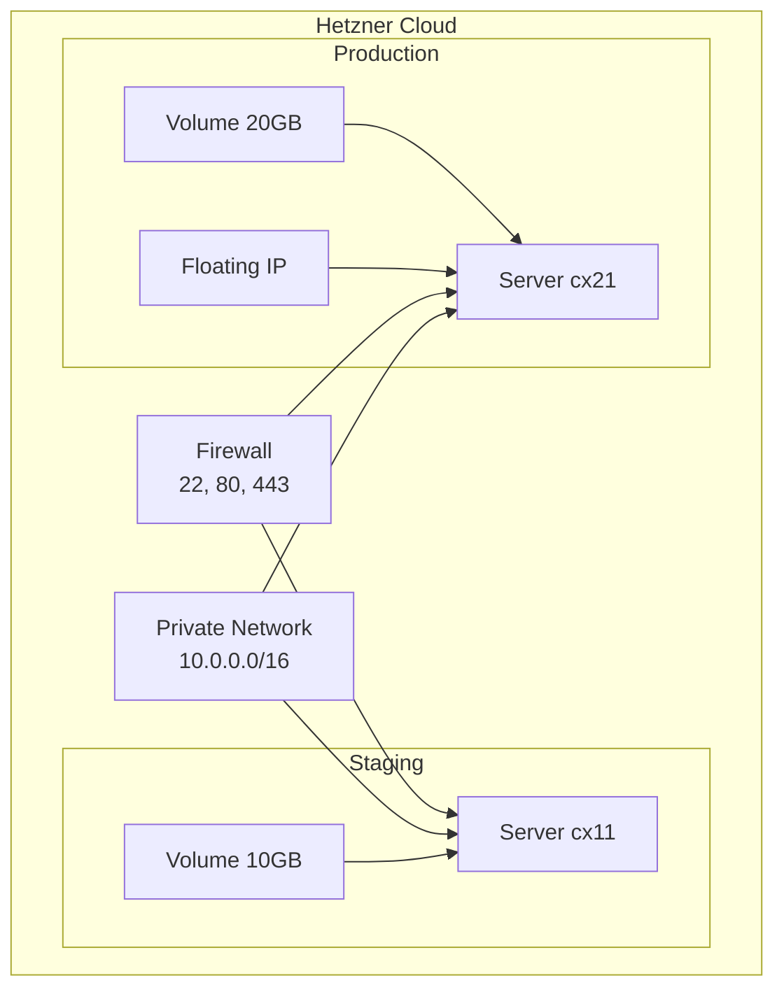

# Hetzner Cloud Deployment

Deploy your Prism-generated project to Hetzner Cloud with production-ready infrastructure using Terraform and cloud-init.

## Overview

Prism provides Infrastructure-as-Code templates for deploying to Hetzner Cloud, a cost-effective European cloud provider with excellent GDPR compliance. The deployment system includes:

- **Terraform** for infrastructure provisioning
- **Cloud-init** for server configuration
- **GitHub Actions** for CI/CD
- **Multi-environment support** (staging & production)

## Quick Start

### 1. Initialize Deployment

```bash
prism deploy init --provider hetzner --domain myapp.example.com
```

This generates:

```
deploy/
├── README.md                    # Detailed deployment guide
├── terraform/
│   ├── main.tf                  # Infrastructure definition
│   ├── variables.tf             # Configuration variables
│   ├── outputs.tf               # Output values (IPs, etc.)
│   ├── versions.tf              # Provider versions
│   ├── staging.tfvars           # Staging config
│   ├── production.tfvars        # Production config
│   ├── cloud-init/
│   │   └── user-data.yml        # Server provisioning
│   └── modules/
│       ├── server/              # VM module
│       └── volume/              # Storage module
├── env/
│   ├── .env.staging.template    # Staging secrets template
│   └── .env.production.template # Production secrets template
└── scripts/
    ├── deploy.sh                # Deployment script
    └── rollback.sh              # Rollback script
.github/workflows/deploy.yml     # CI/CD workflow
```

### 2. Configure Hetzner API

```bash
# Get API token from Hetzner Cloud Console
export HCLOUD_TOKEN="your-api-token"
export TF_VAR_hcloud_token="${HCLOUD_TOKEN}"
export TF_VAR_ssh_public_key="$(cat ~/.ssh/id_ed25519.pub)"
```

### 3. Deploy Staging

```bash
cd deploy/terraform
terraform init
terraform plan -var-file=staging.tfvars
terraform apply -var-file=staging.tfvars
```

### 4. Configure Application

```bash
# Get server IP
STAGING_IP=$(terraform output -raw staging_server_ip)

# Copy and configure environment
scp ../env/.env.staging.template deploy@${STAGING_IP}:/opt/myapp/.env
ssh deploy@${STAGING_IP} "cd /opt/myapp && vim .env"
```

### 5. Deploy Application

```bash
# Copy docker-compose and start
scp ../../docker-compose.prod.yml deploy@${STAGING_IP}:/opt/myapp/
ssh deploy@${STAGING_IP} "cd /opt/myapp && docker compose -f docker-compose.prod.yml up -d"
```

## CLI Commands

### Initialize Deployment

```bash
prism deploy init [OPTIONS]
```

| Option | Default | Description |
|--------|---------|-------------|
| `--provider` | `hetzner` | Cloud provider |
| `--domain` | - | Base domain (e.g., example.com) |
| `--location` | `nbg1` | Datacenter: nbg1, fsn1, hel1, ash, hil |
| `--staging-type` | `cx11` | Staging server: cx11, cx21, cx31 |
| `--production-type` | `cx21` | Production: cx21, cx31, cx41, cx51 |
| `--ssl-email` | - | Email for Let's Encrypt |
| `--no-floating-ip` | false | Disable floating IP |
| `--redis` | false | Include Redis |

### Plan Infrastructure

```bash
prism deploy plan [--env staging|production|all]
```

Preview what Terraform will create/modify/destroy.

### Apply Infrastructure

```bash
prism deploy apply --env staging|production [--auto-approve]
```

Provision or update infrastructure.

### Destroy Infrastructure

```bash
prism deploy destroy --env staging|production
```

!!! danger "Warning"
    This permanently deletes all VMs, volumes, and data.

### SSH to Server

```bash
prism deploy ssh staging|production
```

Opens interactive SSH session.

### View Logs

```bash
prism deploy logs staging|production [--service backend|frontend|db] [-f]
```

View Docker container logs from server.

### Setup SSL

```bash
prism deploy ssl staging|production --domain myapp.example.com
```

Configures Let's Encrypt certificate via certbot.

### Check Status

```bash
prism deploy status
```

Shows deployment configuration and server status.

## Server Specifications

| Environment | Type | vCPU | RAM | Default Volume |
|-------------|------|------|-----|----------------|
| Staging | cx11 | 1 | 2GB | 10GB |
| Production | cx21 | 2 | 4GB | 20GB |

### Available Server Types

| Type | vCPU | RAM | Monthly Cost* |
|------|------|-----|---------------|
| cx11 | 1 | 2GB | ~€4 |
| cx21 | 2 | 4GB | ~€8 |
| cx31 | 2 | 8GB | ~€14 |
| cx41 | 4 | 16GB | ~€28 |
| cx51 | 8 | 32GB | ~€56 |

*Prices approximate, check Hetzner for current rates.

## Infrastructure Details

### What Gets Provisioned



### Cloud-Init Configuration

Servers are automatically configured with:

- **Docker & Docker Compose** - Container runtime
- **nginx** - Reverse proxy (later replaced by app nginx)
- **ufw** - Firewall (ports 22, 80, 443)
- **fail2ban** - Brute-force protection
- **certbot** - SSL certificate automation
- **Swap** - 1GB swap file (configurable)
- **deploy user** - Non-root user with Docker access
- **systemd service** - Application auto-start on boot

### Security

- SSH key authentication only (no passwords)
- Firewall allows only necessary ports
- fail2ban protects against brute-force attacks
- Non-root application user
- Private network for inter-service communication

## CI/CD Integration

The generated `.github/workflows/deploy.yml` automates:

1. **Build** - Creates Docker images on push
2. **Push** - Uploads to GitHub Container Registry
3. **Deploy** - SSH to server and update containers

### Branch Strategy

| Branch | Deploys To |
|--------|------------|
| `staging` | Staging server |
| `main` | Production server |

### Required GitHub Secrets

| Secret | Description |
|--------|-------------|
| `STAGING_HOST` | Staging server IP |
| `PRODUCTION_HOST` | Production IP/floating IP |
| `SSH_PRIVATE_KEY` | Deploy key (ed25519 recommended) |

## Manual Deployment

Use the generated scripts for manual deployment:

```bash
# On server
cd /opt/myapp
./deploy.sh v1.2.3  # Deploy specific tag

# Rollback if needed
./rollback.sh
```

## Cost Estimation

| Component | Staging | Production |
|-----------|---------|------------|
| Server | ~€4/mo | ~€8/mo |
| Volume | ~€1/mo | ~€2/mo |
| Floating IP | - | ~€4/mo |
| **Total** | ~€5/mo | ~€14/mo |

## Troubleshooting

### Server Not Accessible

```bash
# Check Terraform state
terraform show

# Verify firewall in Hetzner Console
# Ensure your IP isn't blocked
```

### Containers Not Starting

```bash
prism deploy ssh staging
cd /opt/myapp
docker compose -f docker-compose.prod.yml logs
docker compose -f docker-compose.prod.yml ps
```

### SSL Issues

```bash
prism deploy ssh production
sudo certbot certificates  # Check status
sudo certbot renew --dry-run  # Test renewal
```

### Database Connection Failed

```bash
# Check PostgreSQL container
docker compose -f docker-compose.prod.yml logs db

# Verify volume mounted
df -h /mnt/data
```

## Next Steps

After deployment:

1. **Setup DNS** - Point domain to server IP/floating IP
2. **Configure SSL** - Run `prism deploy ssl` with your domain
3. **Setup Monitoring** - Consider Uptime Robot, Healthchecks.io
4. **Configure Backups** - Use Hetzner snapshots or pg_dump
5. **Enable GitHub Environments** - Protect production deployments
