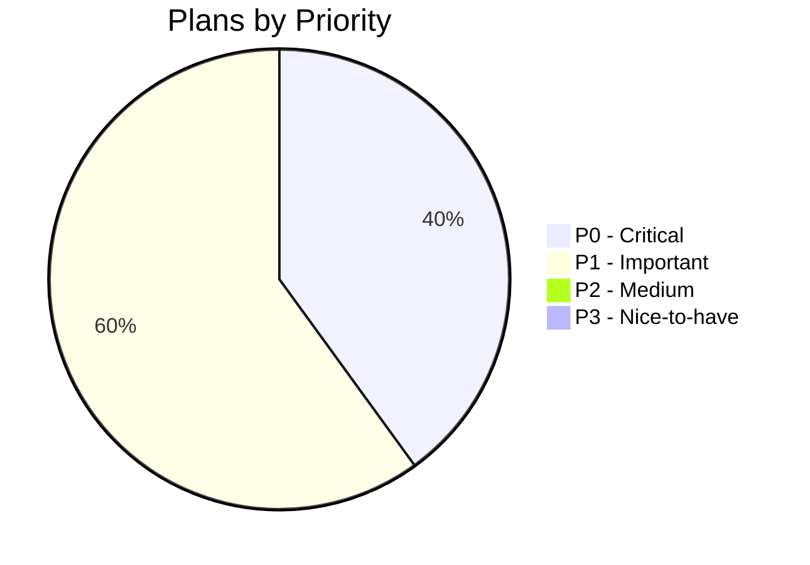
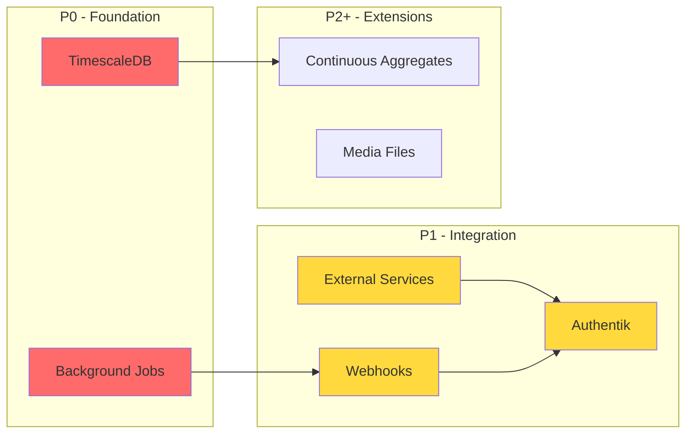

# Implementation Plans

Detailed implementation plans for features and significant changes to Prism.

## Plan Status Overview



## Active Plans

### P0 - Critical Priority

| Plan | Description | Status |
|------|-------------|--------|
| [Background Jobs & Scheduling](background-jobs-scheduling-plan.md) | APScheduler integration for data ingestion | :material-circle-outline: Not Started |
| [TimescaleDB Support](timescaledb-support-plan.md) | Time-series hypertables, compression, retention | :material-circle-outline: Not Started |

### P1 - Important Priority

| Plan | Description | Status |
|------|-------------|--------|
| [External Service Integration](external-service-integration-plan.md) | Type-safe HTTP clients for external APIs | :material-circle-outline: Not Started |
| [Webhook/Event Handling](webhook-event-handling-plan.md) | Authenticated webhook endpoints | :material-circle-outline: Not Started |
| [Authentik Integration](authentik-integration-plan.md) | Self-hosted auth with MFA, IAM, subdomains | :material-circle-outline: Not Started |

### Platform / Developer Experience

| Plan | Description | Status |
|------|-------------|--------|
| [Managed Subdomain + HTTPS](managed-subdomain-plan.md) | `*.madewithpris.me` subdomains with auto-SSL for Hetzner | :material-progress-clock: In Progress (85%) |

## Completed Plans

| Plan | Description | Completed |
|------|-------------|-----------|
| [Admin Panel & User Access Control](admin-panel-plan.md) | Admin pages, user whitelisting, bootstrap flow | 2026-01-30 (PR #63) |
| Dev Container with Claude Code | Self-hosted Codespaces with Claude Code pre-installed | 2026-01-29 (removed in refactor, commit 9f59a7d) |

## Plan Dependencies



## Creating New Plans

Follow the template in [Documentation Guide](../dev-docs.md#plans-plans):

```markdown
# Plan: <Feature Name>

**Status**: Draft | Approved | In Progress | Complete
**Author**: <name>
**Created**: YYYY-MM-DD
**Updated**: YYYY-MM-DD

## Overview
## Goals
## Non-Goals
## Design
## Implementation Steps
## Testing Strategy
## Rollout Plan
## Open Questions
```
