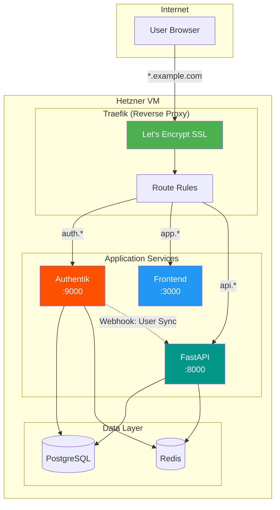
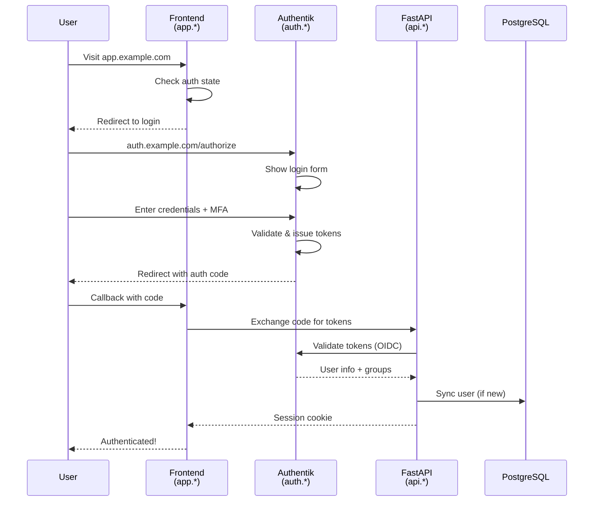
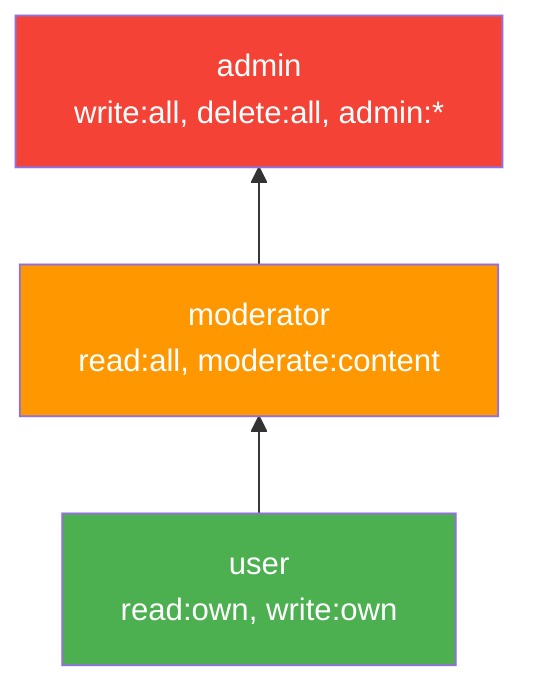

# Plan: Authentik Integration (Self-Hosted Auth)

**Status**: Draft
**Author**: Hjemme IT Platform Team
**Created**: 2026-01-25
**Updated**: 2026-01-25
**Priority**: P1 (Important)
**Roadmap Reference**: Extends Priority 15 (Authentication/Authorization Presets)

## Overview

Integrate Authentik as a self-hosted identity provider for Prism-generated projects. This provides enterprise-grade authentication with email verification, self-signup, MFA (TOTP + email), full IAM (roles/permissions), and subdomain-based service architecture - all deployable on a Hetzner VM with Traefik as reverse proxy.

## Goals

- Define Authentik configuration declaratively in `prism.yaml`
- Auto-generate Docker Compose stack with Authentik, Traefik, and app services
- Generate Authentik blueprints for login, signup, MFA, and password recovery flows
- Implement webhook-based user sync from Authentik to app database
- Provide OIDC integration in FastAPI backend with permission decorators
- Generate Terraform for Hetzner DNS subdomain configuration
- Support upgrade path from `full` IAM to `multi-tenant` mode

## Non-Goals

- Managed/cloud Authentik hosting (self-hosted only for MVP)
- Social login providers (can be added in Authentik UI manually)
- SAML federation (OIDC only for MVP)
- Custom Authentik theming beyond basic branding

## Architecture

### Infrastructure Overview



### Authentication Flow



### User Sync via Webhooks

```mermaid
flowchart LR
    subgraph Authentik
        Event[User Event]
        Hook[Webhook Transport]
    end

    subgraph FastAPI
        Endpoint[/webhooks/authentik/user-sync]
        Handler[Sync Handler]
        UserDB[(Users Table)]
    end

    Event -->|"model_created<br/>model_updated<br/>model_deleted"| Hook
    Hook -->|"POST + Signature"| Endpoint
    Endpoint -->|Verify| Handler
    Handler -->|Upsert/Delete| UserDB

    style Event fill:#fd4f00,color:white
    style Handler fill:#009688,color:white
```

### IAM Role Hierarchy



## Design

### 1. Specification Format

```yaml
# prism.yaml
authentication:
  provider: authentik
  deployment: self-hosted

  # Domain configuration
  domain:
    base: ${DOMAIN}  # e.g., example.com (from .env)
    subdomains:
      auth: auth     # → auth.example.com (Authentik)
      app: app       # → app.example.com (Frontend)
      api: api       # → api.example.com (FastAPI)

  # Infrastructure
  infrastructure:
    reverse_proxy: traefik  # traefik | nginx | cloudflare-tunnel
    ssl:
      provider: letsencrypt
      email: ${SSL_EMAIL}
    dns:
      provider: hetzner  # hetzner | cloudflare | manual
      zone_id: ${HETZNER_DNS_ZONE_ID}

  # Authentik configuration
  authentik:
    version: "2024.2"
    blueprints: full  # full | minimal | none

    # Pre-configured flows
    flows:
      authentication:
        enabled: true
        stages: [identification, password, mfa]
      enrollment:
        enabled: true
        email_verification: true
        stages: [email, user_write, prompt_mfa_setup]
      recovery:
        enabled: true
        method: email
      mfa_setup:
        enabled: true

    # Email configuration (for verification & MFA codes)
    email:
      host: ${SMTP_HOST}
      port: ${SMTP_PORT:587}
      username: ${SMTP_USERNAME}
      password: ${SMTP_PASSWORD}
      from: "auth@${DOMAIN}"
      use_tls: true

    # Branding
    branding:
      title: "${APP_NAME}"
      logo: assets/logo.png  # Copied to Authentik media
      favicon: assets/favicon.ico
      primary_color: "#4F46E5"

  # User sync configuration
  sync:
    method: webhook  # webhook | jit | none
    endpoint: /webhooks/authentik/user-sync
    secret: ${AUTHENTIK_WEBHOOK_SECRET}
    events:
      - model_created   # User created
      - model_updated   # User updated
      - model_deleted   # User deleted
      - group_membership_changed  # Role changes

  # Feature flags
  features:
    self_signup: true
    email_verification: true
    password_recovery: true
    mfa:
      enabled: true
      methods: [totp, email]  # totp | email | webauthn
      enforce_for_roles: [admin]
      grace_period_days: 7  # Days before MFA required
    password_policy:
      min_length: 12
      require_uppercase: true
      require_lowercase: true
      require_number: true
      require_special: false
      hibp_check: true  # Check against HaveIBeenPwned

  # IAM configuration
  iam:
    mode: full  # basic | full | multi-tenant

    # Role definitions (synced to Authentik groups)
    roles:
      - name: user
        authentik_group: "Users"
        description: "Standard user with read access to own data"
        permissions:
          - read:own
          - write:own
        default: true  # Assigned to new users

      - name: moderator
        authentik_group: "Moderators"
        description: "Can moderate content and view all data"
        permissions:
          - read:all
          - moderate:content

      - name: admin
        authentik_group: "Admins"
        description: "Full administrative access"
        permissions:
          - read:all
          - write:all
          - delete:all
          - admin:users
          - admin:settings
        mfa_required: true

    # Permission definitions (for fine-grained access)
    permissions:
      - name: read:own
        description: "Read own resources"
      - name: read:all
        description: "Read all resources"
      - name: write:own
        description: "Create and update own resources"
      - name: write:all
        description: "Create and update all resources"
      - name: delete:all
        description: "Delete any resource"
      - name: admin:users
        description: "Manage user accounts"
      - name: admin:settings
        description: "Modify system settings"
      - name: moderate:content
        description: "Moderate user-generated content"

    # Multi-tenant configuration (for future upgrade)
    # tenants:
    #   enabled: true
    #   isolation: schema  # schema | row | database
    #   tenant_model: Organization
    #   user_tenant_field: organization_id
```

### 2. Generated Docker Compose Stack

```yaml
# docker-compose.yml (generated)
version: "3.9"

services:
  # ===================
  # Reverse Proxy
  # ===================
  traefik:
    image: traefik:v3.0
    container_name: traefik
    restart: unless-stopped
    command:
      - "--api.dashboard=true"
      - "--providers.docker=true"
      - "--providers.docker.exposedbydefault=false"
      - "--entrypoints.web.address=:80"
      - "--entrypoints.websecure.address=:443"
      - "--entrypoints.web.http.redirections.entrypoint.to=websecure"
      - "--certificatesresolvers.letsencrypt.acme.tlschallenge=true"
      - "--certificatesresolvers.letsencrypt.acme.email=${SSL_EMAIL}"
      - "--certificatesresolvers.letsencrypt.acme.storage=/letsencrypt/acme.json"
    ports:
      - "80:80"
      - "443:443"
    volumes:
      - /var/run/docker.sock:/var/run/docker.sock:ro
      - traefik_letsencrypt:/letsencrypt
    networks:
      - web
      - internal
    labels:
      # Traefik dashboard (optional, secured)
      - "traefik.enable=true"
      - "traefik.http.routers.traefik.rule=Host(`traefik.${DOMAIN}`)"
      - "traefik.http.routers.traefik.service=api@internal"
      - "traefik.http.routers.traefik.tls.certresolver=letsencrypt"
      - "traefik.http.routers.traefik.middlewares=authentik@docker"

  # ===================
  # Authentik (Identity Provider)
  # ===================
  authentik-server:
    image: ghcr.io/goauthentik/server:${AUTHENTIK_VERSION:-2024.2}
    container_name: authentik-server
    restart: unless-stopped
    command: server
    environment:
      AUTHENTIK_SECRET_KEY: ${AUTHENTIK_SECRET_KEY}
      AUTHENTIK_REDIS__HOST: redis
      AUTHENTIK_POSTGRESQL__HOST: db
      AUTHENTIK_POSTGRESQL__USER: ${POSTGRES_USER:-authentik}
      AUTHENTIK_POSTGRESQL__PASSWORD: ${POSTGRES_PASSWORD}
      AUTHENTIK_POSTGRESQL__NAME: ${AUTHENTIK_DB:-authentik}
      # Email configuration
      AUTHENTIK_EMAIL__HOST: ${SMTP_HOST}
      AUTHENTIK_EMAIL__PORT: ${SMTP_PORT:-587}
      AUTHENTIK_EMAIL__USERNAME: ${SMTP_USERNAME}
      AUTHENTIK_EMAIL__PASSWORD: ${SMTP_PASSWORD}
      AUTHENTIK_EMAIL__FROM: auth@${DOMAIN}
      AUTHENTIK_EMAIL__USE_TLS: "true"
    volumes:
      - ./authentik/media:/media
      - ./authentik/blueprints:/blueprints/custom
    networks:
      - web
      - internal
    depends_on:
      - db
      - redis
    labels:
      - "traefik.enable=true"
      - "traefik.http.routers.authentik.rule=Host(`auth.${DOMAIN}`)"
      - "traefik.http.routers.authentik.entrypoints=websecure"
      - "traefik.http.routers.authentik.tls.certresolver=letsencrypt"
      - "traefik.http.services.authentik.loadbalancer.server.port=9000"
      # Forward auth middleware for protecting other services
      - "traefik.http.middlewares.authentik.forwardauth.address=http://authentik-server:9000/outpost.goauthentik.io/auth/traefik"
      - "traefik.http.middlewares.authentik.forwardauth.trustForwardHeader=true"
      - "traefik.http.middlewares.authentik.forwardauth.authResponseHeaders=X-authentik-username,X-authentik-groups,X-authentik-email,X-authentik-uid"

  authentik-worker:
    image: ghcr.io/goauthentik/server:${AUTHENTIK_VERSION:-2024.2}
    container_name: authentik-worker
    restart: unless-stopped
    command: worker
    environment:
      AUTHENTIK_SECRET_KEY: ${AUTHENTIK_SECRET_KEY}
      AUTHENTIK_REDIS__HOST: redis
      AUTHENTIK_POSTGRESQL__HOST: db
      AUTHENTIK_POSTGRESQL__USER: ${POSTGRES_USER:-authentik}
      AUTHENTIK_POSTGRESQL__PASSWORD: ${POSTGRES_PASSWORD}
      AUTHENTIK_POSTGRESQL__NAME: ${AUTHENTIK_DB:-authentik}
    volumes:
      - ./authentik/media:/media
      - ./authentik/blueprints:/blueprints/custom
    networks:
      - internal
    depends_on:
      - db
      - redis

  # ===================
  # Application Services
  # ===================
  backend:
    build:
      context: ./packages/backend
      dockerfile: Dockerfile
    container_name: backend
    restart: unless-stopped
    environment:
      DATABASE_URL: postgresql+asyncpg://${POSTGRES_USER}:${POSTGRES_PASSWORD}@db:5432/${APP_DB:-app}
      REDIS_URL: redis://redis:6379/1
      AUTHENTIK_URL: https://auth.${DOMAIN}
      AUTHENTIK_CLIENT_ID: ${AUTHENTIK_CLIENT_ID}
      AUTHENTIK_CLIENT_SECRET: ${AUTHENTIK_CLIENT_SECRET}
      AUTHENTIK_WEBHOOK_SECRET: ${AUTHENTIK_WEBHOOK_SECRET}
    networks:
      - web
      - internal
    depends_on:
      - db
      - redis
      - authentik-server
    labels:
      - "traefik.enable=true"
      - "traefik.http.routers.api.rule=Host(`api.${DOMAIN}`)"
      - "traefik.http.routers.api.entrypoints=websecure"
      - "traefik.http.routers.api.tls.certresolver=letsencrypt"
      - "traefik.http.services.api.loadbalancer.server.port=8000"

  frontend:
    build:
      context: ./packages/frontend
      dockerfile: Dockerfile
      args:
        VITE_API_URL: https://api.${DOMAIN}
        VITE_AUTH_URL: https://auth.${DOMAIN}
    container_name: frontend
    restart: unless-stopped
    networks:
      - web
    labels:
      - "traefik.enable=true"
      - "traefik.http.routers.app.rule=Host(`app.${DOMAIN}`)"
      - "traefik.http.routers.app.entrypoints=websecure"
      - "traefik.http.routers.app.tls.certresolver=letsencrypt"
      - "traefik.http.services.app.loadbalancer.server.port=80"

  # ===================
  # Data Stores
  # ===================
  db:
    image: postgres:16-alpine
    container_name: db
    restart: unless-stopped
    environment:
      POSTGRES_USER: ${POSTGRES_USER:-postgres}
      POSTGRES_PASSWORD: ${POSTGRES_PASSWORD}
    volumes:
      - postgres_data:/var/lib/postgresql/data
      - ./init-db.sql:/docker-entrypoint-initdb.d/init.sql
    networks:
      - internal
    healthcheck:
      test: ["CMD-SHELL", "pg_isready -U ${POSTGRES_USER:-postgres}"]
      interval: 10s
      timeout: 5s
      retries: 5

  redis:
    image: redis:7-alpine
    container_name: redis
    restart: unless-stopped
    command: redis-server --appendonly yes
    volumes:
      - redis_data:/data
    networks:
      - internal
    healthcheck:
      test: ["CMD", "redis-cli", "ping"]
      interval: 10s
      timeout: 5s
      retries: 5

volumes:
  postgres_data:
  redis_data:
  traefik_letsencrypt:

networks:
  web:
    external: false
  internal:
    external: false
```

### 3. Authentik Blueprints

#### Default Authentication Flow

```yaml
# authentik/blueprints/flows/authentication.yaml
version: 1
metadata:
  name: "Default Authentication Flow"
  labels:
    prism.generated: "true"

entries:
  # Authentication Flow
  - model: authentik_flows.flow
    id: default-authentication-flow
    identifiers:
      slug: default-authentication-flow
    attrs:
      name: "Login"
      title: "Sign in to ${APP_NAME}"
      designation: authentication
      authentication: require_unauthenticated

  # Stage 1: Identification (email/username)
  - model: authentik_stages_identification.identificationstage
    id: identification-stage
    identifiers:
      name: identification-stage
    attrs:
      user_fields:
        - email
        - username
      case_insensitive_matching: true
      show_matched_user: true
      enrollment_flow: !Find [authentik_flows.flow, [slug, default-enrollment-flow]]
      recovery_flow: !Find [authentik_flows.flow, [slug, default-recovery-flow]]

  # Stage 2: Password
  - model: authentik_stages_password.passwordstage
    id: password-stage
    identifiers:
      name: password-stage
    attrs:
      backends:
        - authentik.core.auth.InbuiltBackend

  # Stage 3: MFA Validation (TOTP or Email)
  - model: authentik_stages_authenticator_validate.authenticatorvalidatestage
    id: mfa-validation-stage
    identifiers:
      name: mfa-validation-stage
    attrs:
      device_classes:
        - static
        - totp
        - email
      not_configured_action: skip  # Or 'deny' to enforce MFA
      last_auth_threshold: minutes=5

  # Stage 4: User Login
  - model: authentik_stages_user_login.userloginstage
    id: user-login-stage
    identifiers:
      name: user-login-stage
    attrs:
      session_duration: seconds=86400  # 24 hours

  # Bind stages to flow
  - model: authentik_flows.flowstagebinding
    id: flow-binding-identification
    identifiers:
      target: !Find [authentik_flows.flow, [slug, default-authentication-flow]]
      stage: !Find [authentik_stages_identification.identificationstage, [name, identification-stage]]
    attrs:
      order: 10

  - model: authentik_flows.flowstagebinding
    id: flow-binding-password
    identifiers:
      target: !Find [authentik_flows.flow, [slug, default-authentication-flow]]
      stage: !Find [authentik_stages_password.passwordstage, [name, password-stage]]
    attrs:
      order: 20

  - model: authentik_flows.flowstagebinding
    id: flow-binding-mfa
    identifiers:
      target: !Find [authentik_flows.flow, [slug, default-authentication-flow]]
      stage: !Find [authentik_stages_authenticator_validate.authenticatorvalidatestage, [name, mfa-validation-stage]]
    attrs:
      order: 30

  - model: authentik_flows.flowstagebinding
    id: flow-binding-login
    identifiers:
      target: !Find [authentik_flows.flow, [slug, default-authentication-flow]]
      stage: !Find [authentik_stages_user_login.userloginstage, [name, user-login-stage]]
    attrs:
      order: 40
```

#### Self-Signup (Enrollment) Flow

```yaml
# authentik/blueprints/flows/enrollment.yaml
version: 1
metadata:
  name: "Self-Signup Enrollment Flow"
  labels:
    prism.generated: "true"

entries:
  # Enrollment Flow
  - model: authentik_flows.flow
    id: default-enrollment-flow
    identifiers:
      slug: default-enrollment-flow
    attrs:
      name: "Sign Up"
      title: "Create your account"
      designation: enrollment
      authentication: require_unauthenticated

  # Stage 1: Email verification (sends code)
  - model: authentik_stages_email.emailstage
    id: enrollment-email-stage
    identifiers:
      name: enrollment-email-stage
    attrs:
      use_global_settings: true
      subject: "Verify your email for ${APP_NAME}"
      template: email/account_confirmation.html
      activate_user_on_success: true
      token_expiry: 30  # minutes

  # Stage 2: User details prompt
  - model: authentik_stages_prompt.promptstage
    id: enrollment-prompt-stage
    identifiers:
      name: enrollment-prompt-stage
    attrs:
      fields:
        - !Find [authentik_stages_prompt.prompt, [field_key, username]]
        - !Find [authentik_stages_prompt.prompt, [field_key, email]]
        - !Find [authentik_stages_prompt.prompt, [field_key, password]]
        - !Find [authentik_stages_prompt.prompt, [field_key, password_repeat]]
      validation_policies:
        - !Find [authentik_policies_password.passwordpolicy, [name, default-password-policy]]

  # Stage 3: Write user to database
  - model: authentik_stages_user_write.userwritestage
    id: enrollment-user-write-stage
    identifiers:
      name: enrollment-user-write-stage
    attrs:
      create_users_as_inactive: false
      create_users_group: !Find [authentik_core.group, [name, Users]]

  # Stage 4: MFA Setup prompt (optional)
  - model: authentik_stages_authenticator_totp.authenticatortotpstage
    id: enrollment-mfa-setup-stage
    identifiers:
      name: enrollment-mfa-setup-stage
    attrs:
      configure_flow: !Find [authentik_flows.flow, [slug, default-mfa-setup-flow]]
      friendly_name: "Authenticator App"

  # Bind stages
  - model: authentik_flows.flowstagebinding
    identifiers:
      target: !Find [authentik_flows.flow, [slug, default-enrollment-flow]]
      stage: !Find [authentik_stages_prompt.promptstage, [name, enrollment-prompt-stage]]
    attrs:
      order: 10

  - model: authentik_flows.flowstagebinding
    identifiers:
      target: !Find [authentik_flows.flow, [slug, default-enrollment-flow]]
      stage: !Find [authentik_stages_email.emailstage, [name, enrollment-email-stage]]
    attrs:
      order: 20

  - model: authentik_flows.flowstagebinding
    identifiers:
      target: !Find [authentik_flows.flow, [slug, default-enrollment-flow]]
      stage: !Find [authentik_stages_user_write.userwritestage, [name, enrollment-user-write-stage]]
    attrs:
      order: 30
```

#### Password Policy

```yaml
# authentik/blueprints/policies/password.yaml
version: 1
metadata:
  name: "Default Password Policy"
  labels:
    prism.generated: "true"

entries:
  - model: authentik_policies_password.passwordpolicy
    id: default-password-policy
    identifiers:
      name: default-password-policy
    attrs:
      length_min: 12
      amount_uppercase: 1
      amount_lowercase: 1
      amount_digits: 1
      amount_symbols: 0
      check_static_rules: true
      check_have_i_been_pwned: true
      hibp_allowed_count: 0
      error_message: "Password must be at least 12 characters with uppercase, lowercase, and a number."
```

#### OIDC Application & Provider

```yaml
# authentik/blueprints/apps/oidc-app.yaml
version: 1
metadata:
  name: "OIDC Application for ${APP_NAME}"
  labels:
    prism.generated: "true"

entries:
  # OAuth2/OIDC Provider
  - model: authentik_providers_oauth2.oauth2provider
    id: app-oauth2-provider
    identifiers:
      name: "${APP_NAME} OAuth2"
    attrs:
      authorization_flow: !Find [authentik_flows.flow, [slug, default-authorization-flow]]
      client_type: confidential
      client_id: "${AUTHENTIK_CLIENT_ID}"
      client_secret: "${AUTHENTIK_CLIENT_SECRET}"
      redirect_uris: |
        https://api.${DOMAIN}/auth/callback
        https://app.${DOMAIN}/auth/callback
        http://localhost:8000/auth/callback
        http://localhost:3000/auth/callback
      signing_key: !Find [authentik_crypto.certificatekeypair, [name, authentik Self-signed Certificate]]
      access_token_validity: hours=1
      refresh_token_validity: days=30
      include_claims_in_id_token: true
      sub_mode: user_id
      property_mappings:
        - !Find [authentik_providers_oauth2.scopemapping, [managed, goauthentik.io/providers/oauth2/scope-openid]]
        - !Find [authentik_providers_oauth2.scopemapping, [managed, goauthentik.io/providers/oauth2/scope-email]]
        - !Find [authentik_providers_oauth2.scopemapping, [managed, goauthentik.io/providers/oauth2/scope-profile]]
        - !Find [authentik_providers_oauth2.scopemapping, [name, groups-scope]]

  # Custom scope mapping for groups/roles
  - model: authentik_providers_oauth2.scopemapping
    id: groups-scope-mapping
    identifiers:
      name: groups-scope
    attrs:
      scope_name: groups
      description: "User groups/roles"
      expression: |
        return {
          "groups": [group.name for group in user.ak_groups.all()]
        }

  # Application
  - model: authentik_core.application
    id: app-application
    identifiers:
      slug: "${APP_SLUG}"
    attrs:
      name: "${APP_NAME}"
      provider: !Find [authentik_providers_oauth2.oauth2provider, [name, "${APP_NAME} OAuth2"]]
      meta_launch_url: "https://app.${DOMAIN}"
      meta_icon: "/media/app-logo.png"
      policy_engine_mode: any

  # Default groups
  - model: authentik_core.group
    id: users-group
    identifiers:
      name: Users
    attrs:
      is_superuser: false

  - model: authentik_core.group
    id: moderators-group
    identifiers:
      name: Moderators
    attrs:
      is_superuser: false
      parent: !Find [authentik_core.group, [name, Users]]

  - model: authentik_core.group
    id: admins-group
    identifiers:
      name: Admins
    attrs:
      is_superuser: false
      parent: !Find [authentik_core.group, [name, Moderators]]
```

#### Webhook Notification Transport

```yaml
# authentik/blueprints/webhooks/user-sync.yaml
version: 1
metadata:
  name: "User Sync Webhooks"
  labels:
    prism.generated: "true"

entries:
  # Webhook transport
  - model: authentik_events.notificationtransport
    id: user-sync-webhook
    identifiers:
      name: user-sync-webhook
    attrs:
      mode: webhook
      webhook_url: "https://api.${DOMAIN}/webhooks/authentik/user-sync"
      webhook_mapping: !Find [authentik_events.notificationwebhookmapping, [name, user-event-mapping]]
      send_once: true

  # Webhook payload mapping
  - model: authentik_events.notificationwebhookmapping
    id: user-event-mapping
    identifiers:
      name: user-event-mapping
    attrs:
      expression: |
        import json
        import hmac
        import hashlib

        # Build payload
        payload = {
            "event": notification.event.action,
            "timestamp": notification.event.created.isoformat(),
            "user": {
                "pk": str(notification.event.user.get("pk", "")),
                "username": notification.event.user.get("username", ""),
                "email": notification.event.user.get("email", ""),
                "name": notification.event.user.get("name", ""),
                "is_active": notification.event.user.get("is_active", True),
            },
            "groups": [g.name for g in request.user.ak_groups.all()] if request.user else [],
            "context": notification.event.context,
        }

        # Sign payload
        secret = ak_get_config("WEBHOOK_SECRET", "")
        signature = hmac.new(
            secret.encode(),
            json.dumps(payload, sort_keys=True).encode(),
            hashlib.sha256
        ).hexdigest()

        return {
            "body": payload,
            "headers": {
                "Content-Type": "application/json",
                "X-Authentik-Signature": f"sha256={signature}",
            }
        }

  # Notification rule for user events
  - model: authentik_events.notificationrule
    id: user-events-rule
    identifiers:
      name: user-events-notification
    attrs:
      severity: notice
      transports:
        - !Find [authentik_events.notificationtransport, [name, user-sync-webhook]]
      group: !Find [authentik_core.group, [name, Admins]]  # Only notify about admin-visible events

  # Event matcher for user lifecycle
  - model: authentik_policies_event_matcher.eventmatcherpolicy
    id: user-lifecycle-matcher
    identifiers:
      name: user-lifecycle-events
    attrs:
      action: model_created
      model: authentik_core.user
      # Also matches model_updated, model_deleted
```

### 4. Backend OIDC Integration

#### Auth Configuration

```python
# packages/backend/src/auth/config.py
# AUTO-GENERATED - Customize in src/auth/config_custom.py

from pydantic_settings import BaseSettings


class AuthSettings(BaseSettings):
    """Authentication configuration from environment."""

    # Authentik OIDC settings
    AUTHENTIK_URL: str  # e.g., https://auth.example.com
    AUTHENTIK_CLIENT_ID: str
    AUTHENTIK_CLIENT_SECRET: str
    AUTHENTIK_WEBHOOK_SECRET: str

    # Derived URLs
    @property
    def oidc_discovery_url(self) -> str:
        return f"{self.AUTHENTIK_URL}/application/o/{self.app_slug}/.well-known/openid-configuration"

    @property
    def oidc_authorize_url(self) -> str:
        return f"{self.AUTHENTIK_URL}/application/o/authorize/"

    @property
    def oidc_token_url(self) -> str:
        return f"{self.AUTHENTIK_URL}/application/o/token/"

    @property
    def oidc_userinfo_url(self) -> str:
        return f"{self.AUTHENTIK_URL}/application/o/userinfo/"

    @property
    def oidc_logout_url(self) -> str:
        return f"{self.AUTHENTIK_URL}/application/o/{self.app_slug}/end-session/"

    # App settings
    app_slug: str = "app"

    class Config:
        env_prefix = ""


auth_settings = AuthSettings()
```

#### OIDC Client

```python
# packages/backend/src/auth/oidc.py
# AUTO-GENERATED - Customize in src/auth/oidc_custom.py

from datetime import datetime, timedelta
from typing import Any
import httpx
from authlib.integrations.starlette_client import OAuth
from authlib.jose import jwt
from fastapi import HTTPException, Request, Depends
from fastapi.security import OAuth2AuthorizationCodeBearer

from .config import auth_settings
from .models import TokenPayload, UserInfo


# OAuth client setup
oauth = OAuth()
oauth.register(
    name="authentik",
    client_id=auth_settings.AUTHENTIK_CLIENT_ID,
    client_secret=auth_settings.AUTHENTIK_CLIENT_SECRET,
    server_metadata_url=auth_settings.oidc_discovery_url,
    client_kwargs={
        "scope": "openid email profile groups",
        "token_endpoint_auth_method": "client_secret_post",
    },
)

# OAuth2 scheme for FastAPI
oauth2_scheme = OAuth2AuthorizationCodeBearer(
    authorizationUrl=auth_settings.oidc_authorize_url,
    tokenUrl=auth_settings.oidc_token_url,
    scopes={
        "openid": "OpenID Connect",
        "email": "Email address",
        "profile": "User profile",
        "groups": "Group memberships",
    },
)


class OIDCClient:
    """OIDC client for Authentik integration."""

    def __init__(self):
        self._jwks: dict | None = None
        self._jwks_expires: datetime | None = None

    async def get_jwks(self) -> dict:
        """Fetch and cache JWKS for token validation."""
        if self._jwks and self._jwks_expires and datetime.utcnow() < self._jwks_expires:
            return self._jwks

        async with httpx.AsyncClient() as client:
            response = await client.get(f"{auth_settings.AUTHENTIK_URL}/application/o/{auth_settings.app_slug}/jwks/")
            response.raise_for_status()
            self._jwks = response.json()
            self._jwks_expires = datetime.utcnow() + timedelta(hours=1)
            return self._jwks

    async def validate_token(self, token: str) -> TokenPayload:
        """Validate JWT and extract claims."""
        try:
            jwks = await self.get_jwks()
            claims = jwt.decode(
                token,
                jwks,
                claims_options={
                    "iss": {"essential": True, "value": auth_settings.AUTHENTIK_URL},
                    "aud": {"essential": True, "value": auth_settings.AUTHENTIK_CLIENT_ID},
                }
            )
            claims.validate()

            return TokenPayload(
                sub=claims["sub"],
                email=claims.get("email"),
                email_verified=claims.get("email_verified", False),
                name=claims.get("name"),
                preferred_username=claims.get("preferred_username"),
                groups=claims.get("groups", []),
                exp=claims["exp"],
                iat=claims["iat"],
            )
        except Exception as e:
            raise HTTPException(status_code=401, detail=f"Invalid token: {e}")

    async def get_userinfo(self, access_token: str) -> UserInfo:
        """Fetch user info from Authentik userinfo endpoint."""
        async with httpx.AsyncClient() as client:
            response = await client.get(
                auth_settings.oidc_userinfo_url,
                headers={"Authorization": f"Bearer {access_token}"}
            )
            if response.status_code != 200:
                raise HTTPException(status_code=401, detail="Failed to fetch user info")

            data = response.json()
            return UserInfo(
                sub=data["sub"],
                email=data.get("email"),
                email_verified=data.get("email_verified", False),
                name=data.get("name"),
                preferred_username=data.get("preferred_username"),
                groups=data.get("groups", []),
            )


oidc_client = OIDCClient()
```

#### User Sync Webhook Handler

```python
# packages/backend/src/auth/webhooks.py
# AUTO-GENERATED - Customize handlers in src/auth/webhooks_custom.py

import hmac
import hashlib
import json
from datetime import datetime
from uuid import UUID

from fastapi import APIRouter, Request, HTTPException, Depends, BackgroundTasks
from pydantic import BaseModel
from sqlalchemy import select, update, delete
from sqlalchemy.ext.asyncio import AsyncSession

from ..core.database import get_db
from ..models.user import User
from .config import auth_settings


router = APIRouter(prefix="/webhooks/authentik", tags=["webhooks"])


class AuthentikUser(BaseModel):
    """User data from Authentik webhook."""
    pk: str
    username: str
    email: str | None = None
    name: str | None = None
    is_active: bool = True


class AuthentikWebhookPayload(BaseModel):
    """Webhook payload from Authentik."""
    event: str  # model_created, model_updated, model_deleted
    timestamp: datetime
    user: AuthentikUser
    groups: list[str] = []
    context: dict = {}


async def verify_authentik_signature(request: Request) -> bytes:
    """Verify webhook signature from Authentik."""
    body = await request.body()
    signature = request.headers.get("X-Authentik-Signature", "")

    if not signature.startswith("sha256="):
        raise HTTPException(401, "Invalid signature format")

    expected = "sha256=" + hmac.new(
        auth_settings.AUTHENTIK_WEBHOOK_SECRET.encode(),
        body,
        hashlib.sha256
    ).hexdigest()

    if not hmac.compare_digest(signature, expected):
        raise HTTPException(401, "Invalid webhook signature")

    return body


@router.post("/user-sync")
async def sync_user_from_authentik(
    payload: AuthentikWebhookPayload,
    background_tasks: BackgroundTasks,
    db: AsyncSession = Depends(get_db),
    _body: bytes = Depends(verify_authentik_signature),
):
    """
    Handle user lifecycle events from Authentik.

    Events:
    - model_created: Create user in app database
    - model_updated: Update user attributes and roles
    - model_deleted: Soft-delete user (or hard delete based on config)
    """
    authentik_id = payload.user.pk

    match payload.event:
        case "model_created":
            # Create new user
            user = User(
                authentik_id=authentik_id,
                email=payload.user.email,
                username=payload.user.username,
                display_name=payload.user.name,
                roles=payload.groups,
                is_active=payload.user.is_active,
                created_at=payload.timestamp,
            )
            db.add(user)
            await db.commit()

            # Trigger any post-creation hooks
            background_tasks.add_task(
                on_user_created,
                user_id=user.id,
                email=user.email
            )

            return {"status": "created", "user_id": str(user.id)}

        case "model_updated":
            # Update existing user
            result = await db.execute(
                update(User)
                .where(User.authentik_id == authentik_id)
                .values(
                    email=payload.user.email,
                    username=payload.user.username,
                    display_name=payload.user.name,
                    roles=payload.groups,
                    is_active=payload.user.is_active,
                    updated_at=payload.timestamp,
                )
                .returning(User.id)
            )
            user_id = result.scalar_one_or_none()

            if not user_id:
                # User doesn't exist locally, create them (JIT fallback)
                user = User(
                    authentik_id=authentik_id,
                    email=payload.user.email,
                    username=payload.user.username,
                    display_name=payload.user.name,
                    roles=payload.groups,
                    is_active=payload.user.is_active,
                )
                db.add(user)
                await db.commit()
                return {"status": "created_on_update", "user_id": str(user.id)}

            await db.commit()
            return {"status": "updated", "user_id": str(user_id)}

        case "model_deleted":
            # Soft-delete user (preserve data for audit)
            result = await db.execute(
                update(User)
                .where(User.authentik_id == authentik_id)
                .values(
                    is_active=False,
                    deleted_at=payload.timestamp,
                )
                .returning(User.id)
            )
            user_id = result.scalar_one_or_none()
            await db.commit()

            return {"status": "deleted", "user_id": str(user_id) if user_id else None}

        case _:
            return {"status": "ignored", "event": payload.event}


async def on_user_created(user_id: UUID, email: str | None):
    """Post-creation hook for new users. Customize in webhooks_custom.py."""
    # Example: Send welcome notification, create default resources, etc.
    pass
```

#### Permission Dependencies

```python
# packages/backend/src/auth/permissions.py
# AUTO-GENERATED - Add custom permissions in src/auth/permissions_custom.py

from functools import wraps
from typing import Callable

from fastapi import Depends, HTTPException, status
from sqlalchemy.ext.asyncio import AsyncSession

from ..core.database import get_db
from ..models.user import User
from .dependencies import get_current_user


# Role hierarchy (higher includes lower)
ROLE_HIERARCHY = {
    "admin": ["admin", "moderator", "user"],
    "moderator": ["moderator", "user"],
    "user": ["user"],
}

# Permission to role mapping
PERMISSION_ROLES = {
    "read:own": ["user", "moderator", "admin"],
    "read:all": ["moderator", "admin"],
    "write:own": ["user", "moderator", "admin"],
    "write:all": ["admin"],
    "delete:all": ["admin"],
    "admin:users": ["admin"],
    "admin:settings": ["admin"],
    "moderate:content": ["moderator", "admin"],
}


def require_role(*roles: str):
    """
    Dependency that checks if user has one of the specified roles.

    Usage:
        @router.get("/admin")
        async def admin_endpoint(user: User = Depends(require_role("admin"))):
            ...
    """
    async def dependency(
        current_user: User = Depends(get_current_user),
    ) -> User:
        user_roles = set(current_user.roles or [])
        required_roles = set(roles)

        # Check if user has any required role (including hierarchy)
        has_role = False
        for user_role in user_roles:
            inherited_roles = ROLE_HIERARCHY.get(user_role, [user_role])
            if required_roles & set(inherited_roles):
                has_role = True
                break

        if not has_role:
            raise HTTPException(
                status_code=status.HTTP_403_FORBIDDEN,
                detail=f"One of these roles required: {', '.join(roles)}"
            )

        return current_user

    return Depends(dependency)


def require_permission(*permissions: str):
    """
    Dependency that checks if user has all specified permissions.

    Usage:
        @router.delete("/users/{id}")
        async def delete_user(
            id: UUID,
            user: User = Depends(require_permission("admin:users", "delete:all"))
        ):
            ...
    """
    async def dependency(
        current_user: User = Depends(get_current_user),
    ) -> User:
        user_roles = set(current_user.roles or [])

        for permission in permissions:
            allowed_roles = PERMISSION_ROLES.get(permission, [])
            if not (user_roles & set(allowed_roles)):
                raise HTTPException(
                    status_code=status.HTTP_403_FORBIDDEN,
                    detail=f"Permission '{permission}' required"
                )

        return current_user

    return Depends(dependency)


def require_owner_or_role(
    resource_user_id_param: str = "user_id",
    *roles: str
):
    """
    Dependency that checks if user owns the resource OR has specified role.

    Usage:
        @router.put("/users/{user_id}/profile")
        async def update_profile(
            user_id: UUID,
            user: User = Depends(require_owner_or_role("user_id", "admin"))
        ):
            ...
    """
    async def dependency(
        current_user: User = Depends(get_current_user),
        **kwargs
    ) -> User:
        resource_user_id = kwargs.get(resource_user_id_param)

        # Check ownership
        if resource_user_id and str(current_user.id) == str(resource_user_id):
            return current_user

        # Check roles
        user_roles = set(current_user.roles or [])
        if user_roles & set(roles):
            return current_user

        raise HTTPException(
            status_code=status.HTTP_403_FORBIDDEN,
            detail="Access denied: must be owner or have elevated role"
        )

    return Depends(dependency)
```

### 5. Frontend Auth Integration

#### Auth Context (React)

```typescript
// packages/frontend/src/auth/AuthContext.tsx
// AUTO-GENERATED - Customize in src/auth/AuthContext.custom.tsx

import React, { createContext, useContext, useEffect, useState, useCallback } from 'react';

interface User {
  id: string;
  email: string;
  username: string;
  displayName?: string;
  roles: string[];
  emailVerified: boolean;
}

interface AuthContextType {
  user: User | null;
  isAuthenticated: boolean;
  isLoading: boolean;
  login: () => void;
  logout: () => void;
  hasRole: (role: string) => boolean;
  hasPermission: (permission: string) => boolean;
}

const AuthContext = createContext<AuthContextType | undefined>(undefined);

const AUTH_URL = import.meta.env.VITE_AUTH_URL;
const API_URL = import.meta.env.VITE_API_URL;
const CLIENT_ID = import.meta.env.VITE_AUTHENTIK_CLIENT_ID;

// Permission to role mapping (synced with backend)
const PERMISSION_ROLES: Record<string, string[]> = {
  'read:own': ['user', 'moderator', 'admin'],
  'read:all': ['moderator', 'admin'],
  'write:own': ['user', 'moderator', 'admin'],
  'write:all': ['admin'],
  'delete:all': ['admin'],
  'admin:users': ['admin'],
  'admin:settings': ['admin'],
  'moderate:content': ['moderator', 'admin'],
};

export function AuthProvider({ children }: { children: React.ReactNode }) {
  const [user, setUser] = useState<User | null>(null);
  const [isLoading, setIsLoading] = useState(true);

  // Check for existing session on mount
  useEffect(() => {
    checkAuth();
  }, []);

  const checkAuth = async () => {
    try {
      const response = await fetch(`${API_URL}/auth/me`, {
        credentials: 'include',
      });

      if (response.ok) {
        const userData = await response.json();
        setUser(userData);
      }
    } catch (error) {
      console.error('Auth check failed:', error);
    } finally {
      setIsLoading(false);
    }
  };

  const login = useCallback(() => {
    // Redirect to Authentik login
    const redirectUri = `${window.location.origin}/auth/callback`;
    const authUrl = new URL(`${AUTH_URL}/application/o/authorize/`);
    authUrl.searchParams.set('client_id', CLIENT_ID);
    authUrl.searchParams.set('redirect_uri', redirectUri);
    authUrl.searchParams.set('response_type', 'code');
    authUrl.searchParams.set('scope', 'openid email profile groups');
    authUrl.searchParams.set('state', crypto.randomUUID());

    window.location.href = authUrl.toString();
  }, []);

  const logout = useCallback(async () => {
    try {
      // Clear backend session
      await fetch(`${API_URL}/auth/logout`, {
        method: 'POST',
        credentials: 'include',
      });
    } catch (error) {
      console.error('Logout error:', error);
    }

    // Clear local state
    setUser(null);

    // Redirect to Authentik logout
    const logoutUrl = new URL(`${AUTH_URL}/application/o/app/end-session/`);
    logoutUrl.searchParams.set('post_logout_redirect_uri', window.location.origin);
    window.location.href = logoutUrl.toString();
  }, []);

  const hasRole = useCallback((role: string): boolean => {
    if (!user) return false;
    return user.roles.includes(role);
  }, [user]);

  const hasPermission = useCallback((permission: string): boolean => {
    if (!user) return false;
    const allowedRoles = PERMISSION_ROLES[permission] || [];
    return user.roles.some(role => allowedRoles.includes(role));
  }, [user]);

  return (
    <AuthContext.Provider
      value={{
        user,
        isAuthenticated: !!user,
        isLoading,
        login,
        logout,
        hasRole,
        hasPermission,
      }}
    >
      {children}
    </AuthContext.Provider>
  );
}

export function useAuth() {
  const context = useContext(AuthContext);
  if (context === undefined) {
    throw new Error('useAuth must be used within an AuthProvider');
  }
  return context;
}

// Higher-order component for protected routes
export function withAuth<P extends object>(
  Component: React.ComponentType<P>,
  options?: { requiredRole?: string; requiredPermission?: string }
) {
  return function AuthenticatedComponent(props: P) {
    const { isAuthenticated, isLoading, hasRole, hasPermission, login } = useAuth();

    if (isLoading) {
      return <div>Loading...</div>;
    }

    if (!isAuthenticated) {
      login();
      return <div>Redirecting to login...</div>;
    }

    if (options?.requiredRole && !hasRole(options.requiredRole)) {
      return <div>Access denied: {options.requiredRole} role required</div>;
    }

    if (options?.requiredPermission && !hasPermission(options.requiredPermission)) {
      return <div>Access denied: insufficient permissions</div>;
    }

    return <Component {...props} />;
  };
}
```

#### Auth Callback Route

```typescript
// packages/frontend/src/auth/AuthCallback.tsx
// AUTO-GENERATED

import { useEffect, useState } from 'react';
import { useNavigate, useSearchParams } from 'react-router-dom';

const API_URL = import.meta.env.VITE_API_URL;

export function AuthCallback() {
  const [searchParams] = useSearchParams();
  const navigate = useNavigate();
  const [error, setError] = useState<string | null>(null);

  useEffect(() => {
    const code = searchParams.get('code');
    const state = searchParams.get('state');
    const errorParam = searchParams.get('error');

    if (errorParam) {
      setError(searchParams.get('error_description') || errorParam);
      return;
    }

    if (!code) {
      setError('No authorization code received');
      return;
    }

    // Exchange code for tokens via backend
    exchangeCode(code);
  }, [searchParams]);

  const exchangeCode = async (code: string) => {
    try {
      const response = await fetch(`${API_URL}/auth/callback`, {
        method: 'POST',
        headers: { 'Content-Type': 'application/json' },
        credentials: 'include',
        body: JSON.stringify({
          code,
          redirect_uri: `${window.location.origin}/auth/callback`,
        }),
      });

      if (!response.ok) {
        const data = await response.json();
        throw new Error(data.detail || 'Authentication failed');
      }

      // Redirect to dashboard or intended destination
      const returnTo = sessionStorage.getItem('auth_return_to') || '/';
      sessionStorage.removeItem('auth_return_to');
      navigate(returnTo);
    } catch (err) {
      setError(err instanceof Error ? err.message : 'Authentication failed');
    }
  };

  if (error) {
    return (
      <div className="auth-error">
        <h2>Authentication Error</h2>
        <p>{error}</p>
        <a href="/">Return to Home</a>
      </div>
    );
  }

  return (
    <div className="auth-loading">
      <p>Completing sign in...</p>
    </div>
  );
}
```

### 6. Terraform DNS Configuration (Hetzner)

```hcl
# deploy/terraform/dns.tf
# AUTO-GENERATED - Customize in deploy/terraform/dns_custom.tf

terraform {
  required_providers {
    hcloud = {
      source  = "hetznercloud/hcloud"
      version = "~> 1.45"
    }
    hetznerdns = {
      source  = "timohirt/hetznerdns"
      version = "~> 2.2"
    }
  }
}

variable "domain" {
  description = "Base domain for the application"
  type        = string
}

variable "hetzner_dns_zone_id" {
  description = "Hetzner DNS zone ID"
  type        = string
}

variable "server_ipv4" {
  description = "IPv4 address of the server"
  type        = string
}

variable "server_ipv6" {
  description = "IPv6 address of the server (optional)"
  type        = string
  default     = ""
}

# Subdomains to create
locals {
  subdomains = ["auth", "app", "api"]
}

# A records for each subdomain
resource "hetznerdns_record" "subdomain_a" {
  for_each = toset(local.subdomains)

  zone_id = var.hetzner_dns_zone_id
  name    = each.value
  type    = "A"
  value   = var.server_ipv4
  ttl     = 300
}

# AAAA records for IPv6 (if available)
resource "hetznerdns_record" "subdomain_aaaa" {
  for_each = var.server_ipv6 != "" ? toset(local.subdomains) : toset([])

  zone_id = var.hetzner_dns_zone_id
  name    = each.value
  type    = "AAAA"
  value   = var.server_ipv6
  ttl     = 300
}

# CAA record for Let's Encrypt
resource "hetznerdns_record" "caa" {
  zone_id = var.hetzner_dns_zone_id
  name    = "@"
  type    = "CAA"
  value   = "0 issue \"letsencrypt.org\""
  ttl     = 3600
}

output "subdomain_urls" {
  value = {
    auth = "https://auth.${var.domain}"
    app  = "https://app.${var.domain}"
    api  = "https://api.${var.domain}"
  }
}
```

### 7. Environment Template

```bash
# .env.example (generated)
# ===========================================
# Domain Configuration
# ===========================================
DOMAIN=example.com
APP_NAME="My Application"
APP_SLUG=app

# ===========================================
# Authentik Configuration
# ===========================================
AUTHENTIK_VERSION=2024.2
AUTHENTIK_SECRET_KEY=  # Generate with: openssl rand -base64 60
AUTHENTIK_CLIENT_ID=   # From Authentik after setup
AUTHENTIK_CLIENT_SECRET=  # From Authentik after setup
AUTHENTIK_WEBHOOK_SECRET=  # Generate with: openssl rand -hex 32

# ===========================================
# Database Configuration
# ===========================================
POSTGRES_USER=postgres
POSTGRES_PASSWORD=  # Generate secure password
AUTHENTIK_DB=authentik
APP_DB=app

# ===========================================
# Email (SMTP) Configuration
# ===========================================
SMTP_HOST=smtp.example.com
SMTP_PORT=587
SMTP_USERNAME=
SMTP_PASSWORD=
SSL_EMAIL=admin@example.com

# ===========================================
# Hetzner (for Terraform DNS)
# ===========================================
HCLOUD_TOKEN=
HETZNER_DNS_API_TOKEN=
HETZNER_DNS_ZONE_ID=
```

## Implementation Steps

1. [ ] Add `authentication.provider: authentik` to specification schema
2. [ ] Create Docker Compose generator for Authentik + Traefik stack
3. [ ] Implement Authentik blueprint generator (flows, policies, OIDC app)
4. [ ] Generate backend OIDC integration (authlib)
5. [ ] Generate webhook handler for user sync
6. [ ] Generate permission decorators and dependencies
7. [ ] Generate frontend auth context and components
8. [ ] Generate Terraform for Hetzner DNS subdomains
9. [ ] Create CLI commands (`prism auth setup`, `prism auth test`)
10. [ ] Write E2E tests with Authentik container
11. [ ] Document setup process and customization options
12. [ ] Add migration guide from built-in JWT auth

## Testing Strategy

1. **Unit Tests**: Blueprint YAML generation, permission logic
2. **Integration Tests**: OIDC flow with test Authentik instance
3. **E2E Tests**: Full login/signup flow with Playwright
4. **Webhook Tests**: User sync with mock signatures

```yaml
# docker-compose.test.yml
services:
  authentik-test:
    image: ghcr.io/goauthentik/server:2024.2
    environment:
      AUTHENTIK_SECRET_KEY: test-secret-key
      AUTHENTIK_BOOTSTRAP_PASSWORD: admin
      AUTHENTIK_BOOTSTRAP_EMAIL: admin@test.local
    ports:
      - "9000:9000"
```

## Rollout Plan

1. Release as opt-in via `authentication.provider: authentik`
2. Provide one-command setup: `prism auth init --provider authentik`
3. Document step-by-step for Hetzner deployment
4. Create video walkthrough for complete setup
5. Maintain compatibility with existing JWT auth (gradual migration)

## Migration from Built-in JWT

For existing projects using Prism's built-in JWT auth:

1. Deploy Authentik alongside existing auth
2. Import existing users to Authentik (script provided)
3. Configure dual-auth period (accept both JWT sources)
4. Migrate frontend to Authentik login
5. Deprecate old JWT endpoints
6. Remove built-in auth code

## Open Questions

- Should Authentik admin UI be exposed at `auth.domain.com/admin` or separate `admin.domain.com`?
- How to handle Authentik upgrades (auto-update or manual)?
- Should we support Authentik HA (multiple replicas) for production?
- Multi-tenant: Should each tenant get separate Authentik instance or use Authentik tenants feature?

## Appendix: CLI Commands

```bash
# Initialize Authentik auth for project
prism auth init --provider authentik

# Generate Authentik blueprints from spec
prism auth generate-blueprints

# Test OIDC connection
prism auth test-connection

# Import users from existing auth
prism auth import-users --source jwt --file users.json

# Rotate webhook secret
prism auth rotate-secret --type webhook
```
