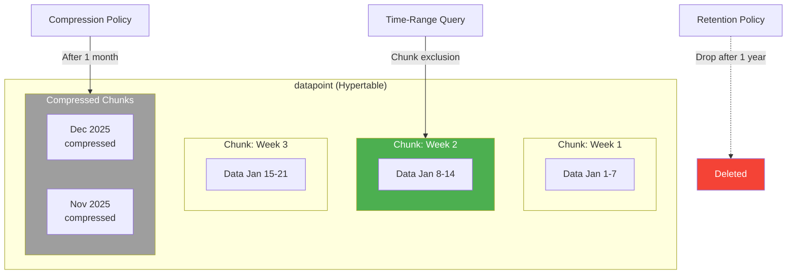
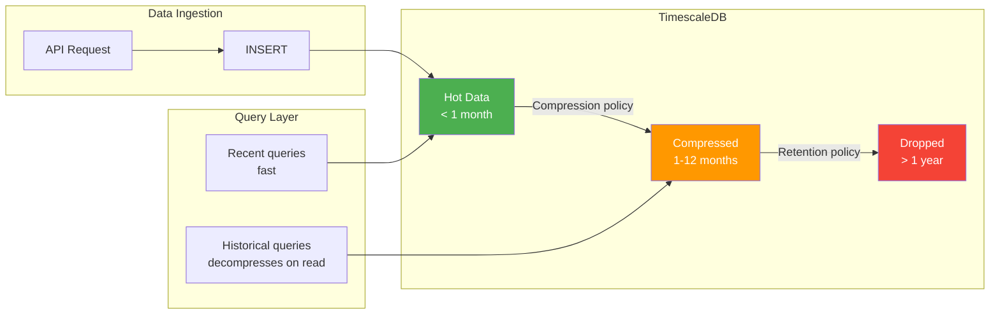
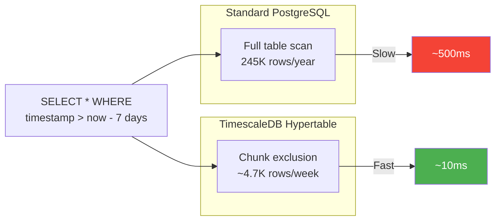
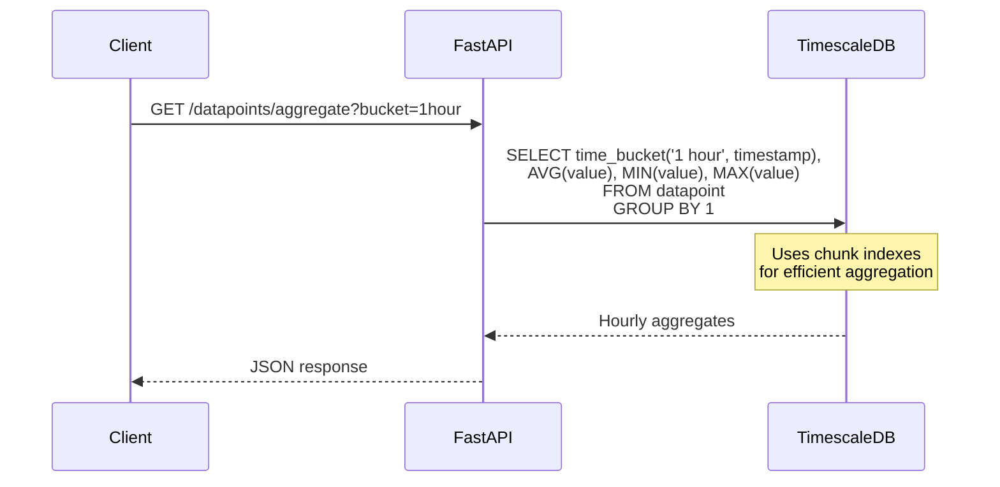

# Plan: TimescaleDB Support

**Status**: Draft
**Author**: Hjemme IT Platform Team
**Created**: 2026-01-24
**Updated**: 2026-01-24
**Priority**: P0 (Critical)
**Roadmap Reference**: Priority 8

## Overview

Add native TimescaleDB support to Prism for time-series data models. This enables hypertables, automatic compression, retention policies, and optimized time-based queries - critical for IoT, monitoring, and analytics use cases with high-volume time-series data.

## Goals

- Define time-series configuration on models in `prism.yaml`
- Auto-generate hypertable migrations with `create_hypertable()`
- Configure compression and retention policies declaratively
- Generate optimized time-bucket queries
- Gracefully degrade to standard PostgreSQL when TimescaleDB is unavailable

## Non-Goals

- Continuous aggregates (separate Priority 14)
- Multi-node TimescaleDB clustering
- Real-time aggregation features

## Architecture

### Hypertable Structure



### Data Lifecycle



### Query Performance



### Time-Bucket Aggregation



## Design

### Technical Approach

#### 1. Specification Format

```yaml
# prism.yaml
models:
  - name: DataPoint
    fields:
      - name: id
        type: uuid
        primary_key: true
      - name: timestamp
        type: datetime
        index: true
      - name: source
        type: string
        max_length: 100
        index: true
      - name: value
        type: float
      - name: metadata
        type: json
        optional: true

    # TimescaleDB configuration
    timeseries:
      time_column: timestamp
      chunk_interval: 1 week
      compression:
        enabled: true
        after: 1 month
        segment_by: [source]
        order_by: [timestamp DESC]
      retention:
        enabled: true
        drop_after: 1 year
      indexes:
        - columns: [source, timestamp]
          type: btree
```

#### 2. Migration Generation

Standard Alembic migration with TimescaleDB extensions:

```python
# migrations/versions/20260124_create_datapoint_hypertable.py

def upgrade():
    # Create table (standard SQLAlchemy)
    op.create_table(
        'datapoint',
        sa.Column('id', UUID, primary_key=True),
        sa.Column('timestamp', sa.DateTime(timezone=True), nullable=False),
        sa.Column('source', sa.String(100), nullable=False),
        sa.Column('value', sa.Float, nullable=False),
        sa.Column('metadata', JSONB, nullable=True),
    )

    # Convert to hypertable (TimescaleDB)
    op.execute("""
        SELECT create_hypertable(
            'datapoint',
            'timestamp',
            chunk_time_interval => INTERVAL '1 week',
            if_not_exists => TRUE
        );
    """)

    # Create indexes
    op.create_index('ix_datapoint_source_timestamp', 'datapoint', ['source', 'timestamp'])

    # Configure compression
    op.execute("""
        ALTER TABLE datapoint SET (
            timescaledb.compress,
            timescaledb.compress_segmentby = 'source',
            timescaledb.compress_orderby = 'timestamp DESC'
        );
    """)

    op.execute("""
        SELECT add_compression_policy('datapoint', INTERVAL '1 month');
    """)

    # Configure retention
    op.execute("""
        SELECT add_retention_policy('datapoint', INTERVAL '1 year');
    """)


def downgrade():
    # Remove policies first
    op.execute("SELECT remove_retention_policy('datapoint', if_exists => true);")
    op.execute("SELECT remove_compression_policy('datapoint', if_exists => true);")

    # Note: Cannot revert hypertable to regular table easily
    op.drop_table('datapoint')
```

#### 3. Repository Methods

Generate optimized query methods for time-series access:

```python
# packages/backend/src/repositories/datapoint.py

class DataPointRepository(BaseRepository[DataPoint]):
    async def get_by_time_range(
        self,
        start: datetime,
        end: datetime,
        sources: list[str] | None = None,
        limit: int | None = None
    ) -> list[DataPoint]:
        """Optimized time-range query with chunk exclusion."""
        query = select(DataPoint).where(
            DataPoint.timestamp >= start,
            DataPoint.timestamp < end
        )
        if sources:
            query = query.where(DataPoint.source.in_(sources))
        query = query.order_by(DataPoint.timestamp.desc())
        if limit:
            query = query.limit(limit)
        result = await self.session.execute(query)
        return list(result.scalars().all())

    async def get_time_bucket_aggregates(
        self,
        bucket_interval: str,  # '1 hour', '1 day', etc.
        start: datetime,
        end: datetime,
        source: str | None = None,
        aggregations: list[str] = ["avg", "min", "max", "count"]
    ) -> list[TimeBucketAggregate]:
        """
        Use TimescaleDB time_bucket for efficient aggregation.
        Falls back to date_trunc for standard PostgreSQL.
        """
        # Build aggregation columns
        agg_columns = []
        if "avg" in aggregations:
            agg_columns.append(func.avg(DataPoint.value).label("avg_value"))
        if "min" in aggregations:
            agg_columns.append(func.min(DataPoint.value).label("min_value"))
        if "max" in aggregations:
            agg_columns.append(func.max(DataPoint.value).label("max_value"))
        if "count" in aggregations:
            agg_columns.append(func.count().label("count"))

        # Use time_bucket (TimescaleDB) or date_trunc (PostgreSQL)
        if self._has_timescaledb():
            bucket = func.time_bucket(bucket_interval, DataPoint.timestamp)
        else:
            bucket = func.date_trunc(bucket_interval, DataPoint.timestamp)

        query = (
            select(bucket.label("bucket"), *agg_columns)
            .where(DataPoint.timestamp >= start, DataPoint.timestamp < end)
            .group_by(bucket)
            .order_by(bucket)
        )

        if source:
            query = query.where(DataPoint.source == source)

        result = await self.session.execute(query)
        return [TimeBucketAggregate(**row._mapping) for row in result.all()]

    async def get_latest_by_source(self, source: str) -> DataPoint | None:
        """Get most recent datapoint for a source (uses last() for efficiency)."""
        if self._has_timescaledb():
            # Use TimescaleDB last() for efficiency
            query = text("""
                SELECT * FROM datapoint
                WHERE source = :source
                ORDER BY timestamp DESC
                LIMIT 1
            """)
        else:
            query = (
                select(DataPoint)
                .where(DataPoint.source == source)
                .order_by(DataPoint.timestamp.desc())
                .limit(1)
            )
        result = await self.session.execute(query, {"source": source})
        return result.scalar_one_or_none()
```

#### 4. TimescaleDB Detection

Runtime detection for graceful degradation:

```python
# packages/backend/src/core/database.py

class DatabaseConfig:
    _has_timescaledb: bool | None = None

    @classmethod
    async def check_timescaledb(cls, session: AsyncSession) -> bool:
        if cls._has_timescaledb is None:
            try:
                result = await session.execute(
                    text("SELECT extversion FROM pg_extension WHERE extname = 'timescaledb'")
                )
                cls._has_timescaledb = result.scalar() is not None
            except Exception:
                cls._has_timescaledb = False
        return cls._has_timescaledb
```

### API Changes

Enhanced query parameters for time-series endpoints:

```
GET /api/datapoints?start=2026-01-01&end=2026-01-31&source=electricity_price
GET /api/datapoints/aggregate?bucket=1+hour&start=...&end=...&aggs=avg,min,max
GET /api/datapoints/latest?source=electricity_price
```

### Database Changes

- Models with `timeseries:` config generate hypertables instead of regular tables
- Compression policies run automatically via TimescaleDB background workers
- Retention policies automatically drop old chunks
- Chunk indexes optimized for time-range queries

## Implementation Steps

1. [ ] Add `timeseries` config to model specification schema
2. [ ] Implement TimescaleDB detection utility
3. [ ] Update migration generator for hypertable support
4. [ ] Generate compression and retention policy SQL
5. [ ] Add time-bucket query methods to repositories
6. [ ] Create API endpoints for aggregate queries
7. [ ] Add CLI command `prism db timescale-info`
8. [ ] Write integration tests with TimescaleDB Docker
9. [ ] Document TimescaleDB setup and configuration
10. [ ] Add Docker Compose template with TimescaleDB

## Testing Strategy

1. **Unit Tests**: Specification parsing, SQL generation
2. **Integration Tests**: Full migration with TimescaleDB container
3. **Degradation Tests**: Verify standard PostgreSQL fallback
4. **Performance Tests**: Compare query times with/without hypertables

Test setup:
```yaml
# docker-compose.test.yml
services:
  timescaledb:
    image: timescale/timescaledb:latest-pg16
    environment:
      POSTGRES_USER: test
      POSTGRES_PASSWORD: test
      POSTGRES_DB: test
    ports:
      - "5432:5432"
```

## Rollout Plan

1. Release as opt-in via `timeseries:` config on models
2. Document TimescaleDB installation (Docker, managed services)
3. Provide example configurations for common use cases
4. Add performance benchmarking guide

## Open Questions

- Should we auto-detect TimescaleDB and skip policies if not available, or fail migration?
- How to handle existing data when adding compression/retention policies?
- Should chunk_interval be configurable per environment (smaller for dev)?
