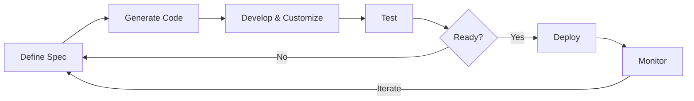
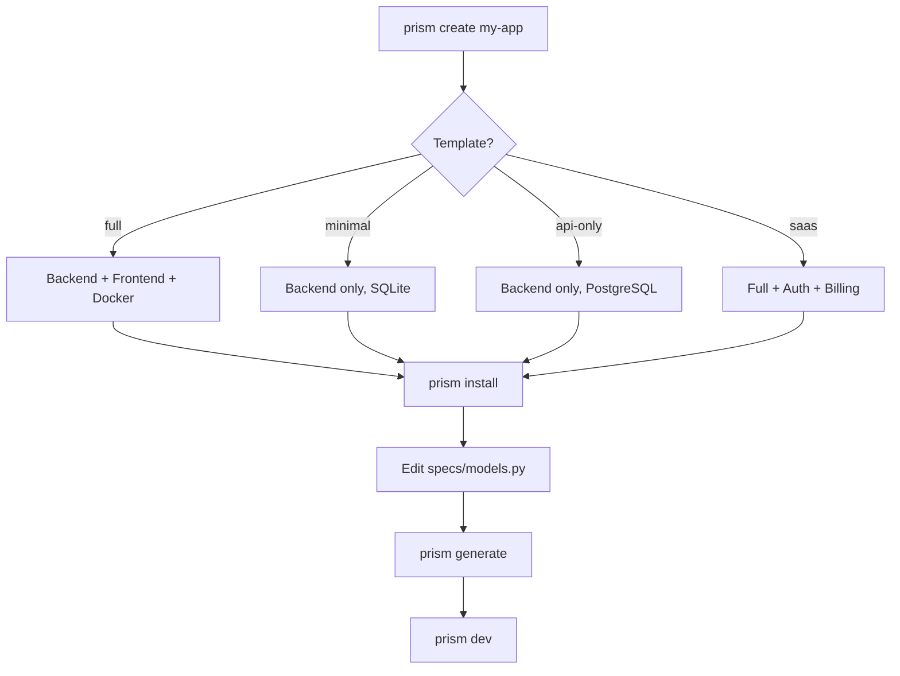
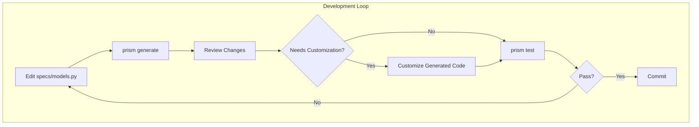
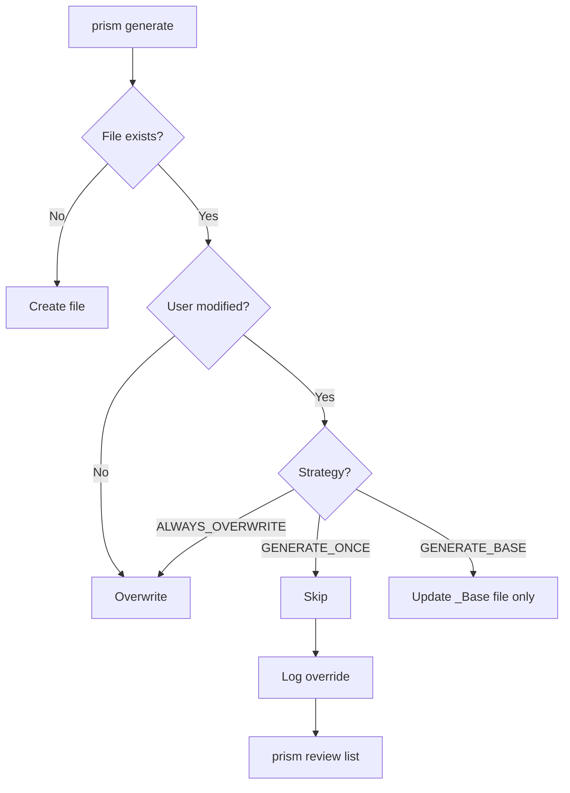
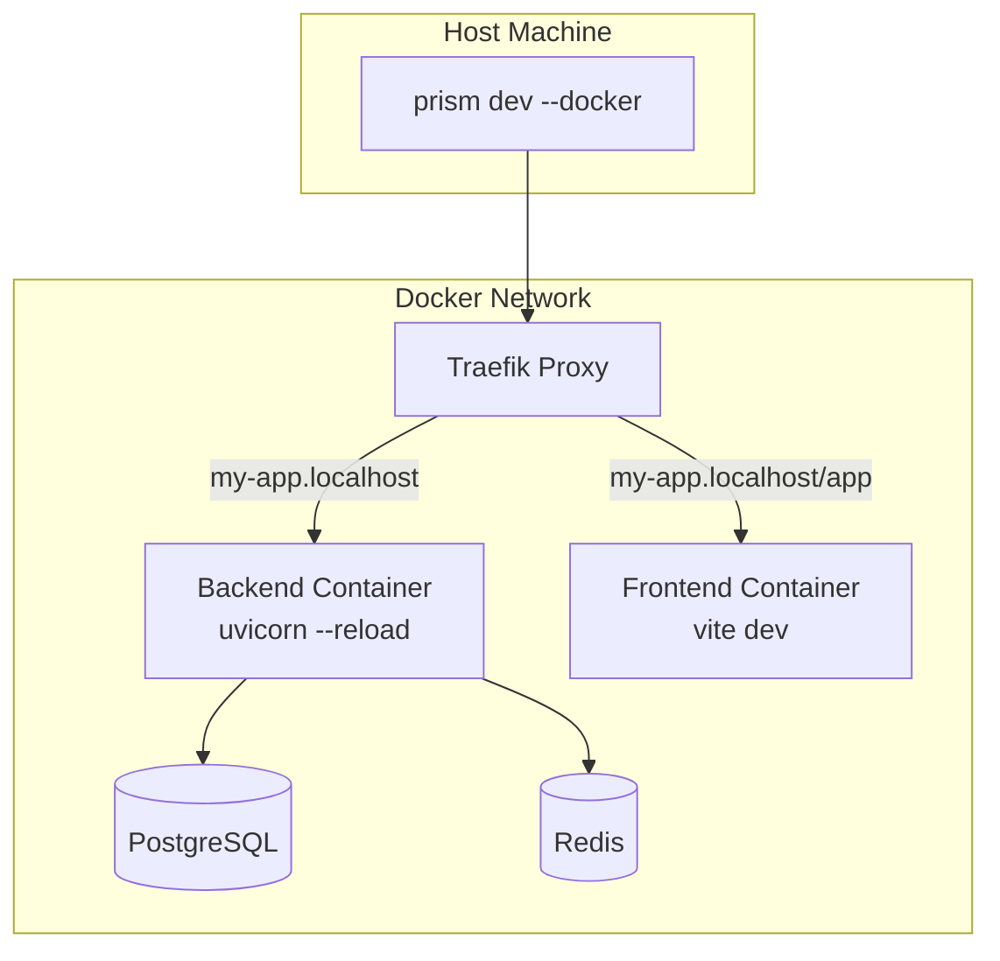
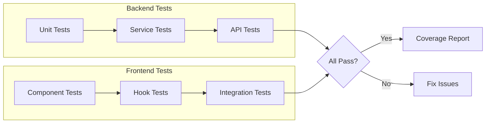
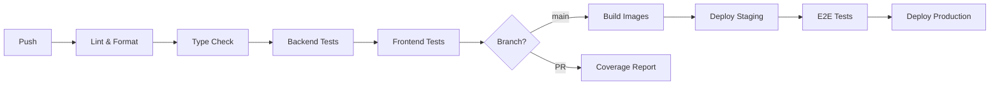
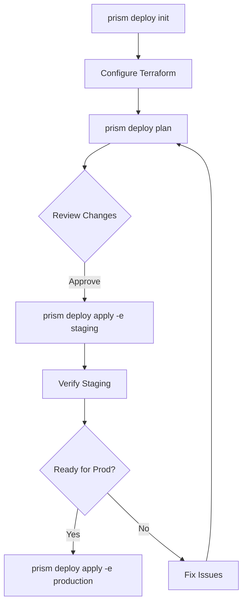
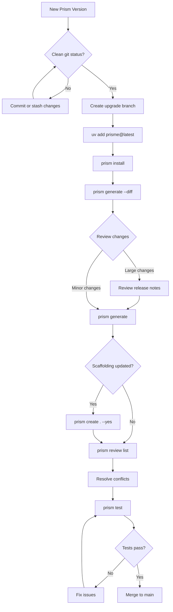
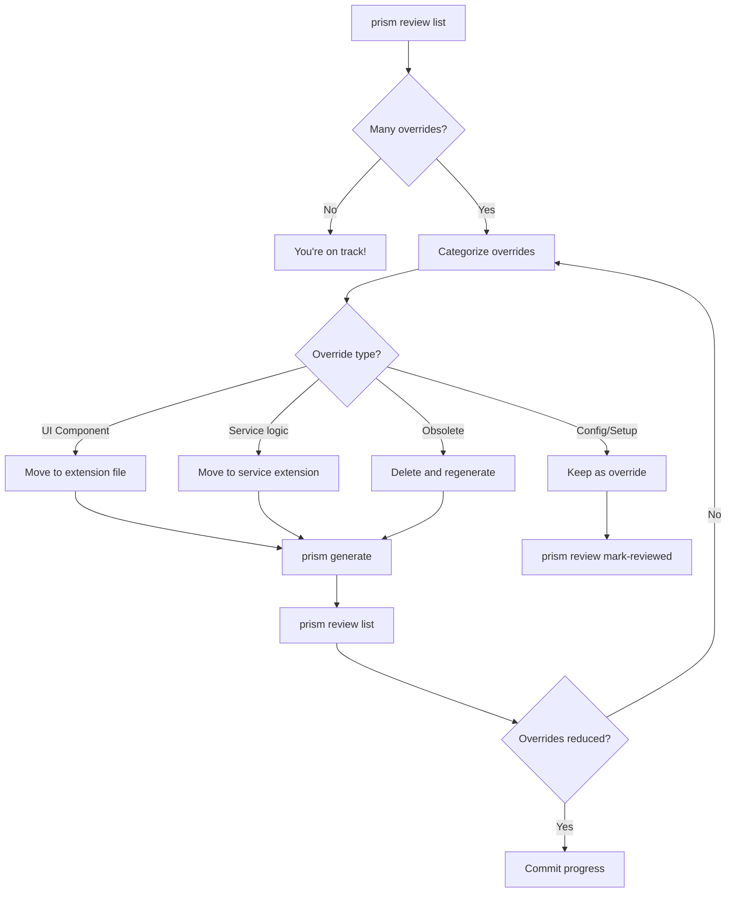

# Workflows & Development Cycle

This guide covers the typical workflows and development patterns when building applications with Prism. Understanding these workflows will help you work efficiently and take full advantage of Prism's code generation capabilities.

## The Prism Development Cycle

At its core, Prism follows a spec-driven development cycle. Your specification is the source of truth, and all generated code flows from it.



**Key principles:**

- **Spec is the source of truth** - Changes to your data model start in `specs/models.py`
- **Generate, don't write** - Let Prism generate boilerplate; focus on business logic
- **Customize safely** - Your customizations are preserved across regenerations
- **Test continuously** - Generated tests provide a safety net for changes

---

## Project Creation Workflow

When starting a new project, choose the template that best fits your needs.



### Template Selection Guide

| Template | Use Case | Includes |
|----------|----------|----------|
| `full` | Full-stack web applications | Backend, Frontend, Docker, CI/CD |
| `minimal` | Learning, prototypes, scripts | Backend only, SQLite |
| `api-only` | Microservices, API backends | Backend only, PostgreSQL |
| `saas` | SaaS products | Full + Auth + Subscriptions |

### Quick Start Commands

```bash
# Create and start a full-stack project
prism create my-app
cd my-app
prism install
prism generate
prism dev
```

Or use the one-liner:

```bash
prism create my-app && cd my-app && prism install && prism generate && prism dev
```

---

## Spec-Driven Development

The core development loop in Prism centers around your specification file. When you need to add features or modify your data model, start with the spec.



### Adding a New Model

1. **Define the model** in `specs/models.py`:

```python title="specs/models.py"
ModelSpec(
    name="Product",
    fields=[
        FieldSpec(name="name", type=FieldType.STRING, required=True),
        FieldSpec(name="price", type=FieldType.DECIMAL, required=True),
        FieldSpec(name="description", type=FieldType.TEXT),
    ],
    rest=RESTExposure(enabled=True),
    graphql=GraphQLExposure(enabled=True),
    frontend=FrontendExposure(enabled=True),
)
```

2. **Generate the code**:

```bash
prism generate
```

3. **Review what was generated**:

```bash
prism generate --dry-run  # Preview without writing
prism generate --diff     # Show changes
```

4. **Run tests** to verify:

```bash
prism test
```

5. **Start development**:

```bash
prism dev
```

### Modifying an Existing Model

When you modify a model in your spec:

1. Prism regenerates all affected files
2. Your customizations in extension files are preserved
3. Base files (`*_Base.tsx`, `*_base.py`) are updated
4. Database migrations are created automatically

```bash
# After editing specs/models.py
prism generate
prism db migrate -m "add status field to product"
prism test
```

---

## Customization & Override Workflow

Prism uses a smart file strategy system to preserve your customizations while keeping generated code up-to-date.



### File Strategies

| Strategy | Behavior | Use For |
|----------|----------|---------|
| `ALWAYS_OVERWRITE` | Always regenerate | Types, schemas, pure generated code |
| `GENERATE_ONCE` | Create once, never overwrite | Service files, main entry points |
| `GENERATE_BASE` | Update base, preserve extension | Components, forms, tables |

### The Base/Extension Pattern

For UI components, Prism generates two files:

```
components/
├── _generated/
│   └── CustomerFormBase.tsx    # Always regenerated
└── customer/
    └── CustomerForm.tsx        # Your customizations (extends Base)
```

**Base file** (`CustomerFormBase.tsx`):
- Contains all generated form fields
- Updated on every `prism generate`
- Should not be edited manually

**Extension file** (`CustomerForm.tsx`):
- Imports and extends the base
- Add custom validation, styling, behavior
- Never overwritten by Prism

### Managing Overrides

When Prism detects you've modified a generated file, it logs the override instead of overwriting:

```bash
# List all overridden files
prism review list

# See what would have been generated
prism review diff src/components/CustomerForm.tsx

# Mark as reviewed (you've verified your changes)
prism review mark-reviewed src/components/CustomerForm.tsx

# Clear reviewed overrides
prism review clear
```

---

## Docker Development Workflow

Prism provides a containerized development environment for consistent local development.



### Starting Docker Development

```bash
# Initialize Docker configuration
prism docker init
prism docker init --redis  # Include Redis

# Start all services
prism dev --docker

# Your app is available at http://my-app.localhost
```

### Docker Commands

```bash
# View logs
prism docker logs           # All services
prism docker logs backend   # Specific service
prism docker logs -f        # Follow logs

# Access containers
prism docker shell backend  # Open shell in container

# Database operations
prism docker backup-db backup.sql
prism docker restore-db backup.sql
prism docker reset-db

# Stop services
prism docker down
```

### Multi-Project Development

Prism uses Traefik to route traffic, allowing multiple projects to run simultaneously:

```bash
# Project 1: http://crm.localhost
cd ~/projects/crm
prism dev --docker

# Project 2: http://blog.localhost
cd ~/projects/blog
prism dev --docker

# List all running projects
prism projects list

# Stop all projects
prism projects down-all
```

---

## Testing Workflow

Prism generates tests for both backend and frontend, providing comprehensive coverage.



### Running Tests

```bash
# Run all tests
prism test

# Backend only (pytest)
prism test --backend-only

# Frontend only (vitest)
prism test --frontend-only

# With coverage
prism test --coverage

# Pass arguments to pytest
prism test -- -k test_customer -v
```

### Test Structure

```
tests/
├── conftest.py           # Shared fixtures
├── test_health.py        # Health check tests
├── models/
│   └── test_customer.py  # Model tests
├── services/
│   └── test_customer_service.py
└── api/
    ├── test_rest_customer.py
    └── test_graphql_customer.py
```

---

## CI/CD Workflow

Prism generates GitHub Actions workflows for continuous integration and deployment.



### Setting Up CI/CD

```bash
# Generate CI/CD workflows
prism ci init

# Options
prism ci init --no-codecov      # Skip coverage integration
prism ci init --no-dependabot   # Skip dependency updates
prism ci init --no-release      # Skip semantic versioning

# Check status
prism ci status

# Validate workflows locally
prism ci validate

# Add Docker build workflows
prism ci add-docker
```

### Generated Workflows

| Workflow | Trigger | Actions |
|----------|---------|---------|
| `ci.yml` | Push, PR | Lint, type check, test |
| `release.yml` | Push to main | Semantic version, changelog |
| `docker-build.yml` | Release | Build and push images |
| `dependabot.yml` | Schedule | Dependency updates |

---

## Deployment Workflow

Prism provides infrastructure-as-code deployment to Hetzner Cloud using Terraform.



### Deployment Setup

```bash
# Initialize deployment configuration
prism deploy init --domain example.com
prism deploy init --location fsn1 --redis

# Preview infrastructure changes
prism deploy plan
prism deploy plan -e staging  # Staging only

# Deploy to staging
prism deploy apply -e staging

# Verify deployment
prism deploy status
prism deploy logs staging -f

# Deploy to production
prism deploy apply -e production

# SSH access
prism deploy ssh staging
prism deploy ssh production
```

### Environment Promotion

1. **Staging**: Test new features, run E2E tests
2. **Production**: Stable releases only

```bash
# Typical promotion workflow
prism deploy apply -e staging
# ... run tests, verify ...
prism deploy apply -e production
```

---

## Upgrading Prism

Prism is evolving rapidly. When a new version is released, follow this workflow to upgrade safely.



### Upgrade Steps

1. **Ensure clean git state** - Commit or stash all changes:

```bash
git status
git add -A && git commit -m "chore: save work before upgrade"
```

2. **Create an upgrade branch**:

```bash
git checkout -b chore/upgrade-prism
```

3. **Update Prism**:

```bash
# Using uv (recommended)
uv add prisme@latest

# Using pip
pip install --upgrade prisme
```

4. **Update project dependencies** - New Prism versions may require updated dependencies:

```bash
prism install
```

6. **Preview what will change**:

```bash
prism generate --dry-run
prism generate --diff
```

7. **Regenerate code**:

```bash
prism generate
```

8. **Update scaffolding** (if major version or scaffolding changes):

```bash
# Regenerate project scaffolding files (main.py, config.py, etc.)
# The --yes flag uses defaults; your specs/ folder is preserved
prism create . --yes
```

!!! note "When to run `prism create`"
    Run `prism create .` when upgrading across major versions or when the changelog mentions updates to scaffolding templates (main.py, config.py, database.py, Docker files, CI workflows).

9. **Review overrides** - New generators may want to update files you've customized:

```bash
prism review list
prism review diff <file>  # For each override
```

10. **Run tests**:

```bash
prism test
```

11. **Apply database migrations** (if schema changed):

```bash
prism db migrate -m "upgrade prism"
```

12. **Merge when ready**:

```bash
git add -A && git commit -m "chore: upgrade prism to vX.Y.Z"
git checkout main && git merge chore/upgrade-prism
```

### Breaking Changes

Check the [Changelog](../changelog.md) for breaking changes between versions. Common things to watch for:

- New required fields in specs
- Changed generator output structure
- Updated file strategies
- New dependencies

---

## Reconciling Overrides

If you've made many direct edits to generated files (bypassing the base/extension pattern), your project may drift from Prism best practices. Here's how to get back on track.



### Understanding Override Categories

| Override Type | Best Practice | Action |
|---------------|---------------|--------|
| UI Components | Use base/extension pattern | Move customizations to `ComponentName.tsx` |
| Forms | Use base/extension pattern | Move validation to `FormName.tsx` |
| Services | Use service extension | Move logic to `services/{model}.py` |
| API Routes | Acceptable override | Mark as reviewed |
| Config files | Acceptable override | Mark as reviewed |
| Type definitions | Should not override | Delete and regenerate |

### Step-by-Step Reconciliation

1. **Audit your overrides**:

```bash
prism review list
prism review summary
```

2. **For each UI component override**, refactor to use base/extension:

```bash
# See what the generated version would be
prism review diff src/components/CustomerForm.tsx

# The generated code goes in _Base file
# Your customizations go in the extension file
```

**Before** (overriding generated file directly):
```typescript title="src/components/CustomerForm.tsx"
// You edited the generated file directly
export function CustomerForm() {
  // Mix of generated code + your customizations
}
```

**After** (proper base/extension pattern):
```typescript title="src/components/_generated/CustomerFormBase.tsx"
// Auto-generated - don't edit
export function CustomerFormBase({ onSubmit }) {
  return <form>...</form>
}
```

```typescript title="src/components/customer/CustomerForm.tsx"
// Your customizations here - never overwritten
import { CustomerFormBase } from '../_generated/CustomerFormBase'

export function CustomerForm() {
  const handleSubmit = (data) => {
    // Your custom validation
    // Your custom logic
  }
  return <CustomerFormBase onSubmit={handleSubmit} />
}
```

3. **For service logic**, use service extensions:

```python title="services/customer.py"
# Your custom business logic - never overwritten
from ._generated.customer_base import CustomerServiceBase

class CustomerService(CustomerServiceBase):
    async def create(self, data):
        # Your custom pre-processing
        result = await super().create(data)
        # Your custom post-processing
        return result
```

4. **After refactoring each file**, regenerate:

```bash
prism generate
```

5. **Mark legitimate overrides as reviewed**:

```bash
# For files you intentionally keep different
prism review mark-reviewed src/main.py
prism review mark-reviewed src/config.py
```

6. **Clear the reviewed overrides**:

```bash
prism review clear
```

### Prevention: Staying on Track

To avoid accumulating overrides in the future:

- **Always check for extension files first** before editing generated code
- **Run `prism generate --diff`** to see what would change before regenerating
- **Run `prism review list`** regularly to catch drift early
- **Commit after each `prism generate`** to make changes reviewable

---

## Common Scenarios

Quick reference for typical developer tasks.

### "I want to add a new model"

```bash
# 1. Edit specs/models.py to add your model
# 2. Generate code
prism generate
# 3. Create migration
prism db migrate -m "add new model"
# 4. Test
prism test
# 5. Start dev server
prism dev
```

### "I want to customize a generated component"

```bash
# 1. Find the extension file (not the _Base file)
# 2. Edit the extension file - your changes are preserved
# 3. If you need to modify base behavior, extend/override in extension
# 4. Test your changes
prism test --frontend-only
```

### "I want to add a custom API endpoint"

```bash
# 1. Create a new router file in api/rest/
# 2. Import and include in main.py
# 3. The file won't be overwritten (GENERATE_ONCE strategy)
```

### "I want to deploy to production"

```bash
# 1. Ensure all tests pass
prism test
# 2. Deploy to staging first
prism deploy apply -e staging
# 3. Verify staging works
prism deploy logs staging
# 4. Deploy to production
prism deploy apply -e production
# 5. Setup SSL
prism deploy ssl production --domain example.com
```

### "I want to reset my development database"

```bash
# Local development
prism db reset -y

# Docker development
prism docker reset-db
```

### "I want to upgrade to a new Prism version"

```bash
# 1. Commit current work
git add -A && git commit -m "chore: save before upgrade"

# 2. Create upgrade branch
git checkout -b chore/upgrade-prism

# 3. Upgrade prism
uv add prisme@latest

# 4. Update dependencies
prism install

# 5. Preview changes
prism generate --diff

# 6. Regenerate code
prism generate

# 7. Update scaffolding (if major version change)
prism create . --yes

# 8. Check for conflicts
prism review list

# 9. Run tests
prism test

# 10. Commit and merge
git add -A && git commit -m "chore: upgrade prism"
git checkout main && git merge chore/upgrade-prism
```

### "I have many overrides and want to get back on track"

```bash
# 1. See all overrides
prism review list
prism review summary

# 2. For each override, check the diff
prism review diff <file>

# 3. Refactor: move customizations to extension files
#    - UI components: ComponentName.tsx (not _Base)
#    - Services: services/{model}.py (extends _base)

# 4. Regenerate after refactoring
prism generate

# 5. Mark intentional overrides as reviewed
prism review mark-reviewed <file>

# 6. Clear reviewed overrides
prism review clear

# 7. Verify
prism review list  # Should be minimal now
```

---

## See Also

- [CLI Reference](cli-reference.md) - Complete command documentation
- [Model Specification](spec-guide.md) - Defining your data models
- [Code Generation](code-generation.md) - How generators work
- [Extensibility](extensibility.md) - Customizing generated code
- [Docker Development](docker-development.md) - Container-based development
- [Hetzner Deployment](hetzner-deployment.md) - Cloud deployment guide
