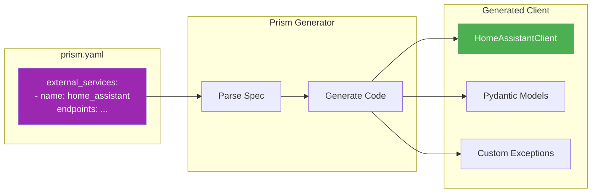
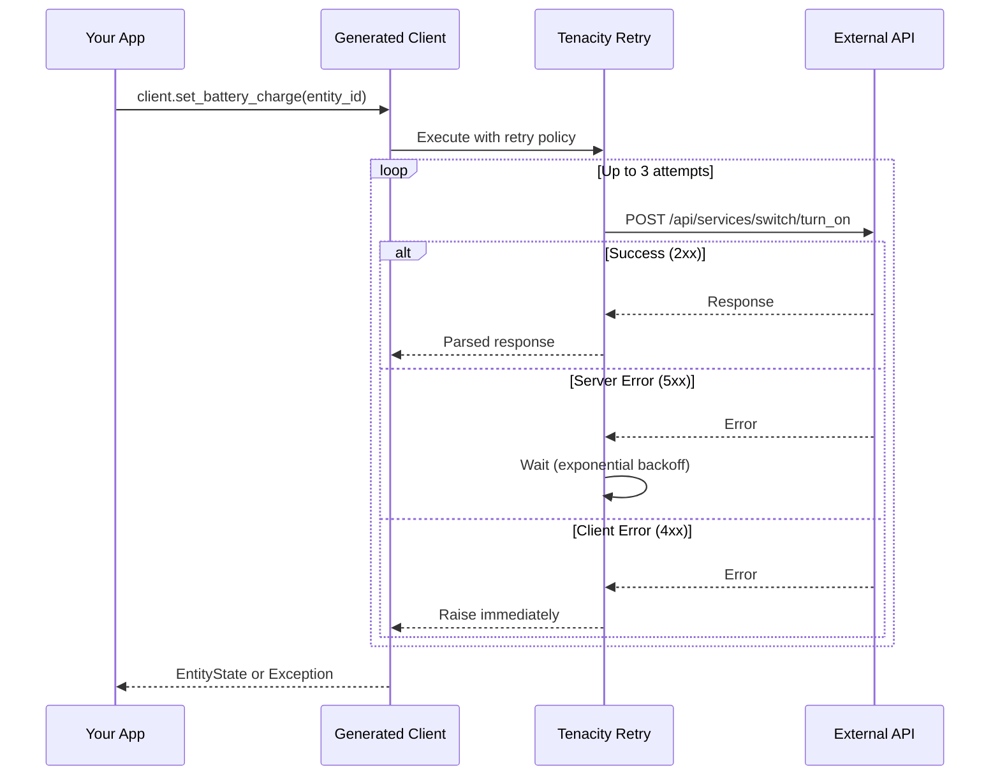
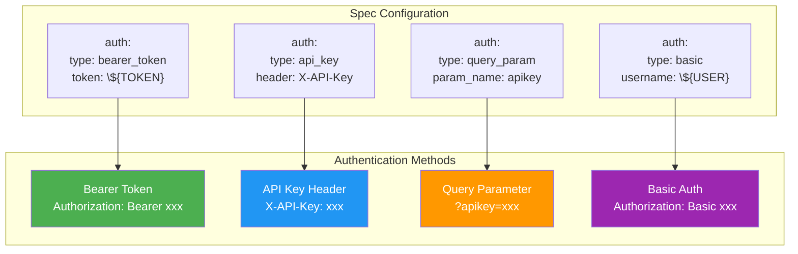
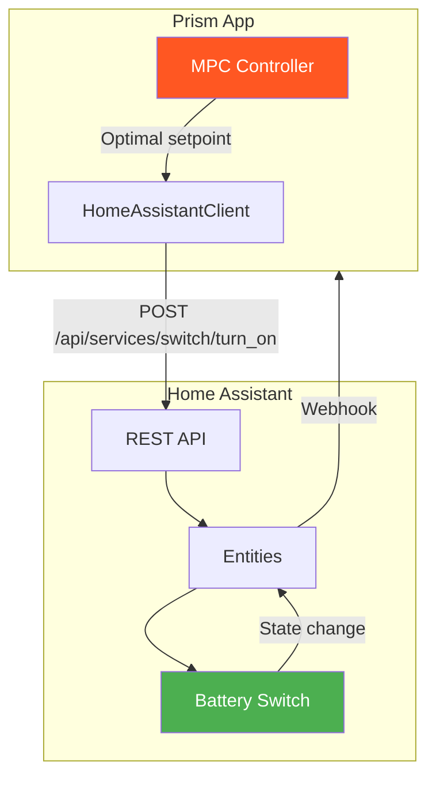

# Plan: External Service Integration

**Status**: Draft
**Author**: Hjemme IT Platform Team
**Created**: 2026-01-24
**Updated**: 2026-01-24
**Priority**: P1 (Important)
**Roadmap Reference**: Priority 9

## Overview

Add declarative external service definitions to Prism, enabling auto-generation of type-safe Python client classes for calling third-party APIs. This simplifies integration with Home Assistant, weather APIs, payment gateways, and other external services.

## Goals

- Define external services declaratively in `prism.yaml`
- Auto-generate type-safe async HTTP client classes
- Support multiple authentication methods (Bearer, API key, OAuth)
- Implement retry logic and error handling
- Generate Pydantic models for request/response schemas

## Non-Goals

- OAuth2 flow management (use existing libraries)
- GraphQL client generation (REST only for MVP)
- Service discovery or dynamic endpoint resolution

## Architecture

### Client Generation Flow



### Request Flow with Retry



### Authentication Methods



### Home Assistant Integration Example



## Design

### Technical Approach

#### 1. Specification Format

```yaml
# prism.yaml
external_services:
  - name: home_assistant
    base_url: ${HA_BASE_URL}
    auth:
      type: bearer_token
      token: ${HA_TOKEN}
    timeout: 30
    retry:
      max_attempts: 3
      backoff: exponential
      retry_on: [500, 502, 503, 504]
    headers:
      Content-Type: application/json
    endpoints:
      - name: set_switch_state
        method: POST
        path: /api/services/switch/turn_{state}
        path_params:
          state:
            type: string
            enum: [on, off]
        request_body:
          entity_id:
            type: string
            required: true
        response_schema:
          type: array
          items:
            type: object

      - name: get_entity_state
        method: GET
        path: /api/states/{entity_id}
        path_params:
          entity_id:
            type: string
        response_schema:
          entity_id: string
          state: string
          attributes: object
          last_changed: datetime
          last_updated: datetime

  - name: weather_api
    base_url: https://api.openweathermap.org/data/2.5
    auth:
      type: query_param
      param_name: appid
      value: ${OPENWEATHER_API_KEY}
    endpoints:
      - name: get_forecast
        method: GET
        path: /forecast
        query_params:
          lat:
            type: float
            required: true
          lon:
            type: float
            required: true
          units:
            type: string
            default: metric
        response_schema:
          cod: string
          message: integer
          cnt: integer
          list:
            type: array
            items:
              dt: integer
              main:
                temp: float
                humidity: integer
              weather:
                type: array
```

#### 2. Generated Client Classes

```python
# packages/backend/src/clients/home_assistant.py
# AUTO-GENERATED - DO NOT EDIT

from datetime import datetime
from typing import Any
import httpx
from pydantic import BaseModel
from tenacity import retry, stop_after_attempt, wait_exponential

from ..core.config import settings


class EntityState(BaseModel):
    entity_id: str
    state: str
    attributes: dict[str, Any]
    last_changed: datetime
    last_updated: datetime


class HomeAssistantClient:
    """Auto-generated client for Home Assistant API."""

    def __init__(
        self,
        base_url: str | None = None,
        token: str | None = None,
        timeout: float = 30.0
    ):
        self.base_url = base_url or settings.HA_BASE_URL
        self.token = token or settings.HA_TOKEN
        self._client = httpx.AsyncClient(
            base_url=self.base_url,
            headers={
                "Authorization": f"Bearer {self.token}",
                "Content-Type": "application/json"
            },
            timeout=timeout
        )

    async def __aenter__(self):
        return self

    async def __aexit__(self, *args):
        await self._client.aclose()

    @retry(
        stop=stop_after_attempt(3),
        wait=wait_exponential(multiplier=1, min=1, max=10),
        retry=lambda e: isinstance(e, httpx.HTTPStatusError)
            and e.response.status_code in [500, 502, 503, 504]
    )
    async def set_switch_state(
        self,
        state: Literal["on", "off"],
        entity_id: str
    ) -> list[dict]:
        """Turn switch on or off via Home Assistant."""
        response = await self._client.post(
            f"/api/services/switch/turn_{state}",
            json={"entity_id": entity_id}
        )
        response.raise_for_status()
        return response.json()

    @retry(
        stop=stop_after_attempt(3),
        wait=wait_exponential(multiplier=1, min=1, max=10),
        retry=lambda e: isinstance(e, httpx.HTTPStatusError)
            and e.response.status_code in [500, 502, 503, 504]
    )
    async def get_entity_state(self, entity_id: str) -> EntityState:
        """Get current state of an entity."""
        response = await self._client.get(f"/api/states/{entity_id}")
        response.raise_for_status()
        return EntityState(**response.json())
```

#### 3. Authentication Support

Support multiple auth methods:

```python
class AuthConfig:
    type: Literal["bearer_token", "api_key", "query_param", "basic", "oauth2"]

# Bearer Token
headers = {"Authorization": f"Bearer {token}"}

# API Key Header
headers = {"X-API-Key": api_key}

# Query Parameter
params = {"appid": api_key}

# Basic Auth
auth = httpx.BasicAuth(username, password)

# OAuth2 (reference external token provider)
# User must implement token refresh separately
```

#### 4. Error Handling

Custom exceptions for external service errors:

```python
# packages/backend/src/clients/exceptions.py

class ExternalServiceError(Exception):
    """Base exception for external service errors."""
    def __init__(self, service: str, message: str, status_code: int | None = None):
        self.service = service
        self.status_code = status_code
        super().__init__(f"[{service}] {message}")


class ServiceUnavailableError(ExternalServiceError):
    """External service is temporarily unavailable."""
    pass


class ServiceAuthenticationError(ExternalServiceError):
    """Authentication with external service failed."""
    pass
```

### API Changes

No direct API changes. Generated clients are used internally by application code.

### Database Changes

None.

## Implementation Steps

1. [ ] Add `external_services` section to specification schema
2. [ ] Create client code generator template
3. [ ] Implement authentication method handlers
4. [ ] Add retry logic with tenacity
5. [ ] Generate Pydantic models for response schemas
6. [ ] Create exception classes for service errors
7. [ ] Write unit tests with mocked HTTP responses
8. [ ] Add documentation for service specification

## Testing Strategy

1. **Unit Tests**: Client generation, auth method handling
2. **Integration Tests**: Mock HTTP server with pytest-httpx
3. **E2E Tests**: Real service calls (optional, requires credentials)

```python
# tests/clients/test_home_assistant.py
import pytest
from pytest_httpx import HTTPXMock

async def test_get_entity_state(httpx_mock: HTTPXMock):
    httpx_mock.add_response(
        url="http://ha.local/api/states/switch.garage",
        json={
            "entity_id": "switch.garage",
            "state": "on",
            "attributes": {},
            "last_changed": "2026-01-24T10:00:00Z",
            "last_updated": "2026-01-24T10:00:00Z"
        }
    )

    async with HomeAssistantClient(base_url="http://ha.local", token="test") as client:
        state = await client.get_entity_state("switch.garage")
        assert state.state == "on"
```

## Rollout Plan

1. Release as opt-in via `external_services:` section
2. Provide example configurations for common services (Home Assistant, OpenWeather)
3. Document custom client extension patterns

## Open Questions

- Should we generate sync clients as well, or async-only?
- How to handle services requiring dynamic token refresh (OAuth2)?
- Should response validation be strict or allow extra fields?
