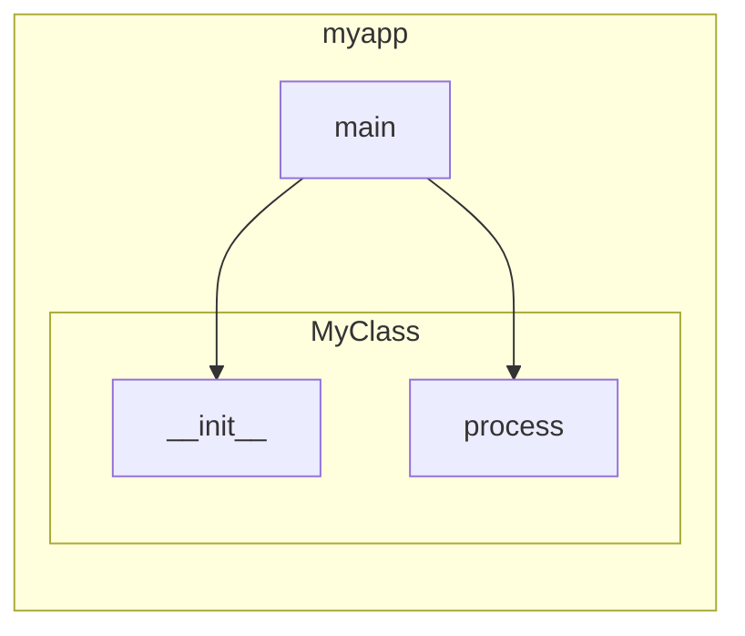

# 🎨 PyVisualizer

[](https://github.com/haider1998/PyVisualizer/actions/workflows/ci.yml)
[](https://www.python.org/downloads/)
[](https://opensource.org/licenses/MIT)

> Transform complex Python codebases into stunning, interactive architectural diagrams

**PyVisualizer** uses static code analysis (AST parsing) to understand your Python code without executing it, then generates beautiful visualizations showing function calls, class relationships, and module dependencies.

<p align="center">
  
</p>

## ✨ Features

### 🔍 Intelligent Code Analysis
- **AST-based parsing** - No code execution required, completely safe
- **Call graph extraction** - Tracks function and method calls across modules
- **Class analysis** - Detects inheritance, decorators, properties, and async methods
- **Import resolution** - Handles complex import patterns including relative imports

### 🎨 Multiple Visualization Formats
- **Interactive D3.js** - Force-directed graphs with zoom, pan, search, and filtering
- **Mermaid Diagrams** - Portable diagrams that render in GitHub, GitLab, and VS Code
- **Static Images** - SVG and PNG export via Graphviz (optional)

### 🔧 Flexible Filtering
- Filter by specific modules
- Exclude test files or other patterns
- Limit call depth from entry points
- Control maximum nodes for large codebases

### 🚀 CI/CD Integration
- GitHub Actions workflows included
- Auto-update diagrams on commit
- PR review with architecture analysis

## 📦 Installation

```bash
pip install py-code-visualizer
```

Or install from source:

```bash
git clone https://github.com/haider1998/PyVisualizer.git
cd PyVisualizer
pip install -e .
```

For SVG/PNG export (optional):

```bash
pip install py-code-visualizer[graphviz]
# Also requires graphviz system package:
# macOS: brew install graphviz
# Ubuntu: sudo apt install graphviz
```

## 🚀 Quick Start

### Basic Usage

```bash
# Generate interactive HTML visualization
py-code-visualizer /path/to/your/project --format html -o architecture.html

# Generate Mermaid diagram
py-code-visualizer /path/to/your/project --format mermaid -o architecture.mmd

# Analyze a single file
py-code-visualizer my_module.py --format html -o my_module.html
```

### Filtering

```bash
# Focus on specific modules
py-code-visualizer /path/to/project --modules myapp.core myapp.utils

# Exclude test files
py-code-visualizer /path/to/project --exclude tests migrations

# Limit to functions within 3 calls of main()
py-code-visualizer /path/to/project --entry main.main --depth 3

# Limit graph size for very large projects
py-code-visualizer /path/to/project --max-nodes 100
```

### With Custom Output

```bash
py-code-visualizer /path/to/project \
    --format html \
    --output docs/architecture.html \
    --project-name "My Awesome Project" \
    --exclude tests \
    --max-nodes 150 \
    --verbose
```

## 📊 Output Formats

### Interactive D3.js HTML

The default `--format html` produces an interactive visualization with:
- 🔍 **Search** - Find functions by name
- 🎚️ **Filters** - Filter by module or function type
- 🔄 **Zoom/Pan** - Navigate large graphs
- 🌙 **Dark Mode** - Toggle light/dark theme
- 📊 **Statistics** - See function count, calls, and cycles
- ⬇️ **Export** - Download as SVG

### Mermaid Diagrams

The `--format mermaid` produces diagrams that render natively in:
- GitHub README and Issues
- GitLab Markdown
- VS Code with Mermaid extension
- Any Mermaid-compatible viewer

Example output:


## 🔄 CI/CD Integration

### Auto-Update Diagrams on Push

Add `.github/workflows/auto-diagram.yml` (included in this repo):

```yaml
name: Update Architecture Diagrams

on:
  push:
    branches: [main]
    paths: ['**/*.py']

jobs:
  update-diagrams:
    runs-on: ubuntu-latest
    steps:
    - uses: actions/checkout@v4
    - uses: actions/setup-python@v5
      with:
        python-version: '3.11'
    
    - name: Install PyVisualizer
      run: pip install py-code-visualizer
    
    - name: Generate diagrams
      run: |
        py-code-visualizer . \
          --format mermaid \
          --output docs/architecture.mmd \
          --exclude tests
    
    - name: Commit changes
      run: |
        git config user.name "github-actions[bot]"
        git config user.email "github-actions[bot]@users.noreply.github.com"
        git add docs/
        git diff --staged --quiet || git commit -m "🏗️ Update architecture diagrams"
        git push
```

### PR Architecture Review

Add `.github/workflows/pr-diagram.yml` (included in this repo) to automatically post architecture analysis as a PR comment.

## 🛠️ Development

```bash
# Clone and install dev dependencies
git clone https://github.com/haider1998/PyVisualizer.git
cd PyVisualizer
pip install -e ".[dev]"

# Run tests
make test

# Format code
make format

# Run linters
make lint

# Generate architecture diagram of PyVisualizer itself
make self-viz
```

## 📁 Project Structure

```
pyvisualizer/
├── pyvisualizer/              # Main package
│   ├── cli.py                 # CLI entry point
│   ├── core/                  # Analysis modules
│   │   ├── analyzer.py        # AST parsing
│   │   ├── graph.py           # Call graph building
│   │   └── resolver.py        # Function resolution
│   ├── visualizers/           # Output generators
│   │   ├── mermaid.py         # Mermaid diagrams
│   │   └── d3.py              # Interactive D3.js
│   └── utils/                 # Utilities
│       └── file_discovery.py
├── tests/                     # Test suite
├── examples/                  # Example projects
├── .github/workflows/         # CI/CD pipelines
└── docs/                      # Documentation
```

## 🤝 Contributing

Contributions are welcome! Please see [CONTRIBUTING.md](CONTRIBUTING.md) for guidelines.

1. Fork the repository
2. Create a feature branch (`git checkout -b feature/amazing-feature`)
3. Commit your changes (`git commit -m 'feat: add amazing feature'`)
4. Push to the branch (`git push origin feature/amazing-feature`)
5. Open a Pull Request

## 📝 License

This project is licensed under the MIT License - see the [LICENSE](LICENSE) file for details.

## 🙏 Acknowledgments

- [NetworkX](https://networkx.org/) - Graph data structures
- [D3.js](https://d3js.org/) - Interactive visualizations
- [Mermaid](https://mermaid.js.org/) - Diagram generation

---

Made with ❤️ by [Syed Mohd Haider Rizvi](https://github.com/haider1998)