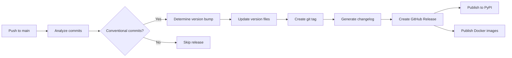

# Release Process

This document describes the automated release process for pytest-agents.

## Overview

pytest-agents uses **automated semantic versioning** based on conventional commits. The release process:

1. Analyzes commit messages since the last release
2. Determines the appropriate version bump (major, minor, or patch)
3. Updates version numbers in the codebase
4. Generates a changelog
5. Creates a GitHub Release
6. Publishes to PyPI
7. Publishes Docker images to GitHub Container Registry (GHCR)

## Versioning Strategy

We follow [Semantic Versioning 2.0.0](https://semver.org/):

- **Major** (X.0.0): Breaking changes
- **Minor** (0.X.0): New features (backwards compatible)
- **Patch** (0.0.X): Bug fixes (backwards compatible)

### Version Bump Rules

The release workflow examines commit messages:

| Commit Type | Example | Version Bump |
|-------------|---------|--------------|
| BREAKING CHANGE | `feat!: remove old API` | Major |
| `feat:` | `feat: add new agent` | Minor |
| `fix:` | `fix: resolve timeout issue` | Patch |
| Others | `docs: update README` | No release |

## Conventional Commits

Use [Conventional Commits](https://www.conventionalcommits.org/) format:

```
<type>[optional scope]: <description>

[optional body]

[optional footer(s)]
```

### Commit Types

- **feat**: New feature
- **fix**: Bug fix
- **docs**: Documentation only
- **style**: Code style changes (formatting, no logic change)
- **refactor**: Code refactoring (no feature/fix)
- **perf**: Performance improvements
- **test**: Adding/updating tests
- **build**: Build system changes
- **ci**: CI/CD changes
- **chore**: Maintenance tasks

### Examples

**Feature (minor bump):**
```bash
git commit -m "feat: add confidence check skill

Implements new skill for checking agent confidence scores.
Integrates with existing PM agent workflow."
```

**Bug fix (patch bump):**
```bash
git commit -m "fix: resolve agent timeout in Docker

Increase default timeout from 30s to 60s for containerized environments.

Fixes #123"
```

**Breaking change (major bump):**
```bash
git commit -m "feat!: redesign agent API

BREAKING CHANGE: Agent invocation now requires explicit timeout parameter.
Previous default behavior no longer supported."
```

## Automated Release Process

### Triggering a Release

Releases are triggered automatically when:

1. Commits are pushed to `main` branch
2. At least one commit uses conventional commit format (`feat:`, `fix:`, etc.)
3. Commits are not documentation-only

**What happens:**



### Manual Release Trigger

For special cases, manually trigger a release:

1. Go to **Actions** → **Release** workflow
2. Click **Run workflow**
3. Select version bump type:
   - `auto`: Analyze commits (default)
   - `major`: Force major version bump
   - `minor`: Force minor version bump
   - `patch`: Force patch version bump
4. Click **Run workflow**

## Release Artifacts

Each release creates:

### 1. GitHub Release

- **Location**: https://github.com/kmcallorum/pytest-agents/releases
- **Contains**:
  - Release notes (auto-generated changelog)
  - Git tag (e.g., `v0.2.0`)
  - Links to source code archives

### 2. PyPI Package

- **Location**: https://pypi.org/project/pytest-agents/
- **Install**: `pip install pytest-agents`
- **Contains**:
  - Python wheel (`.whl`)
  - Source distribution (`.tar.gz`)

### 3. Docker Images

- **Location**: https://ghcr.io/kmcallorum/pytest-agents
- **Tags**:
  - `latest`: Most recent release
  - `X.Y.Z`: Specific version (e.g., `0.2.0`)
  - `X.Y`: Minor version (e.g., `0.2`)
  - `X`: Major version (e.g., `0`)
- **Platforms**: `linux/amd64`, `linux/arm64`

**Pull image:**
```bash
docker pull ghcr.io/kmcallorum/pytest-agents:latest
docker pull ghcr.io/kmcallorum/pytest-agents:0.2.0
```

## Prerequisites for Publishing

### PyPI Publishing

pytest-agents uses **Trusted Publishing** (recommended by PyPI) instead of API tokens.

**Quick Setup:**

1. Create PyPI account at https://pypi.org
2. Configure trusted publisher:
   - Go to https://pypi.org/manage/account/publishing/
   - Add pending publisher:
     - Project: `pytest-agents`
     - Owner: `kmcallorum`
     - Repo: `claudelife`
     - Workflow: `release.yml`
3. Done! Next release will auto-publish to PyPI

**Full Guide:** See [PyPI Setup Guide](PYPI_SETUP.md) for detailed step-by-step instructions.

### Docker Publishing

No setup required - uses `GITHUB_TOKEN` automatically.

**Permissions:**
- GitHub Container Registry (GHCR) is enabled by default
- Workflow has `packages: write` permission

## Version File Locations

The release workflow updates versions in:

1. **pyproject.toml**
   ```toml
   [project]
   name = "pytest-agents"
   version = "0.2.0"  # Updated automatically
   ```

2. **src/pytest-agents/__init__.py**
   ```python
   __version__ = "0.2.0"  # Updated automatically
   ```

## Changelog Generation

Changelogs are auto-generated and organized by type:

```markdown
# Release v0.2.0

## Changes

### ⚠️ Breaking Changes
- **BREAKING**: redesign agent API (a1b2c3d)

### ✨ Features
- add confidence check skill (d4e5f6g)
- implement new research agent (h7i8j9k)

### 🐛 Bug Fixes
- resolve agent timeout in Docker (k1l2m3n)

### 📦 Other Changes
- docs: update API documentation (o4p5q6r)
- chore: update dependencies (s7t8u9v)
```

## Release Workflow

### 1. Development

```bash
# Work on feature branch
git checkout -b feat/new-agent
# ... make changes ...
git add .
git commit -m "feat: add new PM agent capability"
```

### 2. Pull Request

```bash
# Push and create PR
git push origin feat/new-agent
gh pr create --title "feat: add new PM agent capability"
```

### 3. Merge to Main

```bash
# After PR approval
gh pr merge --squash
```

### 4. Automatic Release

- Workflow detects `feat:` commit
- Determines minor version bump
- Updates version: `0.1.0` → `0.2.0`
- Creates tag: `v0.2.0`
- Publishes to PyPI and GHCR

### 5. Verify Release

```bash
# Check GitHub Release
gh release view v0.2.0

# Verify PyPI
pip install pytest-agents==0.2.0

# Verify Docker
docker pull ghcr.io/kmcallorum/pytest-agents:0.2.0
```

## Troubleshooting

### Release Not Triggered

**Issue**: Pushed to main but no release created

**Solutions:**
1. Check commit messages use conventional format
2. Verify commits aren't documentation-only
3. Review workflow run in Actions tab
4. Manually trigger release via workflow_dispatch

### PyPI Publishing Failed

**Issue**: GitHub Release created but PyPI publish failed

**Solutions:**
1. Verify `PYPI_API_TOKEN` secret is set
2. Check token hasn't expired
3. Ensure package name isn't taken
4. Review PyPI publish job logs

**Re-run:**
```bash
# Manually re-run failed job
gh run rerun <run-id> --job <job-id>
```

### Docker Publishing Failed

**Issue**: Images not appearing in GHCR

**Solutions:**
1. Check workflow has `packages: write` permission
2. Verify Docker build succeeds locally
3. Review Docker publish job logs

### Version Conflict

**Issue**: Version already exists

**Solution:**
Version bumps are automatic. If you need to force a specific version:

1. Manually trigger workflow with specific bump type
2. Or update `pyproject.toml` and `__init__.py` manually
3. Create PR with version changes

## Best Practices

### 1. Meaningful Commits

```bash
# ✅ Good
git commit -m "feat: add agent timeout configuration

Allows users to configure agent timeout via environment variable.
Defaults to 60 seconds if not specified."

# ❌ Bad
git commit -m "update stuff"
```

### 2. Squash PRs

Use squash merging for clean history:
```bash
gh pr merge --squash --subject "feat: add new capability"
```

### 3. Test Before Release

Ensure CI passes before merging to main:
```bash
# Check PR status
gh pr checks

# Wait for CI
gh pr checks --watch
```

### 4. Review Changelogs

After release, review auto-generated changelog:
```bash
gh release view v0.2.0
```

Manually edit if needed:
```bash
gh release edit v0.2.0 --notes "Custom release notes"
```

## Release Checklist

Before major releases:

- [ ] Update documentation
- [ ] Run full test suite locally
- [ ] Review breaking changes
- [ ] Update migration guide (if breaking)
- [ ] Test Docker build locally
- [ ] Verify PyPI credentials
- [ ] Create release PR for review
- [ ] Announce release plans
- [ ] Merge and verify automated release
- [ ] Test published packages
- [ ] Announce release to users

## Emergency Rollback

If a release has critical issues:

### 1. Yank PyPI Release

```bash
# Mark release as yanked (won't be installed by default)
pip install twine
twine upload --skip-existing --repository pypi dist/*
```

Or via PyPI web interface:
- Go to https://pypi.org/project/pytest-agents/
- Select version → Manage → Yank release

### 2. Mark GitHub Release as Pre-release

```bash
gh release edit v0.2.0 --prerelease
```

### 3. Create Hotfix

```bash
git checkout -b hotfix/critical-fix v0.1.0
# ... make fixes ...
git commit -m "fix: critical security issue"
git push origin hotfix/critical-fix
# Manually trigger release with patch bump
```

## Monitoring Releases

### GitHub Actions

```bash
# View recent releases
gh run list --workflow=release.yml --limit 5

# View specific release
gh run view <run-id>

# Watch release in progress
gh run watch
```

### Docker Images

```bash
# List published images
gh api /user/packages/container/claudelife/versions

# Pull latest
docker pull ghcr.io/kmcallorum/pytest-agents:latest
```

### PyPI Downloads

View stats at: https://pypistats.org/packages/pytest-agents

## References

- [Semantic Versioning](https://semver.org/)
- [Conventional Commits](https://www.conventionalcommits.org/)
- [GitHub Releases](https://docs.github.com/en/repositories/releasing-projects-on-github)
- [PyPI Publishing](https://packaging.python.org/en/latest/tutorials/packaging-projects/)
- [GitHub Container Registry](https://docs.github.com/en/packages/working-with-a-github-packages-registry/working-with-the-container-registry)

---

**Last Updated**: 2026-01-05
