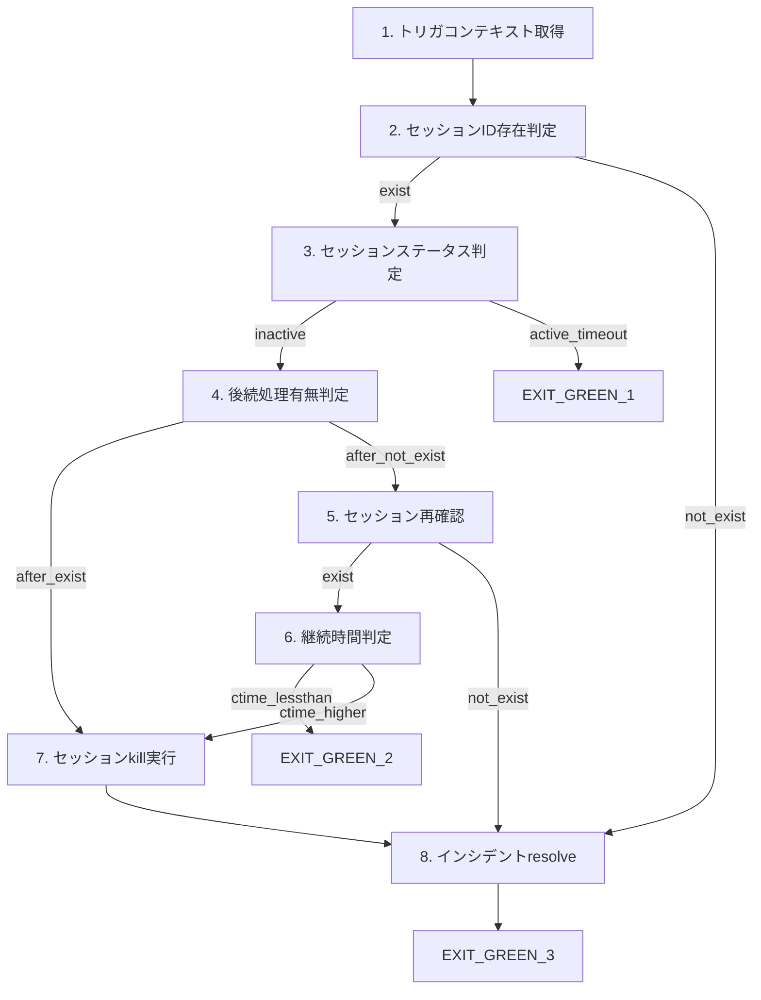

# DAG/グラフワークフローのネイティブサポート

## ステータス

- **優先度**: Critical (★★★★★)
- **対象バージョン**: v0.10.2
- **種別**: 機能追加

## 背景

### 問題の発見経緯

運用高度化事例（セッション管理ワークフロー）をRailway Frameworkで実装した結果、**基本機能は十分に動作する**ものの、**DAG/グラフワークフローのネイティブサポートがない**ことが最大の課題として明らかになった。

### 現状の問題

現在の `pipeline` / `async_pipeline` は直線的なパイプラインのみ対応しており、以下を表現できない：

- 条件分岐（状態に基づくルーティング）
- 並列実行
- 合流点（複数の経路が1つのノードに集約）

### 実際の回避策（事例１より）

ユーザーは自前で状態遷移ループを実装して対応した：

```python
# 状態遷移マップを手動で定義
TRANSITION_MAP: dict[NodeState, Callable[[WorkflowContext], WorkflowContext] | ExitCode] = {
    NodeState.SUCCESS_GET_ALERT: check_session_exists,
    NodeState.SUCCESS_SESSION_EXIST: check_session_status,
    NodeState.SUCCESS_SESSION_NOT_EXIST: resolve_incident,
    # ... 以下多数の遷移定義
}

# 自前で遷移ループを実装
def run_dag_workflow(incident_id: str) -> WorkflowContext:
    ctx = fetch_alert(incident_id)

    max_iterations = 20  # 無限ループ防止
    iteration = 0

    while iteration < max_iterations:
        iteration += 1
        current_state = ctx.current_state

        next_step = TRANSITION_MAP.get(current_state)

        if isinstance(next_step, ExitCode):
            return ctx.with_exit(next_step)

        ctx = next_step(ctx)

    raise RuntimeError("Max iterations exceeded")
```

この実装には以下の問題がある：

1. **ボイラープレートコードが多い**: 遷移ロジックを毎回書く必要がある
2. **型安全性が限定的**: 遷移マップの整合性をコンパイル時にチェックできない
3. **特殊ケースの処理が複雑**: 再確認ループなど、条件付き遷移の実装が煩雑
4. **テスタビリティの低下**: グラフ構造が暗黙的で、テストしづらい

## 提案

### 理想的なAPI設計案

```python
from railway import dag_pipeline, when, transitions

# 案1: DSLベースの宣言的定義
workflow = dag_pipeline(
    start=fetch_alert,
    transitions=[
        # 成功時の遷移
        when(NodeState.SUCCESS_GET_ALERT).then(check_session_exists),
        when(NodeState.SUCCESS_SESSION_EXIST).then(check_session_status),
        when(NodeState.SUCCESS_SESSION_NOT_EXIST).then(resolve_incident),
        when(NodeState.SUCCESS_INACTIVE).then(check_follow_up),
        when(NodeState.SUCCESS_ACTIVE_TIMEOUT).exit(ExitCode.GREEN_1),
        # ...

        # 失敗時の共通遷移
        when("failure::*").exit(ExitCode.RED_1),
    ],
    max_iterations=20,
)

result = workflow.run(incident_id="INC-12345")
```

```python
# 案2: デコレータベースの定義
@dag_node(
    on_success={
        NodeState.SUCCESS_GET_ALERT: "check_session_exists",
    },
    on_failure=ExitCode.RED_1,
)
def fetch_alert(incident_id: str) -> WorkflowContext:
    ...

@dag_node(
    on_success={
        NodeState.SUCCESS_SESSION_EXIST: "check_session_status",
        NodeState.SUCCESS_SESSION_NOT_EXIST: "resolve_incident",
    },
    on_failure=ExitCode.RED_1,
)
def check_session_exists(ctx: WorkflowContext) -> WorkflowContext:
    ...
```

```python
# 案3: グラフビルダーパターン
from railway import DAGBuilder

dag = (
    DAGBuilder()
    .add_node("fetch_alert", fetch_alert)
    .add_node("check_session_exists", check_session_exists)
    .add_node("check_session_status", check_session_status)
    .add_node("resolve_incident", resolve_incident)
    .add_edge("fetch_alert", "check_session_exists",
              condition=lambda ctx: ctx.state == NodeState.SUCCESS_GET_ALERT)
    .add_edge("check_session_exists", "check_session_status",
              condition=lambda ctx: ctx.state == NodeState.SUCCESS_SESSION_EXIST)
    .add_edge("check_session_exists", "resolve_incident",
              condition=lambda ctx: ctx.state == NodeState.SUCCESS_SESSION_NOT_EXIST)
    .set_entry("fetch_alert")
    .add_exit(ExitCode.GREEN_1, ExitCode.GREEN_2, ExitCode.GREEN_3, ExitCode.RED_1)
    .build()
)

result = dag.execute(incident_id="INC-12345")
```

## 要件

### 必須要件

1. **条件分岐**: ノードの出力状態に基づいて次のノードを決定
2. **複数の終了点**: 正常終了・異常終了の複数パターンをサポート
3. **ループ検出・防止**: 無限ループの検出と最大イテレーション設定
4. **型安全性**: 遷移先の存在チェック、状態の網羅性チェック
5. **エラーハンドリング**: 失敗状態の一括ハンドリング（`failure::*` のようなワイルドカード）

### 推奨要件

1. **可視化**: Mermaid形式などでのグラフ出力
2. **検証機能**: グラフの整合性チェック（到達不能ノード、未定義遷移の検出）
3. **デバッグ支援**: 実行パスのトレース、状態遷移ログ
4. **並列実行**: 独立したノードの並列実行（将来拡張）

### 既存APIとの互換性

- 既存の `@node` デコレータはそのまま使用可能であること
- `pipeline` / `async_pipeline` との共存が可能であること
- `Contract` ベースの型システムとの統合

## 事例ワークフローの構造

参考: `.運用高度化事例/事例１.md` より



## 影響範囲

### 新規追加予定

- `railway/core/dag.py` - DAGパイプライン実装
- `railway/core/transitions.py` - 遷移定義DSL
- `tests/unit/core/test_dag.py` - ユニットテスト
- `tests/integration/test_dag_workflow.py` - 統合テスト

### 既存ファイルへの変更

- `railway/__init__.py` - エクスポート追加
- `readme.md` - ドキュメント追加

## 優先度の理由

> 運用自動化の多くはDAG構造であり、この機能なしでは「運用高度化」のメインフックとしての訴求が弱い

Railway Frameworkの主要ターゲットである運用自動化ワークフローは、ほぼ例外なく条件分岐を含むDAG構造を持つ。線形パイプラインのみでは、ユーザーは自前で状態遷移ロジックを実装する必要があり、フレームワークの価値が大幅に減少する。

## 参考資料

- 事例ソースコード: `/home/aoisakanana/workspace/projects/operations/frameworks/examples/review/src/top2.py`
- 事例仕様書: `.運用高度化事例/事例１.md`
- 類似ライブラリ:
  - Apache Airflow (Python)
  - Prefect (Python)
  - Temporal (Go/Python)
  - AWS Step Functions (JSON DSL)

## 次のアクション

1. [ ] API設計の詳細検討（案1〜3の比較評価）
2. [ ] プロトタイプ実装
3. [ ] 事例１ワークフローでの検証
4. [ ] ドキュメント作成
